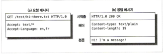

## HTTP

전 세계의 웹 브라우저, 서버, 웹 어플리케이션은 모두 `HTTP(Hypertext Transfer Protocol)`를 통해 서로 대화한다. HTTP 가 어떻게 이 모든 일을 해내는지 개략적으로 살펴보자.  

### 웹 클라이언트와 서버

웹 서버는 HTTP 프로토콜로 의사소통하기 때문에 보통 HTTP 서버라고 불린다.  
클라이언트는 서버에게 HTTP 요청을 보내고 서버는 요청된 데이터를 HTTP 응답으로 돌려준다.  
이처럼 클라이언트와 서버는 `www(월드 와이드 웹)`의 기본 요소다.

### 리소스

웹 서버는 웹 리소스를 관리하고 제공한다.  
가장 단순한 웹 리소스는 웹 서버 파일 시스템의 정적 파일이다.  
예를 들면 txt, html, jpeg 등등의 파일이 포함된다.  

#### 미디어 타입

인터넷은 수천가지의 데이터 타입을 다루기 때문에, HTTP는 웹에서 전송되는 객체 각각에 MIME 타입이라는 데이터 포맷 라벨을 붙인다.  

**MIME(Multipurpose Internet Mail Extensions, 다목적 인터넷 메일 확장)**은 원래 각기 다른 전자메일 시스템 사이에서 메시지가 오갈 때 겪는 문제점을 해결하기 위해 설계 되었지만 워낙 잘 동작했기 때문에, HTTP에서도 채택되었다.

웹 서버는 모든 HTTP 객체 데이터에 MIME 타입을 붙인다. 웹 브라우저는서버로부터 객체를 돌려받을 때, 다룰 수 있는 객체인지 MIME 타입을 통해 확인한다.  

MIME 타입은 사선(/)으로 구분된 `주 타입(primary object type)`과 `부 타입(specific subtype)`으로 이루어진 문자열 라벨이다.  

> ex) text/html, text/plain, image/jpeg, image/gif

#### URI 

웹 서버 리소스는 이름을 갖고 있기 때문에, 클라이언트는 관심있는 리소스를 지목할 수 있다. 서버 리소스 이름은 `통합 자원 식별자(uniform resource identifier), URI`로 불린다.  

HTTP는 주어진 URI로 객체를 찾아온다. URI에는 URL과 URN 두 가지가 있다.  

#### URL

통합 자원 지시자(uniform resource locator, URL)는 리소스 식별자의 가장 흔한 형태다. 

> ex) http://www.joes-hardware.com/specials/saw-blade.gif  

URL은 세 부분으로 이루어진 표준 포맷을 따른다.

1. `스킴(scheme)`이라고 불리는데, 리소스에 접근하기 위해 사용되는 프로토콜을 서술한다. `ex) http://`
2. 서버의 인터넷 주소를 제공한다. `ex) www.joes-hardware.com`
3. 마지막은 웹 서버의 리소스를 가리킨다.  `ex) /specials/saw-blade.gif`

#### URN

URI의 두 번째 종류는 `유니폼 리소스 이름(uniform resource name, URN)`이다. 하지만 잘 사용하지 않으니 패스

### 트랜잭션

HTTP 트랜잭션은 `요청명령(클라이언트에서 서버로 보내는)`과 `응답결과(서버가 클라이언트에게 돌려주는)`로 구성되어 있다.

#### 메서드

HTTP는 여러가지 종류의 요청 명령을 지원한다. 요청 메시지는 한 개의 메서드를 갖으며 서버에게 어떤 동작이 취해져야 하는지 말해준다.(가져오기, 실행하기, 삭제하기 등)

| HTTP 메서드 | 설명 |
|------------|------|
| GET | 서버에서 클라이언트로 지정한 리소스를 보낸다. |
| PUT | 클라이언트에서 서버로 보낸 데이터를 지정한 이름의 리소스로 저장한다. |
| DELETE | 지정한 리소스를 서버에서 삭제한다. |
| POST | 클라이언트 데이터를 서버 게이트웨이 애플리케이션으로 보낸다. |
| HEAD | 지정한 리소스에 대한 응답에서, HTTP 헤더 부분만 보낸다. |

#### 상태 코드

모든 HTTP 응답 메시지는 상태 코드와 함께 반환된다. 상태 코드는 클라이언트에게 요청이 성공했는지 아니면 추가 조치가 필요한지 알려주는 세 자리 숫자다.

| HTTP 상태 코드 | 설명 |
|--------------|------|
| 200 | 좋다. 문서가 바르게 반환되었다. |
| 302 | 다시 보내라. 다른 곳에 가서 리소스를 가져가라. |
| 404 | 없음. 리소스를 찾을 수 없다. |

상태 코드에 텍스트로 된 "사유 구절(reason phrase)" 도 함께 보낸다. 이 구문은 단지 설명만을 위해서 포함된 것일 뿐 실제 응답 처리에 숫자로 된 코드가 사용된다.

#### 웹 페이지는 여러 객체로 이루어질 수 있다

예를 들어, 웹 브라우저는 시각적으로 풍부한 웹페이지를 가져올 때 대량의 HTTP 트랜잭션을 수행한다. 페이지 레이아웃을 서술하는 HTML '뼈대'를 한 번의 트랜잭션으로 가져온 뒤, 첨부된 이미지, 그래픽 조각, 자바 애플릿 등을 가져오기 위해 추가로 HTTP 트랜잭션들을 수행한다.

### 메시지

HTTP 메시지는 단순한 줄 단위의 문자열이다. 이진 형식이 아닌 일반 텍스트이기 때문에 사람이 읽고 쓰기 쉽다.  

웹 클라이언트에서 웹 서버로 보낸 HTTP 메시지를 요청 메시지라고 부르고, 서버에서 클라이언트로 가는 메시지를 응답 메시지라고 부른다.  그 외에 다른 종류의 HTTP 메시지는 없다.

1. 시작줄

    요청 -> 무엇을 해야하는지 응답 -> 무슨 일이 일어 났는지 나타낸다.

2. 헤더

    해더 필드는 쉬운 구문분석을 위해 쌍점(:)으로 구분되어 있는 하나의 이름과 하나의 값으로 구성된다. 필드를 추가하려면 한 줄 더하기만 하면 된다. 해더는 빈 줄로 끝난다.

3. 본문

    빈 줄 다음에는 어떤 종류의 데이터든 들어갈 수 있는 메시지 본문이 필요에 따라 올 수 있다.
    
    요청의 몬분은 웹 서버로 데이터를 실어 보내며, 
    응답의 본문은 클라이언트로 데이터를 반환한다.
    
    시작줄, 해더는 구조적이며 문자열인 것과 달리 본문은 임의의 이진 데이터를 포함할 수 있다.(이미지, 비디오, 오티오 트랙 등등)

### TCP 커넥션

HTTP 메시지가 TCP(Transmission Control Protocol, 전송 제어 프로토콜) 커넥션을 통해 한 곳에서 다른곳으로 어떻게 옮겨가는지 알아보자

#### TCP/IP 

HTTP는 애플리케이션 계층 프로토콜이다. HTTP는 네트워크 통신의 핵심적인 세부사항에 대해 신경쓰지 않는다. 대신 대중적이고 신뢰성 있는 인터넷 전송 프로토콜인TCP/IP에게 맡긴다.

인터넷 자체가 TCP/IP에 기초하고 있다. TCP/IP는 패킷 교환 네트워크 프로토콜의 집합이다. 어떤 종류의 컴퓨터나 네트워크든 서로 신뢰성 있는 의사소통을 하게 해준다.

#### 접속, IP주소, 포트번호

HTTP 클라이언트가 서버에 메시지를 전송할 수 있게 되기 위해서는 인터넷 프로토콜(Internet Protocol, IP) 주수와 포트번호를 사용해 TCP/IP 커넥션을 맺어야 한다.

어떻게 알아낼 수 있을까? 정답은 URL을 이용하면 된다.

URL에는 IP주소가 없지만 대신 글자로 된 도메인 혹은 호스트명("www.netscape.com")을 갖고 있다. 호스트명은 도메인 이름 서비스(Domain Name System, DNS)라 불리는 장치를 통해 쉽게 IP로 변환될 수 있다.

웹브라우저는 다음과 같이 서버의 리소스를 가져온다.
1. URL에서 호스트 명을 추출한다.
2. 호스트명을 IP로 변환한다.
3. 웹 서버와 TCP 커넥션을 맺는다.
4. 서버에 HTTP 요청을 보낸다.
5. 서버는 웹 브라우저에게 HTTP 응답을 돌려준다.
6. 커넥션이 닫히면, 웹 브라우저는 문서를 보여준다.

### Ref
- [HTTP 완벽 가이드](https://www.yes24.com/product/goods/15381085)