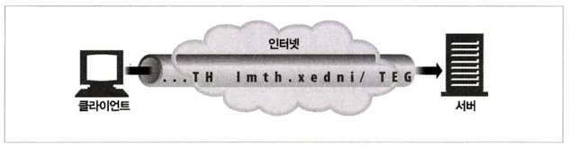
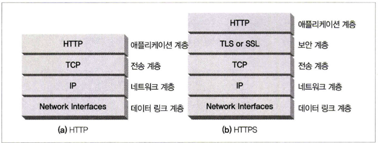
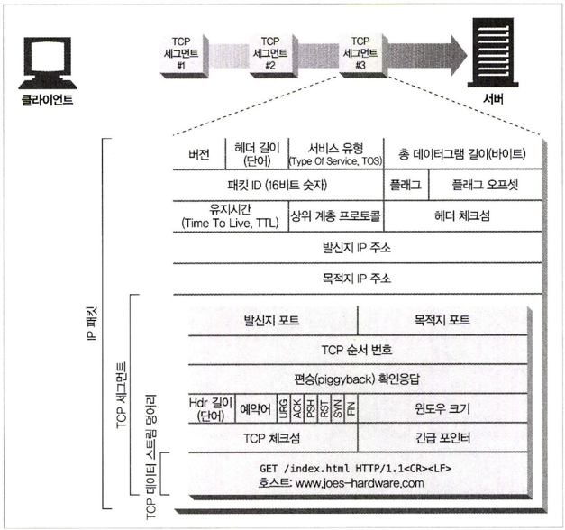
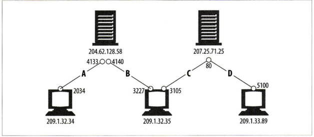
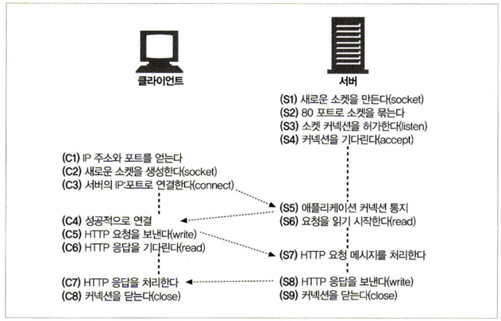

## TCP 커넥션

HTTP 통신은, 패킷 교환 네트워크 프로토콜들의 계층화된 집합인 TCP/IP를 통해 이루어진다.

### 신뢰할 수 있는 데이터 전송 통로인 TCP

HTTP 커넥션은 몇몇 사용 규칙을 제외하고는 TCP 커넥션에 불과하다.

### TCP 스트림은 세그먼트로 나뉘어 IP 패킷을 통해 전송된다.

TCP는 IP 패킷(혹은 IP 데이터그램)이라고 불리는 작은 조각을 통해 데이터를 전송한다.

TCP는 세그먼트라는 단위로 데이터 스트림을 잘게 나누고, 세그먼트를 IP 패킷이라고 불리는 봉투에 담아서 인터넷을 통해 데이터를 전달한다.
이 모든것은 TCP/IP 소프트웨어에 의해 처리되며, 그 과정은 HTTP 프로그래머에게 보이지 않는다.

각 TCP 세그먼트는 하나의 IP 주소에서 다른 IP 주소로 패킷에 담겨 전달된다.

IP 헤더는 발신지와 목적이 IP 주소, 크기, 기타 플래그를 가진다.  
TCP 세그먼트 헤더는 TCP 포트 번호, TCP 제어 플래그, 그리고 데이터 순서와 무결성을 검사하기 위해 사용되는 숫자 값을 포함한다.

### TCP 커넥션 유지하기

컴퓨터는 항상 TCP 커넥션을 여러 개 가지고 있다.  
TCP는 포트 번호를 통해서 여러개의 커넥션을 유지한다. 포트 번호는 회사 직원의 내선전화와 같다. 회사의 대표 전화번호는 안내 데스크로 연결되고 내선전화는 해당 직원으로 연결되듯이 IP 주소는 해당 컴퓨터에
연결되고 포트 번호는 해당 애플리케이션으로 연결된다.

#### TCP 커넥션은 네가지 값으로 식별한다.

> <발신지 IP 주소, 발신지 포트, 수신지 IP 주소, 수신지 포트>

위와 같이 네 가지 값으로 유일한 커넥션을 생성한다. 서로 다른 두개의 TCP 커넥션은 네가지 주소 구성요소의 값이 모두 같을 수 없다.

다음은 이미지 정보를 마크다운 테이블로 변환한 결과입니다:

| 커넥션 | 발신지 IP 주소   | 발신지 포트 | 목적지 IP 주소     | 목적지 포트 |
|-----|-------------|--------|---------------|--------|
| A   | 209.1.32.34 | 2034   | 204.62.128.58 | 4133   |
| B   | 209.1.32.35 | 3227   | 204.62.128.58 | 4140   |
| C   | 209.1.32.35 | 3105   | 207.25.71.25  | 80     |
| D   | 209.1.33.89 | 5100   | 207.25.71.25  | 80     |

### TCP 소켓 프로그래밍

운영체제는 TCP 커넥션의 생성과 관련된 여러 기능을 제공한다.  
소켓 API는 유닉스 운영체제용으로 먼저 개발되었지만, 지금은 소켓 API의 다양한 구현체들 덕분에 대부분의 운영체제와 프로그램 언어에서 이를 사용할 수 있게 되었다.

| 소켓 API 호출                      | 설명                                  |
|--------------------------------|-------------------------------------|
| s = socket(\<parameters\>)     | 연결이 되지 않은 익명의 새로운 소켓 생성             |
| bind(s, \<local IP:port\>)     | 소켓에 로컬 포트 번호와 인터페이스 할당              |
| connect(s, \<remote IP:port\>) | 로컬의 소켓과 원격의 호스트 및 포트 사이에 TCP 커넥션 생성 |
| listen(s,...)                  | 커넥션을 받아들이기 위해 로컬 소켓에 허용함을 표시        |
| s2 = accept(s)                 | 누군가 로컬 포트에 커넥션을 맺기를 기다림             |
| n = read(s,buffer,n)           | 소켓으로부터 버퍼에 n바이트 읽기 시도               |
| n = write(s,buffer,n)          | 소켓으로부터 버퍼에 n바이트 쓰기 시도               |
| close(s)                       | TCP 커넥션을 완전히 끊음                     |
| shutdown(s,\<side\>)           | TCP 커넥션의 입출력만 닫음                    |
| getsockopt(s, . . . )          | 내부 소켓 설정 옵션값을 읽음                    |
| setsockopt(s, . . . )          | 내부 소켓 설정 옵션값을 변경                    |

소켓 API를 사용하면, TCP 종단(endpoint) 데이터 구조를 생성하고, 원격 서버의 TCP 종단에 그 종단 데이터 구조를 연결하여 데이터 스트림을 읽고 쓸 수 있다. TCP API는, 기본적인 네트워크
프로토콜의 핸드셰이킹, 그리고 TCP 데이터 스트림과 IP 패킷 간의 분할 및 재조립에 대한 모든 세부사항을 외부로부터 숨긴다.

아래 슈도코드(pseudocode)는 클라이언트와 서버간에 HTTP 트랜잭션을 후행하기 위한 소켓 API의 사용 방법을 보여준다.

### Ref
- [HTTP 완벽 가이드](https://www.yes24.com/product/goods/15381085)
 