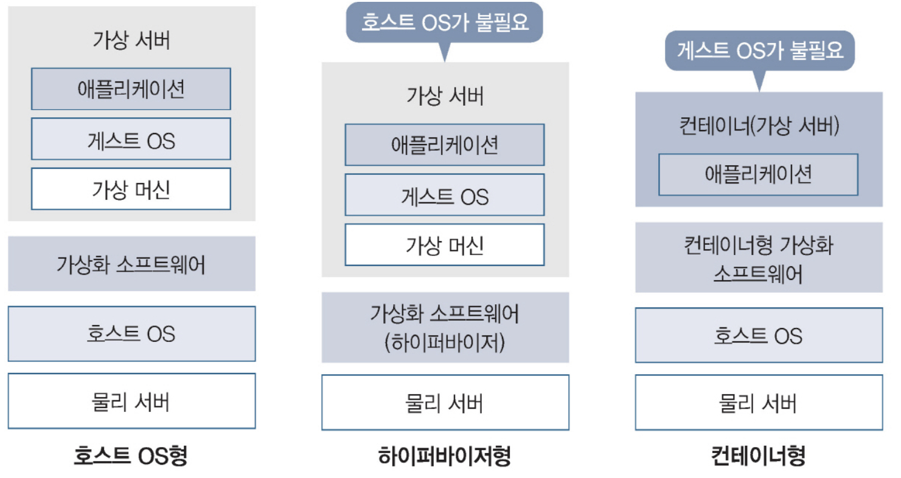

### 서버 가상화란

⌜그림으로 이해하는 가상화와 컨테이너⌟, 길벗, 2022

서버 가상화의 종류에 따라 호스트 OS와 게스트 OS가 존재하는지 여부가 다르다.  
호스트 OS는 하드웨어에 직접 설치하는 OS를 말하며, 게스트 OS는 가상 하드웨어에 설치하는 OS를 말한다.

### 서버 가상화의 종류

| 종류       | 설명                                                                                                                               |
|----------|----------------------------------------------------------------------------------------------------------------------------------|
| 호스트 OS형  | 물리 서버에 설치된 호스트 OS에서 가상 서버를 가동한다. 대표적인 소프트웨어로는 버추얼박스가 있다.                                                                         |
| 하이퍼바이저 형 | 호스트 OS 없이 동작하는 하이퍼바이저라는 가상화 소프트웨어를 사용한다. 호스트 OS가 없는 만큼 호스트 OS형보다 유지 관리하기 쉽다. 대표적인 소프트웨어로는 Hyper-V가 있다.                           |
| 컨테이너 형   | 컨테이너라는 애플리케이션과 실제 환경을 같이 분리하는 원리를 사용해 OS 단위가 아닌 애플리케이션 단위로 가상화한다. 가상 하드웨어와 게스트 OS가 없으며 컨테이너끼리 조합해 사용한다. 대표적인 소프트웨어로는 Docker가 있다. |

## 참조

- [그림으로 이해하는 가상화와 컨테이너](http://www.yes24.com/Product/Goods/115457586)