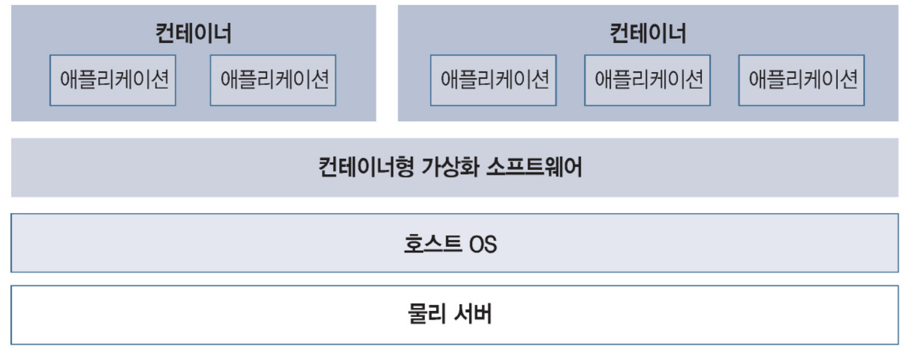

### 서버 가상화란

  
⌜그림으로 이해하는 가상화와 컨테이너⌟, 길벗, 2022  

컨테이너형 가상화는 **'컨테이너'라는 애플리케이션과 실행 환경을 같이 분리하는 방식으로 OS 단위가 아닌 애플리케이션 단위로 가상화하는 기술**이다.  
컨테이너형 가상화는 게스트 OS를 사용하지 않고 호스트 OS에 컨테이너형 가상화 소프트웨어를 설치한다. 

컨테이너에는 여러 응용 프로그램을 도입할 수 있지만 원칙적으로는 **하나의 컨테이너에 하나의 애플리케이션(하나의 프로세스) 단위**로 구축하고 
여러 컨테이너를 결합하는 것이 좋다.  

컨테이너를 만드는 비용은 매우 저렴하기 때문에 복잡한 컨테이너를 하나 만드는 것보다 단순한 컨테이너 여러 개 만드는 것이 더욱 효율적이고 
나중에 설계 등을 변경하기도 쉽기 때문이다. 

### 컨테이너형 가상화 소프트웨어의 대표: 도커

도커는 도커사가 개발한 OSS의 컨테이너형 가상화 소프트웨어이다. 또한, 애플리케이션을 설치한 컨테이너 이미지를 모은 도커 허브라는 서비스가 있으며 
내려받는 것만으로 필요한 컨테이너를 간단하게 준비할수 있다. 

## 참조

- [그림으로 이해하는 가상화와 컨테이너](http://www.yes24.com/Product/Goods/115457586)