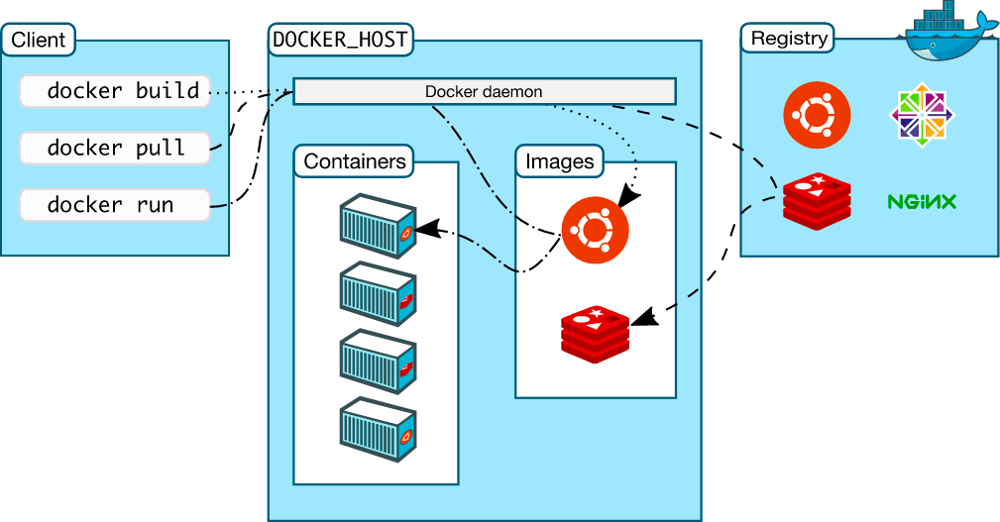

### 도커란

**컨테이너를 실행하거나 컨테이너 이미지(컨테이너를 실행하기 위한 템플릿)를 만들고 배포하는 플랫폼**이다.
도커는 응용프로그램 실행 환경 단위로 패키지화해 컨테이너 이미지를 만들다.
컨테이너 이미지는 컨테이너 레지스트리를 통해 개발 환경에서 프로덕션 환경으로 배포할 수 있다.
**실행 환경별로 패키지화 하기 때문에 개발이나 운영 환경에서 동일한 방식으로 응용 프로그램을 실행할 수 있다.**

| 특징      | 설명                         |
|---------|----------------------------|
| 유연성     | 프로그래밍 언어 등을 제한하지 않는다.      |
| 경량      | 효율적으로 리소스를 활용한다.           |
| 휴대성     | 다른 실행 환경으로의 이전이 쉽다.        |
| 느슨한 결합도 | 시스템을 독립적인 구성 요소로 분해할 수 있다. |
| 확장성     | 수요에 따라 리소스를 늘리거나 줄일 수 있다.  |
| 보안      | 컨테이너끼리 분리할 수 있다.           |

### 도커 엔진이란

도커 엔진은 **컨테이너 및 컨테이너 이미지를 관리하는 응용 프로그램**이다.
도커 엔진은 클라이언트 서버 유형의 응용 프로그램이며 클라이언트인 도커 클라이언트에서 서버인 도커 데몬의 API에 접속해 컨테이너 및 컨테이너 이미지에 대한 다양한
작업을 수행할 수 있다. **도커 클라이언트**에서 도커 데몬 API에 접속하려면 도커 명령어를 실행한다. 이러한 도커 엔진이나 도커 클라이언트르르 '도커'라고 부르는
경우도 있다.

## 참조

- [그림으로 이해하는 가상화와 컨테이너](http://www.yes24.com/Product/Goods/115457586)