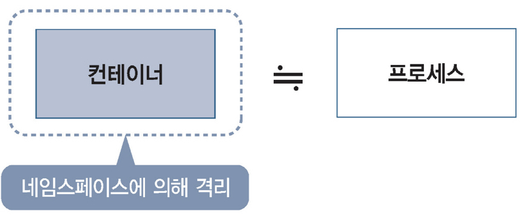
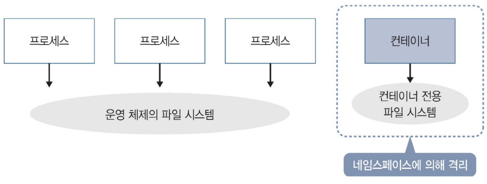

### 컨테이너란

컨테이너는 **운영 체제에서 실행되는 프로세스**다. 프로세스는 프로그램의 실행 단위이며, '실행 중인 프로그램'이라고도 할 수 있다. 
컨테이너가 일반 프로세스와 다른 점은 다른 프로세스와 격리되도록 설정되어 있다는 점이다. 컨테이너를 사용하면 외부 영향을 받지 않는 독립적인 환경에서 
프로세스를 실행할 수 있다. **컨테이너를 외부와 격리하기 위해 네임스페이스라는 구조를 사용한다.** 네임스페이스의 원리에 따라 프로세스 ID 및 네트워크 
인터페이스를 비롯한 다양한 것들을 격리할 수 있다.  

  
⌜그림으로 이해하는 가상화와 컨테이너⌟, 길벗, 2022  

### 파일 시스템의 격리

네임스페이스의 작동 방식을 구현하는 데 특히 중요한 것은 파일 시스템의 격리다. 파일 시스템은 운영 체제의 기능 중 하나이며 파일 시스템에 의해 데이터를 '파일' 
단위로 읽고 쓸 수 있다. 파일 시스템은 프로세스를 실행하는 데 다양한 파일을 포함하며 프로세스가 올바르게 작동하는 환경을 제공한다.  

  
⌜그림으로 이해하는 가상화와 컨테이너⌟, 길벗, 2022  

일반 프로세스는 운영 체제의 파일 시스템을 프로세스와 공유하는 데 사용하는 반면, 컨테이너는 컨테이너 전용 독립 파일 시스템을 사용한다. 
네임스페이스에서 파일 시스템을 격리하는 방식은 컨테이너 내 프로세스가 yum 및 apt와 같은 패키지 관리 시스템에 설치된 패키지에 의존하는 
경우 특히 유용하다. 여기서 말하는 **패키지**란 어떤 기능을 제공하는 프로그램을 한꺼번에 배포 형식으로 만든 것이며, 
**패키지 관리 시스템**이란 패키지의 설치나 종속성을 관리하는 시스템이다. 

대부부분의 경우 운영체제의 파일 시스템에 다른 버전의 패키지가 공존하기는 어렵지만, 컨테이너를 사용해 파일 시스템을 격리한다면 다른 버전의 패키지가 공존할 수 있다. 

## 참조

- [그림으로 이해하는 가상화와 컨테이너](http://www.yes24.com/Product/Goods/115457586)