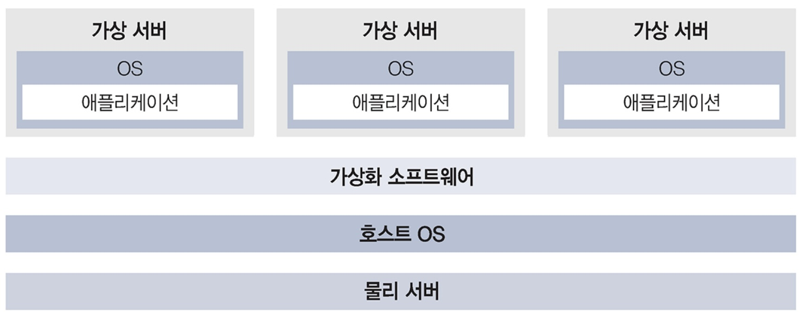

### 가상화란

가상화란 실체가 없는 것을 마치 존재하는 것처럼 보이게 하는 기술을 말한다.

### 가상화의 개념

실제 하드웨어처럼 움직이는 가상화 소프트웨어는 실제 하드웨어와 동일하게 프로그램이 동작한다. 이것이 가상화의 기본 원리다.

### 가상화의 유연성

가상화를 통해 물리적 환경의 제약에 얽매이지 않고 유연하게 환경을 구축할 수 있다. 이것이 가상화의 유연성이다.

### 가용성 향상

가용성은 시스템을 장애 없이 계속 사용할 수 있는지 여부를 나타내는 지표다. 가상화를 이용하면, 생성한 가상 환경을 각각 환경별로 백업해 두는 것이 가능하기 때문에,
만약 가상환경이 고장 나더라도 백업을 바탕으로 복원해 곧바로 이전의 상태로 되돌릴 수 있다. 이로인해 시스템의 가용성이 향상된다.

## 참조

- [그림으로 이해하는 가상화와 컨테이너](http://www.yes24.com/Product/Goods/115457586)