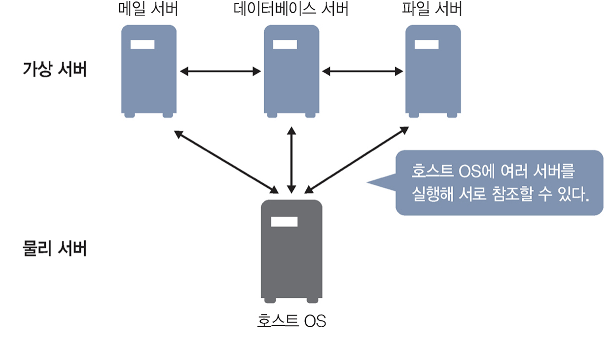
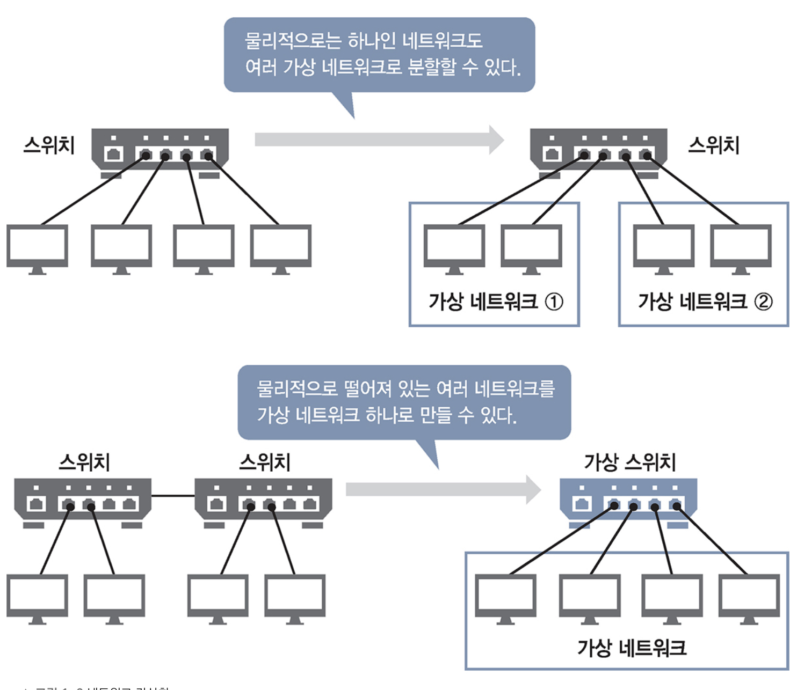

가상화에는 크게 두 유형이 있다. 물리 서버를 가상화하는 '서버 가상화'와 물리적 네트워크를 구성을 가상화하는 '네트워크 가상화'다.

### 서버 가상화란

  
⌜그림으로 이해하는 가상화와 컨테이너⌟, 길벗, 2022

서버 가상화는 물리 서버를 가상화하는 것이다. 가상 서버는 호스트 OS와 다른 OS를 구축할 수 있다.
물리 서버에 구축된 가상 서버는 네트워크를 통해 서로를 참조할 수 있다. 가상 서버끼리는 물론, 호스트 OS끼리도 네트워크를 통해 참조할 수 있다.

### 네트워크 가상화란

  
⌜그림으로 이해하는 가상화와 컨테이너⌟, 길벗, 2022

네트워크 가상화는 네트워크 기기 및 네트워크 설비와 같은 물리적 네트워크 구성을 가상화 한다.
네트워크 하나를 여러 가상 네트워크로 나누거나 여러 네트워크를 가상 네트워크 하나로 보이게 할 수도 있다.  
또한, 네트워크 가상화는 네트워크 설정을 소프트웨어로 한다.

## 참조

- [그림으로 이해하는 가상화와 컨테이너](http://www.yes24.com/Product/Goods/115457586)