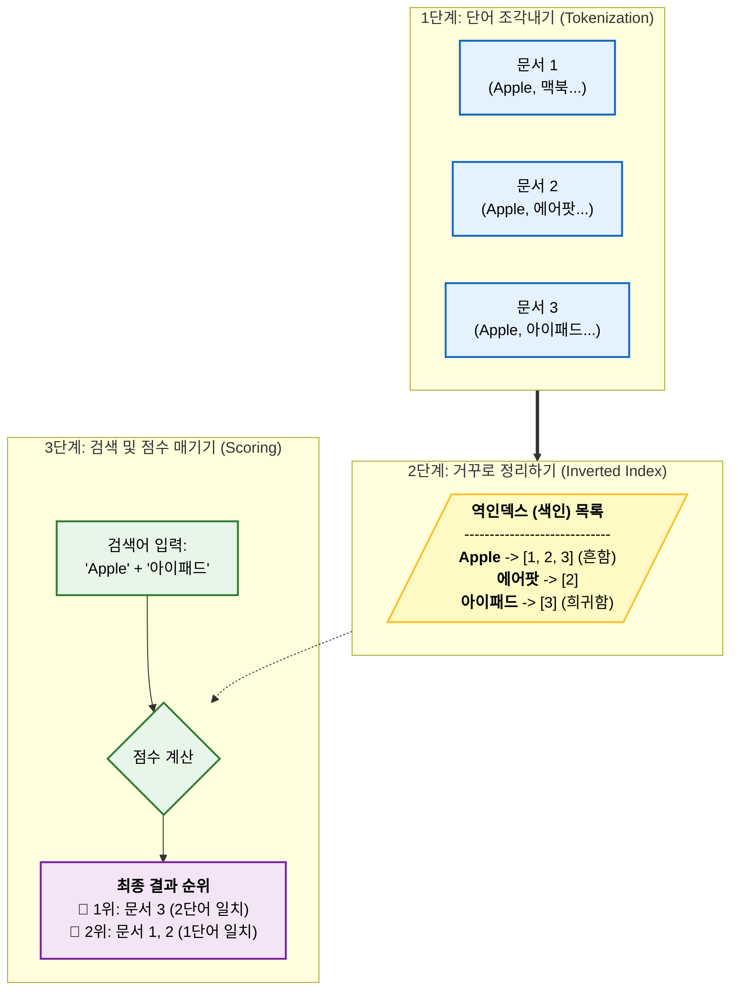

## Elasticsearch란?

**Elasticsearch**는 Apache Lucene 기반의 **오픈소스 분산 검색 엔진**입니다. 구글처럼 빠른 전문 검색을 제공합니다.

### 일반 데이터베이스 vs Elasticsearch

| 항목         | 일반 DB (MySQL 등) | Elasticsearch   |
|------------|-----------------|-----------------|
| **검색 방식**  | 데이터를 하나씩 찾아봄    | 모든 텍스트를 미리 색인화  |
| **검색 속도**  | 데이터 많을수록 느림     | 수백만 건도 0.1초 안에  |
| **데이터 형식** | 표(Table) 형태     | JSON 문서 형태      |
| **주요 용도**  | 거래, 회원 관리       | 검색, 로그 분석, 모니터링 |

### Apache Lucene이란?

Elasticsearch의 기반이 되는 **Apache Lucene**은 자바로 작성된 검색 라이브러리입니다.

**Lucene vs Elasticsearch**

| 항목     | Lucene         | Elasticsearch    |
|--------|----------------|------------------|
| 역할     | 검색 엔진 코어 라이브러리 | 완성된 검색 플랫폼       |
| 사용 방식  | 자바 코드로 직접 구현   | REST API로 간단히 사용 |
| 분산 처리  | 미지원            | 자동 분산 및 확장       |
| 실시간 검색 | 수동 구현 필요       | 자동 제공            |

**비유하자면:**

- Lucene = 자동차 엔진
- Elasticsearch = 완성된 자동차 (엔진 + 편의 기능)

Elasticsearch는 Lucene의 강력한 검색 기능에 분산 처리, REST API, 실시간 검색 등을 더해 누구나 쉽게 사용할 수 있게 만든 플랫폼입니다.

### 주요 활용 사례

- **E-커머스**: 쿠팡, Amazon의 상품 검색
- **로그 분석**: Netflix, Uber의 ELK Stack
- **콘텐츠 검색**: Wikipedia, Medium의 전문 검색
- **실시간 모니터링**: LinkedIn, GitHub의 시스템 추적

---

## Elasticsearch는 왜 빠를까?

Elasticsearch의 빠른 속도 비결은 **애널라이저(Analyzer)**와 **역인덱스(Inverted Index)** 두 가지 핵심 기술에 있습니다.

### 일반 검색 vs 역인덱스 검색

**일반 데이터베이스의 검색 방식:**

```
문서 1: "Apple 맥북 프로 16인치"
문서 2: "Apple 에어팟 프로"
문서 3: "Apple 아이패드 프로"

검색어 입력: "Apple 아이패드"
→ 모든 문서를 하나씩 읽으며 확인 (느림)
```

**Elasticsearch의 역인덱스 방식:**

```
미리 만들어둔 색인:
Apple     → [문서1, 문서2, 문서3]
맥북      → [문서1]
에어팟    → [문서2]
아이패드  → [문서3]

검색어 입력: "Apple 아이패드"
→ 색인에서 즉시 찾음 (빠름)
```

### 동작 원리



Elasticsearch는 이렇게 동작합니다:

1. **애널라이저가 문서를 토큰으로 분리** (Apple, 맥북, 에어팟 등)
2. **역인덱스에 토큰별로 문서 목록 저장** (Apple → [1,2,3])
3. **검색 시 역인덱스에서 즉시 찾고 관련도 점수 계산**

이 방식 덕분에 수백만 건의 데이터에서도 0.1초 안에 검색이 가능합니다.

## 핵심 용어 정리 (MySQL과 비교)

### 용어 대응표

| 개념          | MySQL        | Elasticsearch   | 의미               |
|-------------|--------------|-----------------|------------------|
| **저장소**     | 테이블 (Table)  | 인덱스 (Index)     | 데이터가 저장되는 가장 큰 틀 |
| **데이터 한 건** | 행 (Row)      | 도큐먼트 (Document) | 실제 저장되는 데이터 개체   |
| **데이터 속성**  | 컬럼 (Column)  | 필드 (Field)      | 데이터의 각 항목        |
| **구조 정의**   | 스키마 (Schema) | 매핑 (Mapping)    | 데이터 타입 및 구조 정의   |

### 1. 인덱스 (Index)

MySQL의 테이블과 같은 개념입니다.

```
MySQL:         users 테이블
                ↓
Elasticsearch: users 인덱스
```

### 2. 도큐먼트 (Document)

MySQL의 행(Row)과 같은 개념으로, JSON 형식으로 저장됩니다.

```json
{
  "product_name": "맥북 프로 16인치",
  "price": 3500000,
  "category": "노트북",
  "brand": "Apple"
}
```

### 3. 필드 (Field)

MySQL의 컬럼(Column)과 같으며, 도큐먼트의 각 속성입니다.

위 예시에서 `product_name`, `price`, `category`, `brand`가 모두 필드입니다.

### 4. 매핑 (Mapping)

MySQL의 스키마처럼 데이터 타입을 정의하는 설계도입니다.

```json
{
  "properties": {
    "product_name": {
      "type": "text"
    },
    "price": {
      "type": "integer"
    },
    "brand": {
      "type": "keyword"
    },
    "created_at": {
      "type": "date"
    }
  }
}
```

**text vs keyword 차이**

- `text`: 전문 검색용 (형태소 분석됨)
- `keyword`: 정확히 일치 검색용 (필터링, 정렬에 사용)

## Elasticsearch REST API

MySQL은 SQL 문법을 사용하지만, Elasticsearch는 **HTTP 메서드**로 작업합니다.

### 전체 흐름

```
1. 인덱스 생성 (CREATE TABLE과 동일)
   ↓
2. 매핑 정의 (컬럼 타입 지정과 동일)
   ↓
3. 데이터 삽입 (INSERT와 동일)
   ↓
4. 데이터 조회 (SELECT와 동일)
```

### STEP 1: 인덱스 관리

#### 인덱스 생성

```http
PUT /products
```

**MySQL 비교:**

```sql
CREATE TABLE products;
```

**예상 응답:**

```json
{
  "acknowledged": true,
  "shards_acknowledged": true,
  "index": "products"
}
```

#### 인덱스 조회

```http
GET /products
```

#### 인덱스 삭제

```http
DELETE /products
```

### STEP 2: 매핑 정의

인덱스를 만들었다면, 이제 어떤 데이터가 들어갈지 정의해야 합니다.

```http
PUT /products/_mapping
```

**요청 본문:**

```json
{
  "properties": {
    "product_name": {
      "type": "text"
    },
    "price": {
      "type": "integer"
    },
    "stock": {
      "type": "integer"
    },
    "is_available": {
      "type": "boolean"
    },
    "brand": {
      "type": "keyword"
    },
    "created_at": {
      "type": "date"
    }
  }
}
```

**MySQL 비교:**

```sql
CREATE TABLE products
(
    product_name VARCHAR(255),
    price        INT,
    stock        INT,
    is_available BOOLEAN,
    brand        VARCHAR(100),
    created_at   DATETIME
);
```

### STEP 3: 도큐먼트 삽입

이제 실제 데이터를 넣어봅시다.

```http
POST /products/_doc
```

**요청 본문:**

```json
{
  "product_name": "맥북 프로 16인치 M3",
  "price": 3500000,
  "stock": 50,
  "is_available": true,
  "brand": "Apple",
  "created_at": "2024-11-30"
}
```

**MySQL 비교:**

```sql
INSERT INTO products (product_name, price, stock, is_available, brand, created_at)
VALUES ('맥북 프로 16인치 M3', 3500000, 50, true, 'Apple', '2024-11-30');
```

**예상 응답:**

```json
{
  "_index": "products",
  "_id": "xA7bK4oBXXXXXXXXXXXX",
  "_version": 1,
  "result": "created"
}
```

### STEP 4: 데이터 조회

#### 전체 데이터 조회

```http
GET /products/_search
```

**MySQL 비교:**

```sql
SELECT *
FROM products;
```

**예상 응답:**

```json
{
  "took": 2,
  "hits": {
    "total": {
      "value": 1
    },
    "hits": [
      {
        "_index": "products",
        "_id": "xA7bK4oBXXXXXXXXXXXX",
        "_score": 1.0,
        "_source": {
          "product_name": "맥북 프로 16인치 M3",
          "price": 3500000,
          "stock": 50,
          "is_available": true,
          "brand": "Apple",
          "created_at": "2024-11-30"
        }
      }
    ]
  }
}
```

#### 특정 조건으로 검색

```http
GET /products/_search
```

**요청 본문:**

```json
{
  "query": {
    "match": {
      "product_name": "맥북"
    }
  }
}
```

**MySQL 비교:**

```sql
SELECT *
FROM products
WHERE product_name LIKE '%맥북%';
```

### 응답 데이터 이해하기

| 필드        | 의미     | 설명                             |
|-----------|--------|--------------------------------|
| `_index`  | 인덱스 이름 | 어느 인덱스에서 온 데이터인지               |
| `_id`     | 문서 ID  | MySQL의 Primary Key와 유사         |
| `_score`  | 관련도 점수 | 검색어와 얼마나 관련이 있는지 (높을수록 관련도 높음) |
| `_source` | 실제 데이터 | 우리가 저장한 JSON 문서                |

---

## 애널라이저(Analyzer)란?

**애널라이저**는 Elasticsearch가 텍스트를 검색 가능한 토큰으로 변환하는 3단계 공정입니다.

### 애널라이저의 3단계 공정


#### 1단계: Character Filter (세척)

토큰으로 자르기 전에 불필요한 부분을 제거하거나 변경합니다.

**예시:**

```
입력: "<h1>Apple 맥북</h1>"
     ↓ (HTML 태그 제거)
출력: "Apple 맥북"
```

**주요 역할:**

- HTML 태그 제거
- 특수 문자 변환
- 특정 패턴 치환

#### 2단계: Tokenizer (절단)

문장을 단어 단위로 잘라냅니다.

**예시:**

```
입력: "Apple 맥북 프로"
     ↓ (공백 기준으로 절단)
출력: ["Apple", "맥북", "프로"]
```

**주요 역할:**

- 공백으로 단어 분리
- 문장 부호로 분리
- 언어별 형태소 분석

#### 3단계: Token Filter (가공)

토큰들을 검색에 최적화된 형태로 변환합니다.

**예시:**

```
입력: ["Apple", "is", "running"]
     ↓ (소문자 변환 + 불용어 제거 + 어간 추출)
출력: ["apple", "run"]
```

**주요 역할:**

- 소문자 변환
- 불용어 제거
- 어간 추출
- 동의어 처리

### Standard Analyzer (기본값)

| 단계               | 필터/토크나이저           | 역할            |
|------------------|--------------------|---------------|
| Character Filter | 없음                 | 세척 안 함        |
| Tokenizer        | Standard Tokenizer | 공백과 문장 부호로 자름 |
| Token Filter     | Lowercase Filter   | 소문자로 변환       |

### 실제 동작 예시

```
입력: "Apple 2025 맥북"

1단계 (Character Filter): "Apple 2025 맥북" (변화 없음)
2단계 (Tokenizer):        ["Apple", "2025", "맥북"]
3단계 (Token Filter):     ["apple", "2025", "맥북"]

최종 토큰: ["apple", "2025", "맥북"]
```

### 애널라이저 테스트하기

```http
POST /_analyze
```

**요청 본문:**

```json
{
  "analyzer": "standard",
  "text": "Apple 2025 맥북 프로!"
}
```

**응답:**

```json
{
  "tokens": [
    {
      "token": "apple",
      "start_offset": 0,
      "end_offset": 5,
      "position": 0
    },
    {
      "token": "2025",
      "start_offset": 6,
      "end_offset": 10,
      "position": 1
    },
    {
      "token": "맥북",
      "start_offset": 11,
      "end_offset": 13,
      "position": 2
    },
    {
      "token": "프로",
      "start_offset": 14,
      "end_offset": 16,
      "position": 3
    }
  ]
}
```

## 정리

- Elasticsearch는 Apache Lucene 기반의 검색 엔진으로, 누구나 쉽게 사용할 수 있게 만든 플랫폼
- 애널라이저가 텍스트를 토큰으로 변환하고, 역인덱스에 저장하여 빠른 검색 실현
- MySQL의 Table/Row/Column은 Elasticsearch의 Index/Document/Field에 대응
- REST API로 간단히 CRUD 작업 수행
