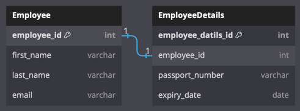
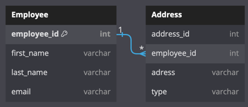
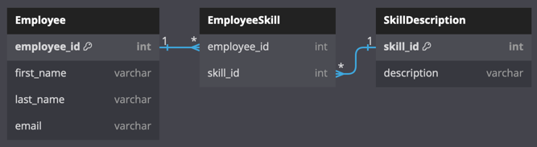

SQL Server와 같은 관계형 데이터베이스의 테이블 간의 관계를 이해하고 설계하는 것이 중요합니다.  
관계형 데이터베이스에서 각 테이블들은 Primary, Foreign 키 제약 조건을 사용하여 다른 테이블에 연결됩니다.

테이블 관계에는 세 가지 유형이 있습니다:

1. One-to-One
2. One-to-Many
3. Many-to-Many

### One-to-One

> 일대일 관계에서는 첫 번째 테이블의 한 레코드가 다른 테이블의 0개 또는 하나의 레코드에 연결됩니다.

예를 들어 `Employee` 테이블의 각 직원은 해당 특정 직원의 여권 세부 정보를 저장하는 `EmployeeDetails` 테이블에 해당 행을 갖습니다.  
따라서 각 직원은 `EmployeeDetails` 테이블에 0개 또는 1개의 레코드를 갖게 됩니다.  
일대일 관계라고 합니다.

### One-to-Many

> 일대다 관계는 테이블 간에 가장 일반적으로 사용되는 관계입니다.  
> 한 테이블의 단일 레코드는 다른 테이블의 0개 이상의 행에 연결될 수 있습니다.

`Employee` 및 `Address` 테이블을 예로 들어 보겠습니다.   
`Employee` 테이블은 `employee_id`가 기본 키인 직원 레코드를 저장합니다. `Address` 테이블에는 `address_id`가 기본 키이고  
`employee_id`가 외래 키인 직원의 주소가 포함됩니다. 각 직원은 `Employee` 테이블에 하나의 레코드를 갖습니다.  
각 직원은 집 주소, 사무실 주소, 영구 주소 등과 같은 많은 주소를 가질 수 있습니다.

`Employee` 및 `Address` 테이블은 `employee_id` 키 열로 연결됩니다.  
`Employee` 테이블의 기본 키 `employee_id` 연결되는 `Address` 테이블의 외래 키입니다.  
따라서 `Employee` 테이블의 한 레코드는 `Address` 테이블의 여러 레코드를 가리킬 수 있습니다.  
이는 일대다 관계입니다.

### Many-to-Many

> 다대다 관계를 사용하면 한 테이블의 각 행을 다른 테이블의 여러 행에 연결하거나 그 반대로 연결할 수 있습니다.

예를 들어, `Employee` 테이블의 직원은 `EmployeeSkill` 테이블의 많은 기술을 가질 수 있으며,  
또한 하나의 스킬이 한 명 이상의 직원과 연결될 수 있습니다.

다음 그림에서는 접합 테이블 `EmployeeSkill`을 사용하여 `Employee`와 `SkillDescription` 테이블 간의 다대다 관계를 보여줍니다.  
`Employee` 테이블의 모든 직원은 하나 이상의 기술을 가질 수 있습니다. 그 반대로 `SkillDescription` 테이블의 기술은 여러 직원과 연결될 수 있습니다.
이는 다대다 관계를 만듭니다.

위의 예에서 `EmployeeSkill`은 `employee_id`와 `skill_id` 외래 키를 포함하여 `Employee`와 `SkillDescription` 테이블 간의
다대다 관계를 형성하는 접합 테이블입니다.  
각각 `Employee`와 `EmployeeSkill`에는 일대다 관계가 있고 `SkillDescription`와 `EmployeeSkill`에도 일대다 관계가 있습니다.   
그러나 접합 테이블 `EmployeeSkill`을 사용하여 다대다 관계를 형성합니다.

### Reference

- [www.tutorialsteacher.com](https://www.tutorialsteacher.com/sqlserver/tables-relations)