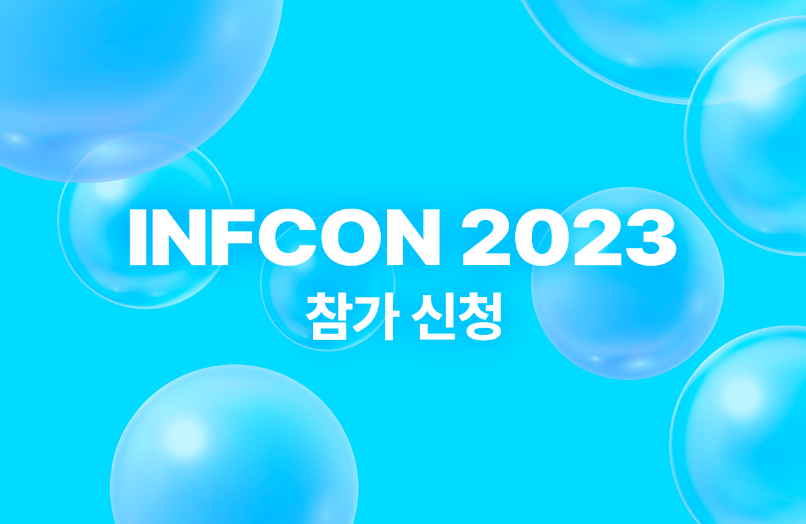
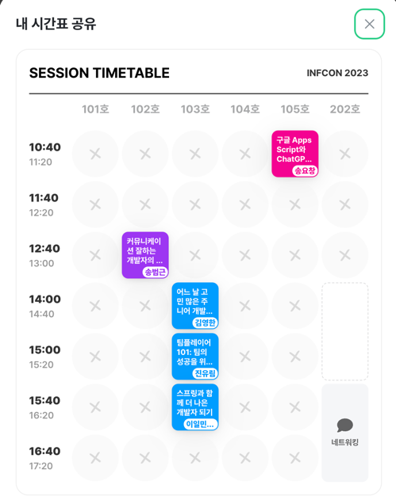
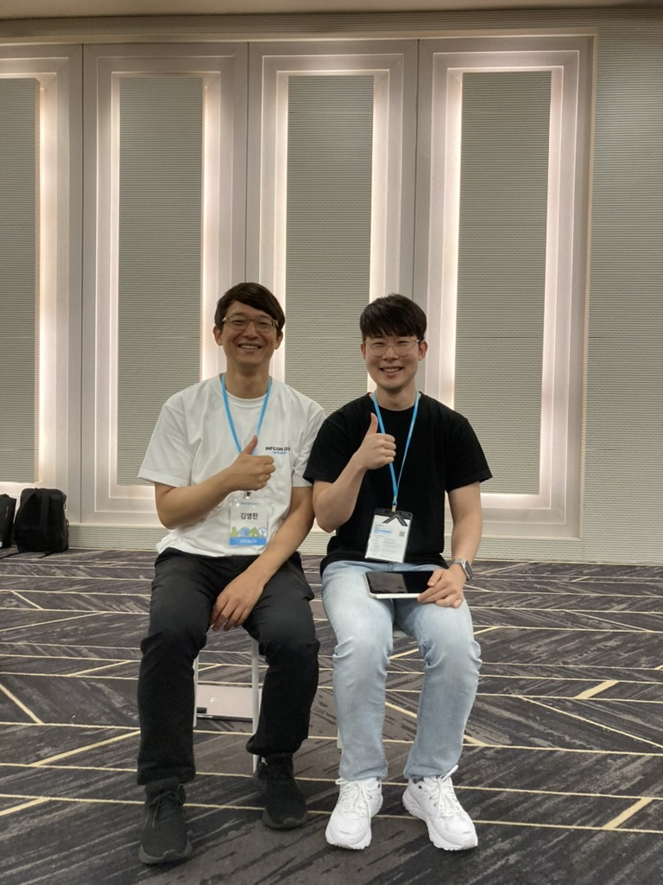

## INFCON 2023

### 인프콘이란?

교육 플랫폼 인프런에서 주최하는 오프라인 컨퍼런스이다.  
인프런은 온라인으로 교육과 커리어에 관한 컨텐츠를 제공하는 플랫폼이다.  
주로 IT에 관련된 사람들과 기업들이 참여하여 기술 성장, 협업 & 생산성 향상을 목표로 정보를 공유하는 자리이다.

{: width=80% height=40%}

### 참여한 이유?

태어나서 처음으로 추첨에 당첨되어본 거 같다.  
혼자 뭘 해보는 게 처음이라 갈까 말까 고민하였지만 기회를 준 인프런과 나로 인해 못 갔을 누군가에게 미안해서 용기를 내어 갔다.
사실 최근에 기쁜 일도 잠시 안 좋은 일이 너무 많았다. 회사일도 현재 하고 있는 프로젝트도 지금까지도 지속되는 일이 내가 극복할 수 있을까라는 의구심이 들어
포기하고 싶기도 했다.
하지만 이런 내 고민을 인프런이 알아버린 건지 이번 콘퍼런스에서는 내가 어떻게 헤쳐나가야 하는지 힌트를 준 것만 같아 눈물이 나올 거 같았다.

### Time Table

{: width=40% height=40%}

내가 들었던 시간표다. 나와 일하는 사람들이 주로 겪는 어려움이 **커뮤니케이션**이었다.
그래서 주로 커뮤니케이션과 팀 플레이어 세션에 눈길이 갔다. 그리고 내가 지금까지 개발을 할 수 있었던 김영한 님 그리고 토비님의 세션을 참가했다.

### 커뮤니케이션

#### 나는 왜 좋은 커뮤니케이션을 갈구할까?

좋은 개발자가 되고 싶기 때문이다. 그러나 이 고민을 하는 건 나뿐만이 아니었다. 일을 잘하고자 하는 개발자들의 가장 큰 관심사였다.
그럼 많은 개발자들은 왜 좋은 커뮤니케이션에 대해 목마를까? 그 이유는 회사를 다니며 월급을 받는 개발자들의 대부분은
서비스 개발을 통해 일을 하기 때문이다. 서비스 개발에는 여러 직군과 협업을 해야 하고 협업을 할 때는 여러 커뮤니케이션 도구를 사용한다.

#### 방법을 찾았나?

다른 직군들이 개발자에게 가장 듣기 싫어하는 건 "**그냥 안된다**"이다.
물론 개발자가 그렇게 말한 이유는 나빠서, 일을 하기 싫어서는 아닐 거다. 나름의 이유가 있고 사정이 있을 것이다. 하지만 우리 원하는 건 
"**좋은 개발자가 되고 싶다.**"를 잊어서는 안 된다.

그럼 어떻게 해야 할까? **스펙 구현형 개발자**가 되는 걸 조심해야 한다. 구현에 집중하면 일의 시야가 좁아지고 문제의 본질을 놓치게 된다.
상대방이 말하는 의도와 맥락을 이해해서 개발적으로 해결하는 방법 외에도 다른 방법으로도 찾을 수 있다.

Toss의 개발자들도 UX나 법무팀의 도움으로 개발로는 힘든것을 다른 방법으로 해결한 사례가 많다고 한다.

#### 회사일에 적용하기

누구나 세션을 듣고 이해하기 쉬운 내용들이다 중요한건 실행으로 옮기는 것이다.  
말은 쉽지만 현실에서는 다양한 상황과 환경이 존재한다. 가장 중요한건 이해한것이 말하는이와 듣는이가 같은지인거 같다.  
그러기 위해선 난 이 세션에서 배운 몇가지를 실천하기로 했다.

1. 해결하려는 문제와 의도에 대해 묻는다.
2. 상대방의 말을 듣고 내가 이해한 바를 공유한다.
3. 안된다고 말할때는 상대방의 관점에서 대안을 제시한다. (상대방은 왜 기술적으로 어려운지 듣는걸 원하지 않는다.)
4. 문제를 해결할 또 다른 방법은 없는지 고민한다.
5. 한번 더 다른 사람에게 물어보면 다양한 방법을 얻을 수 있다.
6. 글을 많이 작성하고 피드백을 받는다.
7. 매일 todo-list를 작성하여 실천한다.

### Why

신기하게 커뮤니티 세션도 기술 세션도 공통점이 **Why**였다. 아니 나에겐 이번 콘퍼런스의 주제일 정도였다.  
커뮤니케이션에서 상대방의 의도를 파악할 때도 왜 이 사람이 이렇게 얘기를 할까를 생각해야 한다.  

그리고 영한님의 세션에서도 성장에는 용기와, why가 필요하다고 했다.

### 기술과 비즈니스를 통해 성장하기

주니어에서 시니어 개발자가 되기 위해선 무엇이 필요할까? 공부한 내용을 바탕으로 협업에 적용시켜야 동기부여가 되고 학습 사이클이 효율적이게 된다. 
1년차의 10번 반복을 피해야한다. **내 월급이 어디서 나오는가?** 를 생각해야 하고 비즈니스와 개발이 어떻게 연결되어 있는지 이해하는 지도를 그려야 한다.  

> 근본적인 이유를 알아야 본질적인 답을 찾을 수 있다.  
> 동기부여, 기술역량 성장, 제대로 된 비즈니스 이해, 제대로된 기술검증이 중요하다.

### 결론

내가 개발을 지속할 수 있게 좋은 강의를 만들어 주신 김영한 님과 사진을 찍었다.  
좋아하는 사람과 용기를 내어 사진 찍고 사인을 받아본 건 태어나 처음이라 너무 값진 경험을 하였다.  
영한님처럼 개발자로써 많은 사람들에게 좋은 영향을 끼치진 못하더라도 팀 내에서 나도 좋은 영향을 끼치고 싶다.

{: width=40% height=40%}

- [infcon2023](https://inflearn.com/conf/infcon-2023)
- [커뮤니케이션 잘하는 개발자의 4가지 습관](https://www.inflearn.com/conf/infcon-2023/session-detail?id=756)
- [어느 날 고민 많은 주니어 개발자가 찾아왔다 2탄: 주니어 시절 성장과 고민들](https://www.inflearn.com/conf/infcon-2023/session-detail?id=745)
- [스프링과 함께 더 나은 개발자 되기](https://www.inflearn.com/conf/infcon-2023/session-detail?id=769)