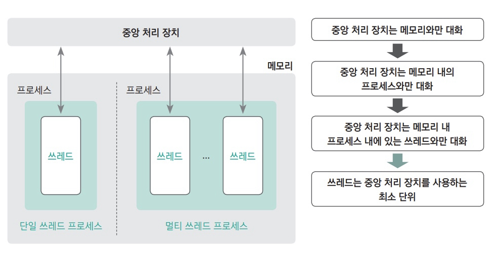
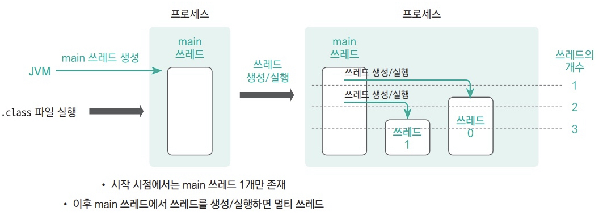
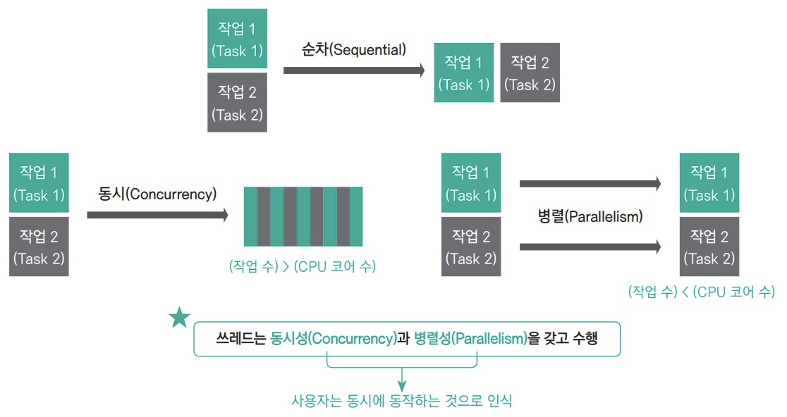

## 쓰레드(Thread)란?

여러 개의 작업이 동시에 수행되도록 하기 위해서는 한정된 코어의 수를 갖는 CPU 를 여러개의 작업이
나눠 사용해야 하는데, 이것이 바로 '쓰레드(Thread)'다.

### 프로그램과 프로세스의 개념

컴퓨터를 이루는 주요 구성 요소에는 중앙 처리 장치(CPU), 메모리(Memory) 그리고 하드디스크(Hard disk)가 있다.
이 중 CPU 는 연산을 수행함으로써 실제 프로그램을 실행하는 장치로, 가장 빠른 속도로 동작한다.
반면 데이터의 저장 역할을 수행하는 하드 디스크는 상대적으로 가장 낮은 속도로 동작한다.  
CPU 와 하드디스크의 속도차는 어마어마하기 때문에 서로 대화를 하지 않는다.  
그렇다면 저장된 데이터를 어떻게 CPU 로 보내야 할까? 이게 바로 메모리의 역할이다.
따라서 실제 하드디스크에 저장된 그로그램이 실행되기 위해서는 먼저 프로그램을 메모리로 로딩하는 과정을 거쳐 프로세스 상태로
만들어야 한다. 이렇게 로딩된 메모리의 프로세스가 CPU 와 비슷한 속도로 대화하면서 프로그램을 실행하는 것이다.  
내용을 정리하면 **프로그램**은 하드디스크에 저장된 파일들의 모임, **프로세스**는 메모리상에 로딩된 프로그램을 의미한다.

### 쓰레드의 개념

쓰레드를 다른 말로 정의하면, 'CPU 를 사용하는 최소 단위'라고 할 수 있다.

### 자바 프로그램에서의 쓰레드

자바로 작성된 프로그램을 실행하면 메모리로 로딩돼 프로세스 상태가 된다.

- .class 파일을 실행하면 JVM 은 main 쓰레드를 생성한다.
- 즉, 프로그램이 처음 실행되면 시작 시점에서는 main 쓰레드 1개만이 존재하는 것이다.
- 만일 main 쓰레드 내부에서 다음과 같은 2개의 쓰레드를 생성해 실행하면 동시에 2개  
  이상의 쓰레드가 동작하게 되는데, 이를 **멀티 쓰레드** 프로세스라고 한다.

### 쓰레드는 정말 동시에 수행될까?

이를 이해하기 위해서는 쓰레드의 동시성(concurrency)과 병렬성(parallelism)을 이해해야 한다.

1. 단일 쓰레드로 2개의 작업을 처리할떄 작업은 순차적(sequential)으로 처리된다. 즉, 먼저 시작된 작업이
   완전히 종료된 이후에 두 번째 작업이 실행되는 것이다.
2. 동시성은 처리할 작업의 수가 CPU 의 코어 수보다 많을 떄다. 예를 들어 CPU 의 코어는 1개인데, 동시에 처리해야 할
   작업이 2개일 때가 이에 해당한다. 매우 짧은 간격으로 교차 실행하기 때문에 사용자는 동시에 실행되는 것처럼 보이는 것이다.
3. CPU 의 코어 수가 작업 수 보다 많을 때는 작업을 각각의 코어에 할당해 동시에 실행할 수 있기 때문에 동시에 작업이
   수행된다. 이를 쓰레드의 병렬성이라 한다.

## 참조

[Do it! 자바 완전 정복](http://www.yes24.com/Product/Goods/103389317)