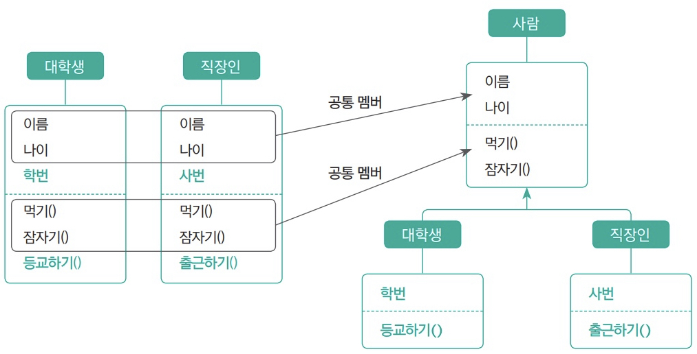
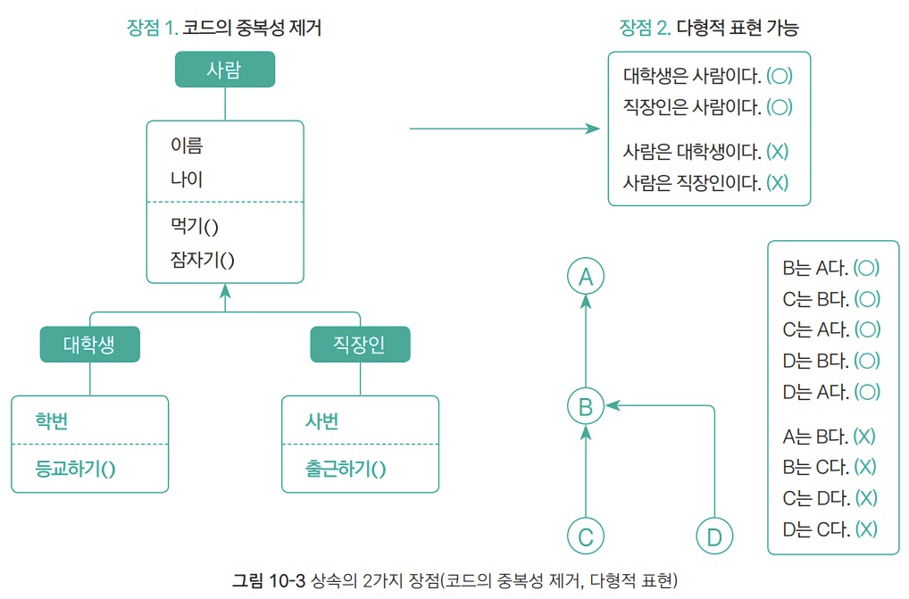
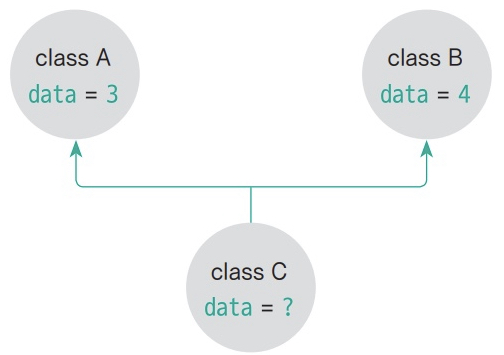

## 클래스 상속
클래스의 상속은 부모 클래스의 맴버(필드, 메서드, 이너 클래스)를 내려받아 자식 클래스 내부에 
포함시키는 자바의 문법 요소다.

### 상속의 개념

김동형, ⌜Do it! 자바 완전 정복⌟, 이지스퍼블리싱, 2021, 308쪽  

사람 클래스가 부모 클래스, 대학생과 직장인 클래스가 자식 클래스

### 상속의 장점  


김동형, ⌜Do it! 자바 완전 정복⌟, 이지스퍼블리싱, 2021, 309쪽  

- 코드의 중복성이 제거
- 다형적 표현이 가능
  - 다형성(polymorphism)이란 1개의 객체를 여러가지 모양으로 표현할수 있는 특성을 말한다. 예를들면 '대학생은 대학생이다.', '대학생은 사람이다.'

### 상속 문법
클래스를 상속할 때는 `extends` 키워드를 사용한다.
```java
class 자식 extends 부모 {
    //...
}
```

#### 자바의 클래스 다중 상속을 허용하지 않는 이유
자바의 클래스는 **다중 상속이 불가능**한데,  
여기서 다중 상속은 부모 클래스가 2개 이상일 때를 말한다.
  
김동형, ⌜Do it! 자바 완전 정복⌟, 이지스퍼블리싱, 2021, 311쪽

위 그림을 예를 들면 A와 B 모두 data 필드를 포함하고 있다.  
만약 C가 A, B를 상속받는다면 부모의 맴버를 모두 내려받으므로 data 필드가 생길 것이다.  
이때 data 필드의 값이 A의 3값과 B의 4값중 무엇이 저장될지 모호성(ambiguous)이 발생한다.  
이것이 다중 상속을 허용하지 않는 이유다.

## 참조

[Do it! 자바 완전 정복](http://www.yes24.com/Product/Goods/103389317)
