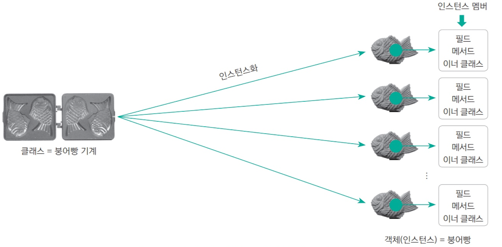

## 클래의 개념

**객체 object 는 사용할 수 있는 실체**를 의미하며, **클래스는 객체를 만들기 위한 설계도**와 같다.   
따라서 1개의 정의된 클래스를 이용해 여러 개의 객체를 만들 수 있다.

## 클래스의 구조
```java
package ...; // ① 패키지
import ...; // ② 임포트
class 클래스명 {...} // ③ 외부 클래스
public class A {
    int a = 3; // ① 필드
    double abc() {...} // ② 메서드
    A() {...} // ③ 생성자
    class 클래스명 {...} // ④ 이너 클래스
}
```

## 클래스와 오브젝트 구분하기



- **클래스**를 붕어빵 기계에 비유한다면 **객체**는 붕어빵 기계로 찍어 낸 붕어빵에 비유할 수 있다.
- 우리는 **클래스**를 직접 사용할 수 없다. 클래스의 모든 특징(필드)과 기능(메서드)들을 사용하려면 클래스를 이용해 **객체**를 만든 후 그 객체 속의
  필드와 메서드 등 을 사용해야 하는 것이다.
- 클래스의 생성자로 객체를 만드는 과정을 `인스턴스화 instantiation`라고 하고, 인스턴스화로 만들어진 객체를 `인스턴스 instance`라고 한다.

> **클래스**는 바로 사용할 수 없고 반드시 **객체**를 생성해 객체 안에 있는 필드, 메서드 및 이너 클래스를 사용해야 한다.

## 객체의 생성과 활용
```java
A a = new A();
```
객체는 `new` 키워드로 생성할 수 있다.   
자바에서는 대부분의 클래스가 이 방법으로 객체를 생성한다. 
클래스에 따라 메서드를 사용해 객체를 생성할 때도 있지만, 이때도 해당 메서드 내부에서 `new`를 사용해 객체를 생성한다.  
즉, 모든 클래스가 객체를 `new` 키워드로 생성한다고 볼 수 있다.

## 참조
[Do it! 자바 완전 정복](http://www.yes24.com/Product/Goods/103389317)
