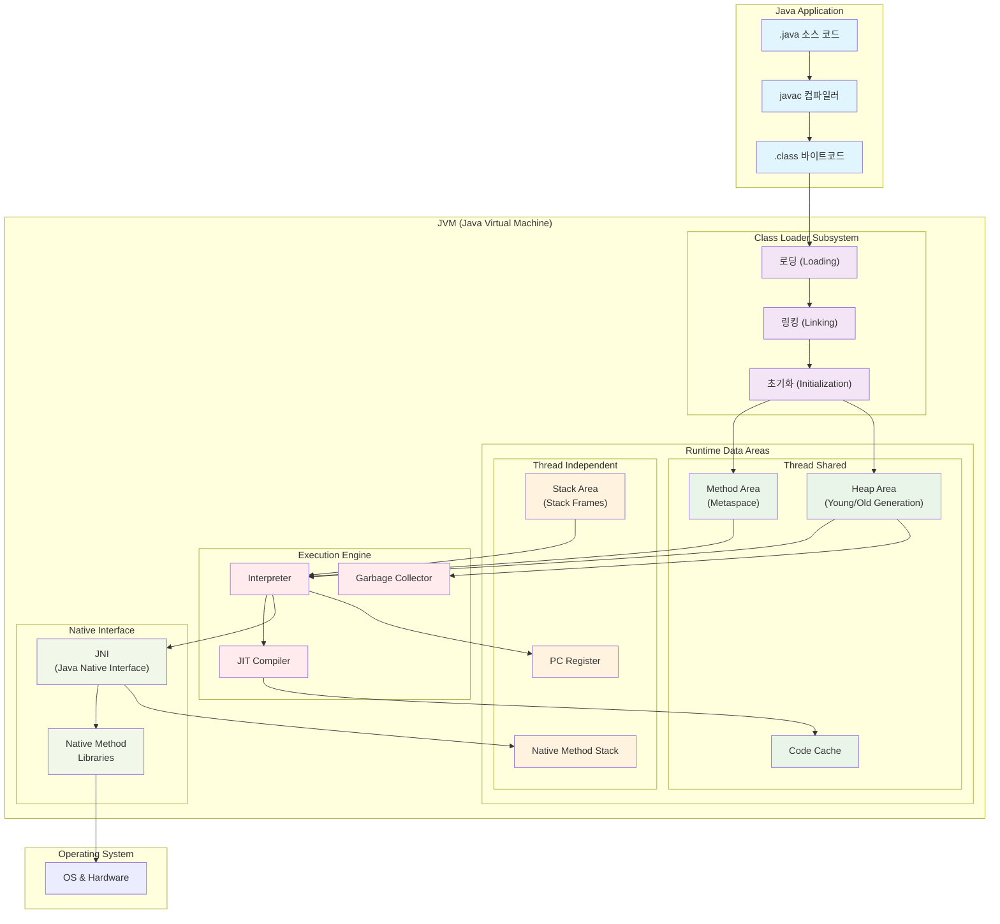
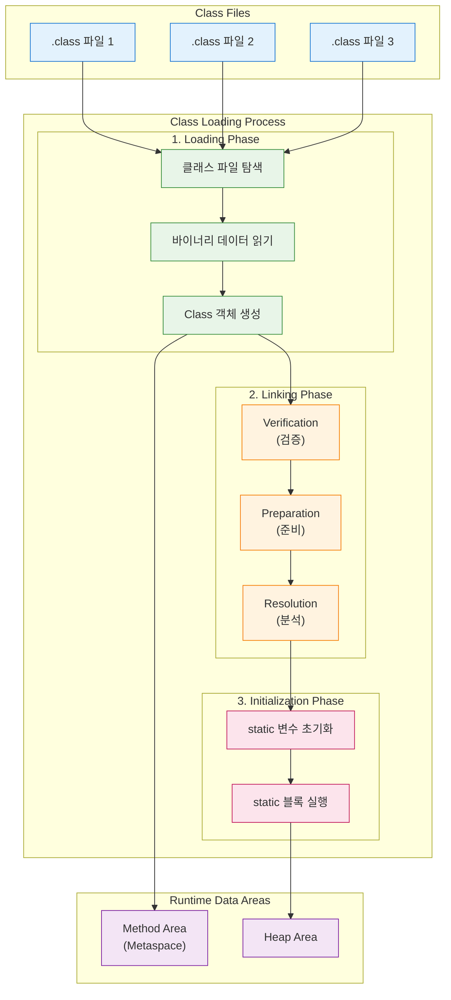
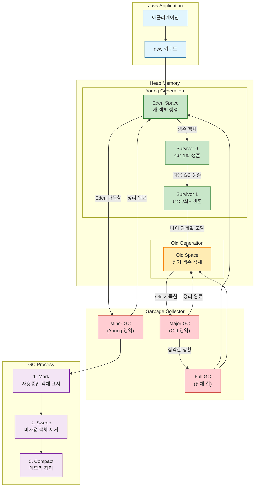

## JVM 이란?

JVM(Java Virtual Machine)은 자바 언어의 핵심 철학인 "Write Once, Run Anywhere "를 가능하게 하는 추상 컴퓨팅 머신이다.  
이는 개발자가 작성한 자바 소스 코드가 `javac` 컴파일러에 의해 플랫폼 독립적인 바이트코드(`.class` 파일)로 변환된 후, JVM이 설치된 모든 운영체제에서 문제없이 실행될 수 있도록 런타임 환경을 제공하는 역할을 한다.

### JVM 을 학습해야 하는 이유

JVM은 자바 애플리케이션의 실행에 필요한 메모리를 운영체제로부터 할당받아 이를 용도에 따라 여러 영역으로 나누어 관리한다.
이러한 메모리 관리 방식은 애플리케이션의 성능, 안정성, 확장성에 직접적인 영향을 미친다.
따라서 JVM 메모리 구조에 대한 깊이 있는 이해는 개발자가 코드 최적화, 리팩토링, 그리고 복잡한 메모리 관련 문제를 진단하고 해결하는 데 필수적인 역량으로 간주된다.

## 아키텍처 개요

JVM은 자바 애플리케이션의 실행을 위한 포괄적인 런타임 환경을 제공하며, 여러 핵심 구성 요소들이 유기적으로 상호작용하여 바이트코드를 실행한다.

### JVM의 핵심 구성 요소

JVM은 크게 클래스 로더 서브시스템(Class Loader Subsystem), 런타임 데이터 영역(Runtime Data Areas), 실행 엔진(Execution Engine), 네이티브 메서드 인터페이스(Native Method Interface, JNI), 그리고 네이티브 메서드 라이브러리(Native Method Libraries)로 구성된다.

- **클래스 로더 서브시스템**:
    - `.class` 파일을 JVM 메모리인 런타임 데이터 영역으로 로드하고, 로드된 클래스들을 JVM의 런타임 상태에 통합하기 위한 링크(Linking) 및 초기화(Initialization) 작업을 담당한다.

- **런타임 데이터 영역**:
    - JVM이 애플리케이션 실행 중 데이터를 저장하는 핵심 메모리 공간이다.
    - 이 영역은 메서드 영역, 힙 영역, 스택 영역, PC 레지스터, 네이티브 메서드 스택으로 세분화된다.
    
- **실행 엔진**:
    - 런타임 데이터 영역에 적재된 바이트코드를 기계어(네이티브 코드)로 변환하여 명령어 단위로 실행하는 역할을 한다.
    - 여기에는 인터프리터(Interpreter), JIT(Just-In-Time) 컴파일러, 그리고 가비지 컬렉터(Garbage Collector)가 포함된다.
    
- **네이티브 메서드 인터페이스 (JNI)**:
    - 자바 애플리케이션이 C/C++ 등 자바 외의 언어로 작성된 네이티브 코드를 호출하거나 상호작용할 수 있도록 하는 표준 프로그래밍 인터페이스이다.
    
- **네이티브 메서드 라이브러리**:
    - JNI를 통해 실행되는 네이티브 메서드에 필요한 라이브러리들의 집합이다.

## JVM 클래스 로더 서브시스템

클래스 로더 서브시스템(Class Loader Subsystem)은 컴파일된 `.class` 파일을 JVM 메모리로 로드하고, 이를 실행 가능한 상태로 변환하는 핵심 구성 요소이다.   
이는 자바의 "Write Once, Run Anywhere" 철학을 실현하는 핵심 메커니즘으로, 런타임에 필요한 클래스들을 동적으로 로딩하여 메모리 효율성과 유연성을 제공한다.

### 클래스 로딩의 3단계 과정

클래스 로딩은 로딩(Loading), 링킹(Linking), 초기화(Initialization)의 세 단계로 이루어진다.

#### 1. 로딩(Loading) 단계

로딩 단계에서는 클래스 로더가 클래스 파일을 찾아서 JVM 메모리로 가져온다.

- **클래스 파일 탐색**: 클래스패스(Classpath)에서 해당 클래스의 `.class` 파일을 찾는다.
- **바이너리 데이터 읽기**: 클래스 파일의 바이트코드를 읽어들인다.
- **Class 객체 생성**: 읽어들인 바이트코드로부터 `java.lang.Class` 객체를 생성하여 메서드 영역에 저장한다.

#### 2. 링킹(Linking) 단계

링킹 단계는 로드된 클래스를 JVM에서 안전하게 실행할 수 있도록 준비하는 과정이다.

- **검증(Verification)**: 로드된 바이트코드가 JVM 명세에 적합한지, 보안 규칙을 위반하지 않는지 검사한다. 이는 악의적이거나 손상된 클래스 파일로부터 JVM을 보호하는 중요한 보안 메커니즘이다.

- **준비(Preparation)**: 클래스의 static 변수들을 위한 메모리를 할당하고 기본값(0, null, false 등)으로 초기화한다. 이 단계에서는 아직 개발자가 코드에서 지정한 값으로 초기화하지 않는다.

- **분석(Resolution)**: 클래스 내의 심볼릭 참조(Symbolic Reference)를 실제 메모리 주소를 가리키는 직접 참조(Direct Reference)로 변환한다. 예를 들어, 다른 클래스의 메서드를 호출하는 코드가 있다면, 해당 메서드의 실제 메모리 위치를 찾아 연결한다.

#### 3. 초기화(Initialization) 단계

초기화 단계에서는 클래스가 실제로 사용되기 직전에 실행되는 최종 준비 과정이다.

- **static 변수 초기화**: 개발자가 코드에서 지정한 값으로 static 변수들을 초기화한다.
- **static 블록 실행**: 클래스에 정의된 static 초기화 블록들을 실행한다.

## JVM 런타임 데이터 영역

JVM은 운영체제로부터 할당받은 메모리를 효율적으로 사용하기 위해 여러 런타임 데이터 영역으로 나눈다.  
이 영역들은 크게 모든 스레드가 공유하는 영역과 스레드마다 독립적으로 생성되는 영역으로 구분된다.

### 1. 메서드 영역 (Method Area / Metaspace)

메서드 영역은 클래스 파일에서 로드된 클래스 및 인터페이스에 대한 정의,
필드 정보(이름, 데이터 타입, 접근 제어자), 메소드 정보(이름, 리턴 타입, 파라미터, 접근 제어자), 타입 정보, 상수 풀(Constant Pool), static 변수, final static 변수 등 클래스 레벨의 메타데이터를 저장하는 영역이다. 이 영역은 JVM이 시작될 때 생성되며, JVM 내의 모든 스레드가 공유하는 단일 영역이다.

### 2. 힙 영역 (Heap Area)

힙 영역은 `new` 키워드를 사용하여 생성된 모든 객체(Object), 인스턴스 변수(Instance Variable), 배열(Array)이 저장되는 런타임 데이터 영역이다.  

이 영역은 JVM 시작 시 생성되며, JVM 내의 모든 스레드가 공유하는 단일 영역이다. 힙에 생성된 객체는 애플리케이션 내 어디에서든 참조될 수 있다.  

힙 영역은 Garbage Collector(GC)에 의해 자동으로 관리되며, 더 이상 참조되지 않는 객체는 GC에 의해 제거되어 메모리가 회수된다.  

효율적인 가비지 컬렉션을 위해 힙은 여러 "세대(Generations)"로 분리된다. 이는 대부분의 객체가 짧은 수명을 가진다는 "약한 세대 가설(Weak Generational Hypothesis)"에 기반한다.

- **Young Generation (젊은 세대)**: 새로 생성된 대부분의 객체가 할당되는 공간이다. Eden Space와 두 개의 Survivor Spaces(S0, S1)로 구성된다. 새 객체는 주로 Eden Space에 할당되며, Eden Space가 가득 차면 Minor GC(Young GC)가 발생한다. Minor GC 후 살아남은 객체들은 Survivor Space(S0 또는 S1)로 이동하며, 이 과정을 반복하면서 객체의 "나이(age)"가 증가한다. 일정 나이 임계값(Tenuring Threshold)에 도달하면 Old Generation으로 승격된다.
    
- **Old Generation (오래된 세대 / Tenured Generation)**: Young Generation에서 여러 Minor GC 사이클을 거쳐 살아남은(오랫동안 참조된) 객체들이 저장되는 공간이다. Old Generation이 가득 차면 Major GC(Full GC)가 발생하며, 이는 Minor GC보다 시간이 오래 걸리고 애플리케이션 전체에 영향을 줄 수 있다.
    
힙에 있는 객체는 해당 참조 타입에 따라 가비지 컬렉션 조건에 맞춰 동작한다.

- **Strong Reference (강한 참조)**: 기본 참조 타입으로, 가장 흔하게 사용되며, 강한 참조가 있는 객체는 GC 대상이 되지 않는다.
- **Weak Reference (약한 참조)**: 다음 GC 프로세스에서 지워질 수 있으며, 지워진 후 참조 시 `null`이 반환된다. 
- **Soft Reference (부드러운 참조)**: 애플리케이션이 메모리가 부족한 상황에서 실행될 때 수집된다. `OutOfMemoryError`가 발생하기 전에 GC에 의해 수집될 수 있다.
- **Phantom Reference (유령 참조)**: GC가 객체를 수집하기로 결정한 후에도 객체가 완전히 제거되기 전에 특정 작업을 수행할 수 있도록 한다. 주로 객체 소멸 시 자원 정리(finalization)에 사용된다.

### 3. 스택 영역 (Stack Area)

JVM 내에서 각 스레드가 생성될 때마다 독립적인 스택 영역이 생성되며, 이는 해당 스레드에만 할당되고 다른 스레드에서 참조할 수 없다. 스레드가 종료되면 해당 스택도 함께 소멸된다.
메서드가 호출될 때마다 해당 메서드를 위한 "스택 프레임(Stack Frame)"이라는 데이터 구조가 스택에 푸시된다.
스택 프레임은 메서드의 지역 변수(Local Variables), 파라미터(Parameters), 리턴 값(Return Values), 연산에 사용되는 임시 값, 그리고 메서드 호출 정보 등을 저장한다. 스택은 LIFO(Last-In, First-Out) 순서로 동작한다. 메서드 실행이 완료되면 해당 스택 프레임은 스택에서 팝(pop)되어 제거된다.
스택의 크기는 JVM 옵션(-Xss)으로 설정할 수 있으며, 스레드 생성 시 고정됩니다. 스택 공간이 부족해지면 `java.lang.StackOverflowError`가 발생한다.

### 4. PC 레지스터 (Program Counter Register)

각 스레드에는 고유한 PC(Program Counter) 레지스터가 할당된다. 이 레지스터는 현재 스레드가 실행 중인 JVM 명령어의 주소(Address)를 저장한다.
이를 통해 JVM은 스레드를 번갈아 가며 수행할 수 있다.
네이티브 메서드(Java 코드가 아닌 C/C++ 등)의 경우 PC 레지스터의 값은 정의되지 않는다.

### 5. 네이티브 메서드 스택 (Native Method Stack)

네이티브 메서드 스택은 자바 외의 언어(주로 C/C++)로 작성된 네이티브 코드(Native Code)를 위한 스택 메모리 영역이다.
JNI(Java Native Interface)를 통해 JVM과 상호 작용하며, 네이티브 메서드 호출 시 해당 스택이 사용된다.
네이티브 스택의 성능은 운영체제에 따라 다르다. 이 영역에서도 `StackOverflowError`가 발생할 수 있다.

### 6. 코드 캐시 (Code Cache)

코드 캐시는 JIT(Just-In-Time) 컴파일러가 바이트코드를 네이티브 코드로 변환하여 저장하는 영역이다. 자주 접근하는 컴파일된 코드 블록이 이곳에 캐시되어 있어, 애플리케이션의 실행 속도를 빠르게 한다.

**[표 1] JVM 런타임 데이터 영역 요약**

| 영역 이름                                  | 주요 역할                                 | 스레드 공유 여부 | 저장되는 데이터 유형                                               |
|----------------------------------------|---------------------------------------|-----------|-----------------------------------------------------------|
| **메서드 영역 (Method Area / Metaspace)**   | 클래스 메타데이터 및 static 정보 저장              | 공유 (단일)   | 클래스/인터페이스 정의, 필드/메소드 정보, 상수 풀, static 변수, final static 변수 |
| **힙 영역 (Heap Area)**                   | `new` 키워드로 생성된 모든 객체 및 배열 저장          | 공유 (단일)   | 객체 인스턴스, 인스턴스 변수, 배열 (Young/Old Generation으로 세분화)         |
| **스택 영역 (Stack Area)**                 | 메서드 호출 시 지역 변수, 파라미터, 리턴 값, 임시 데이터 저장 | 독립 (스레드별) | 스택 프레임 (지역 변수, 파라미터, 리턴 값, 연산 임시 값, 메서드 호출 정보)            |
| **PC 레지스터 (Program Counter Register)** | 현재 실행 중인 JVM 명령어의 주소 저장               | 독립 (스레드별) | 현재 JVM 명령어 주소 (네이티브 메서드 시 `undefined`)                    |
| **네이티브 메서드 스택 (Native Method Stack)**  | JNI를 통해 호출되는 네이티브 코드(C/C++ 등)의 스택 영역  | 독립 (스레드별) | 네이티브 메서드의 지역 변수, 파라미터 등                                   |
| **코드 캐시 (Code Cache)**                 | JIT 컴파일러에 의해 변환된 네이티브 코드 저장           | 공유 (단일)   | JIT 컴파일된 코드 블록                                            |

## JVM 실행 엔진

JVM(Java Virtual Machine)의 실행 엔진(Execution Engine)은 런타임 데이터 영역에 적재된 바이트코드를 기계어(네이티브 코드)로 변환하여 명령어 단위로 실행하는 핵심 구성 요소입니다. 이는 중간 수준의 바이트코드를 컴퓨터가 직접 실행할 수 있는 형식으로 변환하는 역할을 합니다.

실행 엔진은 주로 다음 세 가지 부분으로 구성됩니다.

### 1. 인터프리터 (Interpreter):

인터프리터는 바이트코드 명령어를 한 줄씩 읽고 즉시 실행합니다.

이는 자바의 "Write Once, Run Anywhere" 철학을 가능하게 하는 플랫폼 독립성을 보장하지만, 코드가 반복적으로 실행될 경우 비효율적일 수 있습니다.

### 2. JIT 컴파일러 (Just-In-Time Compiler):

JIT 컴파일러는 인터프리터의 느린 속도를 개선하기 위해 도입되었습니다.

이는 런타임에 자주 반복되는 바이트코드(일명 "핫 스팟" 코드)를 식별하고, 이를 해당 시스템의 네이티브 기계어 코드로 동적으로 컴파일합니다.

이렇게 컴파일된 네이티브 코드는 인터프리터 방식보다 훨씬 빠르게 직접 실행될 수 있어 전반적인 애플리케이션 성능을 향상시킵니다.

JVM은 실행 빈도에 따라 인터프리터와 JIT 컴파일러 사이를 지능적으로 전환합니다. 이 과정은 자바 애플리케이션의 "웜업(warm-up)" 현상을 설명하는데, 애플리케이션이 처음 시작될 때는 인터프리터 모드로 인해 다소 느릴 수 있지만, 시간이 지남에 따라 JIT 컴파일러가 최적화를 수행하면서 성능이 점진적으로 향상됩니다. JIT 컴파일러에 의해 변환된 네이티브 코드는 코드 캐시(Code Cache)라는 영역에 저장되어 빠르게 실행될 수 있습니다.

### 3. 가비지 컬렉터 (Garbage Collector, GC):

가비지 컬렉션(GC)은 JVM의 핵심 기능 중 하나로, 자바 애플리케이션의 메모리 관리를 자동화하여 개발자가 수동으로 메모리를 할당하고 해제할 필요 없도록 한다.

### GC의 기본 원리

GC는 더 이상 참조되지 않는(Unreachable) 객체를 자동으로 탐색하고 제거하여 메모리를 회수한다. 이는 메모리 누수와 같은 문제를 방지하고 개발 생산성을 높이는 데 기여한다.

> "GC의 기본적인 동작 과정은 Mark & Sweep 2단계로 이루어지며, 메모리 단편화를 해결하기 위해 선택적으로 Compact 단계가 추가될 수 있다."

- **Mark (표시) 단계**: GC는 "루트(Root) 객체"(예: 프로그램의 전역 변수, 스택 변수, 레지스터에 저장된 객체)에서 시작하여 참조 체인을 따라가며 도달 가능한(Reachable) 모든 객체를 식별하고 "마크"한다.
    
- **Sweep (정리) 단계**: 마크되지 않은(즉, 도달 불가능한) 모든 객체들을 "가비지"로 판단하고 메모리에서 해제하여 공간을 회수한다.
    
- **Compact (압축) 단계**: 일부 GC 알고리즘은 Sweep 이후 메모리 단편화(Fragmentation)를 해결하기 위해 살아있는 객체들을 메모리의 한쪽으로 이동시켜 연속적인 빈 공간을 확보한다.
    

GC가 힙 메모리를 정리하는 동안, 애플리케이션의 모든 스레드가 일시적으로 정지되는 현상을 "Stop-The-World (STW)"라고 한다. STW 시간은 애플리케이션의 응답성에 직접적인 영향을 미치므로, GC 성능 튜닝의 주된 목표는 이 STW 시간을 최소화하는 것이다.
