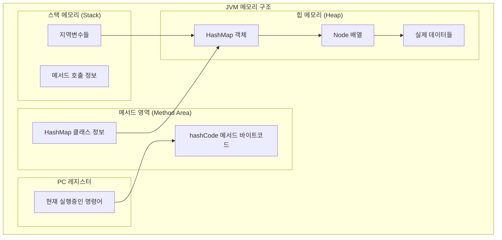
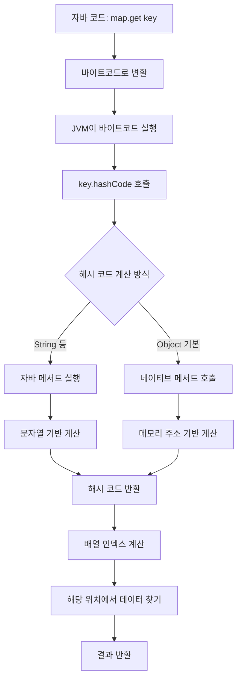
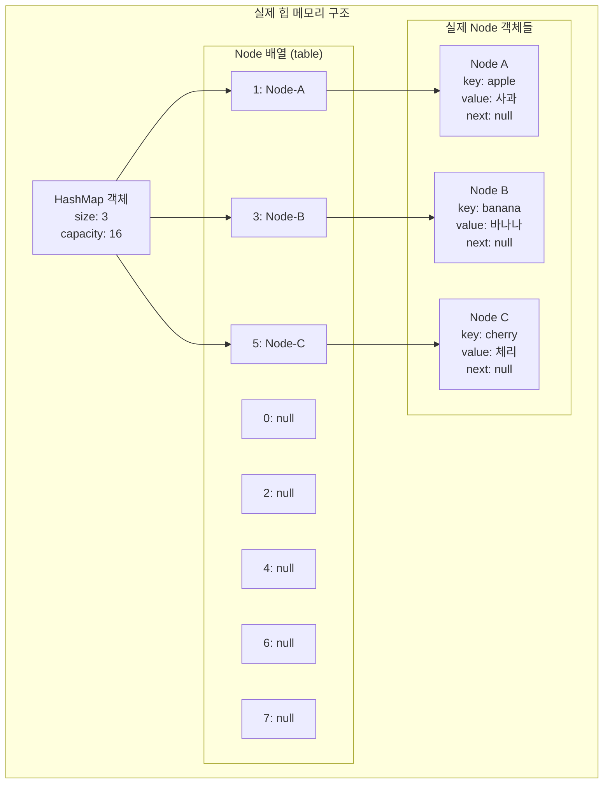

## 시작하기

### 해시(Hash)란 무엇인가요?

해시는 **데이터를 빠르게 찾기 위한 기술**입니다.

#### 예시: 🏠아파트 우편함

```
아파트 우편함을 생각해보세요:
- 김철수(101호) → 1번 우편함
- 박영희(102호) → 2번 우편함  
- 이민수(103호) → 3번 우편함

집 주소(키)를 보면 바로 우편함 번호(위치)를 알 수 있어요!
```

Java의 HashMap도 이와 똑같이 동작합니다.

### 왜 해시를 알아야 하나요?

#### 실무에서 매일 사용하는 코드

```java
// 이런 코드를 자주 작성하지 않나요?
Map<String, User> userMap = new HashMap<>();
Set<String> uniqueIds = new HashSet<>();
```

#### 🚀 성능의 차이

```java
// ArrayList로 사용자 찾기 (느림)
List<User> userList = new ArrayList<>();
for(
    User user :userList){
    if(user.getId().equals("user123")){
        return user; // 최대 1000번 비교해야 함
    }
}

// HashMap으로 사용자 찾기 (빠름)
Map<String, User> userMap = new HashMap<>();
User user = userMap.get("user123"); // 1번만에 찾음!
```

### 첫 번째 HashMap 사용하기

#### 기본 사용법

```java
public class FirstHashMap {
    public static void main(String[] args) {
        // 1. HashMap 생성
        Map<String, String> map = new HashMap<>();

        // 2. 데이터 추가
        map.put("apple", "사과");
        map.put("banana", "바나나");
        map.put("cherry", "체리");

        // 3. 데이터 조회
        String apple = map.get("apple");
        System.out.println(apple); // "사과"

        // 4. 데이터 존재 확인
        if (map.containsKey("apple")) {
            System.out.println("사과가 있어요!");
        }

        // 5. 모든 데이터 출력
        for (String key : map.keySet()) {
            System.out.println(key + " = " + map.get(key));
        }
    }
}
```

---

## 핵심 개념

### HashMap 기본 사용법

#### 주요 메서드들

| 메서드                | 설명        | 예시                              |
|--------------------|-----------|---------------------------------|
| `put(key, value)`  | 데이터 추가/수정 | `map.put("name", "김철수")`        |
| `get(key)`         | 데이터 조회    | `String name = map.get("name")` |
| `remove(key)`      | 데이터 삭제    | `map.remove("name")`            |
| `containsKey(key)` | 키 존재 확인   | `if (map.containsKey("name"))`  |
| `size()`           | 크기 확인     | `int size = map.size()`         |
| `isEmpty()`        | 비어있는지 확인  | `if (map.isEmpty())`            |

#### 실무 예시: 사용자 관리 시스템

```java
public class UserManager {
    private Map<String, User> users = new HashMap<>();

    // 사용자 추가
    public void addUser(User user) {
        users.put(user.getId(), user);
    }

    // 사용자 조회
    public User getUser(String userId) {
        return users.get(userId);
    }

    // 사용자 존재 확인
    public boolean hasUser(String userId) {
        return users.containsKey(userId);
    }

    // 전체 사용자 수
    public int getUserCount() {
        return users.size();
    }
}
```

### hashCode()와 equals() - 가장 중요한 개념!

#### 왜 중요한가요?

```java
// 이런 상황을 생각해보세요
Person person1 = new Person("김철수", 25);
Person person2 = new Person("김철수", 25);

// 같은 사람인데 다른 객체예요!
System.out.println(person1 == person2); // false
```

#### ✅ 올바른 구현

```java
public class Person {
    private String name;
    private int age;

    public Person(String name, int age) {
        this.name = name;
        this.age = age;
    }

    @Override
    public boolean equals(Object obj) {
        if (this == obj) return true;
        if (obj == null || getClass() != obj.getClass()) return false;

        Person person = (Person) obj;
        return age == person.age &&
                Objects.equals(name, person.name);
    }

    @Override
    public int hashCode() {
        return Objects.hash(name, age);
    }
}
```

#### 🧪 테스트해보기

```java
public class Test {
    public static void main(String[] args) {
        Person person1 = new Person("김철수", 25);
        Person person2 = new Person("김철수", 25);

        // 이제 논리적으로 같은 객체로 인식됩니다
        System.out.println(person1.equals(person2)); // true
        System.out.println(person1.hashCode() == person2.hashCode()); // true

        // HashMap에서도 같은 키로 인식됩니다
        Map<Person, String> map = new HashMap<>();
        map.put(person1, "첫 번째 사람");
        System.out.println(map.get(person2)); // "첫 번째 사람"
    }
}
```

### 자주 하는 실수들

#### 🐛 실수 1: hashCode() 재정의 안 함

```java
// ❌ 잘못된 예
public class BadPerson {
    private String name;
    private int age;

    @Override
    public boolean equals(Object obj) {
        // equals만 재정의하고 hashCode는 재정의 안 함
        BadPerson other = (BadPerson) obj;
        return name.equals(other.name) && age == other.age;
    }
    // hashCode() 재정의 안 함 - 큰 문제!
}

// 결과: HashMap에서 정상 동작 안 함
Set<BadPerson> set = new HashSet<>();
set.add(new BadPerson("김철수", 25)); 
set.add(new BadPerson("김철수", 25)); // 중복 저장됨!
        
System.out.println(set.size()); // 2 (잘못됨!)
```

#### 🐛 실수 2: 가변 객체를 키로 사용

```java
// ❌ 위험한 예
List<String> mutableKey = new ArrayList<>();
mutableKey.add("key1");

Map<List<String>, String> map = new HashMap<>();
map.put(mutableKey, "value");

// 키를 변경하면 문제 발생!
mutableKey.add("key2"); // 키가 변경됨

String value = map.get(mutableKey); // null 반환! 찾을 수 없음
```

#### 🐛 실수 3: null 처리 안 함

```java
// ❌ 위험한 예
Map<String, User> userMap = new HashMap<>();
User user = userMap.get("unknown"); // null 반환 가능
user.getName(); // NullPointerException 발생!

// ✅ 안전한 예
User user = userMap.get("unknown");
if(user !=null){
     System.out.println(user.getName());
}

// 또는
String name = userMap.getOrDefault("unknown", new User()).getName();
```

---

## 실무 활용

### Map 인터페이스 vs 구현체

#### 🎯 올바른 선언 방법

```java
// ✅ 권장: 인터페이스 타입으로 선언
Map<String, User> userMap = new HashMap<>();

// ❌ 비권장: 구현체 타입으로 선언
HashMap<String, User> userMap = new HashMap<>();
```

#### 🤔 왜 인터페이스를 사용할까요?

```java
public class UserService {
    // 인터페이스 사용으로 유연성 확보
    private Map<String, User> users;

    public UserService(boolean needsOrdering) {
        if (needsOrdering) {
            users = new LinkedHashMap<>(); // 순서 유지
        } else {
            users = new HashMap<>();      // 일반적인 경우
        }
    }

    public void processUsers(Map<String, User> userMap) {
        // HashMap, LinkedHashMap, TreeMap 모두 받을 수 있음
        for (User user : userMap.values()) {
            // 처리 로직
        }
    }
}
```

### 언제 어떤 Map을 사용할까요?

#### 📊 Map 구현체 비교

| 구현체                   | 특징     | 언제 사용?   | 예시       |
|-----------------------|--------|----------|----------|
| **HashMap**           | 가장 빠름  | 일반적인 경우  | 사용자 캐시   |
| **LinkedHashMap**     | 순서 유지  | 입력 순서 중요 | 설정 파일    |
| **TreeMap**           | 정렬됨    | 정렬 필요    | 학생 성적 순위 |
| **ConcurrentHashMap** | 스레드 안전 | 멀티스레드    | 웹 애플리케이션 |

#### 실무 사용 예시

```java
// 일반적인 캐시 - HashMap
Map<String, User> userCache = new HashMap<>();

// 입력 순서 유지 - LinkedHashMap
Map<String, String> configMap = new LinkedHashMap<>();
configMap.put("database.url","jdbc:mysql://localhost");
configMap.put("database.user","admin");
configMap.put("database.password","secret");

// 정렬 필요 - TreeMap
Map<String, Integer> scoreMap = new TreeMap<>();
scoreMap.put("김철수",95);
scoreMap.put("박영희",87);
scoreMap.put("이민수",92);
// 자동으로 이름 순으로 정렬됨

// 멀티스레드 환경 - ConcurrentHashMap
Map<String, User> threadSafeMap = new ConcurrentHashMap<>();
```

### 성능 최적화 기본

#### 초기 용량 설정

```java
// ❌ 성능 문제 발생 가능
Map<String, User> map = new HashMap<>(); // 기본 용량 16
// 1000개 데이터 추가 시 여러 번 리사이징 발생

// ✅ 성능 최적화
int expectedSize = 1000;
Map<String, User> map = new HashMap<>(expectedSize * 4 / 3 + 1);
// 리사이징 없이 효율적으로 저장
```

#### 📊 성능 측정 예시

```java
public class PerformanceTest {
    public static void main(String[] args) {
        // 작은 맵 vs 큰 맵 성능 비교
        testMapPerformance(16);    // 기본 크기
        testMapPerformance(1000);  // 최적화된 크기
    }

    private static void testMapPerformance(int initialCapacity) {
        Map<String, Integer> map = new HashMap<>(initialCapacity);

        long startTime = System.currentTimeMillis();

        // 10,000개 데이터 추가
        for (int i = 0; i < 10000; i++) {
            map.put("key" + i, i);
        }

        long endTime = System.currentTimeMillis();
        System.out.println("용량 " + initialCapacity + ": " + (endTime - startTime) + "ms");
    }
}
```

---

## 심화 내용

### 내부 구조 이해하기

#### 🏗️ HashMap은 어떻게 동작할까요?

```java
// 간단한 HashMap 동작 원리
Map<String, String> map = new HashMap<>();
map.put("apple","사과");

// 내부적으로 이런 과정을 거칩니다:
// 1. "apple".hashCode() 계산 → 예: 93029210
// 2. 배열 인덱스 계산 → 93029210 % 16 = 10
// 3. 10번 배열에 저장
```

#### 🔄 해시 충돌이 발생하면?

```java
// 만약 두 키가 같은 위치에 저장되려 하면?
map.put("apple","사과");   // 10번 위치
map.put("grape","포도");   // 우연히 10번 위치

// Java 8 이전: 연결 리스트로 저장
// Java 8 이후: 8개 이상 쌓이면 트리로 변환 (더 빠름)
```

### JVM 레벨 이해

#### JVM 전체 구조에서 HashMap의 위치



#### 해시 계산 과정 (JVM 내부)



#### HashMap 메모리 레이아웃


