## 재네릭이란? 

제네릭이란 쉽게 말해서 "타입을 나중에 정해주는 프로그래밍 기법"이에요.  
클래스나 메서드를 만들 때 구체적인 타입 대신 `<T>` 같은 플레이스홀더를 써놓고, 실제 사용할 때 `List<String>`, `List<Integer>` 이런 식으로 원하는 타입을 지정하는 거죠.  
이렇게 하면 하나의 코드로 여러 타입을 안전하게 다룰 수 있어서, 코드 재사용성도 높아지고 타입 오류도 미리 잡을 수 있어요.

## 왜 제네릭을 배워야 할까요?

다음 코드를 살펴보세요. 어떤 문제가 있을까요?

```java
// 제네릭 이전의 코드
List userList = new ArrayList();
userList.add("Alice");
userList.add("Bob");
userList.add(123); // 실수로 정수를 추가!

for (Object obj : userList) {
    String name = (String) obj; // 런타임에 ClassCastException 발생!
    System.out.println("사용자: " + name);
}
```

이 코드는 컴파일은 성공하지만 실행하면 오류가 발생합니다. 문제를 런타임에 발견하게 되죠.

제네릭을 사용하면 이런 문제를 컴파일 시점에 잡을 수 있습니다:

```java
// 제네릭을 사용한 코드
List<String> userList = new ArrayList<>();
userList.add("Alice");
userList.add("Bob");
userList.add(123); // 컴파일 오류! 컴파일러가 즉시 알려줌

for (String name : userList) {
    System.out.println("사용자: " + name); // 캐스팅 불필요!
}
```

> **::💡핵심 포인트**: 제네릭은 버그를 런타임에서 컴파일 시점으로 옮겨서 더 안전한 코드를 만들어줍니다.

## Java 제네릭이 해결하는 세 가지 핵심 문제

### 1. 타입 안전성 (Type Safety)
컴파일러가 잘못된 타입 사용을 미리 감지합니다.

### 2. 캐스팅 제거 (Casting Elimination)
명시적인 타입 캐스팅이 필요 없습니다.

### 3. 코드 재사용 (Code Reusability)
하나의 코드로 여러 타입을 처리할 수 있습니다.

## 제네릭 기본 문법

### 제네릭 클래스 만들기

가장 간단한 예제부터 시작해보겠습니다:

```java
// 어떤 타입이든 담을 수 있는 상자
public class Box<T> {
    
    private T item;
    
    public void put(T item) {
        this.item = item;
    }
    
    public T get() {
        return this.item;
    }
}

// 사용 예시
Box<String> stringBox = new Box<>();
stringBox.put("안녕하세요");
String message = stringBox.get(); // 캐스팅 불필요!

Box<Integer> integerBox = new Box<>();
integerBox.put(42);
Integer number = integerBox.get();
```

> **💡Tip**: `T`는 관례적으로 "Type"을 의미합니다. `E`(Element), `K`(Key), `V`(Value) 등도 자주 사용됩니다.

### 제네릭 메서드 작성하기

클래스 전체가 아닌 특정 메서드만 제네릭으로 만들 수도 있습니다:

```java
public class ArrayUtils {
    // 배열을 리스트로 변환하는 제네릭 메서드
    public static <T> List<T> arrayToList(T[] array) {
        List<T> list = new ArrayList<>();
        for (T item : array) {
            list.add(item);
        }
        return list;
    }
}

// 사용 예시
String[] names = {"Alice", "Bob", "Charlie"};
List<String> nameList = ArrayUtils.arrayToList(names);

Integer[] numbers = {1, 2, 3, 4, 5};
List<Integer> numberList = ArrayUtils.arrayToList(numbers);
```

### 제네릭과 기본 타입의 관계

**⚠️ 주의사항**: 제네릭은 참조 타입만 사용할 수 있습니다.

```java
// ❌ 불가능
List<int> numbers = new ArrayList<>();

// ✅ 가능 (래퍼 클래스 사용)
List<Integer> numbers = new ArrayList<>();
numbers.add(42); // 오토박싱으로 자동 변환
int value = numbers.get(0); // 언박싱으로 자동 변환
```

> **왜 이런 제약이 있을까요?** 이는 자바의 타입 소거(Type Erasure) 방식 때문입니다. 뒤에서 자세히 설명하겠습니다.

## 컬렉션과 제네릭: 실무에서 가장 많이 사용하는 패턴

### List 컬렉션 활용

```java
// ArrayList: 빠른 조회, 순서 보장
List<String> fruits = new ArrayList<>();
fruits.add("사과");
fruits.add("바나나");
fruits.add("오렌지");

// LinkedList: 빠른 삽입/삭제
List<String> tasks = new LinkedList<>();
tasks.add("프로젝트 계획");
tasks.add("코드 리뷰");

// 제네릭 덕분에 타입 안전한 순회
for (String fruit : fruits) {
    System.out.println("과일: " + fruit);
}
```

### Map 컬렉션 활용

```java
// 사용자 ID와 이름을 매핑
Map<Long, String> userMap = new HashMap<>();
userMap.put(1L, "김철수");
userMap.put(2L, "이영희");

// 타입 안전한 조회
String userName = userMap.get(1L); // String 타입 보장
```

### Set 컬렉션 활용

```java
// 중복 없는 태그 관리
Set<String> tags = new HashSet<>();
tags.add("Java");
tags.add("Spring");
tags.add("Java"); // 중복은 무시됨

System.out.println("태그 개수: " + tags.size()); // 2
```

## 와일드카드

와일드카드(`?`)는 제네릭의 엄격함을 적절히 완화해주는 도구입니다.

### 무제한 와일드카드 (`<?>`)

어떤 타입이든 상관없이 처리하고 싶을 때 사용합니다:

```java
public static void printListSize(List<?> list) {
    System.out.println("리스트 크기: " + list.size());
    // 타입에 상관없이 크기만 출력
}

// 모든 타입의 리스트에 사용 가능
printListSize(Arrays.asList("a", "b", "c"));        // List<String>
printListSize(Arrays.asList(1, 2, 3));             // List<Integer>
printListSize(Arrays.asList(true, false));         // List<Boolean>
```

### 상한 경계 와일드카드 (`<? extends T>`)

"`T`를 상속받는 어떤 타입의 리스트"

"T 또는 T의 하위 타입"을 허용합니다. **데이터를 읽을 때** 유용합니다:

```java
// Number와 그 하위 타입들(Integer, Double 등)을 처리
public static double sum(List<? extends Number> numbers) {
    double total = 0.0;
    for (Number num : numbers) {
        total += num.doubleValue(); // Number의 메서드 사용 가능
    }
    return total;
}

// 사용 예시
List<Integer> integers = Arrays.asList(1, 2, 3);
List<Double> doubles = Arrays.asList(1.5, 2.5, 3.5);

System.out.println(sum(integers)); // 6.0
System.out.println(sum(doubles));  // 7.5
```

### 하한 경계 와일드카드 (`<? super T>`)

"T의 부모가 되는 어떤(`?`) 타입의 리스트"

"T 또는 T의 상위 타입"을 허용합니다. **데이터를 쓸 때** 유용합니다:  

```java
// Integer와 그 상위 타입들(Number, Object 등)에 데이터 추가
public static void addNumbers(List<? super Integer> list) {
    list.add(1);
    list.add(2);
    list.add(3);
    // Integer는 상위 타입들에 안전하게 할당 가능
}

// 사용 예시
List<Number> numberList = new ArrayList<>();
List<Object> objectList = new ArrayList<>();

addNumbers(numberList); // OK
addNumbers(objectList); // OK
```

## 타입 소거: 제네릭의 내부 동작 원리

### 타입 소거란?

Java 컴파일러는 제네릭 정보를 컴파일 시점에만 사용하고, 실행 시점에는 제거합니다.

```java
// 컴파일 전
List<String> stringList = new ArrayList<String>();
List<Integer> integerList = new ArrayList<Integer>();

// 컴파일 후 (바이트코드)
List stringList = new ArrayList();
List integerList = new ArrayList();
```

### 왜 타입 소거를 선택했을까?

"하위 호환성을 유지하면서 새로운 기능을 추가하라"

1. **하위 호환성**: 기존 코드와 완벽하게 호환
2. **성능**: 런타임 오버헤드 없음
3. **단순성**: JVM 변경 최소화

### 타입 소거로 인한 제약사항

#### 1. 제네릭 타입으로 객체 생성 불가

```java
public class GenericClass<T> {
    // ❌ 불가능
    public T createInstance() {
        return new T(); // 컴파일 오류
    }
    
    // ✅ 해결책: Class 객체 사용
    private Class<T> type;
    
    public GenericClass(Class<T> type) {
        this.type = type;
    }
    
    public T createInstance() throws Exception {
        return type.newInstance();
    }
}
```

#### 2. 제네릭 배열 생성 불가

```java
// ❌ 불가능
List<String>[] stringLists = new List<String>[10];

// ✅ 해결책
@SuppressWarnings("unchecked")
List<String>[] stringLists = new List[10];
```

#### 3. instanceof 연산 불가

```java
List<String> stringList = new ArrayList<>();

// ❌ 불가능
if (stringList instanceof List<String>) { }

// ✅ 가능
if (stringList instanceof List) { }
```

## 실무 베스트 프랙티스

### 1. API 설계 시 제네릭 활용

```java
// 좋은 예: 명확한 타입 정보 제공
public interface UserRepository<T extends User> {
    T findById(Long id);
    List<T> findAll();
    T save(T user);
}

// 구현
public class AdminRepository implements UserRepository<Admin> {
    
    @Override
    public Admin findById(Long id) {
        // Admin 타입 보장
        return adminDao.findById(id);
    }
}
```

### 2. 메서드 체이닝과 제네릭

```java
public class Builder<T> {
    
    private T object;
    
    public Builder<T> with(Function<T, T> modifier) {
        this.object = modifier.apply(this.object);
        return this; // 타입 안전한 체이닝
    }
    
    public T build() {
        return object;
    }
}
```

### 3. 예외 처리와 제네릭

```java
public class Result<T, E extends Exception> {
    
    private final T value;
    private final E error;
    
    private Result(T value, E error) {
        this.value = value;
        this.error = error;
    }
    
    public static <T> Result<T, ?> success(T value) {
        return new Result<>(value, null);
    }
    
    public static <E extends Exception> Result<?, E> failure(E error) {
        return new Result<>(null, error);
    }
    
    public boolean isSuccess() {
        return error == null;
    }
    
    public T getValue() {
        if (error != null) {
            throw new IllegalStateException("Result has error");
        }
        return value;
    }
}
```

## 성능 고려사항

### 1. 오토박싱/언박싱 비용

```java
// 성능이 중요한 경우 주의
List<Integer> numbers = new ArrayList<>();
for (int i = 0; i < 1000000; i++) {
    numbers.add(i); // 오토박싱 발생
}

// 대안: 기본 타입 특화 컬렉션 사용
TIntList numbers = new TIntArrayList(); // Trove 라이브러리
```

### 2. 제네릭 메서드 vs 제네릭 클래스

```java
// 제네릭 메서드 (권장)
public static <T> void swap(T[] array, int i, int j) {
    T temp = array[i];
    array[i] = array[j];
    array[j] = temp;
}

// 제네릭 클래스는 상태가 필요할 때만 사용
public class ArraySwapper<T> {
    public void swap(T[] array, int i, int j) {
        // 상태 유지가 필요한 경우에만 사용
    }
}
```

## 일반적인 실수와 해결 방법

### 1. Raw Type 사용

```java
// ❌ 나쁜 예
List list = new ArrayList();
list.add("문자열");
list.add(123);

// ✅ 좋은 예
List<String> list = new ArrayList<>();
list.add("문자열");
// list.add(123); // 컴파일 오류
```

### 2. 와일드카드 남용

```java
// ❌ 불필요한 와일드카드
public void process(List<?> items) {
    // items에서 뭔가를 가져올 수 없음
}

// ✅ 적절한 제네릭 사용
public <T> void process(List<T> items) {
    for (T item : items) {
        // item 사용 가능
    }
}
```

### 3. 제네릭 예외 처리

```java
// ❌ 제네릭 예외는 catch 불가
try {
    // 어떤 작업
} catch (T e) { // 컴파일 오류
    // ...
}

// ✅ 바운드 사용
public <T extends Exception> void handle(T exception) throws T {
    // 예외 처리 로직
    throw exception;
}
```

## PECS : Producer-Extends, Consumer-Super

PECS의 핵심 개념은 제네릭 컬렉션 매개변수가 주로 데이터의 소스(즉, "생산자") 역할을 하는지 또는 데이터의 대상(즉, "소비자") 역할을 하는지에 따라 '한정적 와일드카드'(? extends T 또는 ? super T)를 적용하는 것입니다.

### 기본 동물 계층구조 예제

예제를 위한 기본 클래스들을 정의해보겠습니다:

```java
// 기본 동물 클래스
abstract class Animal {
    protected String name;
    
    public Animal(String name) {
        this.name = name;
    }
    
    public abstract void makeSound();
    public String getName() { return name; }
}

// 구체적인 동물들
class Dog extends Animal {
    public Dog(String name) { super(name); }
    
    @Override
    public void makeSound() { 
        System.out.println(name + " says: Woof!"); 
    }
    
    public void fetch() { 
        System.out.println(name + " is fetching!"); 
    }
}

class Cat extends Animal {
    public Cat(String name) { super(name); }
    
    @Override
    public void makeSound() { 
        System.out.println(name + " says: Meow!"); 
    }
    
    public void climb() { 
        System.out.println(name + " is climbing!"); 
    }
}

class Rabbit extends Animal {
    public Rabbit(String name) { super(name); }
    
    @Override
    public void makeSound() { 
        System.out.println(name + " says: Thump!"); 
    }
    
    public void hop() { 
        System.out.println(name + " is hopping!"); 
    }
}
```

### 클래스 계층구조 다이어그램

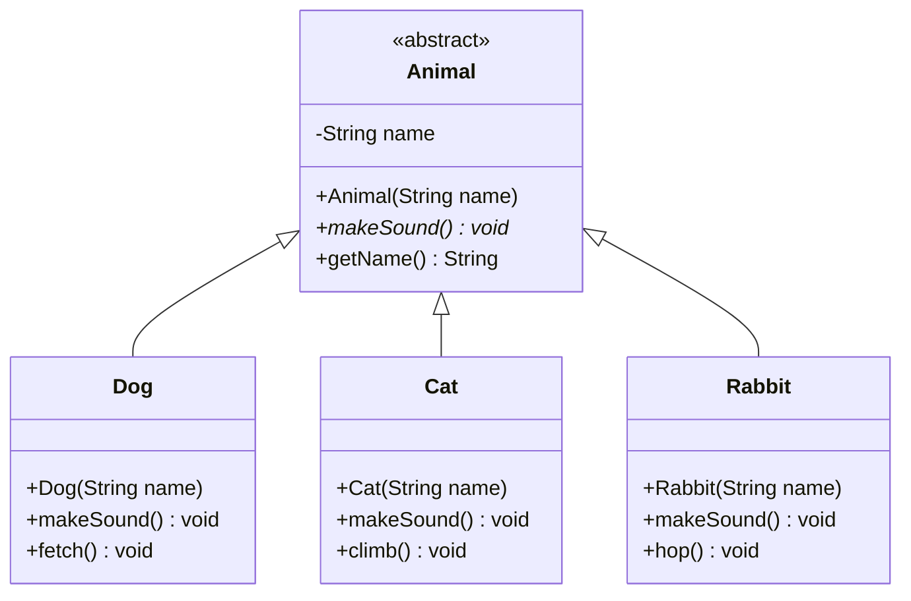

### 불변성 문제: 왜 `List<Dog>`는 `List<Animal>`이 아닌가?

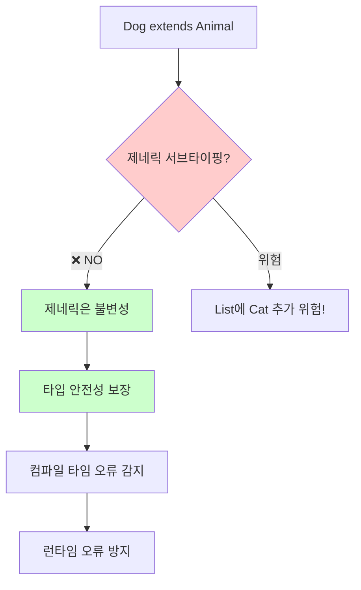

## PECS 원칙 이해하기

### PECS란?

**PECS** = **Producer-Extends, Consumer-Super**

⭐ PECS 관점 (컬렉션 중심):

```java
// 리스트가 데이터를 "생산해서" 나에게 준다
Dog dog = list.get(0); // Producer = 읽기

// 리스트가 데이터를 "소비해서" 받아들인다
list.add(new Dog("멍멍이")); // Consumer = 쓰기
```

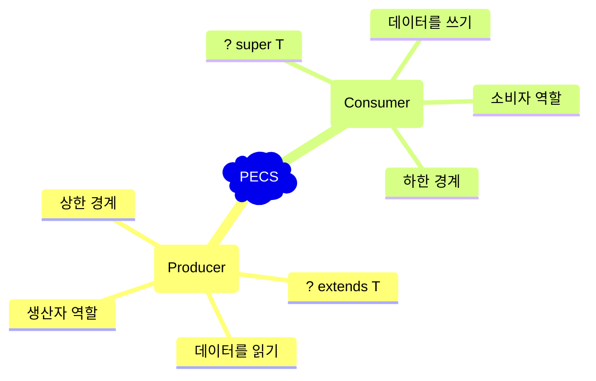

### 타입 가변성 비교표

| 타입 | 서브타이핑 | 읽기 | 쓰기 | 예제 |
|------|------------|------|------|------|
| `List<Animal>` | 불변성 | ✅ Animal | ✅ Animal | 정확한 타입만 |
| `List<? extends Animal>` | 공변성 | ✅ Animal | ❌ (null만) | Dog, Cat 리스트 읽기 |
| `List<? super Dog>` | 반공변성 | ❌ (Object만) | ✅ Dog | Dog를 Animal 리스트에 추가 |
| `List<?>` | 무제한 | ❌ (Object만) | ❌ (null만) | 알 수 없는 타입 |

### PECS 결정 플로우차트

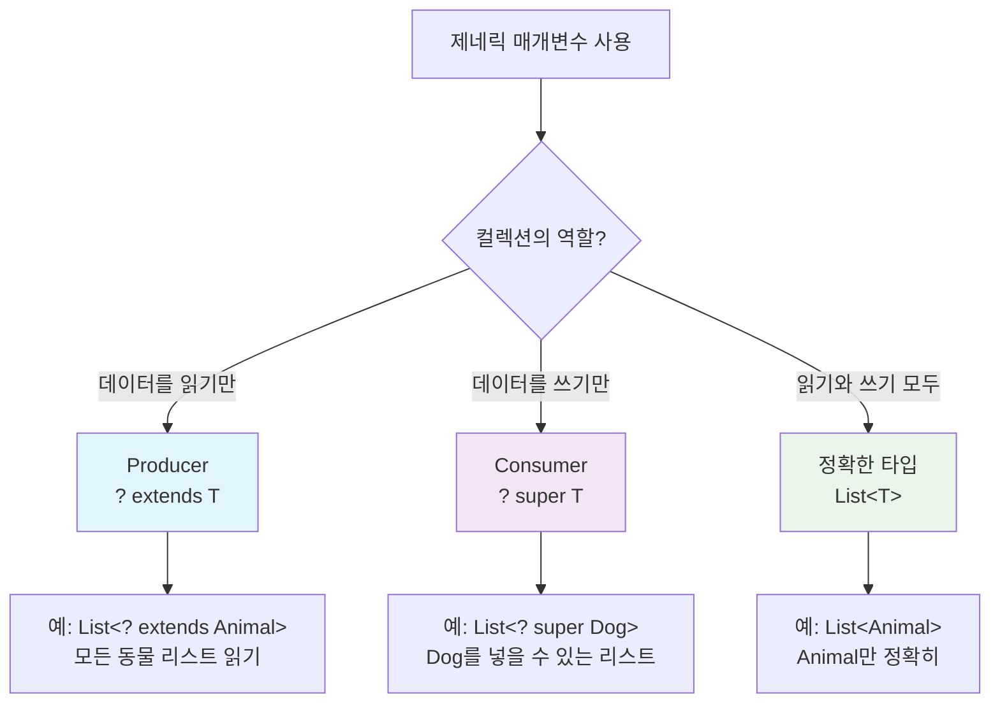

---

## Producer-Extends 상세 가이드

### 개념: "컬렉션에서 데이터를 생산(읽기)"

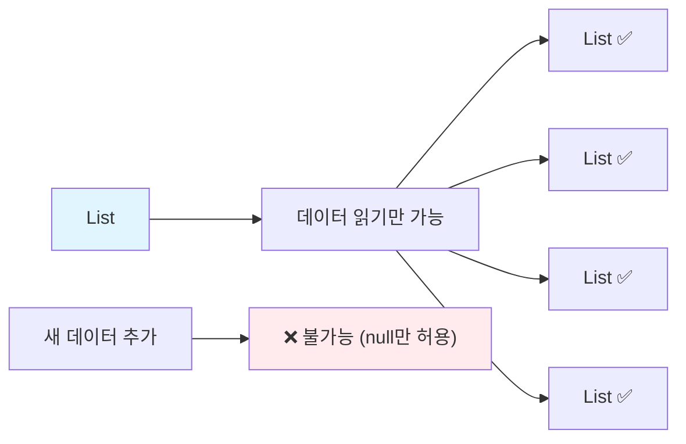

### 실제 예제: 동물원 소리 재생기

```java
public class AnimalSoundPlayer {
    
    // ✅ Producer-Extends 사용
    public static void playAllSounds(List<? extends Animal> animals) {
        System.out.println("=== 동물원 소리 재생 ===");
        for (Animal animal : animals) {
            animal.makeSound(); // 읽기만 가능
        }
        
        // animals.add(new Cat("새 고양이")); // ❌ 컴파일 에러!
        // animals.add(null); // ✅ 오직 null만 추가 가능
    }
    
    // 사용 예제
    public static void main(String[] args) {
        List<Dog> dogs = Arrays.asList(
            new Dog("멍멍이"), 
            new Dog("바둑이")
        );
        
        List<Cat> cats = Arrays.asList(
            new Cat("야옹이"), 
            new Cat("나비")
        );
        
        List<Animal> mixedAnimals = Arrays.asList(
            new Dog("강아지"), 
            new Cat("고양이"), 
            new Rabbit("토끼")
        );
        
        // 모든 리스트가 호환 가능!
        playAllSounds(dogs);     // ✅
        playAllSounds(cats);     // ✅
        playAllSounds(mixedAnimals); // ✅
    }
}
```

### Producer-Extends 동작 원리

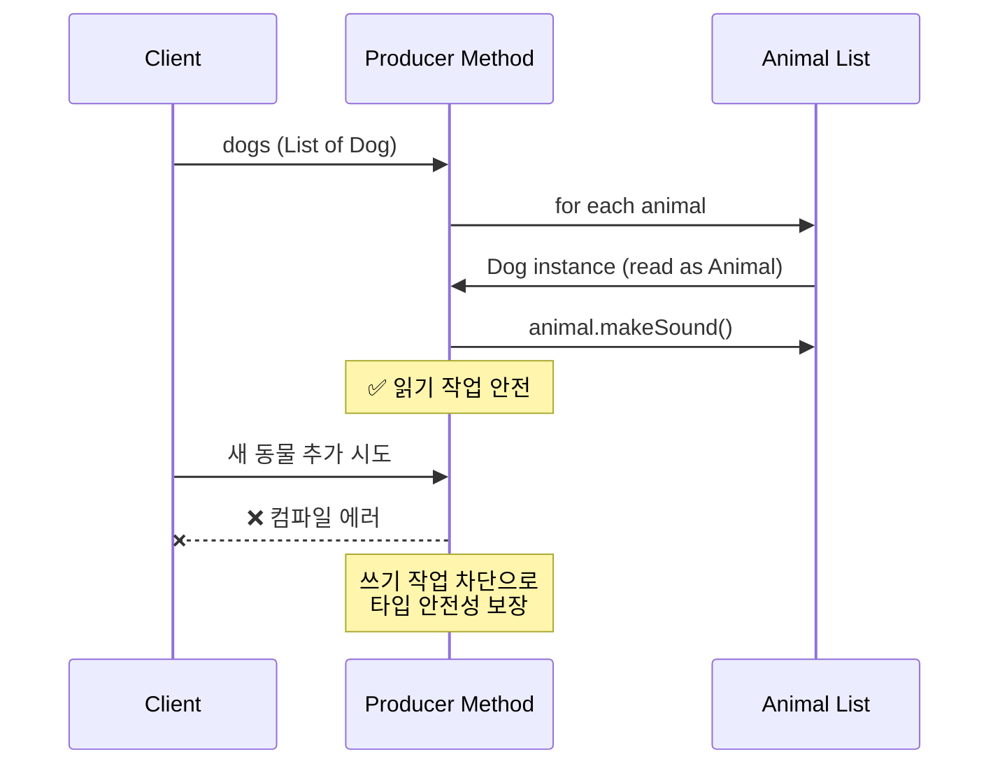

---

## Consumer-Super 상세 가이드

### 개념: "컬렉션이 데이터를 소비(쓰기)"

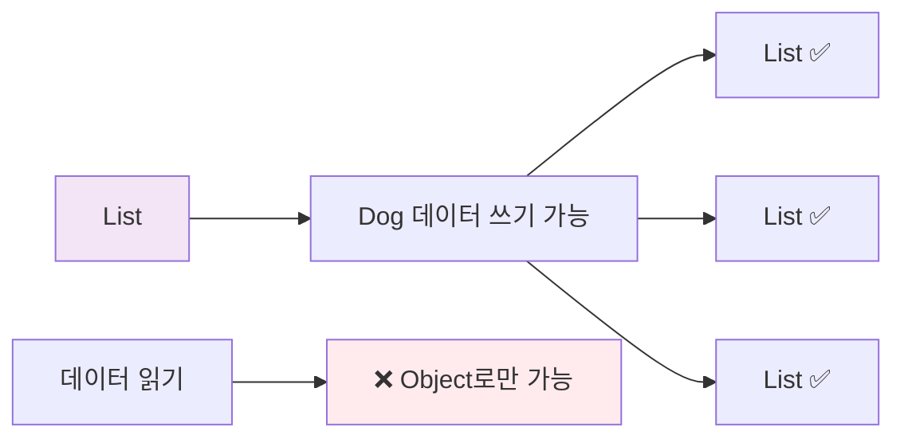

### 실제 예제: 동물 수집기

```java
public class AnimalCollector {
    
    // ✅ Consumer-Super 사용
    public static void collectDogs(List<? super Dog> collection) {
        System.out.println("=== 강아지 수집 중 ===");
        
        // Dog와 그 하위 타입 추가 가능
        collection.add(new Dog("새 강아지1"));
        collection.add(new Dog("새 강아지2"));
        
        // collection.add(new Cat("고양이")); // ❌ 컴파일 에러!
        
        // 읽기는 Object로만 가능
        for (Object obj : collection) {
            System.out.println("수집된 객체: " + obj.getClass().getSimpleName());
            // Dog dog = (Dog) obj; // 위험한 형변환 필요
        }
    }
    
    // 다양한 컬렉션 타입 테스트
    public static void main(String[] args) {
        List<Dog> dogList = new ArrayList<>();
        List<Animal> animalList = new ArrayList<>();
        List<Object> objectList = new ArrayList<>();
        
        // 모든 리스트에 Dog 추가 가능!
        collectDogs(dogList);     // ✅
        collectDogs(animalList);  // ✅  
        collectDogs(objectList);  // ✅
        
        System.out.println("Dog 리스트 크기: " + dogList.size());
        System.out.println("Animal 리스트 크기: " + animalList.size());
        System.out.println("Object 리스트 크기: " + objectList.size());
    }
}
```

### Consumer-Super 동작 원리

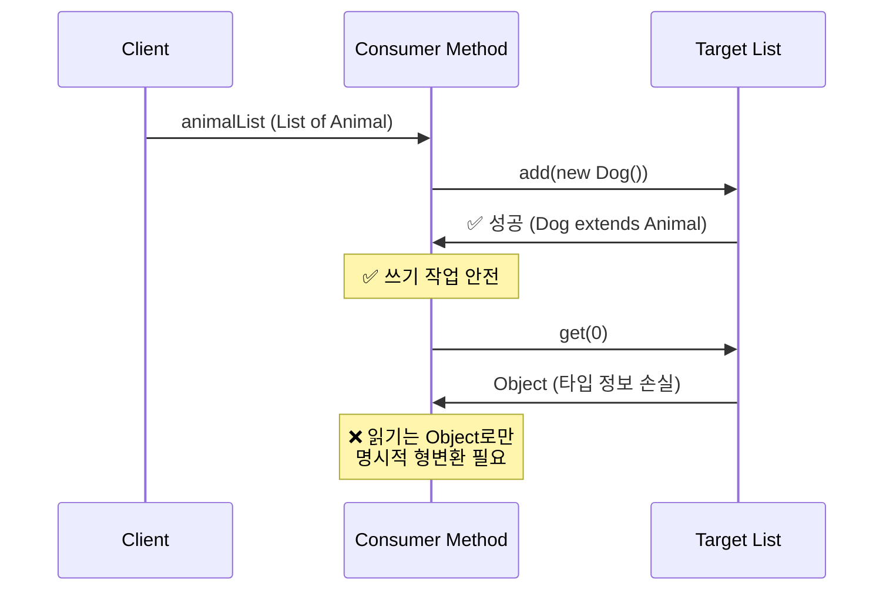

## 특수 케이스와 제한사항

### 언제 와일드카드를 사용하지 말아야 할까?

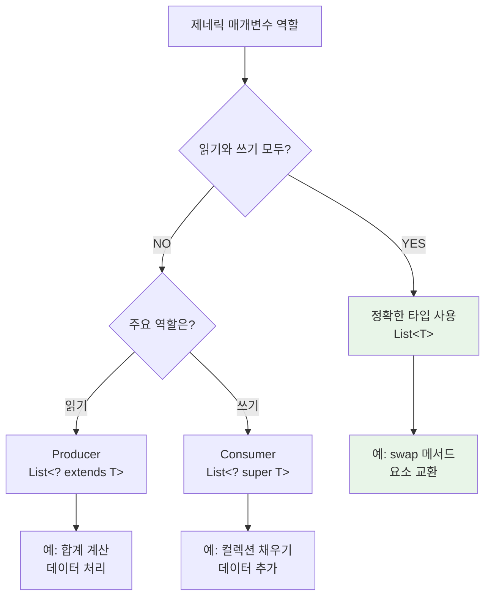

### 실제 예제: 동물 교환 메서드

```java
public class AnimalUtils {
    
    // ✅ 정확한 타입 필요 - 읽기와 쓰기 모두
    public static <T> void swap(List<T> list, int i, int j) {
        T temp = list.get(i);    // 읽기
        list.set(i, list.get(j)); // 쓰기
        list.set(j, temp);       // 쓰기
    }
    
    // ❌ 와일드카드 사용 시 문제점들
    public static void swapWrong1(List<?> list, int i, int j) {
        // Object temp = list.get(i); // Object로만 읽기 가능
        // list.set(i, temp); // ❌ 컴파일 에러! 쓸 수 없음
    }
    
    public static void swapWrong2(List<? extends Animal> list, int i, int j) {
        // Animal temp = list.get(i); // 읽기는 가능
        // list.set(i, temp); // ❌ 컴파일 에러! 쓸 수 없음
    }
    
    // 사용 예제
    public static void main(String[] args) {
        List<Dog> dogs = new ArrayList<>(Arrays.asList(
            new Dog("바둑이"), 
            new Dog("멍멍이")
        ));
        
        System.out.println("교환 전: " + dogs.get(0).getName() + ", " + dogs.get(1).getName());
        swap(dogs, 0, 1);
        System.out.println("교환 후: " + dogs.get(0).getName() + ", " + dogs.get(1).getName());
    }
}
```

### 반환 타입과 클래스 선언 가이드라인

```java
public class DesignGuidelines {
    
    // ❌ 나쁜 예: 와일드카드 반환 타입
    public List<? extends Animal> getBadAnimals() {
        return Arrays.asList(new Dog("강아지"), new Cat("고양이"));
        // 클라이언트가 사용하기 어려움!
    }
    
    // ✅ 좋은 예: 구체적인 반환 타입
    public List<Animal> getGoodAnimals() {
        return Arrays.asList(new Dog("강아지"), new Cat("고양이"));
        // 클라이언트가 사용하기 쉬움!
    }
    
    // ❌ 불가능: 클래스 선언에 와일드카드 사용
    // class BadAnimalContainer<? extends Animal> { } // 컴파일 에러!
    
    // ✅ 올바른 클래스 선언
    class GoodAnimalContainer<T extends Animal> {
        private T animal;
        
        public void setAnimal(T animal) { this.animal = animal; }
        public T getAnimal() { return animal; }
    }
}
```

## 실질적인 이점

### 1. 컴파일 타임 안전성

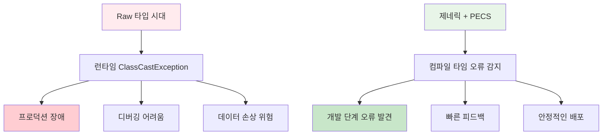

### 2. API 유연성 극대화

```java
public class FlexibilityExample {
    
    // ❌ 경직된 API - 제네릭 없이
    public static void playDogSoundsOnly(List dogs) { // Raw 타입
        for (Object obj : dogs) {
            Dog dog = (Dog) obj; // 위험한 형변환!
            dog.makeSound();
        }
    }
    
    // ❌ 제한적인 API - 정확한 타입만
    public static void playDogSoundsStrict(List<Dog> dogs) {
        for (Dog dog : dogs) {
            dog.makeSound();
        }
        // List<Animal>이 Dog만 포함하더라도 사용 불가!
    }
    
    // ✅ 유연한 API - PECS 활용
    public static void playAnimalSounds(List<? extends Animal> animals) {
        for (Animal animal : animals) {
            animal.makeSound();
        }
        // List<Dog>, List<Cat>, List<Animal> 모두 사용 가능!
    }
    
    public static void main(String[] args) {
        List<Dog> dogs = Arrays.asList(new Dog("바둑이"));
        List<Cat> cats = Arrays.asList(new Cat("야옹이"));
        List<Animal> animals = Arrays.asList(new Dog("멍멍이"), new Cat("나비"));
        
        // 모든 컬렉션이 같은 메서드로 처리 가능!
        playAnimalSounds(dogs);
        playAnimalSounds(cats);
        playAnimalSounds(animals);
    }
}
```

### 3. 코드 재사용성과 유지보수성

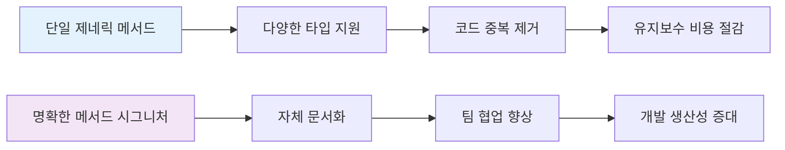

## 실제 활용 사례

### Java Collections Framework 예제

```java
import java.util.*;

public class JCFExamples {
    
    public static void demonstrateCollectionsCopy() {
        // Collections.copy의 실제 시그니처:
        // public static <T> void copy(List<? super T> dest, List<? extends T> src)
        
        List<Animal> animals = new ArrayList<>(Arrays.asList(
            null, null, null // 미리 공간 확보
        ));
        
        List<Dog> dogs = Arrays.asList(
            new Dog("바둑이"),
            new Dog("멍멍이"),
            new Dog("누렁이")
        );
        
        // Dog 리스트 → Animal 리스트로 복사
        Collections.copy(animals, dogs);
        
        System.out.println("=== 복사 결과 ===");
        for (Animal animal : animals) {
            animal.makeSound();
        }
    }
    
    public static void demonstrateLinkedListConstructor() {
        // LinkedList(Collection<? extends E> c) 생성자 활용
        
        List<Dog> dogs = Arrays.asList(
            new Dog("바둑이"),
            new Dog("멍멍이")
        );
        
        // Dog 컬렉션으로 Animal LinkedList 생성
        LinkedList<Animal> animalLinkedList = new LinkedList<>(dogs);
        
        System.out.println("=== LinkedList 생성 결과 ===");
        for (Animal animal : animalLinkedList) {
            animal.makeSound();
        }
    }
    
    public static void main(String[] args) {
        demonstrateCollectionsCopy();
        demonstrateLinkedListConstructor();
    }
}
```

### Stream API와 PECS 원리

```java
import java.util.*;
import java.util.stream.*;

public class StreamPECSExample {
    
    // Stream API에서 PECS 원리 활용
    public static void demonstrateStreamProducer() {
        List<Dog> dogs = Arrays.asList(
            new Dog("바둑이"),
            new Dog("멍멍이"),
            new Dog("누렁이")
        );
        
        List<Cat> cats = Arrays.asList(
            new Cat("야옹이"),
            new Cat("나비"),
            new Cat("치즈")
        );
        
        // Producer-Extends 원리로 다양한 동물 리스트 처리
        processAnimalStream(dogs.stream());
        processAnimalStream(cats.stream());
    }
    
    // Stream<? extends Animal>을 받는 메서드
    public static void processAnimalStream(Stream<? extends Animal> animalStream) {
        System.out.println("=== 동물 스트림 처리 ===");
        animalStream
            .peek(animal -> System.out.println("처리 중: " + animal.getName()))
            .forEach(Animal::makeSound);
    }
    
    // Consumer-Super 원리로 결과 수집
    public static void demonstrateStreamConsumer() {
        List<Dog> dogs = Arrays.asList(
            new Dog("바둑이"),
            new Dog("멍멍이")
        );
        
        // 다양한 타입의 컬렉션에 수집 가능
        List<Animal> animalList = new ArrayList<>();
        List<Object> objectList = new ArrayList<>();
        
        collectAnimals(dogs.stream(), animalList);
        collectAnimals(dogs.stream(), objectList);
    }
    
    public static void collectAnimals(Stream<? extends Animal> stream, 
                                     Collection<? super Animal> collection) {
        stream.forEach(collection::add); // Consumer-Super 활용
    }
    
    public static void main(String[] args) {
        demonstrateStreamProducer();
        demonstrateStreamConsumer();
    }
}
```

## 고급 PECS 패턴

### 제네릭 메서드와 PECS 결합

```java
public class AdvancedPECSPatterns {
    
    // 복합 PECS 패턴: 두 컬렉션 간 변환
    public static <T, R> List<R> transformAnimals(
            List<? extends T> source,           // Producer
            List<? super R> destination,        // Consumer  
            Function<T, R> transformer) {       // 변환 함수
        
        List<R> result = new ArrayList<>();
        
        for (T item : source) {
            R transformed = transformer.apply(item);
            destination.add(transformed);
            result.add(transformed);
        }
        
        return result;
    }
    
    // 실제 사용 예제
    public static void demonstrateTransformation() {
        List<Dog> dogs = Arrays.asList(
            new Dog("바둑이"),
            new Dog("멍멍이")
        );
        
        List<Animal> animalList = new ArrayList<>();
        
        // Dog → Animal 변환 (실제로는 업캐스팅)
        List<Animal> result = transformAnimals(
            dogs,                    // List<Dog> (? extends Dog)
            animalList,              // List<Animal> (? super Animal)
            dog -> (Animal) dog      // Function<Dog, Animal>
        );
        
        System.out.println("=== 변환 결과 ===");
        result.forEach(Animal::makeSound);
    }
    
    // 와일드카드 캡처 패턴
    public static void wildcardCapture(List<?> list) {
        wildcardCaptureHelper(list);
    }
    
    private static <T> void wildcardCaptureHelper(List<T> list) {
        // 이제 T 타입으로 안전하게 작업 가능
        if (!list.isEmpty()) {
            T first = list.get(0);
            list.set(0, first); // 같은 타입이므로 안전
        }
    }
    
    public static void main(String[] args) {
        demonstrateTransformation();
        
        // 와일드카드 캡처 예제
        List<Dog> dogs = new ArrayList<>(Arrays.asList(new Dog("바둑이")));
        wildcardCapture(dogs);
    }
}
```

### PECS 트러블슈팅 가이드

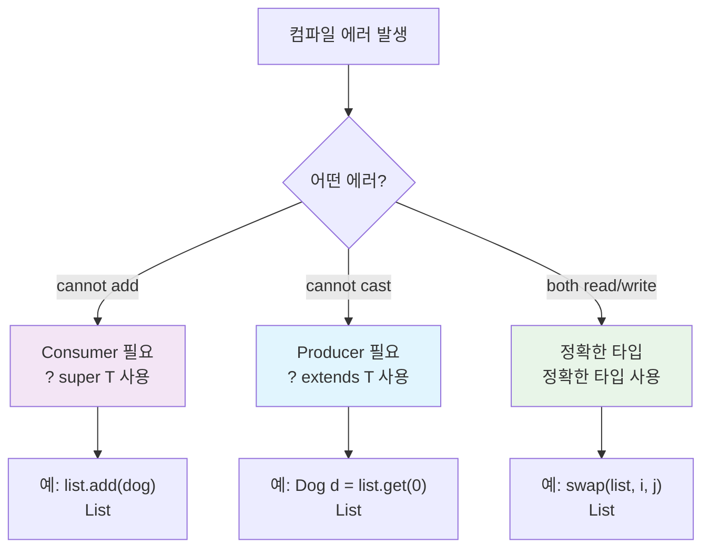

## 실무 적용 가이드

### 1. API 설계 체크리스트

```java
public class APIDesignChecklist {
    
    // ✅ 좋은 API 설계 예제들
    
    // 읽기 전용 처리 메서드
    public static double calculateTotalWeight(List<? extends Animal> animals) {
        return animals.stream()
                     .mapToDouble(animal -> 10.0) // 가정: 모든 동물 10kg
                     .sum();
    }
    
    // 쓰기 전용 처리 메서드  
    public static void addMultipleDogs(List<? super Dog> collection, int count) {
        for (int i = 0; i < count; i++) {
            collection.add(new Dog("강아지" + i));
        }
    }
    
    // 읽기+쓰기 처리 메서드
    public static <T extends Animal> void shuffleAnimals(List<T> animals) {
        Collections.shuffle(animals);
    }
    
    // 명확한 반환 타입
    public static List<Animal> createMixedAnimals() {
        return Arrays.asList(
            new Dog("강아지"),
            new Cat("고양이"),
            new Rabbit("토끼")
        );
    }
}
```

### 2. 일반적인 실수와 해결책

```java
public class CommonMistakes {
    
    // ❌ 실수 1: 불필요한 와일드카드 남용
    public static void mistake1(List<? extends String> strings) {
        // String은 final 클래스이므로 extends 의미없음
        // List<String>이 더 적절
    }
    
    // ✅ 개선
    public static void correct1(List<String> strings) {
        // 명확하고 간단
    }
    
    // ❌ 실수 2: 반환 타입에 와일드카드 사용
    public static List<? extends Animal> mistake2() {
        return Arrays.asList(new Dog("강아지"));
        // 클라이언트가 사용하기 어려움
    }
    
    // ✅ 개선  
    public static List<Animal> correct2() {
        return Arrays.asList(new Dog("강아지"));
        // 클라이언트가 사용하기 쉬움
    }
    
    // ❌ 실수 3: 잘못된 PECS 적용
    public static void mistake3(List<? super Animal> animals) {
        // Animal animal = animals.get(0); // ❌ 컴파일 에러!
        // animals에서 읽으려는데 super를 사용
    }
    
    // ✅ 개선
    public static void correct3(List<? extends Animal> animals) {
        Animal animal = animals.get(0); // ✅ 정상 작동
    }
}
```

### 3. 성능 고려사항

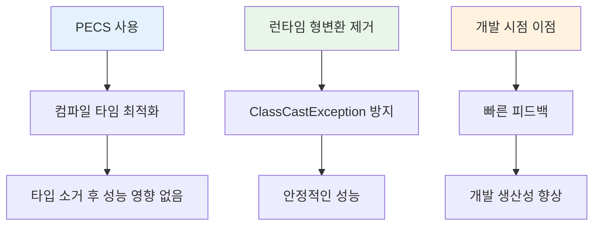

## 결론

### PECS 마스터를 위한 핵심 요약

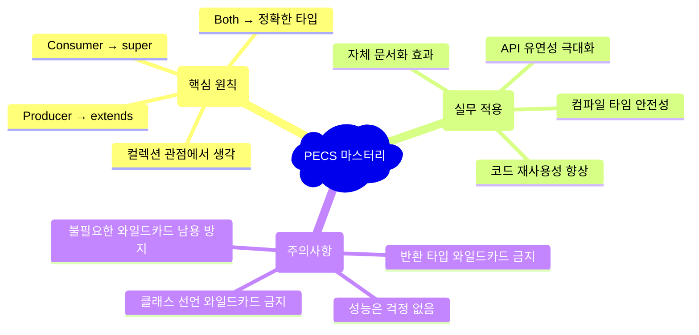

### 마무리

제네릭이 처음 도입되었을 때, 많은 개발자들이 복잡하다고 느꼈습니다. 하지만 PECS 원칙을 이해하고 나면, 제네릭이 얼마나 우아하고 강력한 도구인지 깨닫게 됩니다.

**기억하세요:**
- **Producer**는 데이터를 **생산(읽기)**합니다 → `? extends T`
- **Consumer**는 데이터를 **소비(쓰기)**합니다 → `? super T`
- **둘 다** 필요하면 → 정확한 타입 `T`

이 간단한 규칙만 기억하면, 타입 안전하고 유연한 Java 코드를 작성할 수 있습니다.

