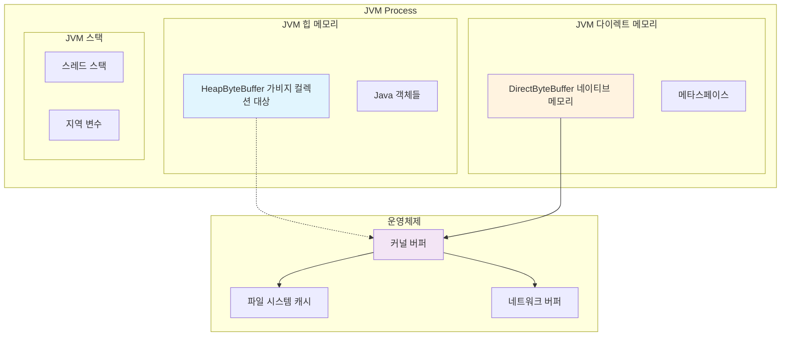
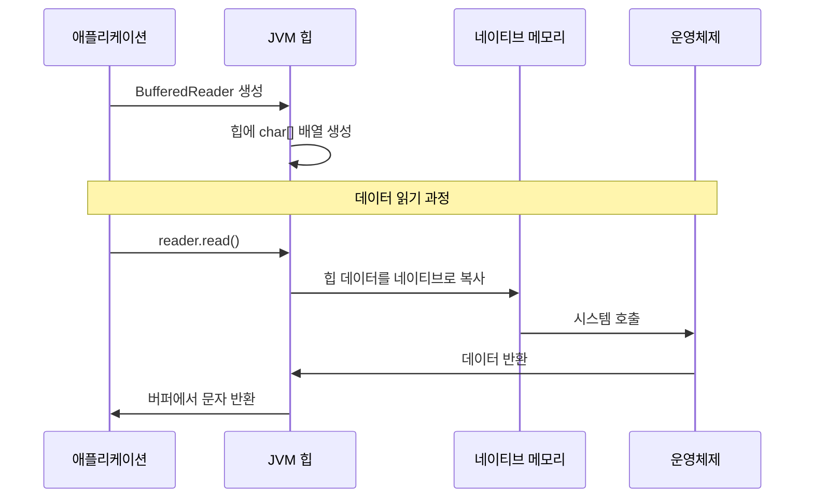
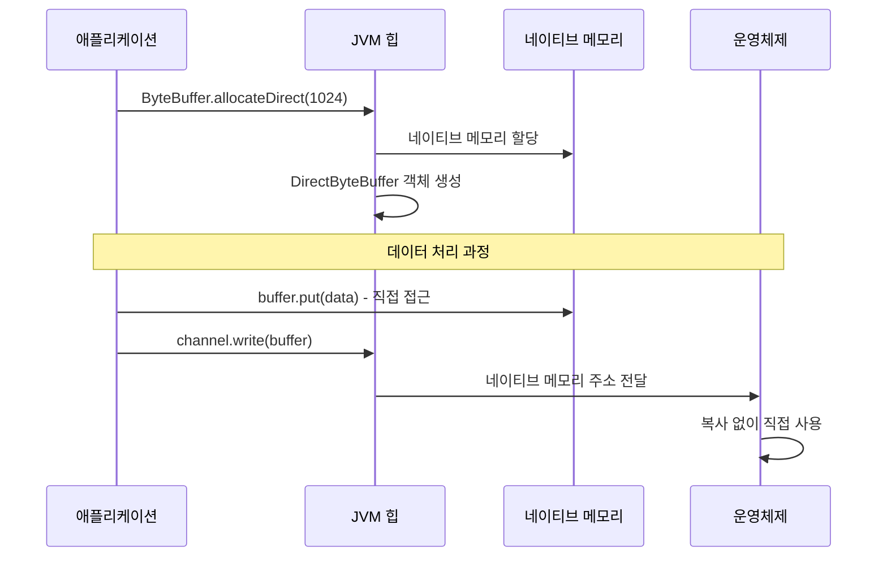
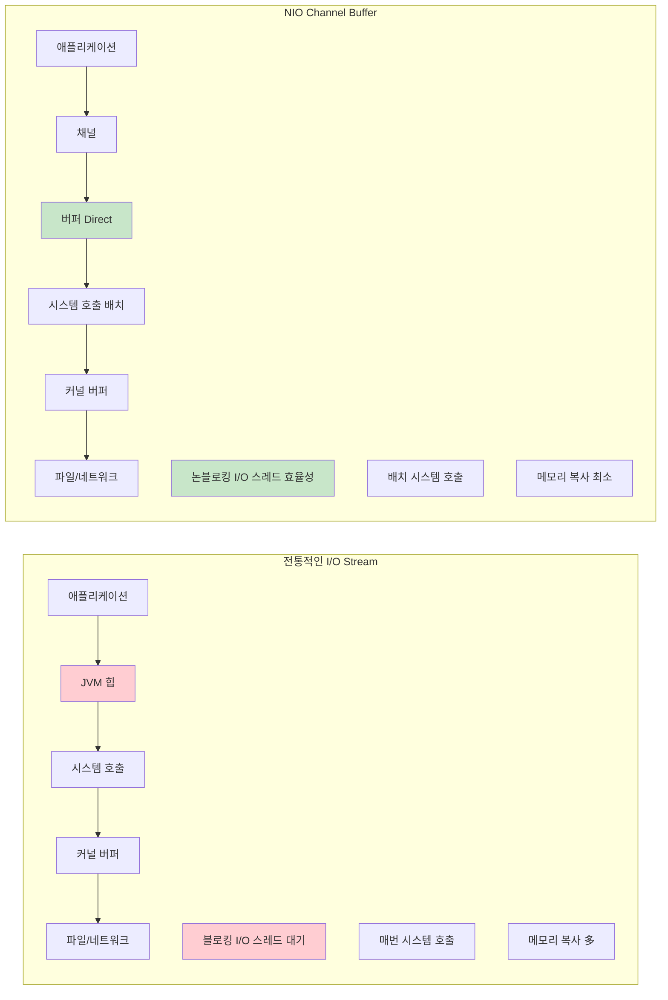
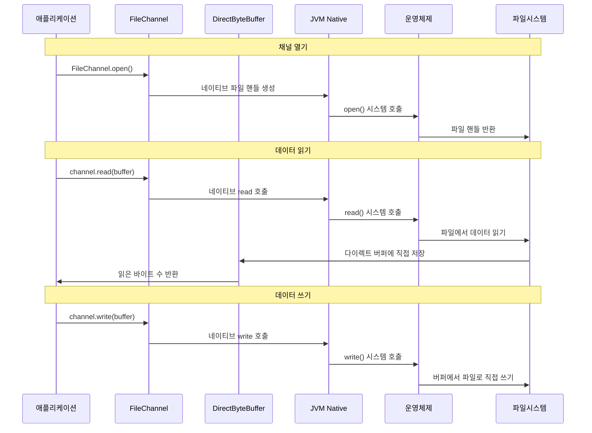

## 1. 기본 스트림 개념 - 모든 I/O의 기초

### 왜 스트림인가?

Java I/O를 설계할 때 가장 중요하게 생각한 것은 **"플랫폼 독립성"**과 **"단순성"**이었습니다. 스트림은 데이터의 흐름을 추상화하여 파일이든 네트워크든 메모리든 동일한 방식으로 처리할 수 있게 해줍니다.

### 핵심 원칙

#### 1) 단방향성
```java
// 입력용과 출력용이 분리되어 있습니다
InputStream input = ...;   // 읽기만 가능
OutputStream output = ...; // 쓰기만 가능
```

이렇게 설계한 이유는 **안전성**과 **명확성** 때문입니다. 하나의 스트림이 읽기와 쓰기를 동시에 한다면 코드가 복잡해지고 오류 가능성이 높아집니다.

#### 2) 바이트 vs 문자 구분

```java
// 바이너리 데이터 (이미지, 실행파일 등)
InputStream / OutputStream

// 텍스트 데이터 (문서, 설정파일 등)
Reader / Writer
```

### 언제 무엇을 사용할까?

```java
// 🔴 바이트 스트림 사용
// - 이미지, 동영상, 실행파일
// - 네트워크 통신
// - 정확한 바이트 단위 처리가 필요한 경우

// 🔵 문자 스트림 사용  
// - 텍스트 파일
// - 로그 파일
// - 설정 파일
// - 한글 등 멀티바이트 문자 처리
```

## 2. 파일 I/O - 가장 자주 사용하는 기능

### 기본 파일 읽기/쓰기

파일 I/O는 모든 애플리케이션에서 필요한 기본 기능입니다. 올바른 클래스 선택이 중요합니다.

#### 텍스트 파일 처리
```java
// 📝 텍스트 파일 읽기
try (FileReader reader = new FileReader("config.txt")) {
    int ch;
    while ((ch = reader.read()) != -1) {
        System.out.print((char) ch);
    }
}

// 📝 텍스트 파일 쓰기
try (FileWriter writer = new FileWriter("output.txt")) {
    writer.write("Hello, Java I/O!");
    writer.write("\n안녕하세요!");
}
```

#### 바이너리 파일 처리
```java
// 🔧 바이너리 파일 읽기
try (FileInputStream fis = new FileInputStream("image.jpg")) {
    byte[] buffer = new byte[1024];
    int bytesRead;
    while ((bytesRead = fis.read(buffer)) != -1) {
        // 바이트 데이터 처리
    }
}

// 🔧 바이너리 파일 쓰기
try (FileOutputStream fos = new FileOutputStream("output.bin")) {
    byte[] data = "바이너리 데이터".getBytes();
    fos.write(data);
}
```

### 실무 팁

```java
// ❌ 피해야 할 코드 - 1바이트씩 읽기
FileInputStream fis = new FileInputStream("large.txt");
int b;
while ((b = fis.read()) != -1) {  // 매우 느림!
    // 처리
}

// ✅ 권장 코드 - 버퍼 사용
FileInputStream fis = new FileInputStream("large.txt");
byte[] buffer = new byte[8192];  // 8KB 버퍼
int bytesRead;
while ((bytesRead = fis.read(buffer)) != -1) {
    // 처리 - 훨씬 빠름!
}
```

## 3. 버퍼링 - 성능을 위한 필수 기술

### 왜 버퍼링이 필요한가?

I/O 작업은 CPU에 비해 매우 느립니다. 1바이트씩 읽는 것보다 큰 덩어리로 읽는 것이 훨씬 효율적입니다.

```java
// 성능 차이 예시
// 1바이트씩: 1MB 파일 읽기 → 1,000,000번의 시스템 호출
// 8KB 버퍼: 1MB 파일 읽기 → 128번의 시스템 호출
```

### 버퍼링 스트림 사용법

#### 텍스트 파일 버퍼링
```java
// 📚 BufferedReader - 텍스트 파일 빠른 읽기
try (BufferedReader reader = new BufferedReader(new FileReader("large.txt"))) {
    String line;
    while ((line = reader.readLine()) != null) {  // 한 줄씩 읽기
        System.out.println(line);
    }
}

// 📚 BufferedWriter - 텍스트 파일 빠른 쓰기
try (BufferedWriter writer = new BufferedWriter(new FileWriter("output.txt"))) {
    writer.write("첫 번째 줄");
    writer.newLine();  // 플랫폼에 맞는 줄바꿈
    writer.write("두 번째 줄");
    writer.flush();    // 버퍼 강제 비우기
}
```

#### 바이너리 파일 버퍼링
```java
// 🚀 BufferedInputStream - 바이너리 파일 빠른 읽기
try (BufferedInputStream bis = new BufferedInputStream(
        new FileInputStream("large.bin"))) {
    byte[] buffer = new byte[1024];
    int bytesRead;
    while ((bytesRead = bis.read(buffer)) != -1) {
        // 처리
    }
}
```

### 성능 비교 실험

```java
// 실제 성능 차이를 확인해보세요
public class PerformanceTest {
    public static void main(String[] args) throws IOException {
        String fileName = "large_file.txt";
        
        // 버퍼 없이
        long start = System.currentTimeMillis();
        try (FileReader fr = new FileReader(fileName)) {
            int ch;
            while ((ch = fr.read()) != -1) {
                // 처리
            }
        }
        long unbuffered = System.currentTimeMillis() - start;
        
        // 버퍼와 함께
        start = System.currentTimeMillis();
        try (BufferedReader br = new BufferedReader(new FileReader(fileName))) {
            int ch;
            while ((ch = br.read()) != -1) {
                // 처리
            }
        }
        long buffered = System.currentTimeMillis() - start;
        
        System.out.println("버퍼 없이: " + unbuffered + "ms");
        System.out.println("버퍼 적용: " + buffered + "ms");
        System.out.println("성능 향상: " + (unbuffered / (double) buffered) + "배");
    }
}
```

### JVM 메모리 관점에서 본 버퍼링

이제 버퍼링이 JVM 내부에서 어떻게 동작하는지 자세히 알아보겠습니다. 이는 NIO를 설계할 때 가장 중요하게 고려한 부분입니다.

#### JVM 메모리 구조와 버퍼의 위치



#### 1) 힙 버퍼 (HeapByteBuffer)

```java
// JVM 힙 메모리에 생성 - 전통적인 BufferedReader가 내부적으로 사용
BufferedReader reader = new BufferedReader(new FileReader("file.txt"));
```

**JVM 내부 동작:**
- JVM 힙 메모리에 char 배열로 저장
- 가비지 컬렉션 대상
- 시스템 호출 시 네이티브 메모리로 복사 필요



#### 2) 다이렉트 버퍼 (DirectByteBuffer) - NIO 전용

```java
// DirectByteBuffer 객체 자체는 힙에 있고 GC 대상입니다
ByteBuffer directBuffer = ByteBuffer.allocateDirect(1024);
// 네이티브 메모리는 Cleaner에 의해 해제됩니다
```

**JVM 내부 동작:**
- 네이티브 메모리에 직접 할당
- 가비지 컬렉션 대상 아님 (참조만 GC 대상)
- 시스템 호출 시 복사 없이 직접 사용 가능



#### 버퍼 성능 비교 - JVM 관점

```java
public class BufferPerformanceTest {
    public static void main(String[] args) throws IOException {
        int bufferSize = 1024 * 1024; // 1MB
        
        // 힙 버퍼 테스트 (전통적인 방식)
        long start = System.currentTimeMillis();
        testTraditionalBuffering("heap_test.txt");
        long heapTime = System.currentTimeMillis() - start;
        
        // 다이렉트 버퍼 테스트 (NIO 방식)
        start = System.currentTimeMillis();
        testDirectBuffering("direct_test.txt");
        long directTime = System.currentTimeMillis() - start;
        
        System.out.println("힙 버퍼 (전통적): " + heapTime + "ms");
        System.out.println("다이렉트 버퍼 (NIO): " + directTime + "ms");
        System.out.println("성능 향상: " + (heapTime / (double) directTime) + "배");
    }
    
    private static void testTraditionalBuffering(String fileName) throws IOException {
        try (BufferedWriter writer = new BufferedWriter(new FileWriter(fileName))) {
            for (int i = 0; i < 10000; i++) {
                writer.write("Test data for performance comparison\n");
            }
        }
    }
    
    private static void testDirectBuffering(String fileName) throws IOException {
        try (FileChannel channel = FileChannel.open(Paths.get(fileName),
                StandardOpenOption.CREATE, StandardOpenOption.WRITE)) {
            
            ByteBuffer buffer = ByteBuffer.allocateDirect(8192);
            byte[] data = "Test data for performance comparison\n".getBytes();
            
            for (int i = 0; i < 10000; i++) {
                if (buffer.remaining() < data.length) {
                    buffer.flip();
                    channel.write(buffer);
                    buffer.clear();
                }
                buffer.put(data);
            }
            
            buffer.flip();
            channel.write(buffer);
        }
    }
}
```

#### 실무에서의 버퍼 선택 기준

```java
// 언제 어떤 버퍼를 사용할까?
public class BufferSelectionGuide {
    
    // 📝 일반적인 텍스트 파일 처리 → 전통적인 버퍼링
    public void processTextFile(String fileName) throws IOException {
        try (BufferedReader reader = new BufferedReader(new FileReader(fileName))) {
            String line;
            while ((line = reader.readLine()) != null) {
                // 텍스트 처리 - 힙 버퍼로 충분
                processLine(line);
            }
        }
    }
    
    // 🚀 대용량 파일 처리 → NIO 다이렉트 버퍼
    public void processLargeFile(String fileName) throws IOException {
        try (FileChannel channel = FileChannel.open(Paths.get(fileName))) {
            ByteBuffer buffer = ByteBuffer.allocateDirect(1024 * 1024); // 1MB
            
            while (channel.read(buffer) > 0) {
                buffer.flip();
                // 대용량 데이터 처리 - 다이렉트 버퍼로 성능 최적화
                processBuffer(buffer);
                buffer.clear();
            }
        }
    }
    
    private void processLine(String line) {
        // 텍스트 처리 로직
    }
    
    private void processBuffer(ByteBuffer buffer) {
        // 바이너리 데이터 처리 로직
    }
}
```

## 4. 자원 관리 - 안정성을 위한 핵심

### 왜 자원 관리가 중요한가?

I/O 작업은 시스템 자원(파일 핸들, 메모리 등)을 사용합니다. 제대로 해제하지 않으면 **메모리 누수**와 **파일 핸들 고갈**이 발생할 수 있습니다.

### try-with-resources (Java 7+)

이것은 Java 7에서 도입한 가장 중요한 개선사항 중 하나입니다.

```java
// ✅ 권장 방법 - 자동 자원 관리
try (BufferedReader reader = new BufferedReader(new FileReader("file.txt"))) {
    String line;
    while ((line = reader.readLine()) != null) {
        System.out.println(line);
    }
} // 자동으로 reader.close() 호출됨

// ✅ 여러 자원 동시 관리
try (FileInputStream fis = new FileInputStream("input.txt");
     FileOutputStream fos = new FileOutputStream("output.txt");
     BufferedInputStream bis = new BufferedInputStream(fis);
     BufferedOutputStream bos = new BufferedOutputStream(fos)) {
    
    // 파일 복사 로직
    byte[] buffer = new byte[8192];
    int bytesRead;
    while ((bytesRead = bis.read(buffer)) != -1) {
        bos.write(buffer, 0, bytesRead);
    }
    
} // 모든 자원이 자동으로 해제됨
```

### 전통적인 방법과 비교

```java
// ❌ 전통적인 방법 - 복잡하고 오류 가능성 높음
BufferedReader reader = null;
try {
    reader = new BufferedReader(new FileReader("file.txt"));
    String line;
    while ((line = reader.readLine()) != null) {
        System.out.println(line);
    }
} catch (IOException e) {
    e.printStackTrace();
} finally {
    if (reader != null) {
        try {
            reader.close();
        } catch (IOException e) {
            e.printStackTrace();
        }
    }
}
```

### 예외 처리 모범 사례

```java
// 구체적인 예외 처리
public void readConfigFile(String fileName) {
    try (BufferedReader reader = new BufferedReader(new FileReader(fileName))) {
        String line;
        while ((line = reader.readLine()) != null) {
            // 설정 파일 처리
        }
    } catch (FileNotFoundException e) {
        System.err.println("설정 파일을 찾을 수 없습니다: " + fileName);
        // 기본 설정 적용
    } catch (IOException e) {
        System.err.println("파일 읽기 오류: " + e.getMessage());
        // 복구 로직
    }
}
```

## 5. 현대적 접근법 - NIO.2 (Java 7+)

### 기존 File 클래스의 한계

```java
// ❌ 기존 File 클래스의 문제점
File file = new File("nonexistent.txt");
boolean deleted = file.delete();  // false만 반환, 실패 이유 모름
```

### Path와 Files 클래스

Java 7부터 도입된 **NIO.2**는 더 강력하고 직관적인 파일 시스템 API를 제공합니다.

#### 기본 사용법
```java
// 🆕 Path 생성
Path path = Paths.get("documents", "readme.txt");
Path absolutePath = path.toAbsolutePath();

// 🆕 파일 읽기 - 간단하고 강력
List<String> lines = Files.readAllLines(path, StandardCharsets.UTF_8);
for (String line : lines) {
    System.out.println(line);
}

// 🆕 파일 쓰기 - 한 번에 처리
List<String> data = Arrays.asList("첫 번째 줄", "두 번째 줄");
Files.write(path, data, StandardCharsets.UTF_8);
```

#### 실용적인 예제

```java
// 파일 복사
Path source = Paths.get("source.txt");
Path target = Paths.get("target.txt");
Files.copy(source, target, StandardCopyOption.REPLACE_EXISTING);

// 디렉토리 생성
Path directory = Paths.get("new_folder");
Files.createDirectories(directory);  // 중간 경로도 모두 생성

// 파일 존재 확인
if (Files.exists(path)) {
    System.out.println("파일 크기: " + Files.size(path) + " bytes");
    System.out.println("수정 시간: " + Files.getLastModifiedTime(path));
}

// 파일 삭제
try {
    Files.delete(path);
} catch (NoSuchFileException e) {
    System.out.println("파일이 존재하지 않습니다.");
} catch (IOException e) {
    System.out.println("삭제 실패: " + e.getMessage());
}
```

### 스트림과 함께 사용하기

```java
// NIO.2와 스트림 결합
try (BufferedReader reader = Files.newBufferedReader(path, StandardCharsets.UTF_8)) {
    String line;
    while ((line = reader.readLine()) != null) {
        // 처리
    }
}

// 또는 더 간단히
try (Stream<String> lines = Files.lines(path)) {
    lines.filter(line -> line.contains("ERROR"))
         .forEach(System.out::println);
}
```

### NIO 채널 - JVM 내부 동작의 혁신

NIO.2의 Path와 Files만으로도 강력하지만, 진정한 성능 최적화를 위해서는 **채널(Channel)**의 동작 원리를 이해해야 합니다.

#### 전통적인 I/O vs NIO 채널 비교



#### 채널의 실용적 활용

```java
public class ChannelExample {
    public static void main(String[] args) throws IOException {
        // 기본 채널 사용
        basicChannelUsage();
        
        // 파일 복사 최적화
        optimizedFileCopy("source.txt", "destination.txt");
        
        // 메모리 맵 파일 처리
        memoryMappedFileProcessing("large_data.bin");
    }
    
    // 기본 채널 사용법
    private static void basicChannelUsage() throws IOException {
        Path path = Paths.get("example.txt");
        
        try (FileChannel channel = FileChannel.open(path, 
                StandardOpenOption.READ, StandardOpenOption.WRITE)) {
            
            // 다이렉트 버퍼 생성
            ByteBuffer buffer = ByteBuffer.allocateDirect(1024);
            
            // 채널에서 버퍼로 데이터 읽기
            int bytesRead = channel.read(buffer);
            
            System.out.println("읽은 바이트: " + bytesRead);
            System.out.println("버퍼 위치: " + buffer.position());
            
            // 버퍼를 읽기 모드로 전환
            buffer.flip();
            
            // 채널에 버퍼 데이터 쓰기
            channel.write(buffer);
        }
    }
    
    // Zero-Copy 파일 복사
    private static void optimizedFileCopy(String source, String dest) throws IOException {
        try (FileChannel srcChannel = FileChannel.open(Paths.get(source), StandardOpenOption.READ);
             FileChannel destChannel = FileChannel.open(Paths.get(dest), 
                     StandardOpenOption.CREATE, StandardOpenOption.WRITE)) {
            
            // 운영체제 레벨에서 직접 전송 - 메모리 복사 최소화
            srcChannel.transferTo(0, srcChannel.size(), destChannel);
            System.out.println("Zero-Copy 파일 복사 완료");
        }
    }
    
    // 메모리 맵 파일 처리
    private static void memoryMappedFileProcessing(String fileName) throws IOException {
        try (FileChannel channel = FileChannel.open(Paths.get(fileName), 
                StandardOpenOption.READ, StandardOpenOption.WRITE, StandardOpenOption.CREATE)) {
            
            // 파일을 메모리에 맵핑
            MappedByteBuffer mappedBuffer = channel.map(
                    FileChannel.MapMode.READ_WRITE, 0, 1024 * 1024); // 1MB
            
            // 메모리 맵에서 직접 데이터 조작
            mappedBuffer.put("Memory mapped data".getBytes());
            
            // 강제로 디스크에 동기화
            mappedBuffer.force();
            
            System.out.println("메모리 맵 파일 처리 완료");
        }
    }
}
```

#### 채널의 JVM 내부 동작 과정



#### 성능 최적화 비교

```java
public class IOPerformanceComparison {
    public static void main(String[] args) throws IOException {
        String sourceFile = "large_test_file.txt";
        createTestFile(sourceFile, 10 * 1024 * 1024); // 10MB 파일 생성
        
        // 1. 전통적인 I/O
        long start = System.currentTimeMillis();
        copyTraditional(sourceFile, "copy_traditional.txt");
        long traditionalTime = System.currentTimeMillis() - start;
        
        // 2. NIO 버퍼
        start = System.currentTimeMillis();
        copyNIOBuffer(sourceFile, "copy_nio_buffer.txt");
        long nioBufferTime = System.currentTimeMillis() - start;
        
        // 3. NIO Zero-Copy
        start = System.currentTimeMillis();
        copyNIOZeroCopy(sourceFile, "copy_nio_zerocopy.txt");
        long nioZeroCopyTime = System.currentTimeMillis() - start;
        
        System.out.println("전통적인 I/O: " + traditionalTime + "ms");
        System.out.println("NIO 버퍼: " + nioBufferTime + "ms");
        System.out.println("NIO Zero-Copy: " + nioZeroCopyTime + "ms");
        System.out.println("성능 향상 (NIO vs 전통): " + 
                          (traditionalTime / (double) nioZeroCopyTime) + "배");
    }
    
    private static void createTestFile(String fileName, int size) throws IOException {
        try (FileOutputStream fos = new FileOutputStream(fileName)) {
            byte[] data = new byte[1024];
            Arrays.fill(data, (byte) 'A');
            
            for (int i = 0; i < size / 1024; i++) {
                fos.write(data);
            }
        }
    }
    
    private static void copyTraditional(String source, String dest) throws IOException {
        try (FileInputStream fis = new FileInputStream(source);
             FileOutputStream fos = new FileOutputStream(dest)) {
            
            byte[] buffer = new byte[8192];
            int bytesRead;
            
            while ((bytesRead = fis.read(buffer)) != -1) {
                fos.write(buffer, 0, bytesRead);
            }
        }
    }
    
    private static void copyNIOBuffer(String source, String dest) throws IOException {
        try (FileChannel srcChannel = FileChannel.open(Paths.get(source), StandardOpenOption.READ);
             FileChannel destChannel = FileChannel.open(Paths.get(dest), 
                     StandardOpenOption.CREATE, StandardOpenOption.WRITE)) {
            
            ByteBuffer buffer = ByteBuffer.allocateDirect(8192);
            
            while (srcChannel.read(buffer) > 0) {
                buffer.flip();
                destChannel.write(buffer);
                buffer.clear();
            }
        }
    }
    
    private static void copyNIOZeroCopy(String source, String dest) throws IOException {
        try (FileChannel srcChannel = FileChannel.open(Paths.get(source), StandardOpenOption.READ);
             FileChannel destChannel = FileChannel.open(Paths.get(dest), 
                     StandardOpenOption.CREATE, StandardOpenOption.WRITE)) {
            
            srcChannel.transferTo(0, srcChannel.size(), destChannel);
        }
    }
}
```
