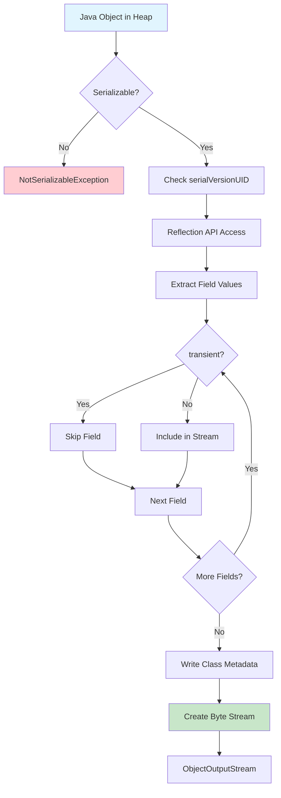
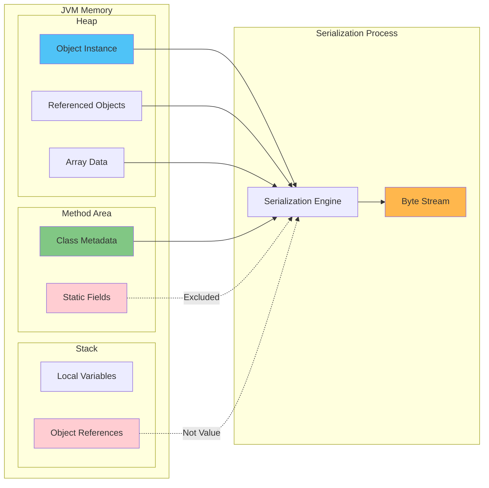
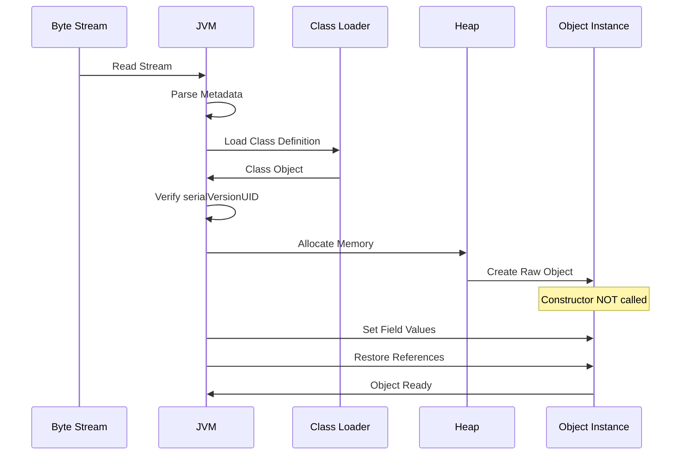
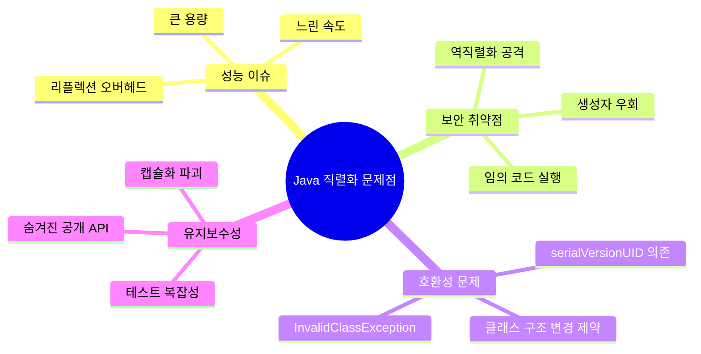
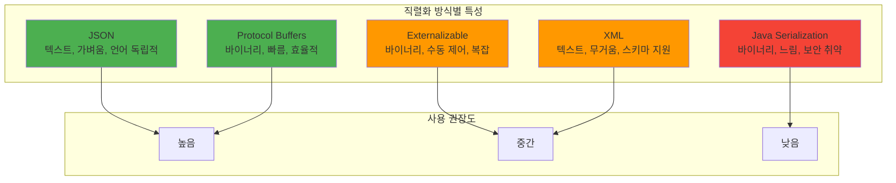
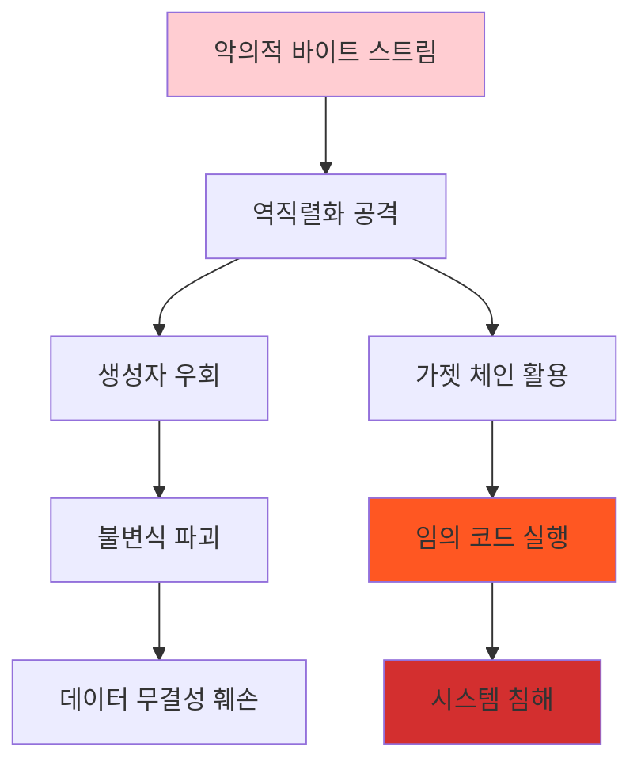
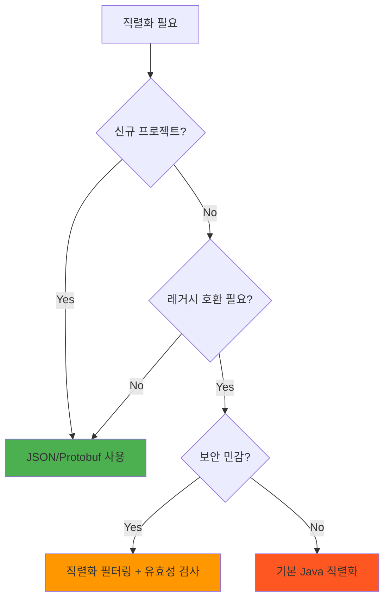
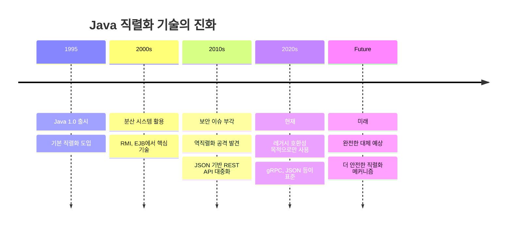

## 1. 개요 및 설계 철학

### 1.1 직렬화의 본질

Java 직렬화는 메모리에 있는 객체를 다른 곳에서도 똑같이 만들 수 있도록 데이터로 변환하는 기술입니다. 메모리 주소는 빼고 실제 값만 저장해서, 어떤 컴퓨터에서든 동일한 객체를 다시 만들 수 있게 합니다.

```java
// 메모리에서의 복잡한 객체 구조
Member member = new Member("John", 30, address); // 주소, 참조 등 포함

// 직렬화: 순수한 값으로 변환
byte[] serialized = serialize(member); // 값만 추출된 바이트 스트림

// 역직렬화: 다른 JVM에서 재구성
Member restored = deserialize(serialized); // 새로운 메모리 위치에서 동일한 상태
```

### 1.2 설계 당시의 비전

1990년대 초, 네트워크 중심 컴퓨팅이 부상하던 시기에 다음과 같은 비전을 가지고 있었습니다:

- **투명한 분산 컴퓨팅**: 원격 객체를 로컬 객체처럼 사용
- **개발 편의성**: 복잡한 네트워크 프로그래밍을 추상화
- **플랫폼 독립성**: 이기종 시스템 간 객체 교환

### 1.3 주요 활용 분야

| 분야          | 설명               | 실제 사례            |
|-------------|------------------|------------------|
| **데이터 영속성** | 객체 상태를 파일/DB에 저장 | 세션 저장, 캐시        |
| **네트워크 통신** | 분산 시스템 간 객체 전송   | RMI, JMS         |
| **캐싱**      | 빠른 객체 검색을 위한 저장  | Redis, Hazelcast |
| **딥 카피**    | 독립적인 객체 복사본 생성   | 프로토타입 패턴         |

## 2. 핵심 개념과 동작 원리

### 2.1 직렬화 (Serialization)

**정의**: Java 객체의 현재 상태를 바이트 스트림으로 변환하는 과정

**핵심 메커니즘**:
- 객체의 모든 인스턴스 필드 값을 추출
- 메모리 주소 정보는 제거하고 순수한 값만 보존
- 클래스 메타데이터와 함께 바이트 스트림으로 인코딩

### 2.2 역직렬화 (Deserialization)

**정의**: 바이트 스트림에서 Java 객체를 재구성하는 과정

**핵심 특징**:
- **생성자 우회**: 일반적인 객체 생성 과정을 거치지 않음
- **상태 복원**: 바이트 스트림에서 필드 값을 읽어 객체에 할당
- **참조 재구성**: 객체 간 참조 관계를 새로운 메모리 공간에서 재건

## 3. JVM 관점에서의 구현

### 3.1 직렬화 프로세스 플로우



### 3.2 JVM 메모리 구조와 직렬화의 관계



### 3.3 역직렬화에서의 객체 재구성



## 4. 실제 구현 방법

### 4.1 기본 직렬화 구현

```java
import java.io.*;

// 1. Serializable 인터페이스 구현
public class Member implements Serializable {
    
    private static final long serialVersionUID = 1L;
    
    private String name;
    private int age;
    private transient String password; // 직렬화 제외
    
    // 생성자, getter, setter...
}

// 2. 직렬화 수행
public class SerializationExample {
    
    public static void serializeObject(Member member, String filename) {
        try (FileOutputStream fos = new FileOutputStream(filename);
             ObjectOutputStream oos = new ObjectOutputStream(fos)
        ) {
            oos.writeObject(member);
            System.out.println("객체가 직렬화되었습니다: " + filename);
            
        } catch (IOException e) {
            e.printStackTrace();
        }
    }
    
    public static Member deserializeObject(String filename) {
        
        try (FileInputStream fis = new FileInputStream(filename);
             ObjectInputStream ois = new ObjectInputStream(fis)
        ) {
            return (Member) ois.readObject();
            
        } catch (IOException | ClassNotFoundException e) {
            e.printStackTrace();
            return null;
        }
    }
}
```

### 4.2 사용자 정의 직렬화

```java
public class SecureMember implements Serializable {
    
    private static final long serialVersionUID = 1L;
    
    private String name;
    private transient String encryptedPassword;
    private transient String sessionToken;
    
    // 사용자 정의 직렬화
    private void writeObject(ObjectOutputStream out) throws IOException {
        // 기본 직렬화 수행
        out.defaultWriteObject();
        
        // 암호화된 비밀번호 처리
        if (encryptedPassword != null) {
            out.writeObject(encrypt(encryptedPassword));
        } else {
            out.writeObject(null);
        }
    }
    
    // 사용자 정의 역직렬화
    private void readObject(ObjectInputStream in) throws IOException, ClassNotFoundException { 
        // 기본 역직렬화 수행
        in.defaultReadObject();
        
        // 암호화된 비밀번호 복원
        String encrypted = (String) in.readObject();
        if (encrypted != null) {
            this.encryptedPassword = decrypt(encrypted);
        }
        
        // 유효성 검사
        if (name == null || name.trim().isEmpty()) {
            throw new InvalidObjectException("이름은 필수입니다");
        }
    }
    
    private String encrypt(String data) { /* 암호화 로직 */ return data; }
    private String decrypt(String data) { /* 복호화 로직 */ return data; }
}
```

### 4.3 Externalizable을 이용한 완전 제어

```java
import java.io.*;

public class OptimizedMember implements Externalizable {
    
    private String name;
    private int age;
    private String email;
    
    // 기본 생성자 필수!
    public OptimizedMember() {}
    
    public OptimizedMember(String name, int age, String email) {
        this.name = name;
        this.age = age;
        this.email = email;
    }
    
    @Override
    public void writeExternal(ObjectOutput out) throws IOException {
        // 선택적 필드만 직렬화
        out.writeUTF(name != null ? name : "");
        out.writeInt(age);
        // email은 의도적으로 제외 (용량 최적화)
    }
    
    @Override
    public void readExternal(ObjectInput in) throws IOException {
        this.name = in.readUTF();
        this.age = in.readInt();
        // email은 기본값으로 설정
        this.email = "unknown@example.com";
    }
}
```

## 5. 장단점 분석

### 5.1 장점

| 장점             | 설명                          | 비고            |
|----------------|-----------------------------|---------------|
| **개발 편의성**     | Serializable만 구현하면 즉시 사용 가능 | 마커 인터페이스의 단순함 |
| **플랫폼 독립성**    | 서로 다른 OS/JVM 간 호환           | WORA 철학의 연장   |
| **내장 기능**      | 별도 라이브러리 불필요                | JDK 기본 제공     |
| **완전한 객체 그래프** | 참조된 모든 객체 자동 처리             | 복잡한 구조도 한 번에  |

### 5.2 단점 및 현실적 문제점



## 6. 현대적 대안들

### 6.1 성능 및 호환성 비교



### 6.2 대안별 상세 비교

| 특성 | Java 직렬화 | JSON | Protocol Buffers | Externalizable |
|------|-------------|------|------------------|----------------|
| **개발 편의성** | ⭐⭐⭐⭐⭐ | ⭐⭐⭐⭐ | ⭐⭐⭐ | ⭐⭐ |
| **성능** | ⭐⭐ | ⭐⭐⭐ | ⭐⭐⭐⭐⭐ | ⭐⭐⭐⭐⭐ |
| **보안** | ⭐ | ⭐⭐⭐⭐ | ⭐⭐⭐⭐ | ⭐⭐⭐ |
| **크기** | ⭐⭐ | ⭐⭐⭐ | ⭐⭐⭐⭐⭐ | ⭐⭐⭐⭐⭐ |
| **호환성** | ⭐⭐ | ⭐⭐⭐⭐⭐ | ⭐⭐⭐⭐ | ⭐⭐ |

### 6.3 실무 권장 사용법

```java
// 1. REST API - JSON 사용
@RestController
public class UserController {
    
    @PostMapping("/users")
    public ResponseEntity<User> createUser(@RequestBody User user) {
        // Jackson이 자동으로 JSON ↔ Object 변환
        return ResponseEntity.ok(userService.save(user));
    }
}

// 2. 고성능 시스템 - Protocol Buffers
// user.proto 정의 후
User user = User.newBuilder()
    .setName("John")
    .setAge(30)
    .build();
    
byte[] data = user.toByteArray(); // 직렬화
User restored = User.parseFrom(data); // 역직렬화

// 3. 레거시 호환 - 보안 강화된 Java 직렬화
ObjectInputStream ois = new ObjectInputStream(inputStream) {
    
    @Override
    protected Class<?> resolveClass(ObjectStreamClass desc)
            throws IOException, ClassNotFoundException {
        // 허용된 클래스만 역직렬화
        if (!allowedClasses.contains(desc.getName())) {
            throw new InvalidClassException("허용되지 않은 클래스", desc.getName());
        }
        return super.resolveClass(desc);
    }
};
```

## 7. 보안 고려사항

### 7.1 주요 보안 위험



### 7.2 방어 전략

```java
// 1. 직렬화 필터링 (Java 9+)
ObjectInputFilter filter = ObjectInputFilter.Config.createFilter(
    "com.example.SafeClass;!*"); // SafeClass만 허용, 나머지 거부
    
ObjectInputStream ois = new ObjectInputStream(inputStream);
ois.setObjectInputFilter(filter);

// 2. 안전한 readObject 구현
private void readObject(ObjectInputStream ois) 
        throws IOException, ClassNotFoundException {
    ois.defaultReadObject();
    
    // 필수 유효성 검사
    if (name == null || name.trim().isEmpty()) {
        throw new InvalidObjectException("name 필드는 필수입니다");
    }
    
    if (age < 0 || age > 150) {
        throw new InvalidObjectException("유효하지 않은 나이: " + age);
    }
    
    // 방어적 복사
    if (addresses != null) {
        this.addresses = new ArrayList<>(addresses);
    }
}

// 3. 신뢰할 수 없는 데이터 처리 금지
public void processUserData(InputStream untrustedStream) {
    // 절대 하지 말 것!
    // ObjectInputStream ois = new ObjectInputStream(untrustedStream);
    // Object obj = ois.readObject();
    
    // 대신 JSON 등 안전한 형식 사용
    ObjectMapper mapper = new ObjectMapper();
    UserData data = mapper.readValue(untrustedStream, UserData.class);
}
```

## 8. 실무 권장사항

### 8.1 사용 결정 기준



### 8.2 모범 사례 체크리스트

#### ✅ 권장사항
- [ ] JSON/Protocol Buffers 우선 고려
- [ ] serialVersionUID 명시적 선언
- [ ] transient로 민감 정보 제외
- [ ] readObject에서 유효성 검사
- [ ] 직렬화 필터링 적용 (Java 9+)
- [ ] 버전 호환성 테스트

#### ❌ 피해야 할 것들
- [ ] 신뢰할 수 없는 데이터 역직렬화
- [ ] serialVersionUID 자동 생성 의존
- [ ] 보안 검증 없는 readObject
- [ ] 대량 데이터의 Java 직렬화
- [ ] 공개 API에서 직렬화 형태 노출

### 8.3 성능 최적화 가이드

```java
// 성능을 위한 직렬화 최적화 예시
public class PerformanceOptimizedClass implements Serializable {
    
    private static final long serialVersionUID = 1L;
    
    // 자주 변하지 않는 데이터
    private String name;
    private int age;
    
    // 성능상 제외할 필드들
    private transient Map<String, Object> cache;
    private transient long lastAccessTime;
    
    // 압축을 통한 용량 최적화
    private void writeObject(ObjectOutputStream out) throws IOException {
        out.defaultWriteObject();
        
        // 대용량 데이터는 압축해서 저장
        if (largeData != null) {
            ByteArrayOutputStream baos = new ByteArrayOutputStream();
            GZIPOutputStream gzos = new GZIPOutputStream(baos);
            gzos.write(largeData.getBytes());
            gzos.close();
            
            out.writeObject(baos.toByteArray());
        } else {
            out.writeObject(null);
        }
    }
    
    private void readObject(ObjectInputStream in) throws IOException, ClassNotFoundException { 
        
        in.defaultReadObject();
        
        // 압축 해제
        byte[] compressed = (byte[]) in.readObject();
        if (compressed != null) {
            ByteArrayInputStream bais = new ByteArrayInputStream(compressed);
            GZIPInputStream gzis = new GZIPInputStream(bais);
            // 압축 해제 로직...
        }
        
        // 캐시 재초기화
        this.cache = new ConcurrentHashMap<>();
        this.lastAccessTime = System.currentTimeMillis();
    }
}
```

## 9. 실제 사례 및 패턴

### 9.1 안티패턴 (피해야 할 것들)

```java
// ❌ 안티패턴 1: 신뢰할 수 없는 데이터 역직렬화
public class BadExample {
    public Object loadUserData(InputStream userInput) {
        try {
            ObjectInputStream ois = new ObjectInputStream(userInput);
            return ois.readObject(); // 매우 위험!
        } catch (Exception e) {
            return null;
        }
    }
}

// ❌ 안티패턴 2: serialVersionUID 미선언
public class BadSerializable implements Serializable {
    // serialVersionUID 없음 - 호환성 문제 발생 가능
    private String name;
    private int age;
}

// ❌ 안티패턴 3: 민감 정보 직렬화
public class InsecureUser implements Serializable {
    private String username;
    private String password; // 평문 비밀번호가 직렬화됨!
    private String creditCardNumber; // 민감 정보 노출!
}
```

### 9.2 권장 패턴

```java
// ✅ 권장 패턴 1: 안전한 직렬화 클래스
public class SecureUser implements Serializable {
    
    private static final long serialVersionUID = 1L;
    
    private String username;
    private transient String password; // 직렬화 제외
    private transient String sessionToken; // 민감 정보 제외
    
    // 안전한 readObject 구현
    private void readObject(ObjectInputStream ois) 
            throws IOException, ClassNotFoundException {
        ois.defaultReadObject();
        
        // 유효성 검사
        if (username == null || username.trim().isEmpty()) {
            throw new InvalidObjectException("username은 필수입니다");
        }
        
        if (username.length() > 50) {
            throw new InvalidObjectException("username이 너무 깁니다");
        }
    }
}

// ✅ 권장 패턴 2: 현대적 대안 사용
@JsonIgnoreProperties(ignoreUnknown = true)
public class ModernUser {
    
    @JsonProperty("username")
    private String username;
    
    @JsonIgnore
    private String password; // JSON 직렬화에서 자동 제외
    
    // Jackson이 자동으로 JSON ↔ Object 변환 처리
}

// ✅ 권장 패턴 3: 필터링을 통한 보안 강화
public class SecureDeserializer {
    
    private static final Set<String> ALLOWED_CLASSES = Set.of(
        "com.example.SafeClass",
        "java.lang.String",
        "java.lang.Integer",
        "java.util.ArrayList"
    );
    
    public Object safeDeserialize(InputStream input) throws IOException {
        ObjectInputStream ois = new ObjectInputStream(input) {
            @Override
            protected Class<?> resolveClass(ObjectStreamClass desc)
                    throws IOException, ClassNotFoundException {
                
                if (!ALLOWED_CLASSES.contains(desc.getName())) {
                    throw new InvalidClassException(
                        "허용되지 않은 클래스: " + desc.getName());
                }
                
                return super.resolveClass(desc);
            }
        };
        
        try {
            return ois.readObject();
        } catch (ClassNotFoundException e) {
            throw new IOException("클래스를 찾을 수 없습니다", e);
        }
    }
}
```

## 10. 결론

### 10.1 핵심 메시지

Java 직렬화는 분산 시스템의 발전에 중요한 역할을 했지만, **현재는 보안과 성능 측면에서 많은 한계**를 보이고 있습니다.

**주요 교훈:**
1. **보안이 최우선**: 신뢰할 수 없는 데이터는 절대 역직렬화하지 않기
2. **현대적 대안 활용**: JSON, Protocol Buffers 등 더 안전하고 효율적인 기술 사용
3. **레거시 호환성**: 불가피한 경우 철저한 보안 검증과 함께 사용

### 10.2 미래 전망


