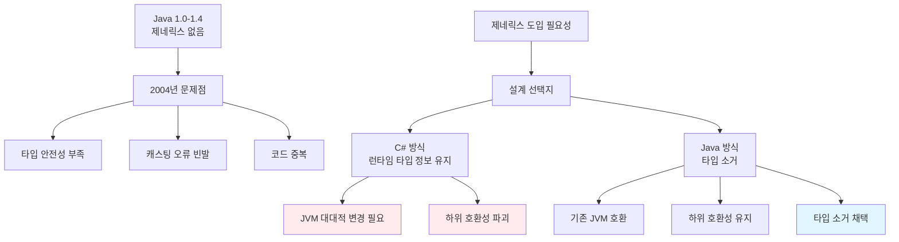
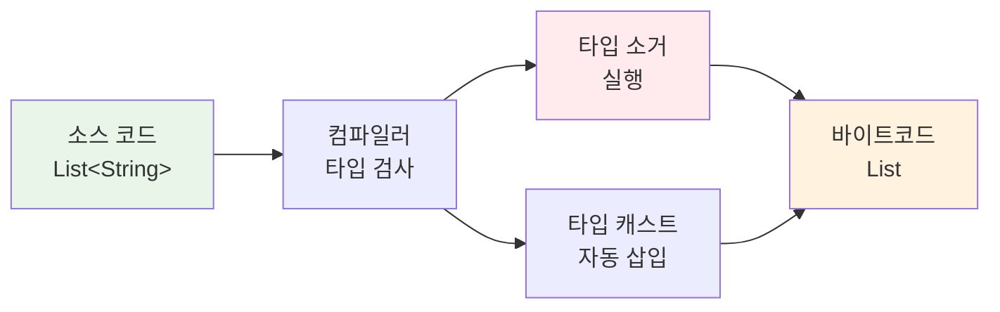
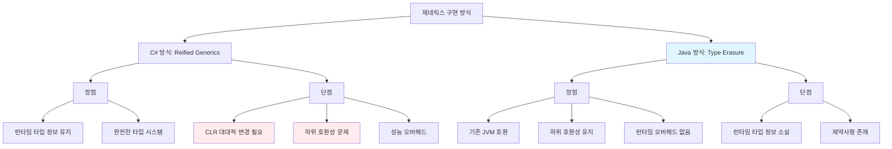
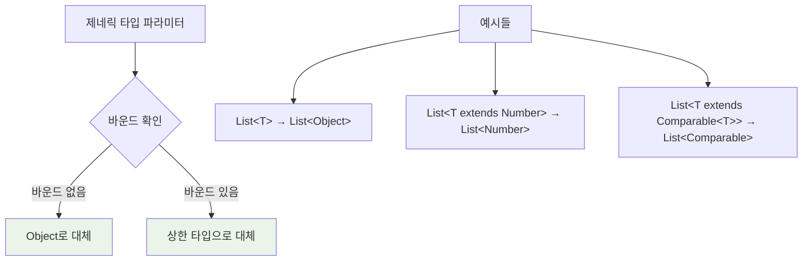
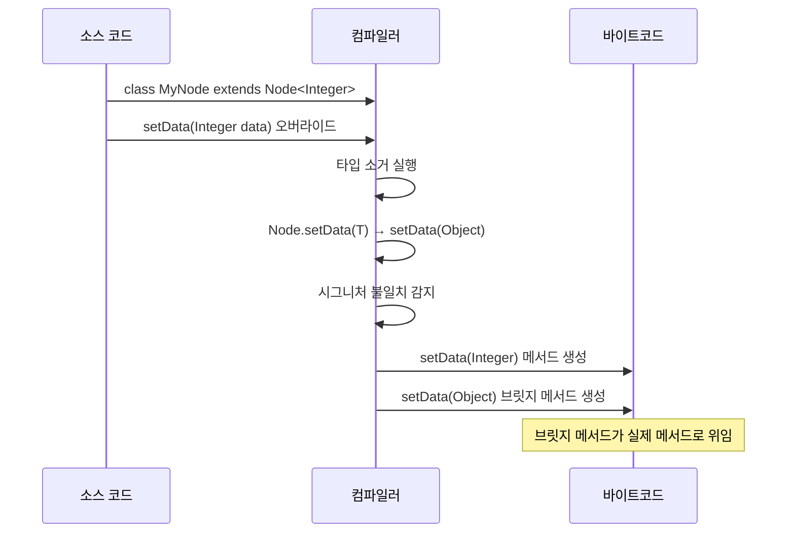
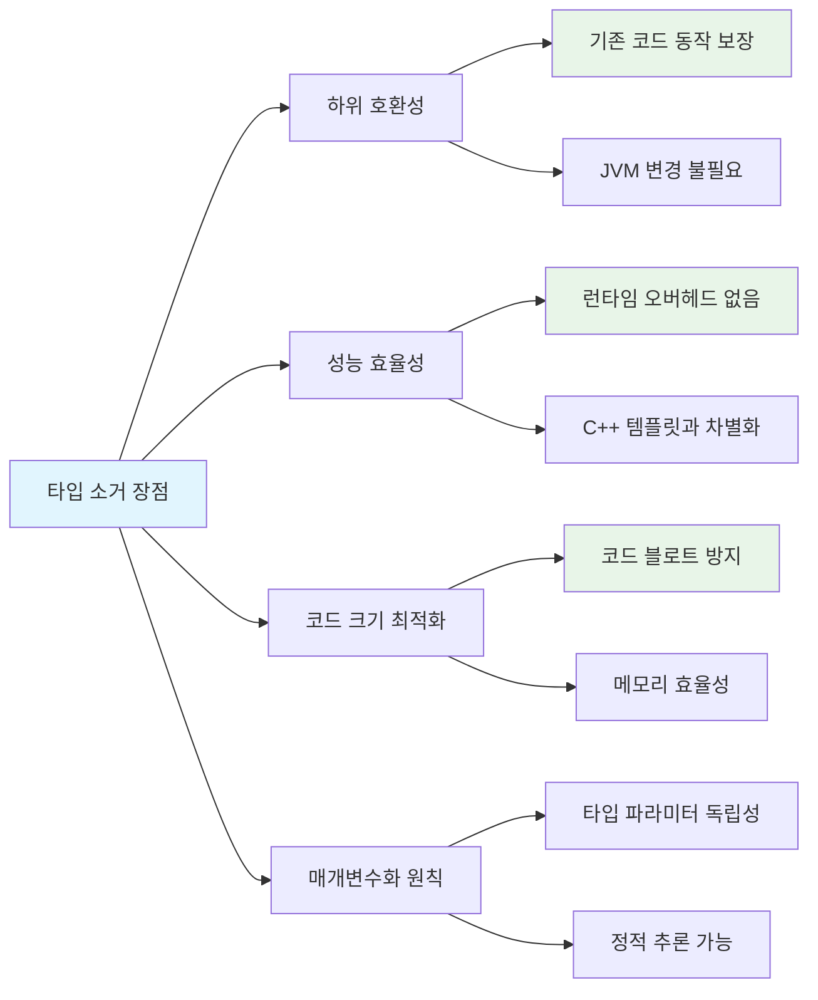
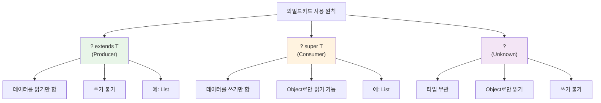
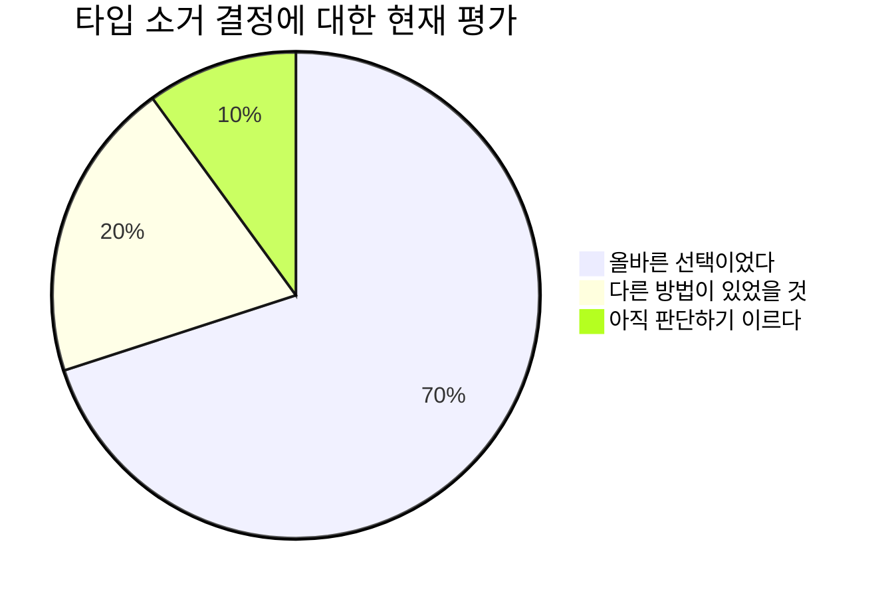
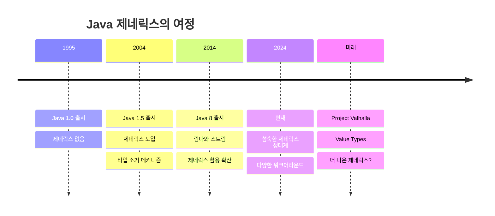

## 서론: 설계자의 고백

안녕하세요. Java 언어를 설계한 James Gosling입니다. 오늘은 Java 제네릭스의 핵심인 **타입 소거(Type Erasure)**에 대해 이야기하고자 합니다.

1990년대 초 Oak 프로젝트를 시작할 때, 우리는 "Write Once, Run Anywhere"라는 철학을 가지고 있었습니다. 하지만 제네릭스는 Java 1.5(2004년)에서야 도입되었죠. 이미 수많은 애플리케이션이 제네릭스 없이 개발되어 있었고, 우리는 중요한 결정을 내려야 했습니다.

**타입 소거**는 이상적인 해결책은 아니었지만, 현실적으로 최선의 선택이었습니다. 이 글에서 그 이유와 함께 타입 소거의 모든 것을 설명드리겠습니다.



---

## 1. 타입 소거란 무엇인가?

### 기본 개념

타입 소거는 **컴파일러가 제네릭 타입 정보를 바이트코드 생성 시 제거하는 메커니즘**입니다.

```java
// 소스 코드 (컴파일 전)
List<String> stringList = new ArrayList<String>();
List<Integer> intList = new ArrayList<Integer>();

// 바이트코드 (컴파일 후 - 타입 소거됨)
List stringList = new ArrayList();
List intList = new ArrayList();
```

### 타입 소거 과정



**개발자가 보는 것**: `List<String>`  
**JVM이 보는 것**: `List` (원시 타입)

이것이 제네릭스의 핵심 역설입니다. 컴파일 시점에는 강력한 타입 안전성을 제공하지만, 런타임에는 그 정보가 사라집니다.

---

## 2. 왜 타입 소거를 선택했을까?

### 당시의 현실적 제약사항

Java를 설계할 때 가장 중요하게 생각한 것은 **실용성**이었습니다. 2004년 당시 상황을 생각해보세요:

1. **수백만 줄의 기존 코드**: 이미 전 세계에 엄청난 양의 Java 코드가 존재
2. **JVM 생태계**: 다양한 벤더의 JVM들이 운영 중
3. **하위 호환성**: 기존 애플리케이션이 계속 동작해야 함

### 대안과의 비교



우리는 **호환성과 실용성**을 선택했습니다. 완벽하지는 않지만, Java 생태계를 보호하는 것이 더 중요했습니다.

---

## 3. 타입 소거의 작동 메커니즘

### 3.1 기본 타입 대체 규칙



### 3.2 자동 타입 캐스트 삽입

컴파일러는 타입 안전성을 위해 필요한 곳에 캐스트를 자동으로 삽입합니다:

```java
// 개발자가 작성한 코드
List<String> list = new ArrayList<>();
String s = list.get(0);

// 컴파일러가 생성한 바이트코드 (개념적)
List list = new ArrayList();
String s = (String) list.get(0);  // 자동 캐스트 삽입
```

### 3.3 브릿지 메서드 생성

가장 복잡한 부분 중 하나입니다. 상속과 오버라이딩 시 다형성을 유지하기 위해 컴파일러가 "브릿지 메서드"를 생성합니다:



---

## 4. 타입 소거의 제약사항들

### 4.1 주요 제약사항 맵

```mermaid
mindmap
  root((타입 소거 제약사항))
    런타임 타입 정보 소실
      instanceof 사용 불가
      리플렉션 제한
      타입 비교 불가
    인스턴스 생성 제한
      new T() 불가능
      제네릭 배열 생성 불가
      정적 컨텍스트 제한
    메서드 관련 제약
      오버로딩 충돌
      시그니처 동일화
    안전성 문제
      힙 오염 Heap Pollution
      Unchecked 경고
      캐스트 예외 위험
```

### 4.2 힙 오염(Heap Pollution) 이해하기

힙 오염은 제가 가장 우려했던 부분 중 하나입니다:

```mermaid
flowchart TD
    A[원시 타입 사용] --> B[타입 안전성 경고 무시]
    B --> C[컴파일 타임 우회]
    C --> D[힙 오염 발생]
    D --> E[런타임 ClassCastException]
    
    F[예방 방법] --> G[원시 타입 피하기]
    F --> H[Unchecked 경고 주의]
    F --> I[@SafeVarargs 신중 사용]
    F --> J[Collections.checkedList 활용]
    
    style D fill:#ffebee
    style E fill:#ffebee
    style G fill:#e8f5e8
    style H fill:#e8f5e8
```

---

## 5. 타입 소거의 장점들

솔직히 말하면, 타입 소거에 대한 비판을 많이 받았습니다. 하지만 우리가 얻은 것들도 상당합니다:

### 5.1 핵심 장점들



**C++과의 차별화**: C++에서는 `vector<int>`와 `vector<string>`이 완전히 다른 클래스로 컴파일됩니다. Java에서는 `List<Integer>`와 `List<String>`이 모두 같은 `List` 클래스를 사용합니다.

---

## 6. 제약사항 극복 전략

### 6.1 Class<T> 객체 전달 패턴

가장 일반적인 워크어라운드입니다:

```java
public class GenericFactory<T> {
    private final Class<T> typeClass;
    
    public GenericFactory(Class<T> typeClass) {
        this.typeClass = typeClass;
    }
    
    public T createInstance() throws Exception {
        return typeClass.getDeclaredConstructor().newInstance();
    }
}

// 사용법
GenericFactory<String> factory = new GenericFactory<>(String.class);
String instance = factory.createInstance();
```

### 6.2 와일드카드 활용 전략

PECS (Producer Extends, Consumer Super) 원칙을 따르세요:



### 6.3 TypeToken 패턴

Google Guava의 TypeToken은 제가 본 가장 우아한 해결책 중 하나입니다:

```java
// 복잡한 제네릭 타입의 정보를 런타임에 보존
TypeToken<List<String>> typeToken = new TypeToken<List<String>>() {};
Type type = typeToken.getType();

// Jackson 등의 라이브러리와 함께 사용
ObjectMapper mapper = new ObjectMapper();
List<String> list = mapper.readValue(json, 
    mapper.getTypeFactory().constructType(typeToken.getType()));
```

---

## 7. 현재 관점에서의 회고

### 7.1 아쉬운 점들

정직하게 말하면, 타입 소거는 완벽한 해결책이 아니었습니다:



**아쉬운 부분들:**
- 런타임 타입 정보의 완전한 소실
- 복잡한 워크어라운드의 필요성
- 초보자에게 혼란을 주는 메커니즘
- 리플렉션과의 불완전한 통합

### 7.2 그래도 옳은 선택이었던 이유

하지만 당시 상황에서는 최선이었습니다:

1. **생태계 보호**: 수백만 줄의 기존 코드가 그대로 동작
2. **점진적 도입**: 기존 프로젝트에서 부분적으로 제네릭스 사용 가능
3. **성능**: 런타임 오버헤드 없이 타입 안전성 확보
4. **채택률**: 빠른 제네릭스 확산

---

## 8. 미래를 위한 조언

### 8.1 개발자를 위한 Best Practices

```mermaid
flowchart TD
    A[타입 소거와 함께 살아가기] --> B[컴파일러 경고 주의]
    A --> C[적절한 워크어라운드 선택]
    A --> D[타입 안전성 최우선]
    
    B --> B1[Unchecked 경고 무시 금지]
    B --> B2[@SuppressWarnings 신중 사용]
    
    C --> C1[Class&lt;T&gt; 패턴 활용]
    C --> C2[TypeToken 적극 사용]
    C --> C3[와일드카드 마스터하기]
    
    D --> D1[원시 타입 피하기]
    D --> D2[제네릭 타입 일관성 유지]
    
    style A fill:#e1f5fe
    style D1 fill:#e8f5e8
    style B1 fill:#ffebee
```

### 8.2 현대적 활용법

현재는 더 나은 도구들이 있습니다:

**라이브러리 활용:**
- Google Guava의 TypeToken
- Jackson의 TypeReference
- Spring의 ParameterizedTypeReference

**언어 발전:**
- Java 8+ 의 람다와 메서드 레퍼런스
- Java 10+ 의 var 키워드로 보일러플레이트 감소
- Project Valhalla의 Value Types (미래)

---

## 결론: 언어 설계자의 마지막 말

타입 소거는 Java의 실용주의 철학을 가장 잘 보여주는 사례입니다. 완벽하지는 않지만, 당시 상황에서 Java 생태계를 보호하면서도 타입 안전성을 크게 향상시켰습니다.



**핵심 메시지:**
- 언어 설계는 기술적 완벽성보다 실용성이 중요할 때가 있습니다
- 하위 호환성은 개발자 생태계의 생명줄입니다
- 제약사항이 있어도 창의적 해결책은 항상 나타납니다

Java를 사용하시는 모든 개발자분들이 타입 소거의 본질을 이해하고, 이를 활용한 더 안전하고 효율적인 코드를 작성하시길 바랍니다.

기억하세요: **완벽한 언어는 없습니다. 하지만 실용적인 언어는 있습니다.**

---

*"복잡성을 단순화하는 것이 아니라, 복잡성을 잘 관리하는 것이 좋은 언어 설계입니다."*  
**- James Gosling**