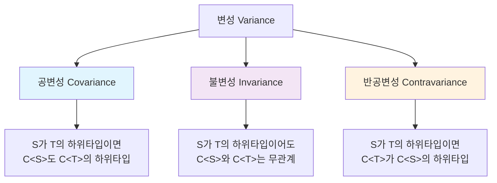
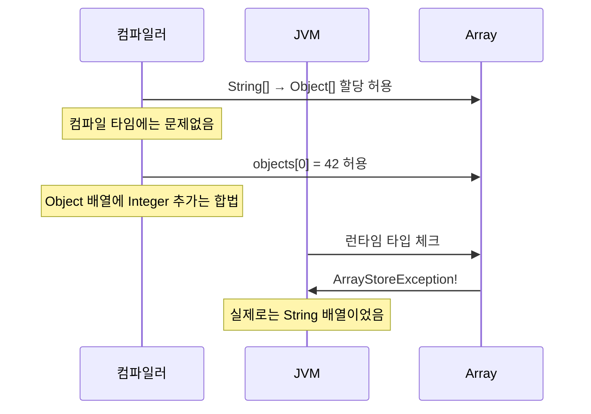
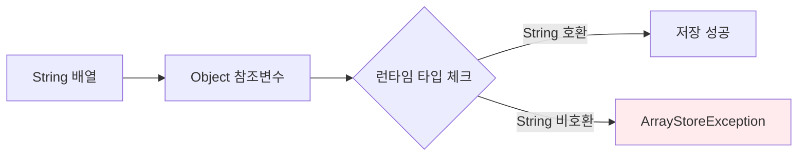
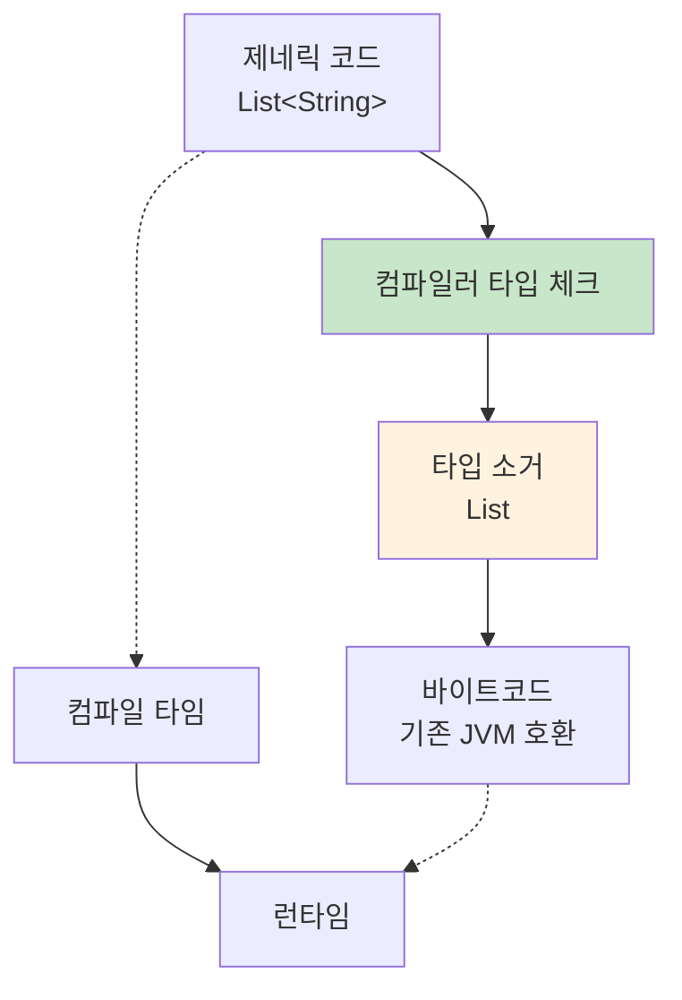
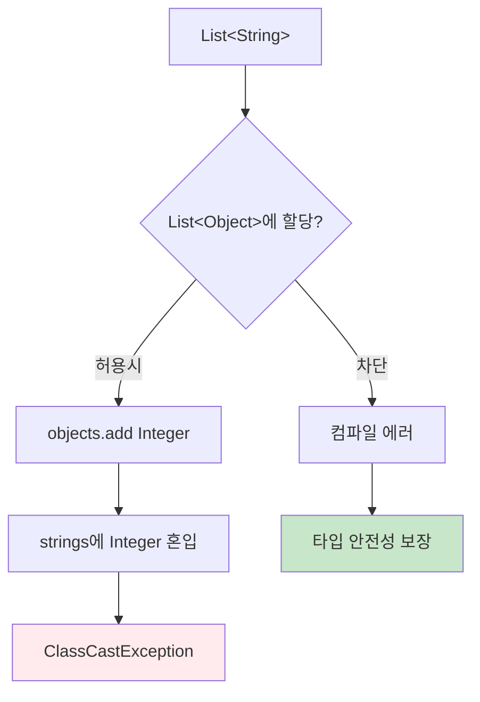
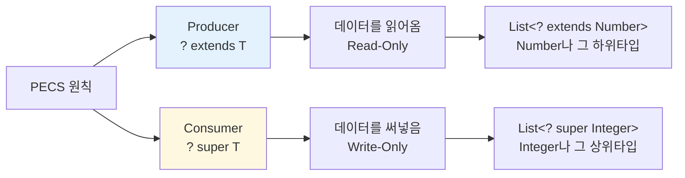
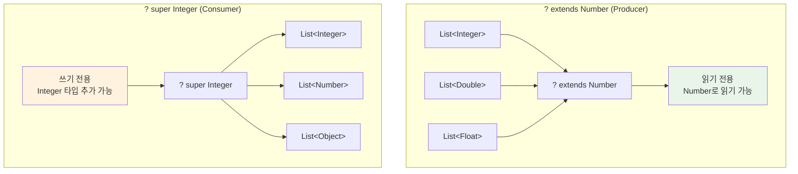
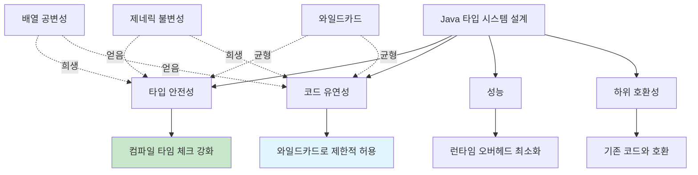
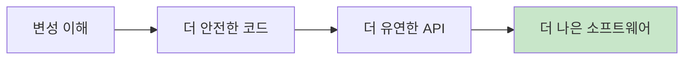

## 변성(Variance)이란 무엇인가?

변성은 타입 간의 상속 관계가 복합 타입(배열, 제네릭 컬렉션 등)에 어떻게 반영되는지를 정의하는 개념입니다.  

현실 세계에서 생각해보면, "동물"과 "개"가 있을 때 "개는 동물이다"라고 할 수 있죠? 이건 상속 관계입니다.  
그런데 문제는 이렇게 시작됩니다:
- `Dog`가 `Animal`을 상속받는다면
- `List<Dog>`는 `List<Animal>`과 어떤 관계일까요?

**직관적으로는** "개 리스트는 동물 리스트야"라고 생각할 수 있지만, **실제로는 그렇지 않습니다.**

왜냐하면:
```java
List<Animal> animals = new ArrayList<Dog>(); // 실제로는 불가능
animals.add(new Cat()); // 개 리스트에 고양이를 넣게 됨!
```

이렇게 되면 타입 안정성이 깨지죠.

**변성의 세 가지 종류:**

1. **불공변(Invariant)**: `List<Dog>`와 `List<Animal>`은 완전히 다른 타입
2. **공변(Covariant)**: `List<Dog>`를 `List<Animal>`로 읽을 수만 있음 (쓰기 금지)
3. **반공변(Contravariant)**: `List<Animal>`을 `List<Dog>`로 쓸 수만 있음 (읽기 제한)

Java에서는 와일드카드를 사용해서 이를 해결했습니다:
- `List<? extends Dog>` (공변)
- `List<? super Dog>` (반공변)

이 개념을 만들 때 가장 중요하게 생각한 것은 **타입 안정성**이었습니다. 컴파일 시점에 최대한 많은 오류를 잡아내서 런타임 오류를 줄이고자 했죠.



## 1. 배열의 공변성

### 제네릭 이전 시대의 선택

1990년대 초 Java를 설계할 때, 제네릭은 아직 존재하지 않았습니다. 다형성을 지원하기 위해 배열을 공변적으로 만든 것은 당시로서는 합리적인 선택이었습니다.

```java
// 이런 코드가 가능하도록 하고 싶었습니다
public static void printAll(Object[] objects) {
    for (Object obj : objects) {
        System.out.println(obj);
    }
}

String[] strings = {"Hello", "World"};
printAll(strings); // String[]을 Object[]로 전달
```

### 하지만 대가가 따랐습니다



```java
public class ArrayCovarianceExample {
    public static void main(String[] args) {
        String[] strings = new String[3];
        Object[] objects = strings; // 컴파일 OK - 배열 공변성
        
        objects[0] = "Hello";        // OK - String은 Object
        objects[1] = 42;             // 런타임 Exception!
        // java.lang.ArrayStoreException: java.lang.Integer
    }
}
```

이 문제는 배열이 런타임에 자신의 실제 타입을 기억하고 있기 때문에 발생합니다. JVM이 매번 타입을 체크해야 하므로 성능에도 영향을 줍니다.



## 2. 제네릭의 불변성

### 타입 소거(Type Erasure) 방식의 선택

JDK 5에서 제네릭을 도입할 때, 기존 Java 코드와의 호환성을 유지하면서도 타입 안전성을 확보하는 방법을 찾아야 했습니다. 그 해답이 '타입 소거'였습니다.



### 불변성이 필요한 이유

```java
public class GenericInvarianceExample {
    public static void main(String[] args) {
        List<String> strings = Arrays.asList("Hello", "World");
        
        // 이 코드가 허용된다면...
        // List<Object> objects = strings; // 컴파일 에러!
        
        // 다음이 가능해집니다:
        // objects.add(42); // Integer를 String 리스트에?
        // String s = strings.get(2); // ClassCastException!
    }
}
```

불변성은 이런 문제를 컴파일 시점에 차단합니다:



## 3. 와일드카드

### PECS 원칙의 탄생

제네릭의 엄격한 불변성만으로는 실용적인 프로그래밍이 어려웠습니다. 그래서 와일드카드를 도입했고, Joshua Bloch가 정리한 PECS(Producer-Extends, Consumer-Super) 원칙이 나왔습니다.



### ? extends T (공변성)

```java
public class ProducerExample {
    // 숫자들을 읽어서 합계를 구하는 메서드
    public static double sum(List<? extends Number> numbers) {
        double total = 0.0;
        for (Number num : numbers) {  // 읽기만 가능
            total += num.doubleValue();
        }
        // numbers.add(3.14); // 컴파일 에러! 쓰기 불가
        return total;
    }
    
    public static void main(String[] args) {
        List<Integer> integers = Arrays.asList(1, 2, 3);
        List<Double> doubles = Arrays.asList(1.1, 2.2, 3.3);
        
        System.out.println(sum(integers)); // 6.0
        System.out.println(sum(doubles));  // 6.6
    }
}
```

### ? super T (반공변성)

```java
public class ConsumerExample {
    // 정수들을 컬렉션에 추가하는 메서드
    public static void addIntegers(List<? super Integer> numbers) {
        numbers.add(42);        // 쓰기 가능
        numbers.add(100);       // Integer의 하위타입도 가능
        
        // Object obj = numbers.get(0); // Object로만 읽기 가능
        // Integer i = numbers.get(0);  // 컴파일 에러!
    }
    
    public static void main(String[] args) {
        List<Number> numbers = new ArrayList<>();
        List<Object> objects = new ArrayList<>();
        
        addIntegers(numbers);   // Number는 Integer의 상위타입
        addIntegers(objects);   // Object는 Integer의 상위타입
    }
}
```



## 4. 메서드 오버라이딩과 공변 반환 타입

JDK 5에서는 메서드 오버라이딩에서도 공변성을 도입했습니다. 이는 배열의 공변성과 달리 안전한 공변성입니다.

```java
class Animal {
    public Animal reproduce() {
        return new Animal();
    }
}

class Dog extends Animal {
    @Override
    public Dog reproduce() {  // 공변 반환 타입
        return new Dog();
    }
}

public class CovariantReturnExample {
    public static void main(String[] args) {
        Dog myDog = new Dog();
        Dog puppy = myDog.reproduce(); // 형변환 불필요!
        
        // 기존 방식이라면:
        // Dog puppy = (Dog) myDog.reproduce();
    }
}
```

## 5. 설계 철학과 트레이드오프

### 우리가 추구한 균형점



### 현실적인 권장사항

#### 1. **배열보다는 제네릭 컬렉션을 사용하세요**

```java
// 지양
String[] strings = new String[10];

// 권장
List<String> strings = new ArrayList<>();
```

#### 2. **PECS 원칙을 활용하세요**

```java
// 데이터를 생산(읽기)하는 경우
public void processNumbers(List<? extends Number> numbers) { }

// 데이터를 소비(쓰기)하는 경우  
public void addNumbers(List<? super Number> numbers) { }
```

#### 3. **타입 안전성을 우선하되, 필요시 와일드카드로 유연성을 확보하세요**

## 결론

변성은 그 자체가 목적이 아니라 더 나은 코드를 작성하기 위한 도구입니다. Java에서는:

- **기본적으로 불변성**을 유지하여 안전성을 확보하고
- **필요시 와일드카드**로 유연성을 추가하며
- **PECS 원칙**을 통해 올바른 사용법을 가이드합니다

이러한 설계 결정들이 완벽하지는 않지만, 수많은 개발자들이 안전하고 효율적인 코드를 작성할 수 있도록 돕는 실용적인 해답이라고 생각합니다.

