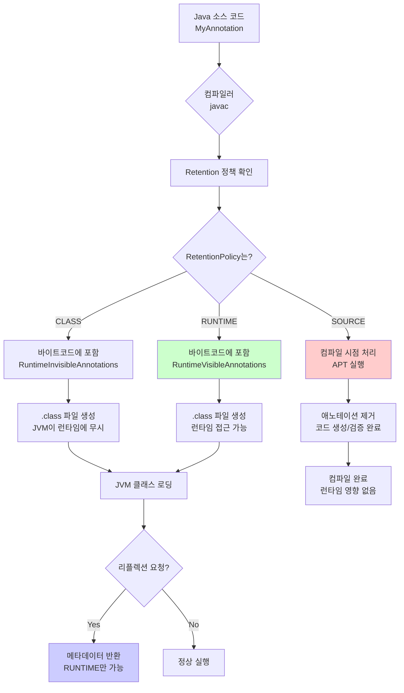
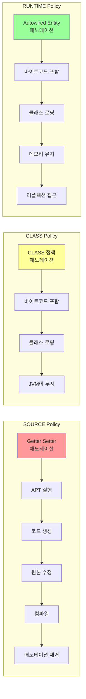
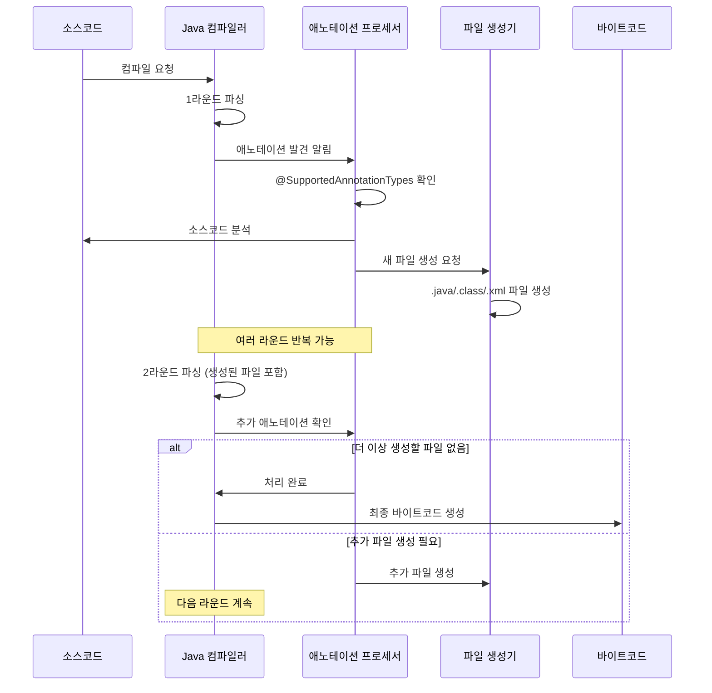
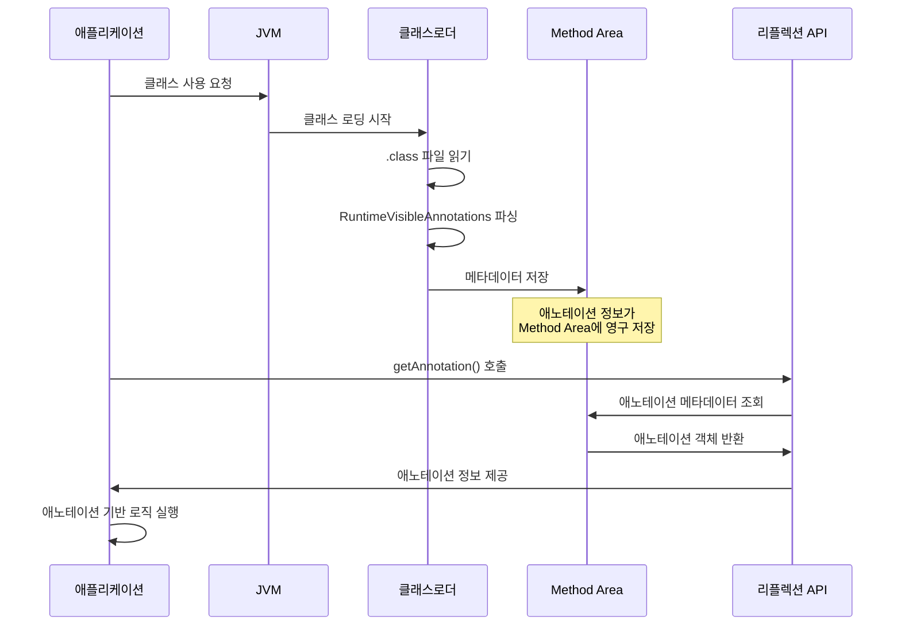
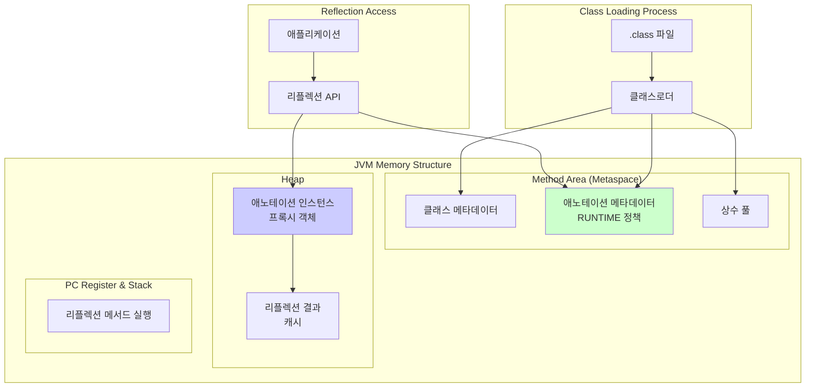
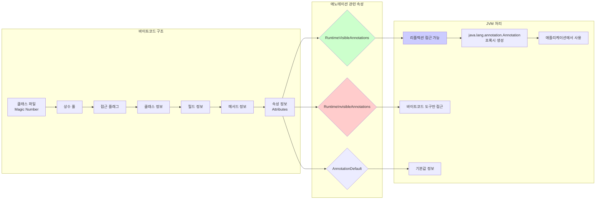
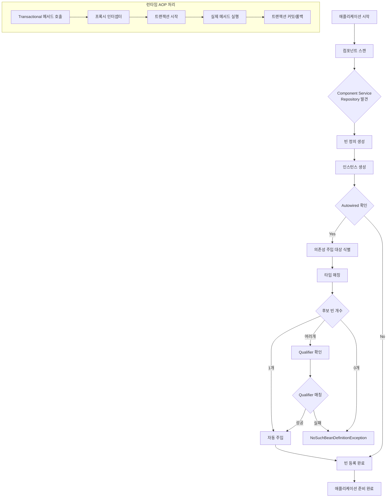
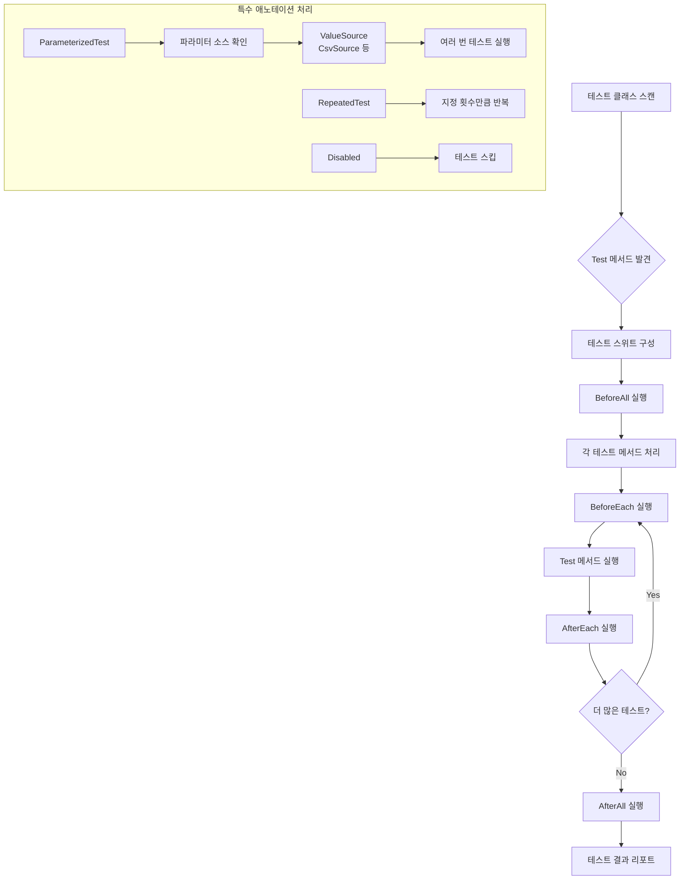

애노테이션의 전체 생명주기를 먼저 살펴보겠습니다:



이 차트가 보여주는 것처럼, 애노테이션은 컴파일 시점부터 런타임까지 서로 다른 경로를 통해 처리됩니다.

## 1. 애노테이션의 탄생 배경

### 1.1 기존 방식의 한계

Java 5 이전에는 메타데이터를 표현하는 방법이 제한적이었습니다:

- **Javadoc 태그**: 문서화에만 사용 가능
- **XML 설정 파일**: 코드와 분리되어 유지보수 어려움
- **명명 규칙**: 암묵적이고 강제력 부족

```xml
<!-- 기존 XML 방식 -->
<beans>
    <bean id="userService" class="com.example.UserService">
        <property name="userRepository" ref="userRepository"/>
    </bean>
</beans>
```

### 1.2 애노테이션의 설계 원칙

애노테이션을 설계할 때 다음 원칙들을 고려했습니다:

1. **코드와의 근접성**: 메타데이터가 코드와 함께 위치
2. **컴파일 시점 검증**: 타입 안전성 보장
3. **런타임 접근성**: 리플렉션을 통한 동적 처리
4. **확장성**: 사용자 정의 애노테이션 지원

```java
// 애노테이션 방식 - 코드와 메타데이터가 함께
@Service
public class UserService {
    
    @Autowired
    private UserRepository userRepository;
}
```

## 2. 애노테이션의 핵심 개념

### 2.1 기본 구조

애노테이션은 `@` 기호로 시작하는 특별한 인터페이스입니다:

```java
@interface MyAnnotation {
    String value() default "default";
    int count() default 1;
}
```

**핵심 특징:**
- `@interface` 키워드로 선언
- 매개변수가 없는 메서드로 요소 정의
- `default` 값 지정 가능
- 기본형, String, enum, Class, 배열만 사용 가능

### 2.2 표준 애노테이션

Java에서 제공하는 표준 애노테이션들은 언어의 견고성을 높입니다:

| 애노테이션 | 목적 | 예시 |
|-----------|------|------|
| `@Override` | 메서드 재정의 검증 | 컴파일 시점 오류 체크 |
| `@Deprecated` | 사용 중단 표시 | 하위 호환성 유지 |
| `@SuppressWarnings` | 경고 억제 | 코드 품질 관리 |
| `@FunctionalInterface` | 함수형 인터페이스 보장 | 람다 표현식 지원 |

```java
public class Vehicle {
    @Deprecated(since = "2.0", forRemoval = true)
    public void oldMethod() { }
    
    @Override
    public String toString() {
        return "Vehicle";
    }
}
```

## 3. 메타 애노테이션: 동작 제어의 핵심

메타 애노테이션은 애노테이션의 "애노테이션"입니다. JVM과의 상호작용을 결정하는 중요한 역할을 합니다.

### 3.1 @Retention: 생명주기 관리

가장 중요한 설계 결정 중 하나는 애노테이션 정보를 언제까지 유지할지였습니다. 이를 시각적으로 보면:



```java
public enum RetentionPolicy {
    SOURCE,   // 컴파일 후 제거
    CLASS,    // 바이트코드에 포함, 런타임에서 무시 (기본값)
    RUNTIME   // 런타임까지 유지, 리플렉션 접근 가능
}
```

#### 성능과 기능의 균형

| 정책 | JVM 영향 | 주요 용도 | 성능 영향 |
|------|---------|-----------|-----------|
| `SOURCE` | 없음 | 코드 생성 (Lombok) | 없음 |
| `CLASS` | 미미함 | 바이트코드 조작 | 거의 없음 |
| `RUNTIME` | 있음 | 프레임워크 기능 | 약간의 오버헤드 |

```java
@Retention(RetentionPolicy.SOURCE)
public @interface Getter { } // Lombok

@Retention(RetentionPolicy.RUNTIME)
public @interface Autowired { } // Spring
```

### 3.2 @Target: 적용 대상 제한

타입 안전성을 위해 애노테이션이 적용될 수 있는 요소를 제한합니다:

```java
@Target({ElementType.TYPE, ElementType.METHOD})
public @interface MyAnnotation { }

// 올바른 사용
@MyAnnotation
public class MyClass {
    @MyAnnotation
    public void myMethod() { }
}

// 컴파일 오류 - FIELD는 허용되지 않음
// @MyAnnotation
// private String field;
```

### 3.3 기타 메타 애노테이션

```java
@Documented    // Javadoc에 포함
@Inherited     // 하위 클래스에 상속
@Repeatable    // 동일 요소에 여러 번 적용 가능
public @interface Role {
    String value();
}

// @Repeatable 사용 예시
@Role("admin")
@Role("user")
public class Person { }
```

## 4. JVM과 애노테이션의 상호작용

### 4.1 컴파일 시점 처리: APT (Annotation Processing Tool)

애노테이션 프로세서가 어떻게 동작하는지 살펴보겠습니다:



애노테이션 프로세서는 컴파일 과정에 통합되어 동작합니다:

```java
@SupportedAnnotationTypes("com.example.MyAnnotation")
public class MyProcessor extends AbstractProcessor {
    @Override
    public boolean process(Set<? extends TypeElement> annotations,
                          RoundEnvironment roundEnv) {
        // 애노테이션 처리 로직
        for (Element element : roundEnv.getElementsAnnotatedWith(MyAnnotation.class)) {
            // 코드 생성 또는 검증
        }
        return true;
    }
}
```

#### Lombok의 혁신적 접근

Lombok은 표준 APT의 한계를 창의적으로 해결했습니다:

```java
// 소스 코드
@Getter @Setter
public class User {
    private String name;
    private int age;
}

// 컴파일 후 실제 결과 (개념적)
public class User {
    private String name;
    private int age;
    
    public String getName() { return name; }
    public void setName(String name) { this.name = name; }
    public int getAge() { return age; }
    public void setAge(int age) { this.age = age; }
}
```

### 4.2 런타임 처리: 리플렉션

런타임에서 애노테이션이 어떻게 처리되는지 보겠습니다:



JVM은 클래스 로딩 시 `RUNTIME` 애노테이션을 메모리에 유지합니다:

```java
public class AnnotationProcessor {
    public void processAnnotations(Object obj) {
        Class<?> clazz = obj.getClass();
        
        // 클래스 애노테이션 처리
        if (clazz.isAnnotationPresent(Service.class)) {
            Service service = clazz.getAnnotation(Service.class);
            System.out.println("Service: " + service.value());
        }
        
        // 메서드 애노테이션 처리
        for (Method method : clazz.getDeclaredMethods()) {
            if (method.isAnnotationPresent(Transactional.class)) {
                // 트랜잭션 처리 로직
                handleTransaction(method);
            }
        }
    }
}
```

### 4.3 JVM 메모리에서의 애노테이션 관리

JVM이 메모리에서 애노테이션을 어떻게 관리하는지 살펴보겠습니다:



#### JVM 메모리에서의 애노테이션 관리

1. **클래스 로딩**: `.class` 파일의 `RuntimeVisibleAnnotations` 속성 파싱
2. **메모리 저장**: Method Area에 애노테이션 메타데이터 저장
3. **리플렉션 접근**: 필요 시 동적으로 메타데이터 조회

### 4.4 바이트코드 레벨에서의 처리

JVM 내부에서 바이트코드 레벨에서 애노테이션이 어떻게 처리되는지 살펴보겠습니다:



## 5. 실전 활용 사례

### 5.1 Spring Framework: 선언적 프로그래밍의 극치

Spring은 애노테이션을 통해 복잡한 Enterprise 애플리케이션을 단순화했습니다. Spring의 애노테이션 처리 과정을 살펴보겠습니다:



```java
@RestController
@RequestMapping("/api/users")
public class UserController {
    
    @Autowired
    private UserService userService;
    
    @GetMapping("/{id}")
    @Cacheable("users")
    public ResponseEntity<User> getUser(@PathVariable Long id) {
        User user = userService.findById(id);
        return ResponseEntity.ok(user);
    }
    
    @PostMapping
    @Transactional
    public ResponseEntity<User> createUser(@Valid @RequestBody User user) {
        User saved = userService.save(user);
        return ResponseEntity.created(URI.create("/api/users/" + saved.getId()))
                           .body(saved);
    }
}
```

**핵심 이점:**
- XML 설정 99% 감소
- 코드와 설정의 일체화
- 타입 안전성 보장
- IDE 지원 향상

### 5.2 JUnit: 테스트 자동화의 혁신

JUnit의 애노테이션 기반 테스트 처리 과정입니다:



```java
@TestMethodOrder(OrderAnnotation.class)
class UserServiceTest {
    
    @Mock
    private UserRepository userRepository;
    
    @InjectMocks
    private UserService userService;
    
    @BeforeEach
    void setUp() {
        MockitoAnnotations.openMocks(this);
    }
    
    @Test
    @Order(1)
    @DisplayName("사용자 생성 테스트")
    void createUser_ShouldReturnUser_WhenValidInput() {
        // Given
        User inputUser = new User("John", "john@example.com");
        User savedUser = new User(1L, "John", "john@example.com");
        
        when(userRepository.save(any(User.class))).thenReturn(savedUser);
        
        // When
        User result = userService.createUser(inputUser);
        
        // Then
        assertThat(result.getId()).isEqualTo(1L);
        assertThat(result.getName()).isEqualTo("John");
    }
    
    @ParameterizedTest
    @ValueSource(strings = {"", " ", "invalid-email"})
    void createUser_ShouldThrowException_WhenInvalidEmail(String email) {
        User user = new User("John", email);
        
        assertThrows(ValidationException.class, 
                    () -> userService.createUser(user));
    }
}
```

## 6. 성능 고려사항과 최적화

성능 관점에서 애노테이션이 어떻게 처리되는지 살펴보겠습니다:



### 6.1 RetentionPolicy별 성능 영향

```java
// 성능에 영향 없음 - 컴파일 후 제거
@Retention(RetentionPolicy.SOURCE)
@interface CompileTimeOnly { }

// 런타임 오버헤드 발생 가능
@Retention(RetentionPolicy.RUNTIME)
@interface RuntimeProcessed { }
```

### 6.2 리플렉션 최적화 패턴

```java
public class AnnotationCache {
    private static final Map<Class<?>, List<Method>> ANNOTATED_METHODS = 
        new ConcurrentHashMap<>();
    
    public static List<Method> getAnnotatedMethods(Class<?> clazz, 
                                                  Class<? extends Annotation> annotation) {
        return ANNOTATED_METHODS.computeIfAbsent(clazz, key -> 
            Arrays.stream(key.getDeclaredMethods())
                  .filter(method -> method.isAnnotationPresent(annotation))
                  .collect(Collectors.toList())
        );
    }
}
```

## 7. 개발자를 위한 권고사항

### 7.1 설계 원칙

1. **적절한 RetentionPolicy 선택**
   - 런타임에 불필요한 애노테이션은 `SOURCE` 사용
   - 성능보다 유연성이 중요하면 `RUNTIME` 선택

2. **타입 안전성 활용**
   - `@Target`으로 적용 범위 제한
   - 컴파일 시점 검증 최대한 활용

3. **문서화와 유지보수성**
   - `@Documented`로 API 문서 품질 향상
   - 명확한 애노테이션 이름과 요소명 사용

4. **성능 최적화**
   - 리플렉션 결과 캐싱
   - 불필요한 `RUNTIME` 애노테이션 지양

### 7.2 실무 적용 가이드

**DO:**
- 명확하고 직관적인 애노테이션 이름 사용
- 기본값을 통한 사용 편의성 제공
- 적절한 검증과 예외 처리

**DON'T:**
- 과도한 애노테이션으로 코드 복잡성 증가
- 런타임 성능을 고려하지 않은 무분별한 `RUNTIME` 정책 사용
- 애노테이션에 비즈니스 로직 포함

```mermaid
graph TD
    subgraph "컴파일 타임 (성능 영향 없음)"
        A[SOURCE 정책] --> B[APT 처리]
        B --> C[코드 생성]
        C --> D[애노테이션 제거]
        D --> E[최적화된 바이트코드]
    end
    
    subgraph "클래스 로딩 타임 (미미한 영향)"
        F[CLASS 정책] --> G[바이트코드 포함]
        G --> H[클래스 로딩]
        H --> I[메타데이터 무시]
    end
    
    subgraph "런타임 (성능 고려 필요)"
        J[RUNTIME 정책] --> K[메모리 저장]
        K --> L[리플렉션 호출]
        L --> M{캐시 존재?}
        M -->|Yes| N[캐시된 결과 반환<br/>빠름]
        M -->|No| O[메타데이터 탐색<br/>느림]
        O --> P[결과 캐싱]
        P --> N
    end
    
    style E fill:#ccffcc
    style I fill:#ffffcc
    style O fill:#ffcccc
    style N fill:#ccffff
```

---

## 결론

애노테이션은 Java 언어의 진화에서 중요한 이정표였습니다. 단순함과 실용성이라는 Java의 핵심 가치를 유지하면서도, 현대적인 프레임워크와 도구들이 필요로 하는 메타데이터 기능을 우아하게 제공했습니다.

**애노테이션의 핵심 가치:**
- **개발자 생산성 향상**: 보일러플레이트 코드 감소
- **코드 가독성 개선**: 설정과 코드의 일체화
- **타입 안전성**: 컴파일 시점 검증
- **확장성**: 사용자 정의 애노테이션 지원

JVM과의 긴밀한 통합을 통해 애노테이션은 컴파일 시점부터 런타임까지 일관된 메타데이터 처리 메커니즘을 제공합니다. 이는 Spring, JUnit 같은 강력한 프레임워크들이 탄생할 수 있는 기반을 마련했습니다.
