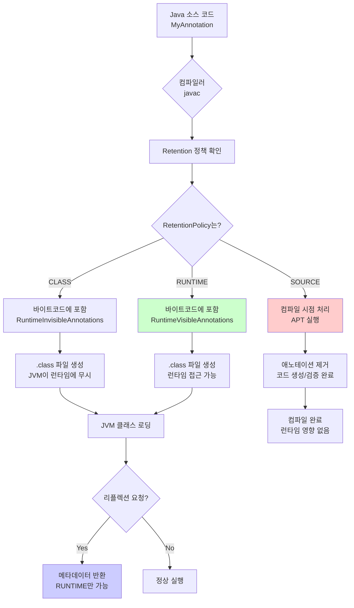
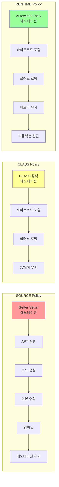
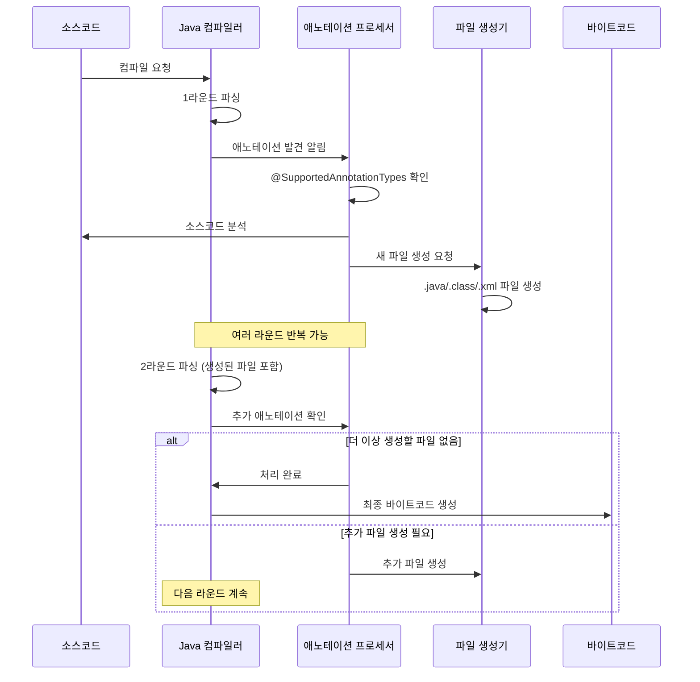
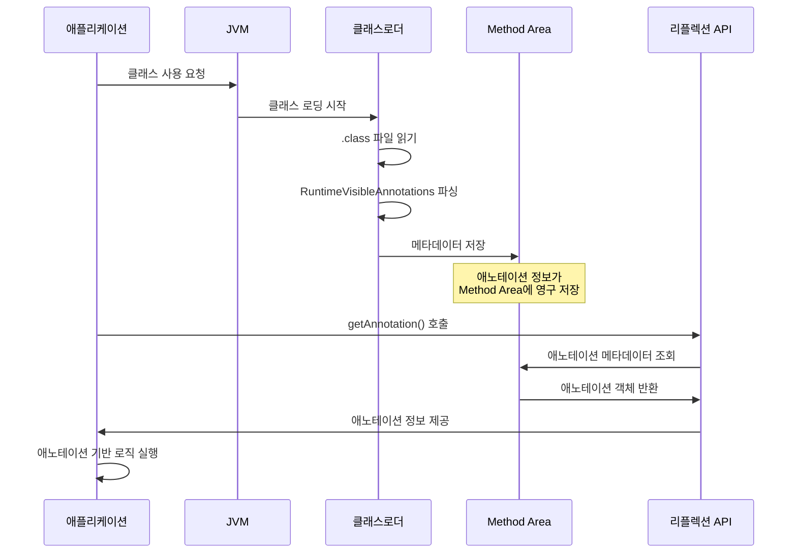
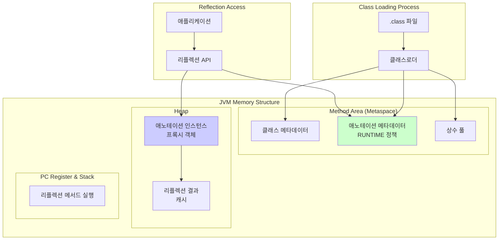
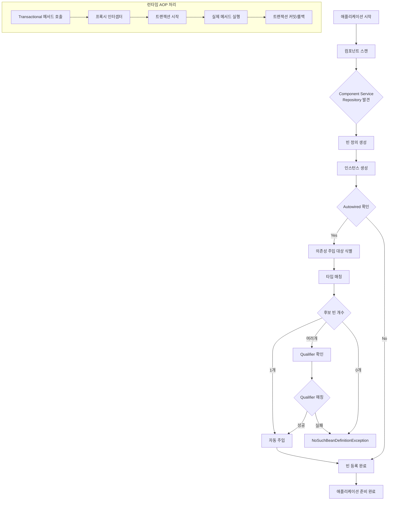
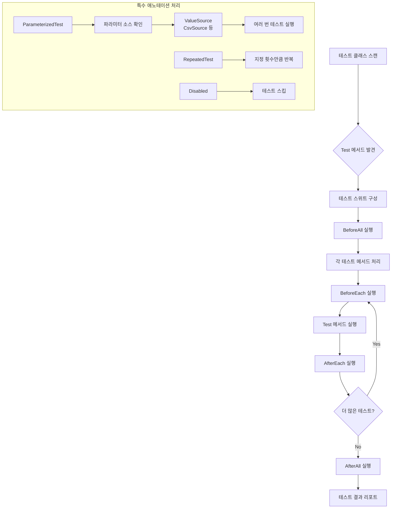
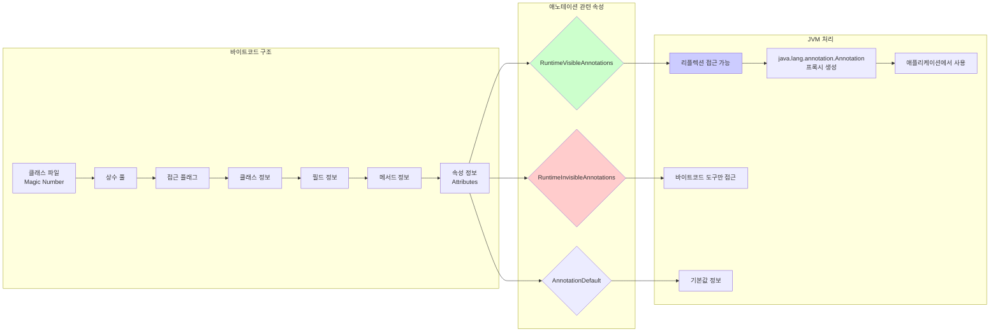

# Java 애노테이션 메커니즘 - Mermaid 다이어그램

## 1. 애노테이션 생명주기 전체 개요

## 2. RetentionPolicy별 처리 경로

## 3. 컴파일 시점 처리 (APT) 메커니즘

## 4. 런타임 리플렉션 처리 메커니즘

## 5. JVM 메모리 관점의 애노테이션 관리

## 6. 프레임워크별 애노테이션 활용 패턴

### Spring Framework

### JUnit Test Framework

## 7. JVM 내부 바이트코드 레벨 처리

## 8. 성능 관점의 애노테이션 처리

```mermaid
graph TD
    subgraph "컴파일 타임 (성능 영향 없음)"
        A[SOURCE 정책] --> B[APT 처리]
        B --> C[코드 생성]
        C --> D[애노테이션 제거]
        D --> E[최적화된 바이트코드]
    end
    
    subgraph "클래스 로딩 타임 (미미한 영향)"
        F[CLASS 정책] --> G[바이트코드 포함]
        G --> H[클래스 로딩]
        H --> I[메타데이터 무시]
    end
    
    subgraph "런타임 (성능 고려 필요)"
        J[RUNTIME 정책] --> K[메모리 저장]
        K --> L[리플렉션 호출]
        L --> M{캐시 존재?}
        M -->|Yes| N[캐시된 결과 반환<br/>빠름]
        M -->|No| O[메타데이터 탐색<br/>느림]
        O --> P[결과 캐싱]
        P --> N
    end
    
    style E fill:#ccffcc
    style I fill:#ffffcc
    style O fill:#ffcccc
    style N fill:#ccffff
```

---

## 핵심 요약

**James Gosling의 관점에서 본 애노테이션 메커니즘:**

1. **단순성**: 복잡한 XML 설정을 코드 내 메타데이터로 단순화
2. **타입 안전성**: 컴파일 시점 검증으로 런타임 오류 방지
3. **성능 최적화**: RetentionPolicy를 통한 세밀한 생명주기 제어
4. **확장성**: 사용자 정의 애노테이션으로 무한한 가능성 제공
5. **JVM 통합**: 바이트코드와 메모리 구조에 자연스럽게 통합

이러한 설계 결정들이 Spring, JUnit 같은 강력한 프레임워크들이 탄생할 수 있는 기반을 마련했습니다.
