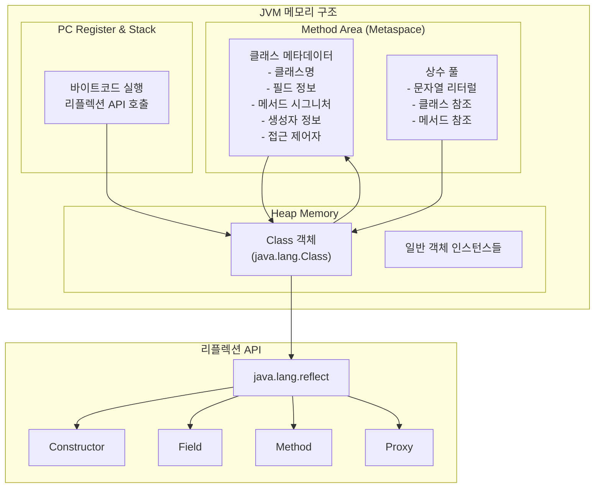
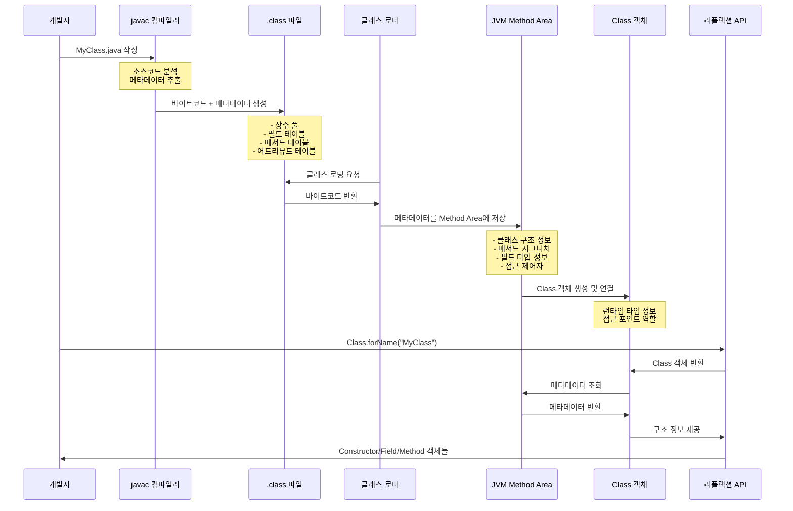
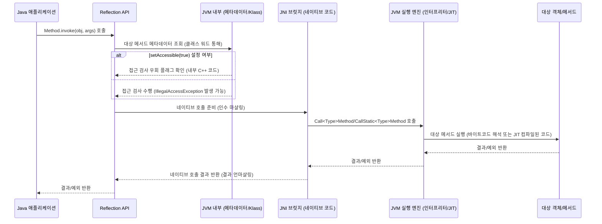
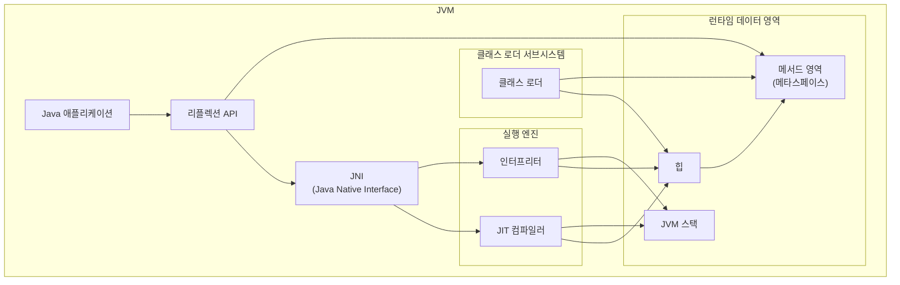
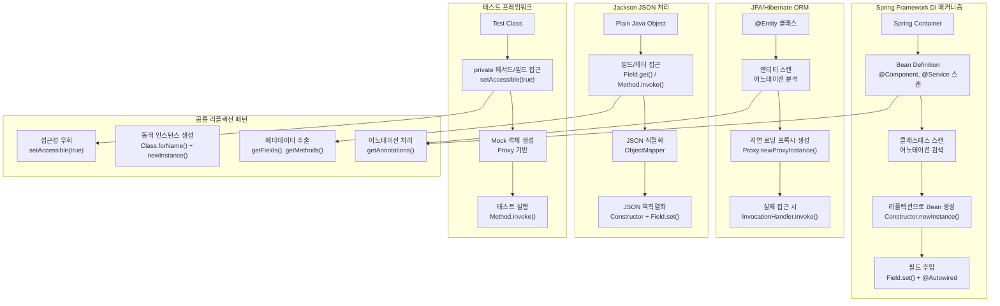

# Java 리플렉션: JVM 내부 동작과 설계 철학

*James Gosling의 관점으로 바라본 Java Reflection 심층 분석*

---

## 서론: Oak에서 JVM까지의 여정

1990년대 초 Sun Microsystems에서 Oak 프로젝트를 시작할 때, 우리는 단순히 새로운 프로그래밍 언어를 만드는 것이 아니라 **미래의 컴퓨팅 패러다임**을 설계하고 있었습니다. 네트워크가 중심이 되는 세상에서 프로그램들은 어떻게 상호작용할까요? 분산 환경에서 객체들은 어떻게 자신의 정체성을 유지하고 소통할까요?

리플렉션은 이러한 근본적인 질문들에 대한 우리의 답변이었습니다. 단순한 "기능"이 아니라, **동적이고 연결된 세상을 위한 기반 아키텍처**였죠. Java 1.1에서 리플렉션을 완전히 도입한 것이 컬렉션 API보다도 앞선 시기였다는 것은 우연이 아닙니다. 프로그램이 자기 자신을 성찰할 수 있는 능력을 우리는 **자바 플랫폼의 근본적인 특성**으로 간주했기 때문입니다.

## 리플렉션의 핵심 개념: 메타데이터의 민주화

### 리플렉션이란 무엇인가

자바 리플렉션은 **실행 중인 프로그램이 런타임에 자신의 구조와 동작을 검사하고 수정할 수 있도록 하는 능력**입니다. 이는 클래스, 인터페이스, 필드, 메서드, 생성자의 구조를 동적으로 탐색하고, 새로운 인스턴스를 생성하며, 필드 값을 조작하고, 메서드를 호출할 수 있는 포괄적인 기능을 제공합니다.

C++에서 우리가 경험했던 경직성을 극복하고자 했던 것처럼, 리플렉션은 **컴파일 시점의 제약을 런타임의 유연성으로 변환**하는 핵심 메커니즘입니다.

### 핵심 API 구성요소

`java.lang.reflect` 패키지의 핵심 클래스들은 각각 명확한 책임을 가지고 설계되었습니다:

- **Class**: 모든 리플렉션 작업의 진입점이자 타입 메타데이터의 컨테이너
- **Constructor**: 동적 객체 생성을 위한 인터페이스
- **Field**: 객체 상태에 대한 런타임 접근
- **Method**: 동적 행위 호출을 위한 메커니즘
- **Proxy**: AOP와 인터셉션 패턴의 기반

```java
// 세 가지 Class 객체 획득 방법
Class<?> clazz1 = MyClass.class;              // 컴파일 타임 안전성
Class<?> clazz2 = obj.getClass();             // 런타임 다형성
Class<?> clazz3 = Class.forName("MyClass");   // 완전한 동적 로딩
```

## JVM 아키텍처와 리플렉션의 깊은 통합

### JVM의 "Write Once, Run Anywhere" 철학

JVM은 단순한 바이트코드 실행기가 아닙니다. **플랫폼 독립적인 실행 환경을 제공하는 추상 컴퓨팅 머신**이죠. 우리가 설계한 JVM 아키텍처는 다음과 같은 핵심 서브시스템으로 구성됩니다:

1. **클래스 로더 서브시스템**: 동적 클래스 로딩과 링킹
2. **런타임 데이터 영역**: 메모리 관리와 메타데이터 저장
3. **실행 엔진**: 바이트코드 해석과 네이티브 코드 컴파일
4. **JNI (Java Native Interface)**: 네이티브 코드와의 상호운용성

### 메모리 구조와 런타임 메타데이터

JVM이 유지하는 **풍부한 런타임 타입 정보**는 리플렉션을 가능하게 하는 핵심입니다. HotSpot JVM에서 이 메타데이터는 다음과 같이 구조화됩니다:

#### 객체 헤더 구조
- **마크 워드(Mark Word)**: 동기화, GC 정보 등 인스턴스별 메타데이터
- **클래스 워드(Klass Word)**: 타입별 메타데이터에 대한 포인터

#### 메타스페이스(Metaspace)
클래스 정의, 메서드 테이블, 필드 정보, 상수 풀 등 **공유되는 타입별 메타데이터**가 저장됩니다. 리플렉션은 본질적으로 이미 존재하는 메타데이터에 대한 **프로그래밍 인터페이스**를 제공하는 것입니다.



### 클래스 로딩 라이프사이클

클래스 로더 서브시스템은 **로딩, 링크, 초기화**의 3단계 프로세스를 통해 동작합니다:



#### 로딩(Loading)
부트스트랩, 확장, 시스템 클래스 로더의 **위임 계층**을 통해 .class 파일을 읽고 메서드 영역에 저장합니다.

#### 링크(Linking)
- **검증**: 바이트코드의 구조적/의미론적 정확성 확인
- **준비**: 정적 변수를 위한 메모리 할당과 기본값 초기화
- **해결**: 심볼릭 참조를 직접 참조로 변환

#### 초기화(Initialization)
정적 변수에 실제 값을 할당하고 정적 블록을 실행합니다.

## 리플렉션의 내부 동작 메커니즘: JNI와 네이티브 통합

### Class.forName(): 동적 해결의 복잡성

`Class.forName(String className)`이 호출되면, JVM은 **동적 바인딩과 해결**을 수행해야 합니다. 클래스 이름이 컴파일 타임 상수가 아닌 경우, 일반적인 정적 해결 대신 런타임에 메서드 영역을 검색하여 심볼릭 참조를 직접 참조로 변환하는 과정이 필요합니다.

이는 **컴파일 타임 바인딩을 우회**하고 JVM이 동적으로 클래스 해결을 수행하도록 강제하며, 이는 정적으로 링크된 코드에 비해 본질적인 오버헤드를 추가합니다.

### Method.invoke(): JNI 브릿지와 네이티브 전환

`Method.invoke()`를 통한 리플렉티브 메서드 호출은 **JNI를 포함하는 복잡한 작업**입니다. 이는 제가 C++과의 상호운용성을 고려하여 설계한 핵심 메커니즘 중 하나입니다.



실제 호출 과정에서는 다음과 같은 JNI 함수들이 사용됩니다:
- `Call<Type>Method`: 인스턴스 메서드 호출
- `CallStatic<Type>Method`: 정적 메서드 호출
- `CallNonvirtual<Type>Method`: 비가상 메서드 호출

이 과정은 자바 객체를 네이티브 타입으로 **마샬링**하고, JNI 경계를 넘어 반환값과 예외를 처리하는 복잡한 작업을 포함합니다.

### Field.get()/set(): 직접 메모리 접근

필드에 대한 리플렉티브 접근도 JNI를 통해 이루어집니다:
- `Get<Type>Field`: 인스턴스 필드 읽기
- `Set<Type>Field`: 인스턴스 필드 쓰기
- `GetStatic<Type>Field`: 정적 필드 읽기
- `SetStatic<Type>Field`: 정적 필드 쓰기

`setAccessible(true)`가 활성화되면, 이는 **객체의 메모리 레이아웃을 직접 조작**하여 private 필드까지 접근할 수 있게 됩니다. 이는 자바의 고수준 안전성과 추상화를 우회하는 **저수준 메모리 조작**입니다.

## 성능과 최적화: 실용적 관점

### JIT 컴파일러와의 상호작용

실행 엔진의 JIT 컴파일러는 "핫" 메서드를 네이티브 코드로 최적화하지만, **리플렉션은 이러한 최적화에 도전**을 제기합니다:

#### 최적화 제약 요소
1. **동적 특성**: 런타임까지 대상이 알려지지 않아 인라이닝과 같은 정적 최적화 불가
2. **JNI 경계**: 네이티브 코드 전환으로 인한 최적화 단절
3. **조건부 최적화**: 상수 폴딩이 가능한 경우에만 제한적 최적화

#### 성능 분기점
흥미롭게도, 리플렉션의 성능은 **사용 패턴에 따라 크게 달라집니다**:

- **유사 정적 리플렉션**: 컴파일 타임 상수를 사용하는 경우 JIT가 상당한 최적화 가능
- **진정한 동적 리플렉션**: 사용자 입력이나 설정 파일에서 읽는 경우 최적화 불가

이는 "리플렉션이 느리다"는 일반화가 **과도하게 단순화된 것**임을 보여줍니다. 실제로는 **동적 정도에 따른 성능 스펙트럼**이 존재합니다.

### 성능 최적화 전략

#### 1. 캐싱 전략
```java
// 비효율적: 매번 탐색
Method method = clazz.getMethod("methodName", paramTypes);
method.invoke(obj, args);

// 효율적: 한 번 탐색 후 캐싱
private static final Method CACHED_METHOD =
        MyClass.class.getMethod("methodName", paramTypes);
CACHED_METHOD.invoke(obj, args);
```

#### 2. 바이트코드 생성
프레임워크에서는 ASM이나 CGLIB을 사용한 **런타임 바이트코드 생성**으로 리플렉션 오버헤드를 회피할 수 있습니다.

#### 3. GraalVM 네이티브 이미지
AOT 컴파일을 통해 **빌드 타임에 리플렉티브 접근을 분석**하고 직접 호출로 대체하여 런타임 오버헤드를 크게 줄일 수 있습니다.

## 보안 모델과 setAccessible(): 의도적 경계 넘기

### 접근 제어의 이중 구조

자바의 접근 제어는 **이중 방어 구조**로 설계되었습니다:

1. **컴파일 타임 검사**: 개발자의 실수 방지
2. **런타임 검사**: 동적 접근에 대한 보안 통제

`setAccessible(true)`는 이 중 **런타임 검사를 의도적으로 우회**하는 메커니즘입니다.

### JVM 내부의 접근 제어 메커니즘

`setAccessible(true)` 호출 시 다음과 같은 과정이 수행됩니다:

1. **내부 플래그 수정**: `AccessibleObject`의 `override` 플래그를 true로 설정
2. **네이티브 코드 실행**: JVM 내부 C++ 코드에서 실제 플래그 변경
3. **보안 관리자 검사**: 필요시 `SecurityManager`에 의한 승인 확인

이는 단순한 API 호출이 아니라 **JVM의 네이티브 구현에 보안 동작 변경을 직접 지시**하는 강력한 작업입니다.

### 보안 고려사항

```java
// 위험한 패턴
field.setAccessible(true);
field.set(obj, maliciousValue); // 불변 객체 변조 가능

// 안전한 패턴  
try {
        field.setAccessible(true);
// 제한된 스코프에서만 사용
    return field.get(obj);
} finally {
        field.setAccessible(false); // 권한 복구
}
```

## JVM 구성요소와 리플렉션 통합 아키텍처



## 현실 세계에서의 활용: 생태계의 성장

### 프레임워크 혁명

리플렉션 없이는 오늘날의 자바 생태계는 불가능했을 것입니다:

#### Spring Framework
의존성 주입의 마법은 리플렉션에서 시작됩니다:
```java
@Autowired
private UserService userService; // 리플렉션을 통한 자동 주입
```

#### JPA/Hibernate
지연 로딩과 프록시 생성:
```java
@Entity
public class User {
    @OneToMany(fetch = FetchType.LAZY)
    private List<Order> orders; // 동적 프록시로 구현
}
```

#### Jackson
JSON 직렬화/역직렬화:
```java
ObjectMapper mapper = new ObjectMapper();
User user = mapper.readValue(json, User.class); // 리플렉션 기반 변환
```

### 프레임워크 활용 패턴



## 리플렉션 API와 JVM 내부 표현 매핑

### 핵심 컴포넌트 분석

| 리플렉션 API 구성 요소 | JVM 내부 표현/위치 | 저장되는 주요 정보 |
|:--- |:--- |:--- |
| java.lang.Class | Klass 객체 (힙 내, 메타스페이스 참조) | 완전한 이름, 상위 클래스, 인터페이스, 수정자, 메서드, 필드, 생성자, 상수 풀, 클래스 로더 참조 |
| java.lang.reflect.Method | 메서드 영역의 메서드 테이블 | 메서드 시그니처, 바이트코드, 접근 제어자, 예외 테이블 |
| java.lang.reflect.Field | 메서드 영역의 필드 테이블 | 필드 타입, 오프셋, 접근 제어자, 어노테이션 |
| java.lang.reflect.Constructor | 메서드 영역의 생성자 테이블 | 파라미터 타입, 바이트코드, 접근 제어자 |

### 리플렉션 호출과 JVM 내부 작업 요약

| 리플렉션 API 호출 | 주요 JVM 서브시스템 관련 | 핵심 JVM 내부 작업 | 잠재적 성능/보안 영향 |
|:--- |:--- |:--- |:--- |
| Class.forName() | 클래스 로더, 런타임 데이터 영역 (메서드 영역, 힙) | 클래스 로딩 (로딩, 링크, 초기화), 심볼릭 참조의 동적 해결, Class 객체 생성 | 동적 오버헤드, JIT 최적화 제한 |
| Method.invoke() | 실행 엔진, JNI, 런타임 데이터 영역 (메서드 영역) | 런타임 메서드 탐색, JNI 경계 교차, 네이티브 메서드 실행 (Call<Type>Method 등), 인수 마샬링/언마샬링 | JIT 최적화 제한, JNI 오버헤드, 잠재적 보안 우회 (setAccessible(true) 사용 시) |
| Field.get() | 실행 엔진, JNI, 런타임 데이터 영역 (힙, 메서드 영역) | 런타임 필드 탐색, JNI 경계 교차, 네이티브 필드 접근 (Get<Type>Field 등), 직접 메모리 읽기 | JIT 최적화 제한, JNI 오버헤드, 잠재적 보안 우회 (setAccessible(true) 사용 시) |
| Field.set() | 실행 엔진, JNI, 런타임 데이터 영역 (힙, 메서드 영역) | 런타임 필드 탐색, JNI 경계 교차, 네이티브 필드 수정 (Set<Type>Field 등), 직접 메모리 쓰기 | JIT 최적화 제한, JNI 오버헤드, 잠재적 보안 우회 (setAccessible(true) 사용 시) |

## 성능 분석과 모범 사례

### 성능 오버헤드의 근본 원인

리플렉션의 성능 이슈는 다음과 같은 **구조적 요인**에서 비롯됩니다:

1. **동적 탐색 비용**: 런타임에 메서드 영역을 검색하여 메타데이터 해결
2. **JNI 경계 교차**: 자바-네이티브 간 컨텍스트 전환과 마샬링 오버헤드
3. **JIT 최적화 제약**: 동적 특성으로 인한 인라이닝, 상수 폴딩 등 최적화 불가
4. **보안 검사**: 접근 권한 확인과 setAccessible() 처리

### 실용적 최적화 전략

#### 1. 스마트 캐싱
```java
public class OptimizedReflectionUtil {
    private static final ConcurrentHashMap<String, Method> METHOD_CACHE =
            new ConcurrentHashMap<>();

    public static Method getMethod(Class<?> clazz, String methodName, Class<?>... paramTypes) {
        String key = clazz.getName() + "#" + methodName + "#" +
                Arrays.toString(paramTypes);
        return METHOD_CACHE.computeIfAbsent(key, k -> {
            try {
                Method method = clazz.getDeclaredMethod(methodName, paramTypes);
                method.setAccessible(true);
                return method;
            } catch (NoSuchMethodException e) {
                throw new RuntimeException(e);
            }
        });
    }
}
```

#### 2. 핫패스 회피
성능에 민감한 루프에서는 리플렉션을 피하고, 초기화 시점에만 사용:
```java
// 비효율적
for (int i = 0; i < 1000000; i++) {
        method.invoke(obj, args); // 매번 JNI 호출
}

// 효율적
Supplier<String> directCall = obj::methodName; // 메서드 참조 사용
for (int i = 0; i < 1000000; i++) {
        directCall.get(); // 직접 호출
}
```

#### 3. 바이트코드 생성 활용
```java
// Spring의 CGLIB을 이용한 최적화 예시
public class ReflectionOptimizer {
    private final FastClass fastClass;
    private final FastMethod fastMethod;

    public ReflectionOptimizer(Class<?> targetClass, String methodName) {
        this.fastClass = FastClass.create(targetClass);
        this.fastMethod = fastClass.getMethod(methodName, new Class[0]);
    }

    public Object invoke(Object target) throws InvocationTargetException {
        return fastMethod.invoke(target, new Object[0]); // 리플렉션 우회
    }
}
```

### GraalVM과 네이티브 이미지

GraalVM의 **Ahead-of-Time 컴파일**은 리플렉션 성능을 혁신적으로 개선합니다:

```json
// reflect-config.json
[
  {
    "name": "com.example.MyClass",
    "methods": [
      {"name": "myMethod", "parameterTypes": ["java.lang.String"]}
    ],
    "fields": [
      {"name": "myField"}
    ]
  }
]
```

빌드 타임에 리플렉션 사용을 분석하여 **직접 호출로 대체**함으로써 런타임 오버헤드를 완전히 제거할 수 있습니다.

## 보안 모델의 심화: 다층 방어 전략

### 보안 관리자와 리플렉션

Java Security Manager는 리플렉션에 대한 **포괄적인 정책 제어**를 제공합니다:

```java
SecurityManager sm = System.getSecurityManager();
if (sm != null) {
        // 리플렉션 접근 권한 검사
        sm.checkPermission(new ReflectPermission("suppressAccessChecks"));
        }
```

### 안전한 리플렉션 사용 패턴

```java
public class SecureReflectionUtil {

    // 1. 입력 검증
    public static Class<?> loadClass(String className) {
        // 화이트리스트 검증
        if (!ALLOWED_PACKAGES.stream().anyMatch(className::startsWith)) {
            throw new SecurityException("Unauthorized class: " + className);
        }

        try {
            return Class.forName(className);
        } catch (ClassNotFoundException e) {
            throw new RuntimeException("Class not found: " + className, e);
        }
    }

    // 2. 권한 최소화
    public static <T> T getFieldValue(Object obj, String fieldName) {
        Field field = null;
        try {
            field = obj.getClass().getDeclaredField(fieldName);
            field.setAccessible(true);
            return (T) field.get(obj);
        } catch (Exception e) {
            throw new RuntimeException(e);
        } finally {
            if (field != null) {
                field.setAccessible(false); // 권한 복구
            }
        }
    }

    // 3. 예외 처리 강화
    public static Object invokeMethod(Object obj, String methodName, Object... args) {
        try {
            Class<?>[] paramTypes = Arrays.stream(args)
                    .map(Object::getClass)
                    .toArray(Class[]::new);

            Method method = obj.getClass().getDeclaredMethod(methodName, paramTypes);
            method.setAccessible(true);

            return method.invoke(obj, args);
        } catch (InvocationTargetException e) {
            throw new RuntimeException("Method execution failed", e.getCause());
        } catch (ReflectiveOperationException e) {
            throw new RuntimeException("Reflection operation failed", e);
        }
    }
}
```

## 미래 전망: 현대 Java의 발전 방향

### Project Loom과 Virtual Threads

Virtual Threads의 도입으로 리플렉션의 활용 범위가 더욱 확장되고 있습니다:

```java
// Virtual Thread에서의 리플렉션 활용
try (var executor = Executors.newVirtualThreadPerTaskExecutor()) {
CompletableFuture<?>[] futures = reflectiveTasks.stream()
        .map(task -> CompletableFuture.runAsync(task::execute, executor))
        .toArray(CompletableFuture[]::new);
    
    CompletableFuture.allOf(futures).join();
}
```

### Project Valhalla와 Value Types

Value Types가 도입되면서 리플렉션 API도 새로운 타입 시스템을 지원하도록 진화하고 있습니다.

### 기계 학습과 AI 통합

Amazon에서의 경험을 바탕으로 보면, **기계 학습 워크로드**에서도 리플렉션이 중요한 역할을 합니다:

```java
// 동적 모델 로딩과 추론
@AIModel("sentiment-analysis")
public class SentimentAnalyzer {
    @Inject
    private ModelInference inference; // 리플렉션 기반 주입

    public Sentiment analyze(String text) {
        return inference.predict(text); // 동적 디스패치
    }
}
```

## 실무에서의 리플렉션: 모범 사례 가이드

### 언제 리플렉션을 사용해야 하는가

#### 적절한 사용 사례
1. **프레임워크 개발**: 사용자 정의 타입을 일반적으로 처리
2. **설정 기반 시스템**: 외부 설정에 따른 동적 객체 생성
3. **테스트 도구**: private 멤버 접근이 필요한 정밀한 테스트
4. **직렬화/역직렬화**: JSON, XML 등의 데이터 변환
5. **플러그인 아키텍처**: 런타임 모듈 로딩과 통합

#### 피해야 할 사용 사례
1. **일반적인 비즈니스 로직**: 타입이 명확한 경우
2. **성능 중요 루프**: 반복 호출되는 핫패스
3. **단순한 객체 생성**: `new` 키워드로 충분한 경우
4. **타입 안전성이 중요한 API**: 컴파일 타임 검증이 필요한 경우

### 팀 개발에서의 가이드라인

```java
/**
 * 리플렉션 사용 가이드라인
 *
 * DO:
 * - 캐싱을 통한 성능 최적화
 * - 명확한 예외 처리
 * - 입력 검증과 보안 고려
 * - 문서화와 주석
 *
 * DON'T:
 * - 핫패스에서 직접 사용
 * - setAccessible() 남용
 * - 예외 무시
 * - 동적 클래스명 없는 검증
 */
@UtilityClass
public class ReflectionHelper {

    private static final Logger logger = LoggerFactory.getLogger(ReflectionHelper.class);
    private static final Map<String, Class<?>> classCache = new ConcurrentHashMap<>();

    /**
     * 안전한 클래스 로딩
     * @param className 로드할 클래스명 (검증됨)
     * @param allowedPackages 허용된 패키지 목록
     * @return 로드된 클래스
     */
    public static Class<?> loadClassSafely(String className, Set<String> allowedPackages) {
        validateClassName(className, allowedPackages);

        return classCache.computeIfAbsent(className, name -> {
            try {
                logger.debug("Loading class: {}", name);
                return Class.forName(name);
            } catch (ClassNotFoundException e) {
                logger.error("Failed to load class: {}", name, e);
                throw new RuntimeException("Class loading failed: " + name, e);
            }
        });
    }

    private static void validateClassName(String className, Set<String> allowedPackages) {
        if (className == null || className.trim().isEmpty()) {
            throw new IllegalArgumentException("Class name cannot be null or empty");
        }

        boolean allowed = allowedPackages.stream()
                .anyMatch(className::startsWith);

        if (!allowed) {
            throw new SecurityException("Unauthorized class access: " + className);
        }
    }
}
```

## 마무리: 개발자에게 전하는 조언

30년이 넘는 자바와의 여정을 돌아보며, 리플렉션은 여전히 저에게 **자랑스러운 설계 결정** 중 하나입니다. 단순히 기술적 기능을 넘어서, **개발자들의 창의성을 해방시키는 도구**였기 때문입니다.

### 핵심 원칙들

1. **유연성과 안전성의 균형**: 강력한 기능에는 항상 책임이 따릅니다
2. **성능 vs 편의성**: 모든 도구에는 적절한 사용 시점이 있습니다
3. **보안 의식**: `setAccessible(true)`는 양날의 검입니다
4. **팀 고려**: 코드는 혼자 읽는 것이 아닙니다

### 앞으로의 전망

클라우드 네이티브, 마이크로서비스, 서버리스 컴퓨팅의 시대에서 리플렉션의 중요성은 더욱 커지고 있습니다. 동적이고 적응적인 시스템들이 리플렉션의 유연성을 바탕으로 구축되고 있기 때문입니다.

Amazon에서 분산 시스템을 연구하면서, 제가 30년 전에 설계한 이 기능이 여전히 혁신의 기반이 되고 있다는 것을 보며 깊은 감회를 느낍니다. 앞으로도 리플렉션이 개발자들의 상상력을 현실로 만드는 **견고한 기반**이 되기를 바랍니다.

---

**"복잡함은 단순함을 숨기는 방법이고, 단순함은 복잡함을 다루는 방법이다"** - 리플렉션을 설계할 때 제가 항상 염두에 두었던 원칙입니다. 강력하되 남용하지 말고, 유연하되 안전하게, 그리고 무엇보다 **동료 개발자들을 위해** 사용하시기 바랍니다.

**James Gosling**  
*Java의 아버지, Amazon Distinguished Engineer*