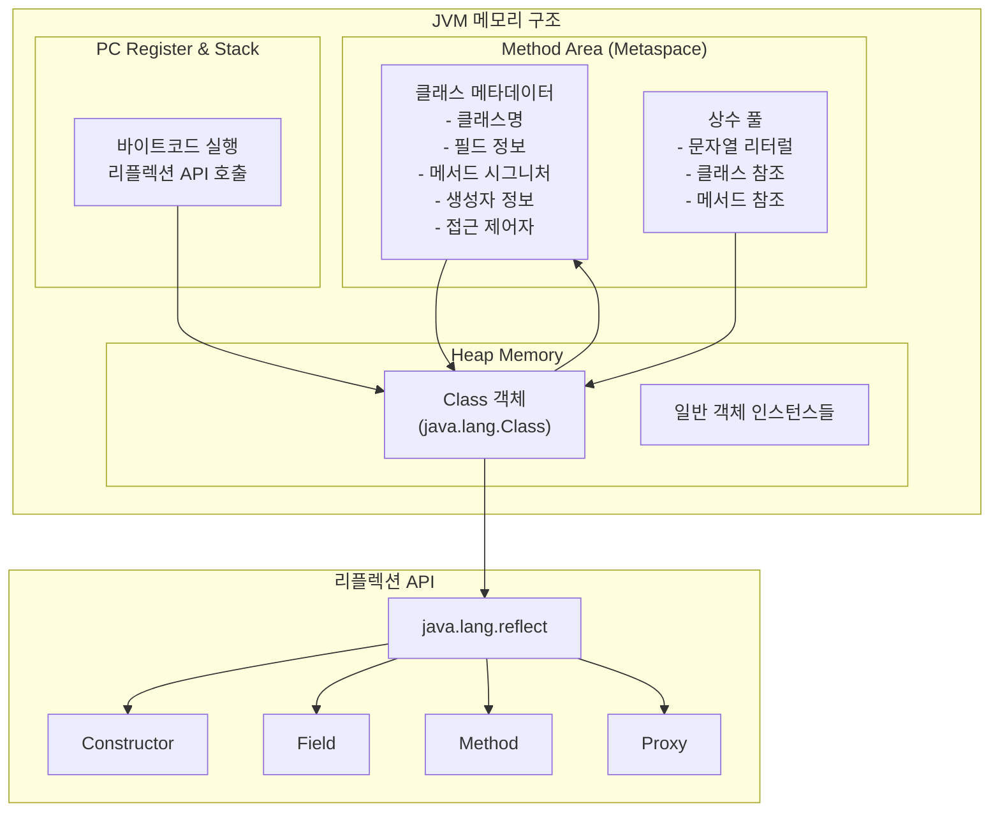
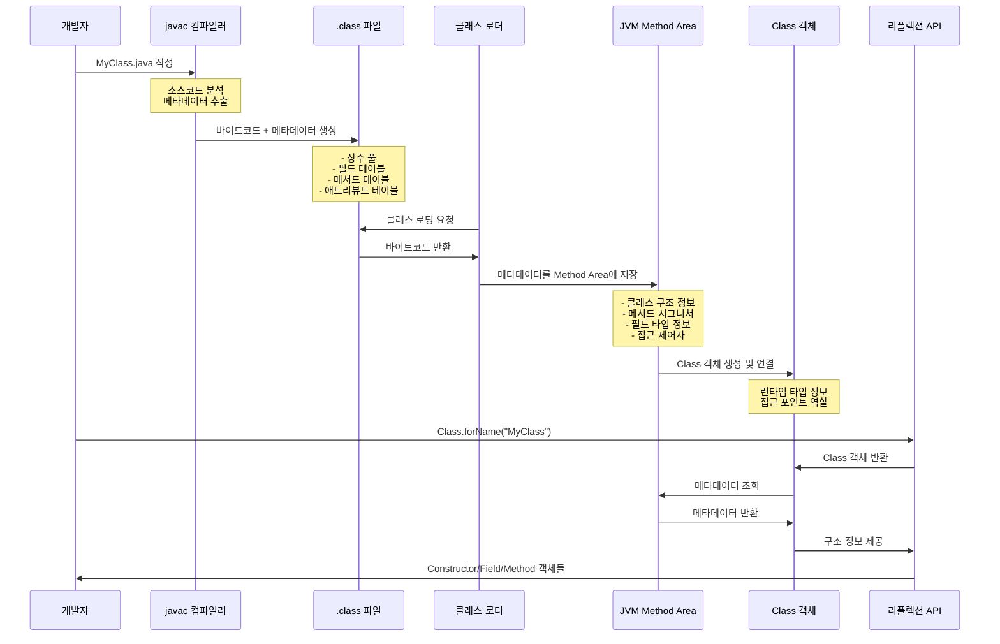
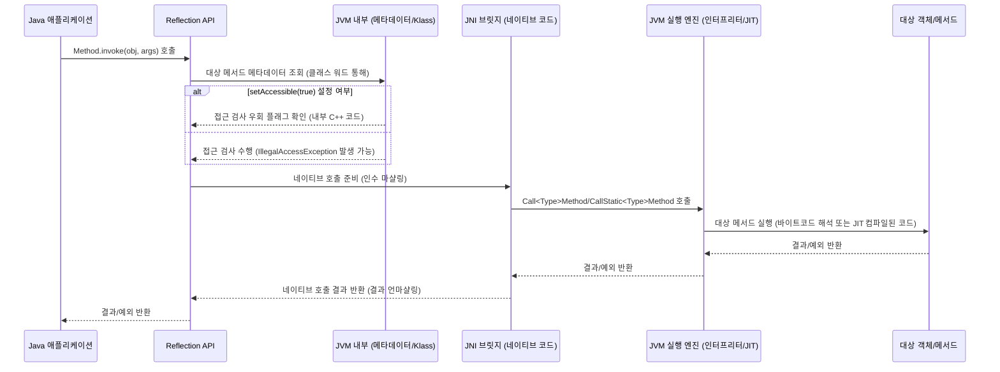

## 리플렉션의 핵심 개념

### 리플렉션이란?

자바 리플렉션은 **실행 중인 프로그램이 런타임에 자신의 구조와 동작을 검사하고 수정할 수 있도록 하는 능력**입니다. 이는 클래스, 인터페이스, 필드, 메서드, 생성자의 구조를 동적으로 탐색하고, 새로운 인스턴스를 생성하며, 필드 값을 조작하고, 메서드를 호출할 수 있는 포괄적인 기능을 제공합니다.

리플렉션은 **컴파일 시점의 제약을 런타임의 유연성으로 변환**하는 핵심 메커니즘입니다.

### 핵심 API 구성요소

`java.lang.reflect` 패키지의 핵심 클래스들은 각각 명확한 책임을 가지고 설계되었습니다:

- **Class**: 모든 리플렉션 작업의 진입점이자 타입 메타데이터의 컨테이너
- **Constructor**: 동적 객체 생성을 위한 인터페이스
- **Field**: 객체 상태에 대한 런타임 접근
- **Method**: 동적 행위 호출을 위한 메커니즘
- **Proxy**: AOP와 인터셉션 패턴의 기반

```java
// 세 가지 Class 객체 획득 방법
Class<?> clazz1 = MyClass.class;              // 컴파일 타임 안전성
Class<?> clazz2 = obj.getClass();             // 런타임 다형성
Class<?> clazz3 = Class.forName("MyClass");   // 완전한 동적 로딩
```

## JVM 아키텍처와 리플렉션의 깊은 통합

### 메모리 구조와 런타임 메타데이터

JVM이 유지하는 **풍부한 런타임 타입 정보**는 리플렉션을 가능하게 하는 핵심입니다. HotSpot JVM에서 이 메타데이터는 다음과 같이 구조화됩니다:

#### 객체 헤더 구조
- **마크 워드(Mark Word)**: 동기화, GC 정보 등 인스턴스별 메타데이터
- **클래스 워드(Klass Word)**: 타입별 메타데이터에 대한 포인터

#### 메타스페이스(Metaspace)
클래스 정의, 메서드 테이블, 필드 정보, 상수 풀 등 **공유되는 타입별 메타데이터**가 저장됩니다. 리플렉션은 본질적으로 이미 존재하는 메타데이터에 대한 **프로그래밍 방식으로 접근할 수 있는 인터페이스**를 제공하는 것입니다.



### 클래스 로딩 라이프사이클

클래스 로더 서브시스템은 **로딩, 링크, 초기화**의 3단계 프로세스를 통해 동작합니다:



#### 로딩(Loading)
부트스트랩, 확장, 시스템 클래스 로더의 **위임 계층**을 통해 .class 파일을 읽고 메서드 영역에 저장합니다.

#### 링크(Linking)
- **검증**: 바이트코드의 구조적/의미론적 정확성 확인
- **준비**: 정적 변수를 위한 메모리 할당과 기본값 초기화
- **해결**: 심볼릭 참조를 직접 참조로 변환

#### 초기화(Initialization)
정적 변수에 실제 값을 할당하고 정적 블록을 실행합니다.

## 리플렉션의 내부 동작 메커니즘: JNI와 네이티브 통합

### Class.forName(): 동적 해결의 복잡성

`Class.forName(String className)`이 호출되면, JVM은 **동적 바인딩과 해결**을 수행해야 합니다. 클래스 이름이 컴파일 타임 상수가 아닌 경우, 일반적인 정적 해결 대신 런타임에 메서드 영역을 검색하여 심볼릭 참조를 직접 참조로 변환하는 과정이 필요합니다.

이는 **컴파일 타임 바인딩을 우회**하고 JVM이 동적으로 클래스 해결을 수행하도록 강제하며, 이는 정적으로 링크된 코드에 비해 본질적인 오버헤드를 추가합니다.

### Method.invoke(): JNI 브릿지와 네이티브 전환

`Method.invoke()`를 통한 리플렉티브 메서드 호출은 **JNI를 포함하는 복잡한 작업**입니다. 이는 C++과의 상호운용성을 고려하여 설계한 핵심 메커니즘 중 하나입니다.



실제 호출 과정에서는 다음과 같은 JNI 함수들이 사용됩니다:
- `Call<Type>Method`: 인스턴스 메서드 호출
- `CallStatic<Type>Method`: 정적 메서드 호출
- `CallNonvirtual<Type>Method`: 비가상 메서드 호출

이 과정은 자바 객체를 네이티브 타입으로 **마샬링**하고, JNI 경계를 넘어 반환값과 예외를 처리하는 복잡한 작업을 포함합니다.

### Field.get()/set(): 직접 메모리 접근

필드에 대한 리플렉티브 접근도 JNI를 통해 이루어집니다:
- `Get<Type>Field`: 인스턴스 필드 읽기
- `Set<Type>Field`: 인스턴스 필드 쓰기
- `GetStatic<Type>Field`: 정적 필드 읽기
- `SetStatic<Type>Field`: 정적 필드 쓰기

`setAccessible(true)`가 활성화되면, 이는 **객체의 메모리 레이아웃을 직접 조작**하여 private 필드까지 접근할 수 있게 됩니다. 이는 자바의 고수준 안전성과 추상화를 우회하는 **저수준 메모리 조작**입니다.
