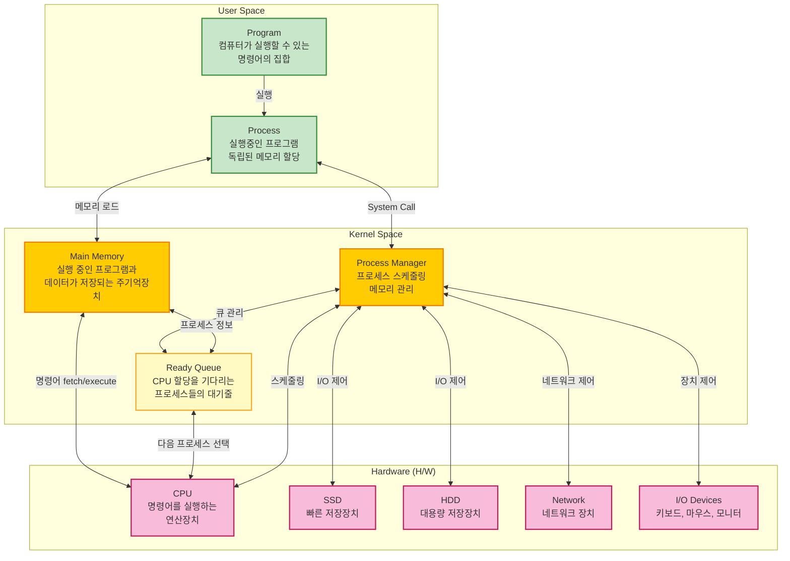
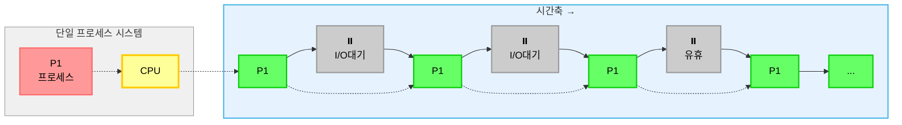
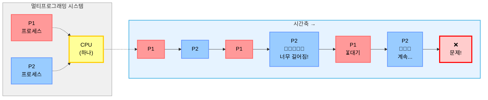
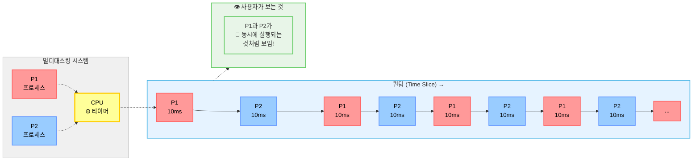
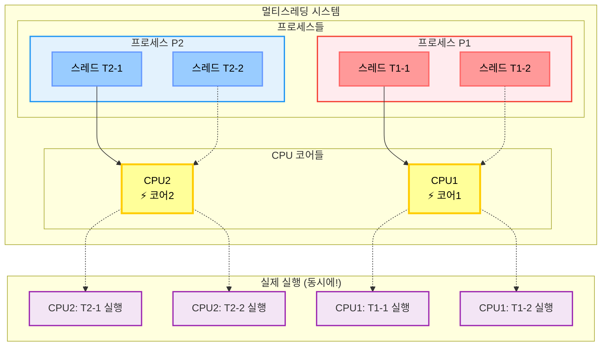
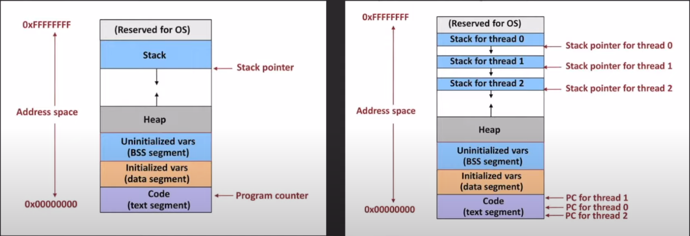

## 📚 기본 개념 정리
먼저 핵심 개념들을 정리해보겠습니다:

- program: 컴퓨터가 실행할 수 있는 명령어의 집합
- process: 실행중인 프로그램(독립된 메모리를 할당받음)
- CPU: 명령어를 실행하는 연산장치
- Main Memory: 실행 중인 프로그램과 데이터가 저장되는 주기억장치
- Ready Queue: 메모리에 있는 프로세스들 중 CPU 할당을 기다리는 프로세스들의 논리적 대기줄
- I/O (input, output): 파일을 읽고 쓰기, 네트워크, 입출력 장치
- Process Manager: 이 둘을 연결하고 관리하는 스케줄러
 
### 시스템 아키텍처

현대 컴퓨터 시스템은 크게 3개 계층으로 구분됩니다:

## 📈 프로세스 실행 방식의 진화

### 1. 단일 프로세스 (Single Process)

특징:

- 한 번에 하나의 프로그램만 실행
- CPU가 하나의 작업을 완료할 때까지 다른 작업 불가
- 초기 컴퓨터 시스템의 방식

문제점:

- I/O 작업 중에 CPU가 놀고 있음
- 전체적인 시스템 효율성이 매우 낮음

### 2. 멀티프로그래밍 (Multiprogramming)

특징:

- 메모리에 여러 프로그램을 동시에 적재
- 하나의 프로그램이 I/O 대기 시 다른 프로그램 실행
- CPU 활용률 향상이 주목적

장점:

- CPU 유휴 시간 최소화
- 전체적인 시스템 처리량 증가

문제점:

- 한 프로세스가 CPU를 독점할 수 있음
- 응답성 보장이 어려움

### 3. 멀티태스킹 (Multitasking)

특징:

- 시분할(Time Sharing) 방식으로 CPU 시간을 나누어 할당
- 매우 짧은 시간 단위(퀀텀)로 프로세스들을 번갈아가며 실행
- 사용자에게는 동시 실행처럼 보임

장점:

- 공정한 CPU 시간 분배
- 뛰어난 응답성
- 대화형 시스템 구현 가능

단점:

- 컨텍스트 스위칭 오버헤드 발생

### 4. 멀티스레딩 (Multithreading)

특징:

- 하나의 프로세스 내에서 여러 실행 흐름(스레드) 생성
- 메모리는 공유하지만 실행 스택은 독립적
- 진정한 병렬 처리 가능 (멀티코어 환경)

장점:

- 실제 동시 실행
- 메모리 공유로 효율적인 통신
- 빠른 컨텍스트 스위칭

단점:

- 동기화 문제 발생 가능
- 프로그래밍 복잡도 증가

#### Single vs Multi thread

## 참고

- [쉬운코드](https://youtu.be/QmtYKZC0lMU?si=WUm8Zwe3nbpNceSC)