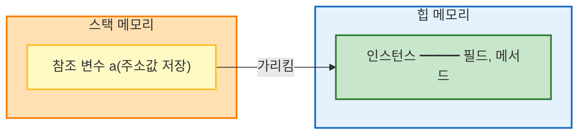
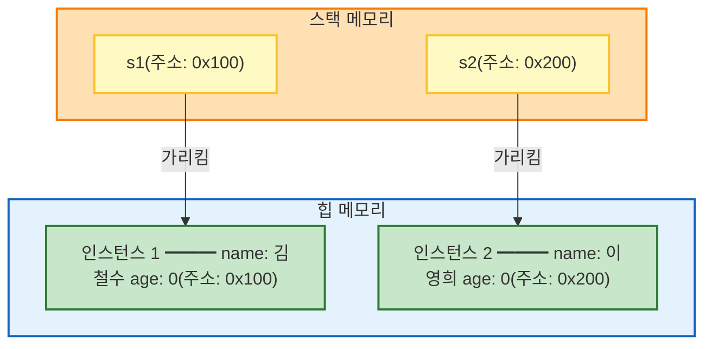
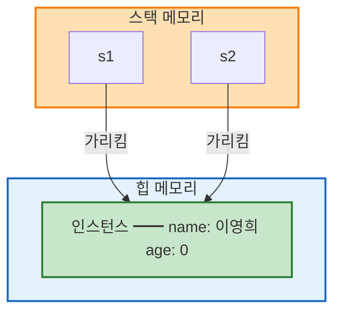
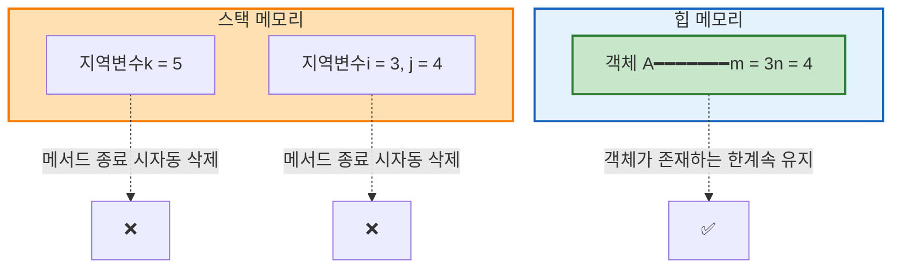

## 객체 생성의 이해

### 참조 변수와 인스턴스

```java
A a = new A();
```

이 코드를 분해하면:
- `A a`: **참조 변수(Reference Variable)** 선언
- `new A()`: **인스턴스(Instance)** 생성
- `=`: 참조 변수가 인스턴스를 가리킴



**핵심 개념**
- `a`는 **참조 변수**로, 인스턴스의 **주소**를 저장합니다
- `a`는 인스턴스 그 자체가 아닙니다
- **실제 인스턴스**는 ==힙 메모리==에 생성됩니다

### 구체적인 예시
```java
class Student {
    String name;
    int age;
}

public class Main {
    public static void main(String[] args) {
        Student s1 = new Student();  // s1은 참조 변수
        Student s2 = new Student();  // s2는 참조 변수
        
        s1.name = "김철수";
        s2.name = "이영희";
        
        System.out.println(s1);  // Student@15db9742 (주소값)
        System.out.println(s2);  // Student@6d06d69c (주소값)
    }
}
```

**메모리 구조:**


### 참조 변수를 사용하는 이유

```java
// ❌ 참조 변수 없이 객체 생성
new Student().name = "김철수";
// 위 코드는 실행되지만, 이 객체를 다시 사용할 방법이 없음!

// ✅ 참조 변수로 객체 저장
Student s = new Student();
s.name = "김철수";
s.age = 20;
// 나중에도 계속 사용 가능
```

### 참조 변수 복사

```java
Student s1 = new Student();
s1.name = "김철수";

Student s2 = s1;  // 참조 변수 복사 (인스턴스 복사 아님!)
s2.name = "이영희";

System.out.println(s1.name);  // 이영희 (같은 인스턴스를 가리킴)
System.out.println(s2.name);  // 이영희
```

**메모리 구조:**



> **주의**: `s2 = s1`은 인스턴스를 복사하는 것이 아니라, `s1`이 가리키는 주소를 `s2`에 복사하는 것입니다.

## 필드와 지역 변수

### 필드 vs 지역 변수란?

```java
class A {
    // 필드 (클래스의 중괄호 안)
    int m = 3;
    int n = 4;

    void work1() {
        // 지역 변수 (메서드의 중괄호 안)
        int k = 5;
        System.out.println(k);
        work2(3);
    }

    void work2(int i) {  // i도 지역 변수
        int j = 4;       // j도 지역 변수
        System.out.println(i + j);
    }
}
```

**필드(Field)**
- 클래스의 중괄호 `{ }` 안에 선언된 변수
- 객체의 속성값을 저장
- 힙(Heap) 메모리에 생성

**지역 변수(Local Variable)**
- 메서드의 중괄호 `{ }` 안에 선언된 변수
- 메서드 실행 중에만 사용
- 스택(Stack) 메모리에 생성

### 메모리 구조로 이해하기



**필드**와 **지역 변수**의 가장 큰 차이점은 ==생성되는 메모리의 위치==다.  
**필드**는 ==힙 메모리==의 객체 내부, **지역 변수**는 ==스택 메모리==에 생성된다.  

스택 메모리에 저장되는 변수는 때가 되면 ==자바 가상 머신이 자동으로 삭제==하지만,  
힙 메모리의 객체 안에 저장되는 필드는 ==객체가 사라지지 않는 한 절대로 삭제==되지 않는다. 

#### 그렇다면 스택 메모리의 변수는 언제 자동으로 삭제될까?

> 자신이 선언된 메서드의 중괄호가 닫혀 메서드가 종료되면,  
> 그 메서드 안에 선언된 모든 지역 변수가 메모리에서 통째로 삭제된다.

### 필드와 지역 변수의 초깃값

**필드**와 **지역 변수**의 또 다른 차이점은 초깃값이다.  

**필드**는 직접 초기화하지 않아도 강제로 초기화된다. 
반면, **지역 변수**는 직접 초기화하지 않으면 저장 공간이 빈 공간 그대로 있어 값을 출력하고자 할 때 오류가 발생한다.

```java
class A {
  int m;
  int n;

  void work1() {
    int k;
    System.out.println(k); // ❌ 초깃값 없이 출력을 시도해 컴파일 에러 발생
  }
}
```

```java
class A {
  boolean m1;
  int m2;
  double m3;
  String m4;

  void printFieldValue() {
    // 필드는 초기화하지 않아도 값이 강제 초기화돼 출력 가능
    System.out.println(m1);
    System.out.println(m2);
    System.out.println(m3);
    System.out.println(m4);
  }
}
```

## 메서드

**메서드는 클래스의 기능**에 해당하는 요소다.

```java
class A {
  // 메서드
  public static int sum(int a, int b) {
    // 메서드 내용
  }
}
```

- **리턴 타입** (`int`): 메서드가 반환하는 값의 자료형
- **메서드명** (`sum`): 소문자로 시작 (관례)
- **입력 매개변수** (`int a, int b`): 메서드 실행에 필요한 값
- **메서드 내용**: 중괄호 안에 수행할 기능 작성. 

### 메서드 호출하기

#### **클래스 외부**에서 메서드 호출하기  

**메서드**도 클래스의 **멤버**이므로 객체 안에 존재할 것이고,   
클래스 외부에서 메서드를 사용하려면 먼저 ==객체를 생성==해야 할 것이다.

```java
class A {
  // 리턴 타입 void, 입력매개변수 없음.
  void print() {
    System.out.println("안녕");
  }
}
public class ExternalCallMethods {
  public static void main(String[] args) {
    // 1. 객체 생성
    A a = new A();
    // 2. 메서드 호출(멤버 활용)
    a.print();
  }
}
```

#### **클래스 내부**에서 메서드 호출하기  

클래스 내부에 있는 메서드 끼리는 객체를 생성하지 않고 서로를 호출할 수 있다.  
말 그대로 같은 멤버이기 때문이다. 필드 또한 멤버이므로 클래스 내부의 모든 메서드 안에서 객체를 생성하지 않고 자신이 속한 클래스의 필드를 사용할 수 있다. 

```java
public class InternalCallMethods {
  public static void main(String[] args) {
    // 같은 클래스 안에 있는 내부 메서드 호출
    print();
    int a = twice(3);
    System.out.println(a);
    double b = sum(a, 5.8);
    System.out.println(b);
  }

  public static void print() {
    System.out.println("안녕");
  }

  public static int twice(int k) {
    return k * 2;
  }

  public static double sum(int m, double n) {
    return m + n;
  }
} 
```

## 생성자

생성자 `constructor`는 **객체를 생성**하는 역할을 지닌 클래스의 내부 구성 요소다.  
또한 객체 내에 포함되는 **필드의 초기화** 또한 주로 생성자 내에서 수행한다.

### 생성자의 특징

생성자를 작성할 때 꼭 지켜야 하는 문법적 규칙은 2가지다. 
- 반드시 ==클래스명과 동일한 이름==으로 지어야 한다.
- 메서드 와 비슷한 구조를 지니고 있지만, 리턴 타입이 없다.(void도 아님)
 
여기서 헷갈리지 말아야 할 것이 ‘리턴 타입이 없다.’와 ‘리턴하지 않는다(`void`).’는 전혀 다른 이야기라는 것이다.

### 기본 생성자

**생성자를 포함하지 않는 클래스**에게 **컴파일러**가 **기본 생성자를 추가한다.**

```java
class A {
  int m;

  void work() {}

  // 컴파일러가 자동으로 기본생성자를 생성
  A() {
  }
}
```

> **주의**: 생성자를 하나라도 직접 작성하면 기본 생성자는 자동 추가되지 않는다.

## `this` 키워드

**클래스 내부**에서는 객체의 생성 없이 필드와 메서드를 바로 사용할 수 있다고 했다.  

하지만 모든 멤버는 항상 객체 속에만 존재한다.  
그렇다면 어떻게 **클래스 내부에서는 객체를 생성하지 않고 바로 필드와 메서드를 사용할 수 있을까?**

### `this`란?

`this`는 ==자신이 속한 객체를 가리키는 참조 변수==입니다.  

다만 `this.`를 생략하면 ==컴파일러가 자동으로 this.를 추가해 주기 때문==에 지금까지 클래스 내부에서 필드와 메서드를 그대로 사용할 수 있던 것이다.

```java
class A {
  int m;
  int n;

  void init(int a, int b) {
    int c;
    c = 3;
    this.m = a; //this.를 생략했을 때 자동으로 추가
    this.n = b; //this.를 생략했을 때 자동으로 추가
  }

  void work() {
    this.init(2, 3); //this.를 생략했을 때 자동으로 추가
  }
}

public class ThisKeyword_1 {
  public static void main(String[] args) {
    // 클래스 객체 생성
    A a = new A();
    // 메서드 호출 / 필드값 활용
    a.work();
    System.out.println(a.m);
    System.out.println(a.n);
  }
}
```

## `this()` 메서드

`this()` 메서드는 **자신이 속한 클래스 내부**의 **다른 생성자를 호출**하는 명령이다.  

### 문법 규칙

1. **생성자의 내부**에서만 사용할 수 있다.
2. **생성자의 첫 줄**에 위치해야 한다

```java
class A {
  A() {
    System.out.println("첫 번째 생성자");
  }

  A(int a) {
    this(); // 반드시 생성자의 첫 줄에 위치해야 함.
    System.out.println("두 번째 생성자");
  }

  // 메서드에서는 this() 메서드 사용 불가능
  void abc() {
    this();
  }
}
```

이런 문법 요소가 생긴 이유는 무엇일까?  

### 생성자 중복 제거하기

`this()`를 사용하면 코드 중복을 줄일 수 있습니다.

#### Before: 코드 중복

```java
class Student {
    String name;
    int age;
    String major;
    String school;

    Student() {
        this.name = "미정";
        this.age = 0;
        this.major = "미정";
        this.school = "미정";
    }

    Student(String name) {
        this.name = name;
        this.age = 0;        // 중복
        this.major = "미정";  // 중복
        this.school = "미정"; // 중복
    }

    Student(String name, int age) {
        this.name = name;
        this.age = age;
        this.major = "미정";  // 중복
        this.school = "미정"; // 중복
    }

    Student(String name, int age, String major) {
        this.name = name;
        this.age = age;
        this.major = major;
        this.school = "미정"; // 중복
    }
}
```

#### After: `this()`로 중복 제거

```java
class Student {
    String name;
    int age;
    String major;
    String school;

    // 기본 생성자: 모든 필드 초기화
    Student() {
        this.name = "미정";
        this.age = 0;
        this.major = "미정";
        this.school = "미정";
    }

    // 나머지 생성자들은 this()로 기본 생성자 호출 후 필요한 값만 설정
    Student(String name) {
        this();           // 기본값 설정
        this.name = name; // name만 재설정
    }

    Student(String name, int age) {
        this();
        this.name = name;
        this.age = age;
    }

    Student(String name, int age, String major) {
        this();
        this.name = name;
        this.age = age;
        this.major = major;
    }
}
```

## 정리

### 필드 vs 지역 변수

| 구분     | 필드           | 지역 변수        |
|--------|--------------|--------------|
| 선언 위치  | 클래스의 `{ }` 안 | 메서드의 `{ }` 안 |
| 메모리 위치 | 힙(Heap)      | 스택(Stack)    |
| 생명 주기  | 객체가 사라질 때까지  | 메서드 종료 시 삭제  |
| 초기화    | 자동 초기화       | 수동 초기화 필수    |

### this vs this()

| 구분    | this        | this()       |
|-------|-------------|--------------|
| 의미    | 현재 객체 참조    | 다른 생성자 호출    |
| 사용 위치 | 클래스 내부 어디서나 | 생성자 첫 줄에만    |
| 목적    | 필드와 매개변수 구분 | 생성자 코드 중복 제거 |

## 참조
[Do it! 자바 완전 정복](http://www.yes24.com/Product/Goods/103389317)