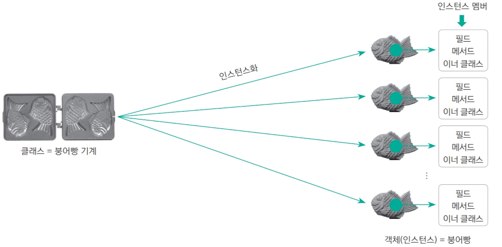

## 클래스의 개념

**객체(object )는 사용할 수 있는 실체**를 의미하며, **클래스는 객체를 만들기 위한 설계도**와 같다.   
따라서 1개의 정의된 클래스를 이용해 여러 개의 객체를 만들 수 있다.

### 클래스의 구조
```java
package ...; // ① 패키지

import ...; // ② 임포트

class 클래스명 {...} // ③ 외부 클래스

public class A {
    int a = 3; // ① 필드
    
    double abc() {...} // ② 메서드
    
    A() {...} // ③ 생성자
    
    class 클래스명 {...} // ④ 이너 클래스
}
```

### 클래스와 오브젝트 구분하기

  

김동형, ⌜Do it! 자바 완전 정복⌟, 이지스퍼블리싱, 2021, 214쪽 

- **클래스**를 붕어빵 기계에 비유한다면 **객체**는 붕어빵 기계로 찍어 낸 붕어빵에 비유할 수 있다.
- 우리는 **클래스**를 직접 사용할 수 없다. 클래스의 모든 특징(필드)과 기능(메서드)들을 사용하려면 클래스를 이용해 **객체**를 만든 후 그 객체 속의
  필드와 메서드 등 을 사용해야 하는 것이다.
- 클래스의 생성자로 객체를 만드는 과정을 `인스턴스화 instantiation`라고 하고, 인스턴스화로 만들어진 객체를 `인스턴스 instance`라고 한다.

### 붕어빵 비유를 코드로 이해하기

```java
// 클래스 (설계도)
public class 붕어빵 {
    String 속재료;
    int 온도;
}

// 객체 (실제 붕어빵들)
붕어빵 팥붕어빵 = new 붕어빵();
붕어빵 슈크림붕어빵 = new 붕어빵();
붕어빵 피자붕어빵 = new 붕어빵();
```

> **클래스**는 바로 사용할 수 없고 반드시 **객체**를 생성해 객체 안에 있는 필드, 메서드 및 이너 클래스를 사용해야 한다.

## 객체의 생성과 활용

```java
A a = new A();
```
객체는 `new` 키워드로 생성할 수 있다.   
자바에서는 대부분의 클래스가 이 방법으로 객체를 생성한다. 
클래스에 따라 메서드를 사용해 객체를 생성할 때도 있지만, 이때도 해당 메서드 내부에서 `new`를 사용해 객체를 생성한다.  
즉, 모든 클래스가 객체를 `new` 키워드로 생성한다고 볼 수 있다.

### 객체 복사: 얕은 복사 vs 깊은 복사

Java에서 객체를 복사할 때, 복사의 깊이에 따라 얕은 복사(Shallow Copy)와 깊은 복사(Deep Copy)로 나뉩니다.  
핵심 차이는 ==객체 안에 있는 또 다른 객체(참조 타입)를 어떻게 처리하느냐==에 있습니다.

### 얕은 복사 (Shallow Copy)

얕은 복사는 객체를 복사할 때, ==객체의 멤버 변수들 중 참조 변수(주소값)만 복사==하는 방식입니다.

**동작 방식**

- 새로운 객체를 만들지만, 내부 필드들이 참조하는 실제 객체는 원본과 동일한 것을 가리킵니다
- **기본형(Primitive) 타입**: 값 자체가 복사되므로 독립적입니다
- **참조형(Reference) 타입**: 주소값만 복사되므로, **원본과 복사본이 같은 내부 객체를 공유**합니다

**문제점**

- 복사본에서 내부 객체의 값을 수정하면, **원본 객체의 값도 함께 변경**되는 부작용이 발생합니다

#### 예시 코드

Java의 `Object.clone()` 메서드는 기본적으로 얕은 복사를 수행합니다.
```java
class Person implements Cloneable {
    String name;
    int[] scores; // 참조 타입 (배열)

    public Person(String name, int[] scores) {
        this.name = name;
        this.scores = scores;
    }

    @Override
    protected Object clone() throws CloneNotSupportedException {
        return super.clone(); // 기본 clone은 얕은 복사 수행
    }
}

public class Main {
    public static void main(String[] args) throws CloneNotSupportedException {
        int[] data = {100, 90};
        Person original = new Person("홍길동", data);
        
        // 얕은 복사 수행
        Person copy = (Person) original.clone();

        // 복사본의 배열 값을 변경
        copy.scores[0] = 0; 

        // 결과 확인
        System.out.println("원본: " + original.scores[0]); // 0 (원본도 바뀜!)
        System.out.println("복사본: " + copy.scores[0]);   // 0
    }
}
```

#### 메모리 구조


### 깊은 복사 (Deep Copy)

깊은 복사는 객체를 복사할 때, ==객체 내부의 모든 참조 객체까지 새로 생성하여 값을 복사==하는 방식입니다.

**동작 방식**

- 원본 객체와 복사본 객체가 메모리상에서 **완벽하게 분리**됩니다
- 참조형 타입: 단순히 주소만 복사하는 것이 아니라, 참조하고 있는 객체 자체를 새로 만들어서 할당합니다

**장점**

- 복사본을 아무리 수정해도 **원본 객체에는 전혀 영향을 주지 않습니다**

#### 구현 방법

Java에서는 깊은 복사를 기본적으로 제공하지 않으므로 직접 구현해야 합니다.

**방법 A: clone() 메서드 재정의**

```java
@Override
protected Object clone() throws CloneNotSupportedException {
    Person copy = (Person) super.clone();     // 1. 껍데기 복사 (얕은 복사)
    copy.scores = this.scores.clone();        // 2. 내부 참조 객체도 따로 복사
    return copy;
}
```

**방법 B: 복사 생성자 (권장)**
```java
public Person(Person original) {
    this.name = original.name;
    // 배열을 새로 생성하여 값만 복사
    this.scores = new int[original.scores.length];
    System.arraycopy(original.scores, 0, this.scores, 0, original.scores.length);
}
```

**사용 예시:**
```java
public class Main {
    public static void main(String[] args) {
        int[] data = {100, 90};
        Person original = new Person("홍길동", data);
        
        // 깊은 복사 수행 (복사 생성자 사용)
        Person copy = new Person(original);

        // 복사본의 배열 값을 변경
        copy.scores[0] = 0;

        // 결과 확인
        System.out.println("원본: " + original.scores[0]); // 100 (원본 유지!)
        System.out.println("복사본: " + copy.scores[0]);   // 0
    }
}
```

#### 메모리 구조


### 비교 정리

| 특징        | 얕은 복사 (Shallow Copy)  | 깊은 복사 (Deep Copy)         |
|-----------|-----------------------|---------------------------|
| **복사 대상** | 객체의 주소값 (Reference)   | 실제 데이터 (Value)            |
| **메모리**   | 원본과 내부 객체 공유          | 원본과 내부 객체 분리 (새로운 메모리 할당) |
| **속도**    | 빠름                    | 상대적으로 느림 (객체 생성 비용 발생)    |
| **원본 영향** | 복사본 수정 시 원본도 변경될 수 있음 | 복사본 수정 시 원본에 영향 없음        |
| **구현 방법** | `Object.clone()` (기본) | 복사 생성자, 직접 구현, 직렬화 등      |

## 참조

[Do it! 자바 완전 정복](http://www.yes24.com/Product/Goods/103389317)