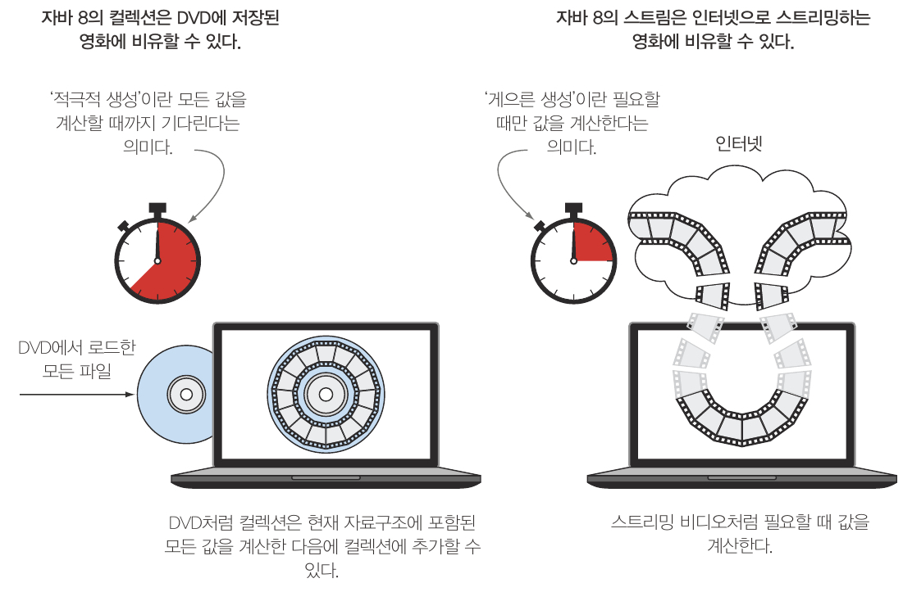

자바 스트림(java stream)은 자바8 API 에 새로 추가된 기능이다.  
스트림은 원하는 결과를 생성하기 위해 파이프라인될 수 있는 다양한 메서드를 지원하는 일련의 객체입니다.  

### Java Stream 이란?
'**데이터 처리 연산**을 지원하도록 **소스**에서 추출된 **연속된 요소(Sequence of elements)**'로 정의할 수 있다.
- 연속된 요소: 컬렉션과 마찬가지로 스트림은 특정 요소 형식으로 이루어진 연속된 값의 집합 인터페이스를 제공한다.
- 소스: 스트림은 컬렉션, 배열, I/O 자원 등의 데이터 제공 소스로부터 데이터를 소비한다.
- 데이터 처리 연산: 스트림은 함수형 프로그래밍 언어에서 일반적으로 지원하는 연산과 데이터베이스와 비슷한 연산을 지원한다.

### 스트림의 특징
- 파이프라이닝(Pipelining): 스트림 연산은 스트림 연산끼리 연결해서 커다란 파이프 라인을 구성할 수 있도록 스트림 자신을 반환한다. 
그 덕분에 게으름(laziness), 쇼트서킷(short-circuiting)같은 최적화도 얻을 수 있다.
- 내부 반복: 반복자를 이용해서 명시적으로 반복하는 `컬렉션`과 달리 `스트림`은 내부 반복을 지원한다.

### 스트림과 컬렉션
자바의 기존 컬렉션과 새로운 스트림 모두 연속된 요소 형식의 값을 저장하는 자료구조의 인터페이트를 제공한다.      
여기서 **'연속된(sequenced)'** 이라는 표현은 순서와 상관없이 아무 값에나 접속하는 것이 아니라 순차적으로 값에 접근 
한다는 것을 의미한다.  

#### 스트림과 컬렉션의 차이
**데이터를 언제 계산**하느냐가 컬렉션과 스트림의 가장 큰 차이다.  
컬렉션은 현재 자료구조가 포함하는 모든 값을 메모리에 저장하는 자료 구조이다.  
즉, 컬렉션의 모든 요소는 컬렉션에 추가하기 전에 계산되어야 한다.        
반면 스트림은 이론적으로 **요청할 때만 요소를 계산**하는 고정된 자료구조다.  

결과적으로 스트림은 생산자(producer)와 소비자(consumer)관계를 형성한다.  
게으르게 만들어지는 컬렉션과 같다. 즉, 사용자가 데이터를 요청 할 때만 값을 계산한다.   
이를 요청 중심 제조(demand-driven manufacturing) 또는 즉석 제조(just-in-time manufacturing)라고 부른다.
반면 컬렉션은 적극적(생산자 중심(supplier-driven): 팔기도 전에 창고를 가득 채움)으로 생성된다.     

    
라울-게이브리얼 우르마, ⌜모던 자바 인 액션⌟, 한빛미디어, 2019, 145쪽


### 딱 한번만 탐색할 수 있다.
```java
List<String> strings = Arrays.asList("Modern", "Java", "in", "Action");
Stream<String> stringStream = strings.stream();

// 첫번째 탐색
stringStream.forEach(System.out::println);
// 두번째 탐색 시도
// stream has already been operated upon or closed 에러 발생
stringStream.forEach(System.out::println); 
```

### 스트림 연산
스트림 인터페이스는 크게 두가지로 구분할 수 있다.
- 중간 연산(intermediate operation): 연결할 수 있는 연산
  - filter, map, limit 등이 있다.
- 최종 연산(terminal operation): 스트림을 닫는 연산
  - collect, reduce, forEach 등이 있다.  

```java
List<Dish> menus = Arrays.asList(
        new Dish("차돌박이", 100),
        new Dish("치킨", 200),
        new Dish("햄버거", 300));

List<String> names = menus.stream()
        .filter(dish -> dish.getCalories() > 200) // 중간 연산
        .map(Dish::getName) // 중간 연산
        .limit(1) // 중간 연산
        .collect(Collectors.toList()); // 최종 연산
```

## 참조

[모던 자바 인 액션](http://www.yes24.com/Product/Goods/77125987)