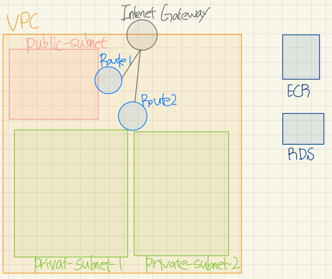

## CI/CD 배포 파이프라인 구축

### 1. health check router

배포가 되었을때 상태 확인을 위해 health check router를 만들어 준다.

```groovy
dependencies {
    implementation 'org.springframework.boot:spring-boot-starter-actuator'
}
```

```yaml
management:
  endpoints:
    health:
      show-details: always
```

### 2. AWS

{: width=40% height=40%}

### 3. Github Actions

```yaml
name: Backend CI

on:
  push:
    branches: [ dev ]

permissions:
  contents: read

jobs:
  build:
    name: CI
    runs-on: ubuntu-latest

    steps:
      - name: Pull Repository
        uses: actions/checkout@v3

      - name: Checkout private tools
        uses: actions/checkout@v3
        with:
          repository: hongmoSung/properties
          token: ${{ secrets.ACTION_TOKEN }}
          path: src/main/resources/properties
          submodules: true

      - name: Set up JDK 21
        uses: actions/setup-java@v3
        with:
          java-version: '21'
          distribution: 'temurin'

      - name: Build with Gradle
        uses: gradle/gradle-build-action@v2.10.0
        with:
          arguments: build

  deployment:
    name: CD
    runs-on: ubuntu-latest
    needs: build

    steps:
      - name: Pull Repository
        uses: actions/checkout@v3

      - name: Checkout private tools
        uses: actions/checkout@v3
        with:
          repository: hongmoSung/properties
          token: ${{ secrets.ACTION_TOKEN }}
          path: src/main/resources/properties
          submodules: true

      - name: Set up JDK 21
        uses: actions/setup-java@v3
        with:
          java-version: '21'
          distribution: 'temurin'

      - name: Build with Gradle
        uses: gradle/gradle-build-action@v2.10.0
        with:
          arguments: build

      - name: Configure AWS credentials
        uses: aws-actions/configure-aws-credentials@v1
        with:
          aws-access-key-id: ${{ secrets.AWS_ACCESS_KEY_ID }}
          aws-secret-access-key: ${{ secrets.AWS_SECRET_ACCESS_KEY }}
          aws-region: ap-northeast-2

      - name: Login to Amazon ECR
        id: login-ecr
        uses: aws-actions/amazon-ecr-login@v1

      - name: Build, tag, and push docker image to Amazon ECR
        id: build-image
        env:
          REGISTRY: ${{ steps.login-ecr.outputs.registry }}
          REPOSITORY: my-backend-ecr
          IMAGE_TAG: ${{ github.sha }}
        run: |
          docker build -t $REGISTRY/$REPOSITORY:latest .
          docker push $REGISTRY/$REPOSITORY:latest
          echo "image=$REGISTRY/$REPOSITORY:latest" >> $GITHUB_OUTPUT

      - name: Fill in the new image ID in the Amazon ECS task definition
        id: task-def
        uses: aws-actions/amazon-ecs-render-task-definition@v1
        with:
          task-definition: ./src/main/resources/properties/dev-task-definition.json
          container-name: my-backend-contatiner
          image: ${{ steps.build-image.outputs.image }}

      - name: Deploy Amazon ECS task definition
        uses: aws-actions/amazon-ecs-deploy-task-definition@v1
        with:
          task-definition: ${{ steps.task-def.outputs.task-definition }}
          service: my-ecs-service
          cluster: dev_my_cluster
          wait-for-service-stability: false

```

#### Git submodule

설정 정보들을 공개하지 않기 위해서 사용...

```shell
# 서브 모듈을 등록
git submodule add --force https://github.com/hongmoSung/private_test.git 

# 최신화
git submodule foreach git pull
```

### 느낀점

CI/CD 를 처음해봐서 너무 어려웠다.. AWS를 처음 써본것도 있지만.. 네트워크 지식이 너무 없어서 너무 많은 시간을 지체했다.  
중간에 하현우 코치님과 멘토링이 많은 도움이 되었다. 요즘 클라우드 플랫폼을 많이 사용하는데 트랜드가 블랙리스트가 아닌 화이트리스트를 많이 선택한다는 것  
그래서 네트워크를 새팅할때 허용해주는것을 잘 해야한다.(port, ip, iam 등등...)  
그리고 아예 구축을 못할 뻔했는데 같은 기수분 중에 인프라를 테라폼으로 하신분이 공유해 주셨는데 그게 많은 도움이 되었다. AWS Console 에서 직접 하는것보다 코드로 보는게 더 직관적이고 쉬웠다.

### ref

- [spring docs](https://docs.spring.io/spring-boot/docs/current/reference/html/actuator.html)
- [2023-festa-go](https://github.com/woowacourse-teams/2023-festa-go)
- [nestjs-cicd-sample](https://github.com/team-hlab/nestjs-cicd-sample)
