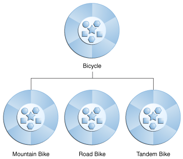

### 서로 다른 종류의 객체는 종종 서로 일정량의 공통점을 가지고 있습니다.

예를 들어 산악 자전거, 도로 자전거 및 2인용 자전거는 모두 자전거의 특성(현재 속도, 현재 페달 케이던스, 현재 기어)을 공유합니다.  
그러나 각각은 또한 그것들을 다르게 만드는 추가 기능을 정의합니다.

- 탠덤 자전거에는 두 개의 좌석과 두 세트의 핸들바가 있습니다.
- 로드 바이크에는 드롭 핸들바가 있습니다.
- 일부 산악 자전거에는 추가 체인 링이 있어 기어비가 더 낮습니다.

### 객체 지향 프로그래밍을 통해 클래스는 일반적으로 사용되는 상태와 동작을 다른 클래스에서 상속받을 수 있습니다.

이 예제에서 Bicycle 은 이제 Mountain Bike, Road Bike 및 Tandem Bike 의 상위 클래스가 됩니다.  
Java 프로그래밍 언어에서 각 클래스는 하나의 직접적인 수퍼클래스를 가질 수 있으며 각 수퍼클래스는 서브클래스를 무제한으로 가질 수 있습니다.

  

하위 클래스를 만드는 구문은 간단합니다. 클래스 선언 시작 부분에 extends 키워드를 사용하고 그 뒤에 상속할 클래스 이름을 사용합니다.

```java
class MountainBike extends Bicycle {

    // new fields and methods defining 
    // a mountain bike would go here

}
```

이렇게 하면 MountainBike 에 Bicycle 과 동일한 모든 필드와 메서드가 제공되지만 코드가 고유하게 만드는 기능에만 집중할 수 있습니다.    
이렇게 하면 하위 클래스의 코드를 쉽게 읽을 수 있습니다.    
그러나 해당 코드는 각 하위 클래스의 소스 파일에 표시되지 않으므로 각 상위 클래스가 정의하는 상태와 동작을 적절하게 문서화하도록 주의해야 합니다.

### 참조

- [What Is Inheritance?](https://docs.oracle.com/javase/tutorial/java/concepts/inheritance.html)