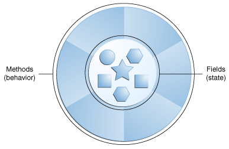

### 객체는 객체 지향(object-oriented) 기술을 이해하는 데 핵심입니다.

현실 세계에서 객체는 두 가지 특성을 공유합니다.  
state(상태), behavior(동작)을 가지고 있습니다.    
예를 들면 강아지들은 이름, 색, 품종, 배고픔의 `state(상태)`와 짖기, 물어뜯기, 꼬리 흔들기의 `behavior(행동)`이 있습니다.    
실세계 객체의 상태와 동작을 식별하는 것은 객체 지향 프로그래밍 측면에서 생각하기 시작하는 가장 좋은 방법입니다.

  

### 소프트웨어 객체는 개념적으로 실제 객체와 유사합니다.

또한 `state(상태)`, `behavior(동작)`으로 구성됩니다.  
객체는 `fields`필드(프로그래밍 언어에서 변수들 `variables`)에 state(상태)를 저장합니다.    
그리고 `method`메서드(프로그래밍 언어에서 함수들 `functions`)를 통해 behavior(동작)을 노출합니다.

`method` 메서드는 객체의 내부 상태에서 작동하며 객체 간 통신을 위한 기본 메커니즘 역할을 합니다.  
내부 상태를 숨기고 객체의 메서드를 통해 모든 상호 작용을 수행하도록 요구하는 것을 데이터 캡슐화라고 합니다. -객체 지향 프로그래밍의 기본 원칙.

### 코드를 개별 소프트웨어 객체로 묶으면 다음과 같은 여러 가지 이점이 있습니다.

1. **모듈성**: 객체의 소스 코드는 다른 개체의 소스 코드와 독립적으로 작성되고 유지 관리될 수 있습니다. 객체가 생성되면 시스템 내부에서 쉽게 전달할 수 있습니다.
2. **정보 숨기기**: 오직 객체의 메서드로 상호 작용하여 내부 구현의 세부 정보가 외부 세계에서 숨겨진 상태로 유지됩니다.
3. **코드 재사용**: 객체가 이미 존재하는 경우(아마도 다른 소프트웨어 개발자가 작성) 프로그램에서 해당 객체를 사용할 수 있습니다.
   이를 통해 전문가는 복잡한 작업별 객체를 구현/테스트/디버그할 수 있으며, 그런 다음 자신의 코드에서 실행할 수 있도록 신뢰할 수 있습니다.
4. **연결 가능성 및 디버깅 용이성**: 특정 객체에 문제가 있는 것으로 판명되면 프로그램에서 해당 개체를 간단하게 제거하고 교체 대상으로 다른 객체를 연결합니다.
   이것은 실제 세계에서 기계적인 문제를 해결하는 것과 유사합니다. 볼트가 부러지면 기계 전체가 아니라 볼트를 교체해야 합니다.

### 참조

- [What Is an Object?](https://docs.oracle.com/javase/tutorial/java/concepts/object.html)