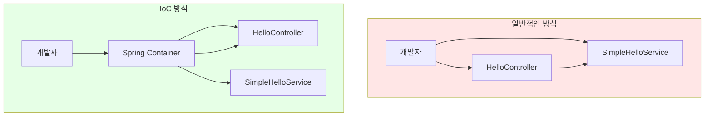
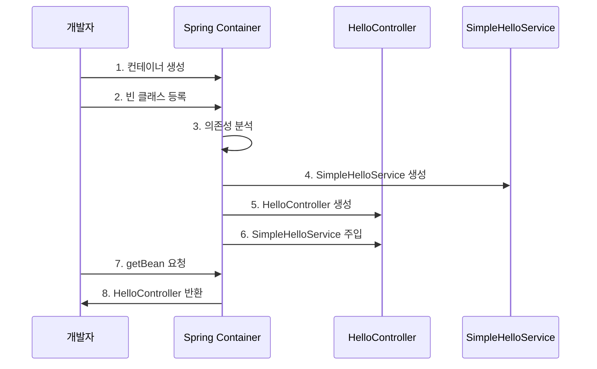
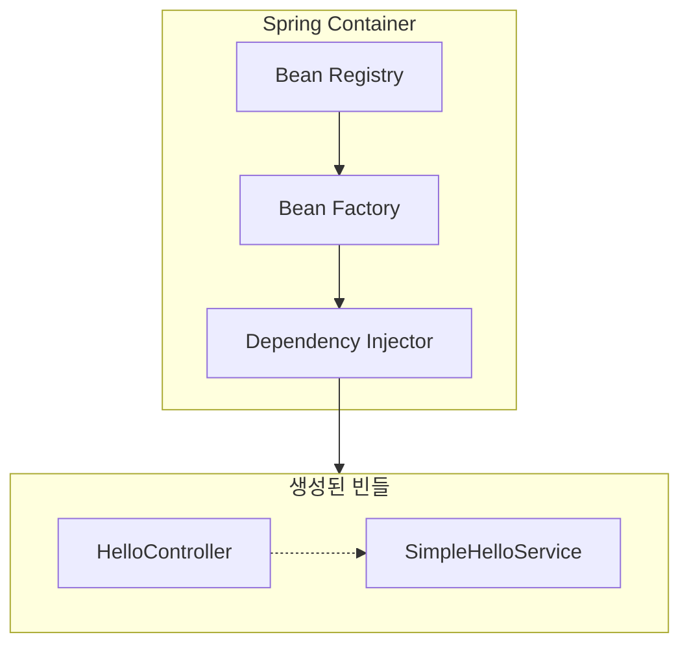
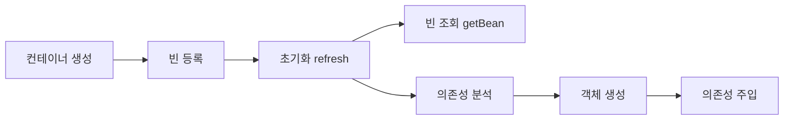

## Sample Code

```java
public class HellobootApplication {
    public static void main(String[] args) {
        // 1. IoC 컨테이너 생성
        GenericApplicationContext applicationContext = new GenericApplicationContext();

        // 2. 빈 등록 - "이 클래스들을 관리해주세요!"
        applicationContext.registerBean(HelloController.class);
        applicationContext.registerBean(SimpleHelloService.class);

        // 3. 컨테이너 초기화 - "이제 객체들을 만들어주세요!"
        applicationContext.refresh();

        // ... 웹서버 설정 ...

        // 4. 빈 조회 - "HelloController 주세요!"
        HelloController helloController = applicationContext.getBean(HelloController.class);
        String ret = helloController.hello(name);
    }
}
```

## 🔄 IoC (Inversion of Control) - 제어의 역전



### 코드에서 살펴보기

**일반적인 방식**:

```java
// 개발자가 직접 관리
HelloController controller = new HelloController();
SimpleHelloService service = new SimpleHelloService();
```

**IoC 방식**:

```java
// Spring 컨테이너가 관리
GenericApplicationContext applicationContext = new GenericApplicationContext();
applicationContext.

registerBean(HelloController .class);     // "관리해주세요"
applicationContext.

registerBean(SimpleHelloService .class);  // "관리해주세요"
applicationContext.

refresh();                               // "이제 만들어주세요"

// 필요할 때 요청
HelloController helloController = applicationContext.getBean(HelloController.class);
```

### 🎯 IoC의 핵심

**제어권이 바뀌었습니다!**

- **Before**: 개발자가 직접 `new HelloController()`
- **After**: 컨테이너가 `applicationContext.getBean()`

**비유**:

- **일반적인 방식**: 내가 직접 요리하기
- **IoC 방식**: 요리사(Spring 컨테이너)에게 주문하고 받아먹기

## 💉 DI (Dependency Injection) - 의존성 주입



### HelloController는 SimpleHelloService가 필요해요!

```java
public class HelloController {
    // SimpleHelloService가 필요합니다! (의존성)
    public String hello(String name) {
        // 여기서 SimpleHelloService를 어떻게 얻을까요?
        return "Hello " + name;
    }
}
```

**문제**: HelloController가 SimpleHelloService를 어떻게 얻을까요?

### ❌ 잘못된 방법: 직접 생성

```java
public class HelloController {
    public String hello(String name) {
        // 매번 새로 생성 - 메모리 낭비!
        SimpleHelloService service = new SimpleHelloService();
        return service.sayHello(name);
    }
}
```

**문제점**:

- 매번 새 객체 생성 (메모리 낭비)
- HelloController가 SimpleHelloService에 강하게 결합
- 테스트하기 어려움
- 다른 서비스로 바꾸기 어려움

## 🎯 DI의 세 가지 방법


```mermaid
flowchart TD
    subgraph Constructor["생성자 주입 - 추천"]
        C1[HelloController 생성시]
        C2[파라미터로 주입]
        C3[final 필드 설정]
        C1 --> C2 --> C3
    end
    
    subgraph Field["필드 주입"]
        F1[HelloController 생성]
        F2[@Autowired 애노테이션]
        F3[필드 직접 설정]
        F1 --> F2 --> F3
    end
    
    subgraph Setter["세터 주입"]
        S1[HelloController 생성]
        S2[세터 메서드 호출]
        S3[필드 설정]
        S1 --> S2 --> S3
    end
```

### 1. 생성자 주입 (Constructor Injection) ⭐ **추천!**

```java
public class HelloController {
    private final SimpleHelloService helloService;  // final 사용 가능!

    // 생성자를 통해 의존성 주입받기
    public HelloController(SimpleHelloService helloService) {
        this.helloService = helloService;
    }

    public String hello(String name) {
        return helloService.sayHello(name);  // 주입받은 서비스 사용
    }
}
```

**Spring 컨테이너가 하는 일**:

```java
// 1. SimpleHelloService 생성
SimpleHelloService service = new SimpleHelloService();

// 2. HelloController 생성하면서 서비스 주입
HelloController controller = new HelloController(service);

// 3. 컨테이너에 저장
applicationContext에 저장
```

**장점**:

- ✅ **불변성 보장**: `final` 키워드 사용 가능
- ✅ **필수 의존성 명시**: 생성자 파라미터로 명확히 표현
- ✅ **테스트 용이**: `new HelloController(mockService)` 가능
- ✅ **순환 참조 조기 발견**: 애플리케이션 기동 시점에 즉시 실패 (`BeanCurrentlyInCreationException`)

### 2. 필드 주입 (Field Injection) ⚠️ **주의**

```java
public class HelloController {
    @Autowired
    private SimpleHelloService helloService;  // 필드에 직접 주입

    public String hello(String name) {
        return helloService.sayHello(name);
    }
}
```

**Spring 컨테이너가 하는 일**:

```java
// 1. HelloController 생성 (빈 생성자로)
HelloController controller = new HelloController();

// 2. Reflection으로 필드에 주입
// controller.helloService = applicationContext.getBean(SimpleHelloService.class);
```

**장점**:

- ✅ 코드가 간결함

**단점**:

- ❌ `final` 사용 불가 (불변성 보장 안됨)
- ❌ 테스트하기 어려움 (Reflection 필요)
- ❌ 의존성이 숨겨짐 (얼마나 많은 의존성이 있는지 모름)

### 3. 세터 주입 (Setter Injection) 🤔 **선택적 사용**

```java
public class HelloController {
    private SimpleHelloService helloService;

    @Autowired
    public void setHelloService(SimpleHelloService helloService) {
        this.helloService = helloService;
    }

    public String hello(String name) {
        return helloService.sayHello(name);
    }
}
```

**Spring 컨테이너가 하는 일**:

```java
// 1. HelloController 생성
HelloController controller = new HelloController();

// 2. setter 메서드 호출하여 주입
controller.setHelloService(
   applicationContext.getBean(SimpleHelloService.class)
);
```

**장점**:

- ✅ **선택적 의존성**: 꼭 필요하지 않은 의존성 표현 가능
- ✅ **런타임 변경**: 실행 중에 의존성 교체 가능

**단점**:

- ❌ `final` 사용 불가
- ❌ 의존성 누락 위험 (setter를 호출하지 않을 수 있음)

## 🏭 Spring 컨테이너의 생명주기

### Container 내부 구조






코드에서 일어나는 일을 단계별로 살펴보세요:

### 1단계: 컨테이너 생성

```java
GenericApplicationContext applicationContext = new GenericApplicationContext();
```

**컨테이너**: "안녕하세요! 객체 관리 서비스 시작합니다!"

### 2단계: 빈 등록

```java
applicationContext.registerBean(HelloController .class);
applicationContext.registerBean(SimpleHelloService .class);
```

**컨테이너**: "HelloController와 SimpleHelloService를 등록했습니다!"

### 3단계: 의존성 분석 및 객체 생성

```java
applicationContext.refresh();
```

**컨테이너의 분석**:

```shell
"음... HelloController 생성자를 보니 SimpleHelloService가 필요하네요.
1. 먼저 SimpleHelloService를 만들고
2. 그다음 HelloController를 만들면서 SimpleHelloService를 주입해주겠습니다!"
```

### 4단계: 빈 조회

```java
HelloController helloController = applicationContext.getBean(HelloController.class);
```

**컨테이너**: "이미 만들어놓은 HelloController를 드립니다!"

## 🎯 핵심 정리

### IoC (제어의 역전)

```java
// 여러분의 코드에서
GenericApplicationContext applicationContext = 
        new GenericApplicationContext();
// 컨테이너가 관리!
pplicationContext.registerBean(HelloController.class);  
```

**제어권이 개발자 → Spring 컨테이너로 이동**

### DI (의존성 주입)

**필요한 의존성을 외부에서 넣어줌**

```java
// HelloController가 SimpleHelloService를 주입받음
public HelloController(SimpleHelloService helloService) {
    this.helloService = helloService;  // 외부에서 주입받음!
}
```

## Ref

[토비-스프링부트-이해와원리](https://www.inflearn.com/course/토비-스프링부트-이해와원리)
