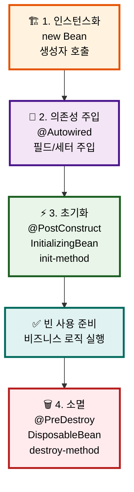
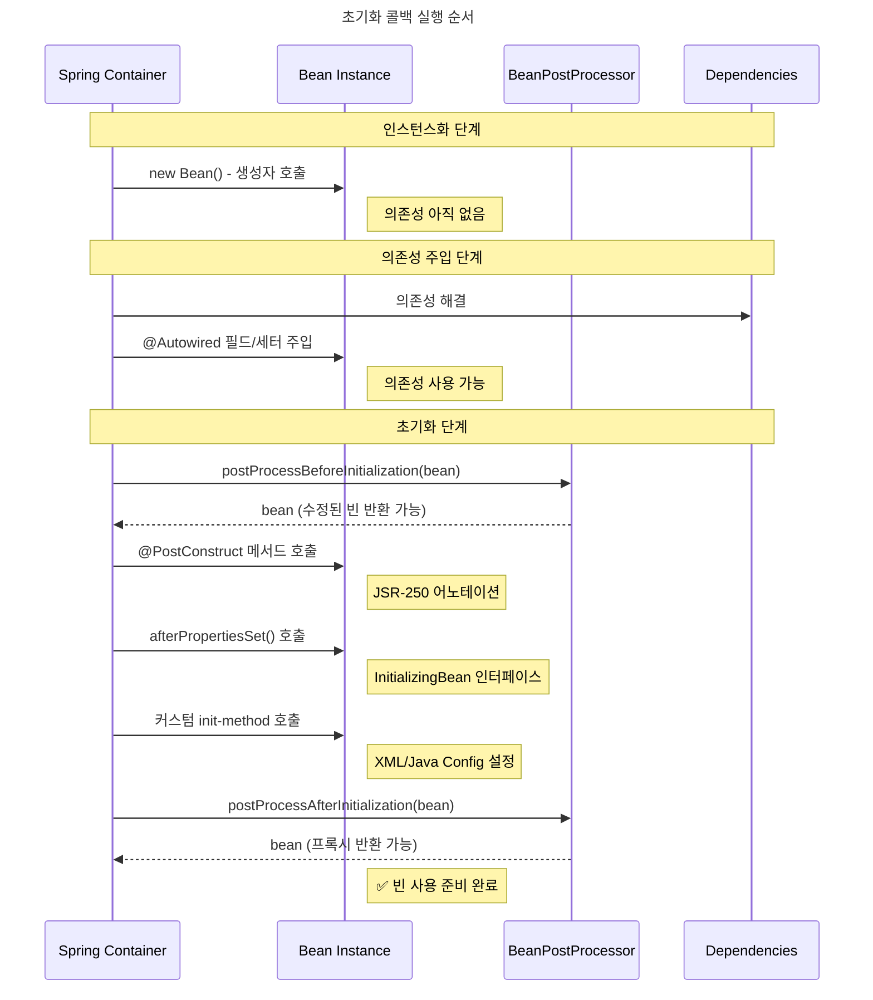

## 개요

스프링의 IoC(Inversion of Control) 컨테이너는 Java의 가비지 컬렉션처럼 **객체의 생명주기를 자동으로 관리**합니다. 개발자는 더 이상 언제 객체를 생성하고 소멸시킬지 걱정할 필요가 없습니다.

### 왜 생명주기 관리가 중요한가?

🏠 **식당 운영에 비유하면:**
- **준비 단계**: 식당 건물 짓기 (인스턴스화)
- **설비 설치**: 주방기구, 테이블 배치 (의존성 주입)
- **오픈 준비**: 직원 교육, 메뉴 준비 (초기화)
- **영업 종료**: 정리, 청소, 문 잠그기 (소멸)

각 단계를 올바른 순서로 진행해야 식당이 제대로 운영되는 것처럼, 빈도 올바른 생명주기를 거쳐야 합니다.

## 스프링 빈 생명주기 4단계



### 1단계: 인스턴스화 (Instantiation) 🏗️

```java
// 스프링이 내부적으로 수행
MyService service = new MyService(); // 생성자 호출
```

- **언제**: 가장 첫 번째 단계
- **무엇을**: 메모리에 객체 인스턴스 생성
- **특징**: 아직 의존성이 주입되지 않은 상태

### 2단계: 의존성 주입 (Dependency Injection) 🔌

```java
// 스프링이 내부적으로 수행
service.setUserRepository(userRepository);  // 세터 주입
// 또는 @Autowired 필드에 값 할당
```

- **언제**: 인스턴스화 직후
- **무엇을**: 필요한 의존성들을 주입
- **특징**: 이제 협력 객체들과 연결된 상태

### 3단계: 초기화 (Initialization) ⚡

```java
// 개발자가 정의한 초기화 로직 실행
@PostConstruct
public void init() {
    // 초기화 로직
}
```

- **언제**: 의존성 주입 완료 후
- **무엇을**: 개발자가 정의한 초기화 로직 실행
- **특징**: 모든 의존성을 사용할 수 있는 상태

### 4단계: 소멸 (Destruction) 🗑️

```java
// 개발자가 정의한 정리 로직 실행
@PreDestroy
public void cleanup() {
    // 정리 로직
}
```

- **언제**: 컨테이너 종료 시 또는 빈 스코프 종료 시
- **무엇을**: 개발자가 정의한 정리 로직 실행
- **특징**: 자원 해제, 연결 닫기 등

## 콜백 (Callback)

### 💡 콜백(Callback)이란?

**콜백은 "약속된 시점에 자동으로 울리는 알람"입니다.**   
스프링 컨테이너가 빈의 생명주기를 관리하면서, 특정 순간(초기화 완료 시점, 소멸 직전 등)에 개발자가 미리 정의해둔 메서드를 자동으로 호출해주는 메커니즘입니다.

예를 들어 `@PostConstruct`는 "의존성 주입이 끝나면 이 메서드를 호출해줘!"라고 스프링에게 미리 약속하는 것이죠.   
마치 "아침 7시가 되면 알람 울려줘!"와 같은 원리입니다. ⏰

### 초기화 콜백 순서도




### 1. JSR-250 어노테이션 (✅ 권장)

```java
@Component
public class RestaurantService {
    
    @PostConstruct  // 초기화
    public void openRestaurant() {
        System.out.println("🍽️ 식당 오픈 준비 완료!");
    }
    
    @PreDestroy     // 소멸
    public void closeRestaurant() {
        System.out.println("🔒 식당 문 닫고 정리 완료!");
    }
}
```

**장점**:
- 표준 API (이식성 좋음)
- 스프링에 종속되지 않음
- 코드가 깔끔함

### 2. 스프링 인터페이스

```java
@Component
public class RestaurantService implements InitializingBean, DisposableBean {
    
    @Override
    public void afterPropertiesSet() throws Exception {
        System.out.println("🍽️ 초기화: 모든 설정 완료!");
    }
    
    @Override
    public void destroy() throws Exception {
        System.out.println("🔒 소멸: 정리 작업 완료!");
    }
}
```

**특징**:
- 스프링에 종속됨
- 명시적인 인터페이스 계약
- 컴파일 시점에 검증 가능

## 실행 순서

### 초기화 순서 📊

| 순서 | 단계 | 코드 예시 | 의존성 사용 | 주의사항 |
|------|------|-----------|-------------|----------|
| 1 | 생성자 | `new Bean()` | ❌ | 의존성 사용 금지 |
| 2 | 의존성 주입 | `@Autowired` | ❌ | 스프링이 자동 처리 |
| 3 | @PostConstruct | `@PostConstruct` | ✅ | **권장 방식** |
| 4 | InitializingBean | `afterPropertiesSet()` | ✅ | 스프링 종속 |
| 5 | init-method | `@Bean(initMethod)` | ✅ | 외부 라이브러리용 |

### 소멸 순서 📊

| 순서 | 단계 | 코드 예시 | 사용 시기 | 특징 |
|------|------|-----------|-----------|------|
| 1 | @PreDestroy | `@PreDestroy` | **권장 방식** | 표준 API |
| 2 | DisposableBean | `destroy()` | 레거시/특수 | 스프링 종속 |
| 3 | destroy-method | `@Bean(destroyMethod)` | 외부 라이브러리 | 설정 기반 |

## 실습 예제

### 예제 1: 기본 생명주기

```java
@Component
public class CoffeeShop {
    // 1. 생성자
    public CoffeeShop() {
        System.out.println("☕ 1단계: 카페 건물 완성 (생성자)");
    }
    // 2. 의존성 주입 후 초기화
    @PostConstruct
    public void openCafe() {
        System.out.println("☕ 3단계: 카페 오픈 준비 완료!");
    }
    // 4. 소멸 전 정리
    @PreDestroy
    public void closeCafe() {
        System.out.println("☕ 4단계: 카페 문 닫기");
    }
}
```

### 예제 2: 모든 콜백 메커니즘 비교

```java
@Component
public class LifecycleDemo implements InitializingBean, DisposableBean {
    // 생성자
    public LifecycleDemo() {
        System.out.println("1️⃣ 생성자 호출 - 객체 생성");
    }
    // JSR-250 어노테이션
    @PostConstruct
    public void postConstruct() {
        System.out.println("3️⃣ @PostConstruct - JSR-250 초기화");
    }
    // 스프링 인터페이스
    @Override
    public void afterPropertiesSet() throws Exception {
        System.out.println("4️⃣ afterPropertiesSet() - 스프링 인터페이스 초기화");
    }
    // JSR-250 어노테이션
    @PreDestroy
    public void preDestroy() {
        System.out.println("5️⃣ @PreDestroy - JSR-250 소멸");
    }
    // 스프링 인터페이스
    @Override
    public void destroy() throws Exception {
        System.out.println("6️⃣ destroy() - 스프링 인터페이스 소멸");
    }
}
```

### 예제 3: 실행 순서 확인용 테스트

```java
@SpringBootTest
class BeanLifecycleTest {
    
    @Test
    void beanLifecycleOrder() {
        System.out.println("=== 스프링 컨텍스트 시작 ===");
        // 스프링 컨텍스트가 시작되면서 빈들의 생명주기가 시작됩니다
        // 로그를 통해 순서를 확인할 수 있습니다
    }
}
```

**예상 로그 출력:**

```java
1️⃣ 생성자 호출 - 객체 생성
3️⃣ @PostConstruct - JSR-250 초기화
4️⃣ afterPropertiesSet() - 스프링 인터페이스 초기화
=== 스프링 컨텍스트 시작 ===
...
5️⃣ @PreDestroy - JSR-250 소멸
6️⃣ destroy() - 스프링 인터페이스 소멸
```

## 결론

스프링 빈 생명주기의 핵심은 "생성자에서는 의존성 사용 금지, @PostConstruct부터 안전하게 사용 가능"입니다.
@PostConstruct로 초기화, @PreDestroy로 자원 정리만 확실히 알면 실무의 80% 문제를 해결할 수 있습니다.
