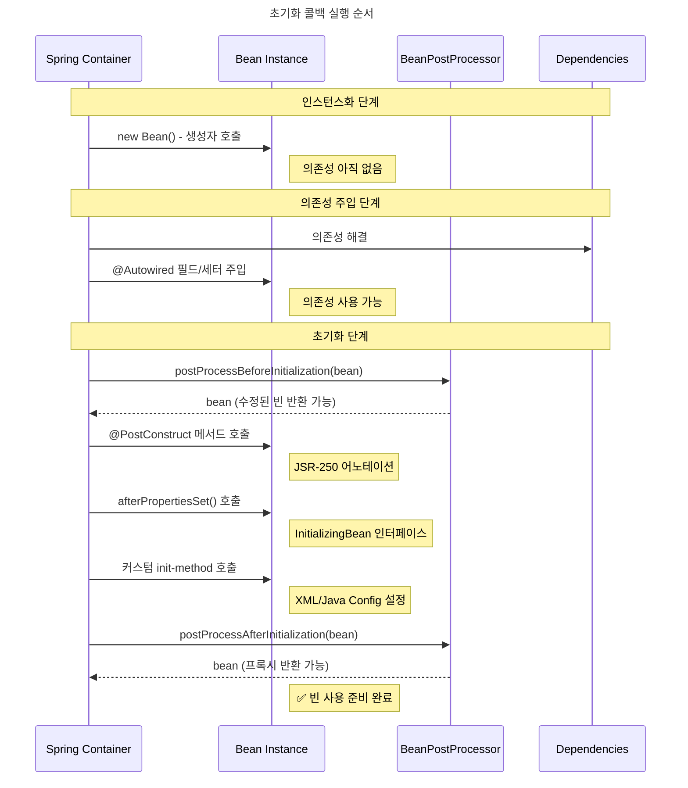
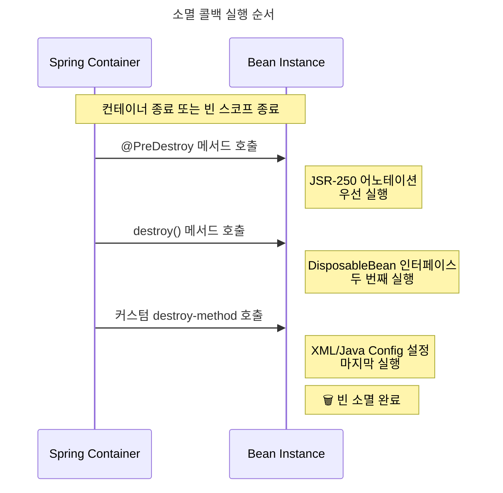
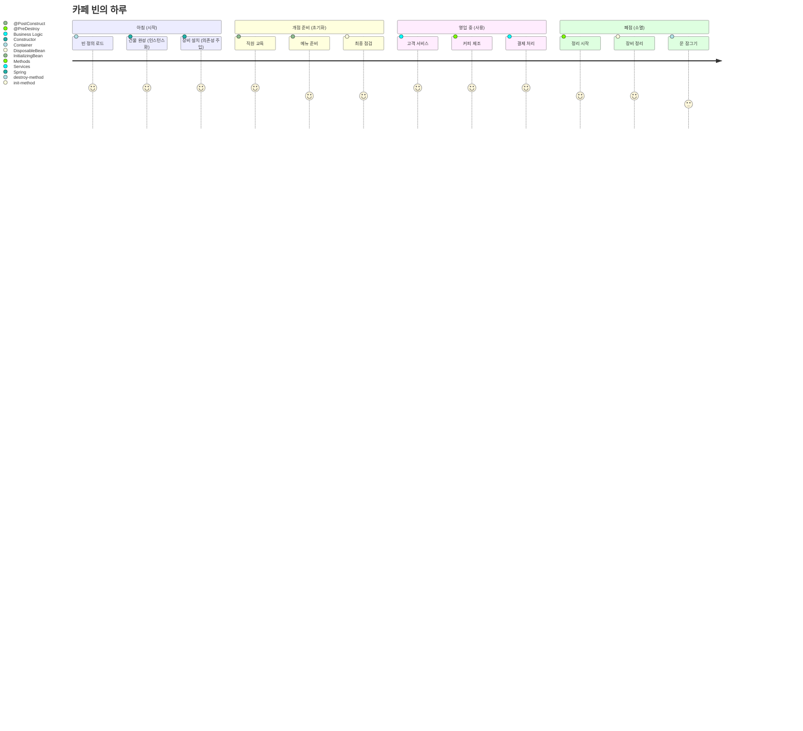
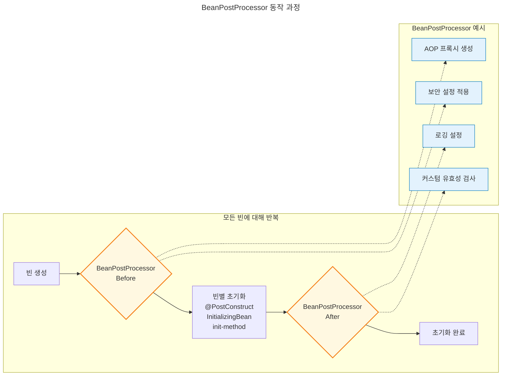
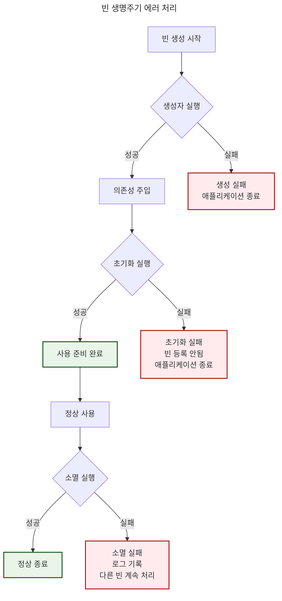

# 스프링 빈 생명주기 완전 가이드

## 개요

스프링의 IoC(Inversion of Control) 컨테이너는 Java의 가비지 컬렉션처럼 **객체의 생명주기를 자동으로 관리**합니다. 개발자는 더 이상 언제 객체를 생성하고 소멸시킬지 걱정할 필요가 없습니다.

### 왜 생명주기 관리가 중요한가?

🏠 **식당 운영에 비유하면:**
- **준비 단계**: 식당 건물 짓기 (인스턴스화)
- **설비 설치**: 주방기구, 테이블 배치 (의존성 주입)
- **오픈 준비**: 직원 교육, 메뉴 준비 (초기화)
- **영업 종료**: 정리, 청소, 문 잠그기 (소멸)

각 단계를 올바른 순서로 진행해야 식당이 제대로 운영되는 것처럼, 빈도 올바른 생명주기를 거쳐야 합니다.

## 스프링 빈 생명주기 4단계

### 1단계: 인스턴스화 (Instantiation) 🏗️

```java
// 스프링이 내부적으로 수행
MyService service = new MyService(); // 생성자 호출
```

- **언제**: 가장 첫 번째 단계
- **무엇을**: 메모리에 객체 인스턴스 생성
- **특징**: 아직 의존성이 주입되지 않은 상태

### 2단계: 의존성 주입 (Dependency Injection) 🔌

```java
// 스프링이 내부적으로 수행
service.setUserRepository(userRepository);  // 세터 주입
// 또는 @Autowired 필드에 값 할당
```

- **언제**: 인스턴스화 직후
- **무엇을**: 필요한 의존성들을 주입
- **특징**: 이제 협력 객체들과 연결된 상태

### 3단계: 초기화 (Initialization) ⚡

```java
// 개발자가 정의한 초기화 로직 실행
@PostConstruct
public void init() {
    // 초기화 로직
}
```

- **언제**: 의존성 주입 완료 후
- **무엇을**: 개발자가 정의한 초기화 로직 실행
- **특징**: 모든 의존성을 사용할 수 있는 상태

### 4단계: 소멸 (Destruction) 🗑️

```java
// 개발자가 정의한 정리 로직 실행
@PreDestroy
public void cleanup() {
    // 정리 로직
}
```

- **언제**: 컨테이너 종료 시 또는 빈 스코프 종료 시
- **무엇을**: 개발자가 정의한 정리 로직 실행
- **특징**: 자원 해제, 연결 닫기 등

## 콜백 메커니즘 상세

### 1. JSR-250 어노테이션 (✅ 권장)

```java
@Component
public class RestaurantService {
    
    @PostConstruct  // 초기화
    public void openRestaurant() {
        System.out.println("🍽️ 식당 오픈 준비 완료!");
    }
    
    @PreDestroy     // 소멸
    public void closeRestaurant() {
        System.out.println("🔒 식당 문 닫고 정리 완료!");
    }
}
```

**장점**:
- 표준 API (이식성 좋음)
- 스프링에 종속되지 않음
- 코드가 깔끔함

### 2. 스프링 인터페이스

```java
@Component
public class RestaurantService implements InitializingBean, DisposableBean {
    
    @Override
    public void afterPropertiesSet() throws Exception {
        System.out.println("🍽️ 초기화: 모든 설정 완료!");
    }
    
    @Override
    public void destroy() throws Exception {
        System.out.println("🔒 소멸: 정리 작업 완료!");
    }
}
```

**특징**:
- 스프링에 종속됨
- 명시적인 인터페이스 계약
- 컴파일 시점에 검증 가능

### 3. 커스텀 메서드 (설정 기반)

```java
@Configuration
public class AppConfig {
    
    @Bean(initMethod = "customInit", destroyMethod = "customDestroy")
    public ThirdPartyService thirdPartyService() {
        return new ThirdPartyService();
    }
}

// 타사 라이브러리 클래스 (수정 불가)
public class ThirdPartyService {
    public void customInit() {
        System.out.println("🔧 타사 서비스 초기화");
    }
    
    public void customDestroy() {
        System.out.println("🔧 타사 서비스 종료");
    }
}
```

**언제 사용**:
- 소스코드를 수정할 수 없는 타사 라이브러리
- 설정에서 생명주기를 외부적으로 관리하고 싶을 때

## 실행 순서

### 초기화 순서 📊

| 순서 | 메커니즘 | 시점 | 의존성 사용 가능 |
|------|----------|------|------------------|
| 1 | 생성자 | 인스턴스화 | ❌ (생성자 파라미터만) |
| 2 | BeanPostProcessor.before | 초기화 전 | ✅ |
| 3 | @PostConstruct | 초기화 | ✅ |
| 4 | InitializingBean.afterPropertiesSet() | 초기화 | ✅ |
| 5 | 커스텀 init-method | 초기화 | ✅ |
| 6 | BeanPostProcessor.after | 초기화 후 | ✅ |

### 소멸 순서 📊

| 순서 | 메커니즘 | 시점 |
|------|----------|------|
| 1 | @PreDestroy | 소멸 |
| 2 | DisposableBean.destroy() | 소멸 |
| 3 | 커스텀 destroy-method | 소멸 |

## 실습 예제

### 예제 1: 기본 생명주기

```java
@Component
@Slf4j
public class CoffeeShop {
    
    @Autowired
    private CoffeeMachine coffeeMachine;
    
    @Autowired
    private PaymentService paymentService;
    
    // 1. 생성자
    public CoffeeShop() {
        log.info("☕ 1단계: 카페 건물 완성 (생성자)");
    }
    
    // 2. 의존성 주입 후 초기화
    @PostConstruct
    public void openCafe() {
        log.info("☕ 3단계: 카페 오픈 준비 완료!");
        log.info("   - 커피머신 상태: {}", coffeeMachine != null ? "준비됨" : "없음");
        log.info("   - 결제시스템 상태: {}", paymentService != null ? "준비됨" : "없음");
        
        // 의존성을 활용한 초기화 로직
        coffeeMachine.warmUp();
        paymentService.connect();
    }
    
    // 4. 소멸 전 정리
    @PreDestroy
    public void closeCafe() {
        log.info("☕ 4단계: 카페 문 닫기");
        coffeeMachine.shutdown();
        paymentService.disconnect();
    }
    
    public void serveCoffee(String customerName) {
        log.info("☕ {}님께 커피 제공", customerName);
    }
}
```

### 예제 2: 모든 콜백 메커니즘 비교

```java
@Component
@Slf4j
public class LifecycleDemo implements InitializingBean, DisposableBean {
    
    @Autowired
    private DatabaseService databaseService;
    
    // 생성자
    public LifecycleDemo() {
        log.info("1️⃣ 생성자 호출 - 객체 생성");
    }
    
    // JSR-250 어노테이션
    @PostConstruct
    public void postConstruct() {
        log.info("3️⃣ @PostConstruct - JSR-250 초기화");
    }
    
    // 스프링 인터페이스
    @Override
    public void afterPropertiesSet() throws Exception {
        log.info("4️⃣ afterPropertiesSet() - 스프링 인터페이스 초기화");
    }
    
    // JSR-250 어노테이션
    @PreDestroy
    public void preDestroy() {
        log.info("5️⃣ @PreDestroy - JSR-250 소멸");
    }
    
    // 스프링 인터페이스
    @Override
    public void destroy() throws Exception {
        log.info("6️⃣ destroy() - 스프링 인터페이스 소멸");
    }
}
```

### 예제 3: 실제 사용 사례 - 데이터베이스 커넥션 풀

```java
@Component
@Slf4j
public class DatabaseConnectionManager {
    
    private HikariDataSource dataSource;
    private boolean isConnected = false;
    
    @Value("${database.url}")
    private String databaseUrl;
    
    @Value("${database.username}")
    private String username;
    
    @Value("${database.password}")
    private String password;
    
    @PostConstruct
    public void initializeConnectionPool() {
        try {
            log.info("🔗 데이터베이스 커넥션 풀 초기화 시작");
            
            HikariConfig config = new HikariConfig();
            config.setJdbcUrl(databaseUrl);
            config.setUsername(username);
            config.setPassword(password);
            config.setMaximumPoolSize(10);
            config.setMinimumIdle(2);
            config.setConnectionTimeout(30000);
            
            dataSource = new HikariDataSource(config);
            isConnected = true;
            
            log.info("✅ 데이터베이스 커넥션 풀 초기화 완료");
            
        } catch (Exception e) {
            log.error("❌ 데이터베이스 커넥션 풀 초기화 실패", e);
            throw new RuntimeException("데이터베이스 연결 실패", e);
        }
    }
    
    @PreDestroy
    public void closeConnectionPool() {
        if (dataSource != null && !dataSource.isClosed()) {
            log.info("🔌 데이터베이스 커넥션 풀 종료 시작");
            dataSource.close();
            isConnected = false;
            log.info("✅ 데이터베이스 커넥션 풀 종료 완료");
        }
    }
    
    public Connection getConnection() throws SQLException {
        if (!isConnected) {
            throw new IllegalStateException("데이터베이스가 연결되지 않았습니다");
        }
        return dataSource.getConnection();
    }
    
    public boolean isHealthy() {
        return isConnected && !dataSource.isClosed();
    }
}
```

### 예제 4: BeanPostProcessor 활용

```java
@Component
@Slf4j
public class LoggingBeanPostProcessor implements BeanPostProcessor {
    
    @Override
    public Object postProcessBeforeInitialization(Object bean, String beanName) 
            throws BeansException {
        if (bean.getClass().getPackage().getName().startsWith("com.example")) {
            log.info("🔧 빈 초기화 전: {} ({})", beanName, bean.getClass().getSimpleName());
        }
        return bean;
    }
    
    @Override
    public Object postProcessAfterInitialization(Object bean, String beanName) 
            throws BeansException {
        if (bean.getClass().getPackage().getName().startsWith("com.example")) {
            log.info("✅ 빈 초기화 완료: {} ({})", beanName, bean.getClass().getSimpleName());
        }
        return bean;
    }
}
```

### 예제 5: 실행 순서 확인용 테스트

```java
@SpringBootTest
@Slf4j
class BeanLifecycleTest {
    
    @Test
    void beanLifecycleOrder() {
        log.info("=== 스프링 컨텍스트 시작 ===");
        // 스프링 컨텍스트가 시작되면서 빈들의 생명주기가 시작됩니다
        // 로그를 통해 순서를 확인할 수 있습니다
    }
}
```

**예상 로그 출력:**
```
1️⃣ 생성자 호출 - 객체 생성
🔧 빈 초기화 전: lifecycleDemo
3️⃣ @PostConstruct - JSR-250 초기화  
4️⃣ afterPropertiesSet() - 스프링 인터페이스 초기화
✅ 빈 초기화 완료: lifecycleDemo
...
5️⃣ @PreDestroy - JSR-250 소멸
6️⃣ destroy() - 스프링 인터페이스 소멸
```

## 모범 사례

### ✅ 권장사항

1. **새 프로젝트**: `@PostConstruct`와 `@PreDestroy` 사용
   ```java
   @PostConstruct
   public void init() { /* 초기화 로직 */ }
   ```

2. **타사 라이브러리**: `init-method`와 `destroy-method` 사용
   ```java
   @Bean(initMethod = "start", destroyMethod = "stop")
   public ExternalService externalService() { ... }
   ```

3. **자원 관리**: 항상 try-with-resources 또는 적절한 정리 구현
   ```java
   @PreDestroy
   public void cleanup() {
       if (connection != null) {
           connection.close();
       }
   }
   ```

### ❌ 주의사항

1. **생성자에서 의존성 사용 금지**
   ```java
   // ❌ 잘못된 예
   public MyService(AnotherService another) {
       another.doSomething(); // NullPointerException 가능
   }
   
   // ✅ 올바른 예
   @PostConstruct
   public void init() {
       anotherService.doSomething(); // 안전함
   }
   ```

2. **초기화 메서드에서 예외 처리**
   ```java
   @PostConstruct
   public void init() {
       try {
           riskyOperation();
       } catch (Exception e) {
           log.error("초기화 실패", e);
           throw new RuntimeException(e); // 빠른 실패
       }
   }
   ```

3. **프로토타입 빈의 소멸 관리**
   ```java
   // 프로토타입 빈은 스프링이 소멸을 관리하지 않음
   @Scope("prototype")
   @Component
   public class PrototypeBean {
       // @PreDestroy가 호출되지 않음!
   }
   ```

## 💡 핵심 포인트

> "복잡해 보이지만 실제로는 매우 단순합니다. 각 단계가 명확한 목적을 가지고 있고, 스프링이 모든 것을 체계적으로 관리해줍니다. Java의 가비지 컬렉션처럼 말이죠."

1. **단계별 목적을 이해하세요**: 인스턴스화 → 와이어링 → 초기화 → 소멸
2. **적절한 콜백을 선택하세요**: 새 코드에는 JSR-250, 타사 라이브러리에는 설정 기반
3. **실행 순서를 기억하세요**: @PostConstruct가 가장 먼저, init-method가 마지막
4. **자원 관리를 잊지 마세요**: 획득한 자원은 반드시 해제

이렇게 생명주기를 이해하면, 더욱 견고하고 예측 가능한 스프링 애플리케이션을 만들 수 있습니다! 🚀


# 스프링 빈 생명주기 Mermaid 다이어그램

## 1. 전체 생명주기 플로우차트

```mermaid
---
title: 스프링 빈 생명주기 (Spring Bean Lifecycle)
---
flowchart TD
    Start([스프링 컨테이너 시작]) --> LoadDef[빈 정의 로드]
    LoadDef --> Instantiate[1️⃣ 인스턴스화<br/>Constructor 호출]
    
    Instantiate --> DI[2️⃣ 의존성 주입<br/>@Autowired, Setter 등]
    
    DI --> PostProcBefore{BeanPostProcessor<br/>postProcessBeforeInitialization}
    PostProcBefore --> PostConstruct[@PostConstruct<br/>JSR-250 어노테이션]
    PostConstruct --> InitBean[InitializingBean<br/>afterPropertiesSet]
    InitBean --> InitMethod[커스텀 init-method<br/>설정 기반]
    InitMethod --> PostProcAfter{BeanPostProcessor<br/>postProcessAfterInitialization}
    
    PostProcAfter --> Ready[3️⃣ 초기화 완료<br/>✅ 빈 사용 준비]
    Ready --> InUse[빈 사용 중<br/>비즈니스 로직 실행]
    
    InUse --> Shutdown{컨테이너 종료<br/>또는 빈 스코프 종료}
    Shutdown --> PreDestroy[@PreDestroy<br/>JSR-250 어노테이션]
    PreDestroy --> DispBean[DisposableBean<br/>destroy 메서드]
    DispBean --> DestroyMethod[커스텀 destroy-method<br/>설정 기반]
    DestroyMethod --> Destroyed[4️⃣ 소멸 완료<br/>🗑️ 메모리에서 제거]
    
    %% 스타일링
    classDef startEnd fill:#e1f5fe,stroke:#01579b,stroke-width:2px,color:#000
    classDef instantiation fill:#fff3e0,stroke:#e65100,stroke-width:2px,color:#000
    classDef injection fill:#f3e5f5,stroke:#4a148c,stroke-width:2px,color:#000
    classDef initialization fill:#e8f5e8,stroke:#1b5e20,stroke-width:2px,color:#000
    classDef destruction fill:#ffebee,stroke:#b71c1c,stroke-width:2px,color:#000
    classDef processor fill:#fff8e1,stroke:#f57f17,stroke-width:2px,color:#000
    classDef ready fill:#e0f2f1,stroke:#00695c,stroke-width:3px,color:#000
    
    class Start,LoadDef,Destroyed startEnd
    class Instantiate instantiation
    class DI injection
    class PostConstruct,InitBean,InitMethod,Ready initialization
    class PreDestroy,DispBean,DestroyMethod destruction
    class PostProcBefore,PostProcAfter processor
    class InUse ready
```

## 2. 초기화 콜백 순서도



## 3. 소멸 콜백 순서도



## 4. 콜백 메커니즘 비교 차트

```mermaid
---
title: 빈 생명주기 콜백 메커니즘 비교
---
graph LR
    subgraph "JSR-250 어노테이션 ⭐ 권장"
        A1[@PostConstruct<br/>표준 API<br/>이식성 높음]
        A2[@PreDestroy<br/>표준 API<br/>이식성 높음]
    end
    
    subgraph "스프링 인터페이스"
        B1[InitializingBean<br/>afterPropertiesSet<br/>스프링 종속]
        B2[DisposableBean<br/>destroy<br/>스프링 종속]
    end
    
    subgraph "설정 기반"
        C1[init-method<br/>XML/Java Config<br/>외부 구성]
        C2[destroy-method<br/>XML/Java Config<br/>외부 구성]
    end
    
    A1 --> B1 --> C1
    A2 --> B2 --> C2
    
    classDef recommended fill:#e8f5e8,stroke:#1b5e20,stroke-width:3px
    classDef spring fill:#fff3e0,stroke:#e65100,stroke-width:2px
    classDef config fill:#f3e5f5,stroke:#4a148c,stroke-width:2px
    
    class A1,A2 recommended
    class B1,B2 spring
    class C1,C2 config
```

## 5. 실제 사용 예제 시나리오



## 6. 의존성 주입과 초기화 타이밍

```mermaid
---
title: 의존성 사용 가능 시점
---
gantt
    title 빈 생명주기에서 의존성 사용 가능성
    dateFormat X
    axisFormat %s
    
    section 생성
    Constructor      :done, constructor, 0, 1
    
    section 주입
    Dependency Injection :done, di, 1, 2
    
    section 초기화
    @PostConstruct   :active, postcon, 2, 3
    InitializingBean :active, initbean, 3, 4
    init-method      :active, initmethod, 4, 5
    
    section 사용
    Ready for Use    :crit, ready, 5, 10
    
    section 소멸
    @PreDestroy      :destroy, predest, 10, 11
    DisposableBean   :destroy, dispbean, 11, 12
    destroy-method   :destroy, destmethod, 12, 13
```

## 7. BeanPostProcessor 동작 원리



## 8. 에러 처리 플로우



## 💡 다이어그램 해석 가이드

### 색상 코드
- 🔵 **파란색**: 컨테이너 동작
- 🟠 **주황색**: 인스턴스화 단계
- 🟣 **보라색**: 의존성 주입 단계
- 🟢 **녹색**: 초기화 단계
- 🔴 **빨간색**: 소멸 단계
- 🟡 **노란색**: BeanPostProcessor

### 핵심 포인트
1. **순차적 실행**: 각 단계는 순서대로 실행됨
2. **의존성 타이밍**: @PostConstruct부터 의존성 사용 가능
3. **에러 전파**: 초기화 실패 시 애플리케이션 종료
4. **BeanPostProcessor**: 모든 빈에 횡단적으로 적용

이 다이어그램들을 통해 스프링 빈 생명주기의 전체적인 흐름과 각 단계의 역할을 시각적으로 이해할 수 있습니다! 🚀