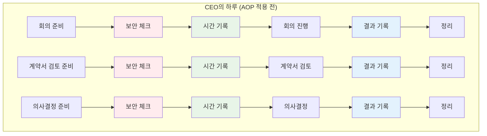
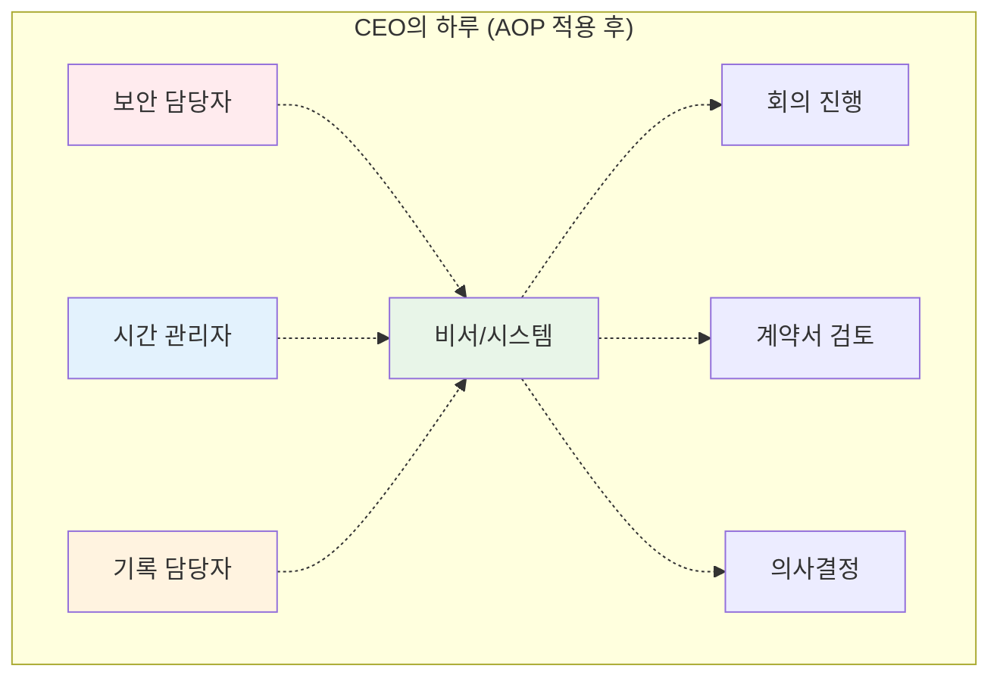
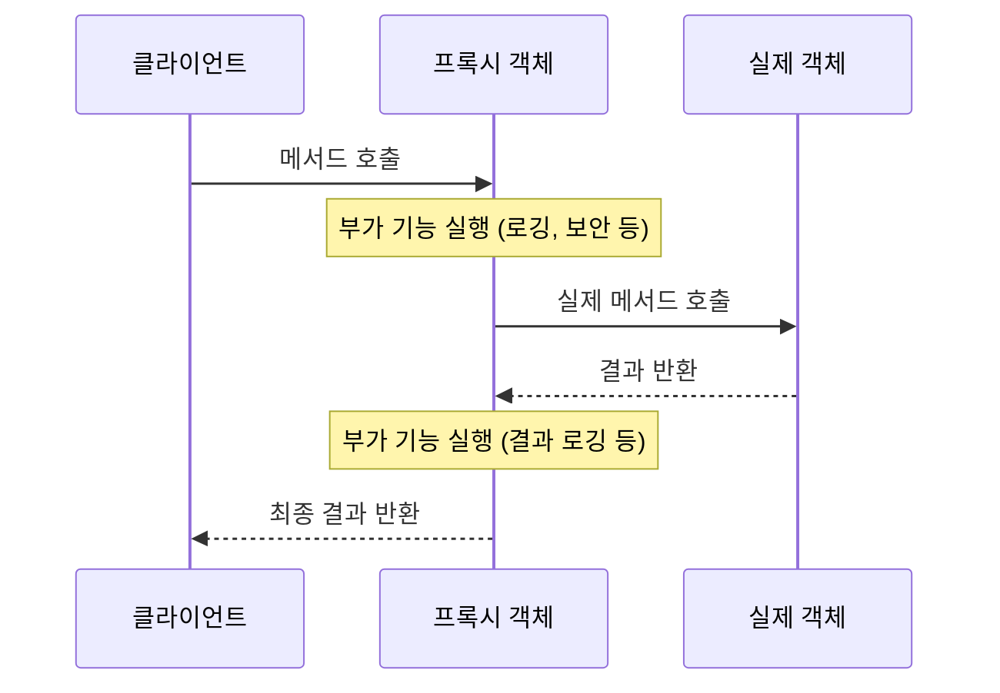
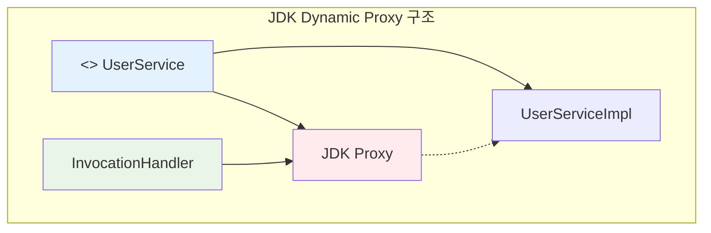
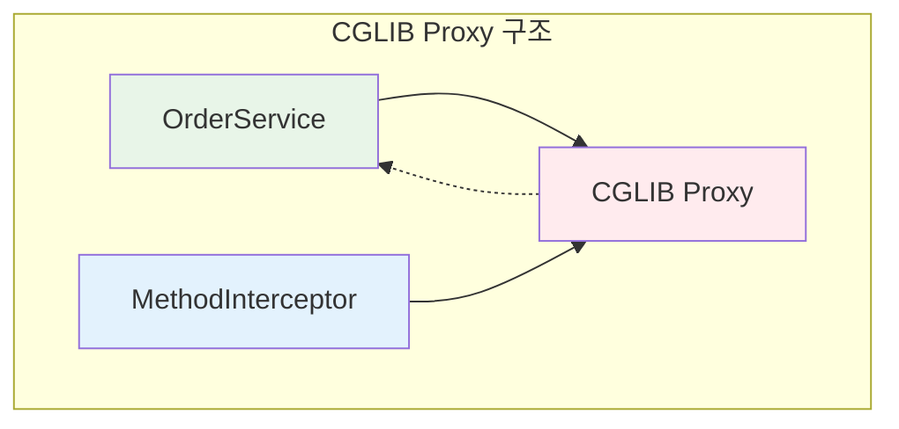
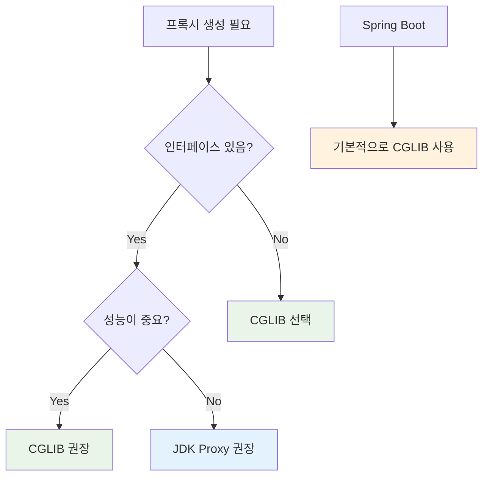

## 1. AOP가 뭔가요? 🤔

### 실생활 비유로 이해하기

여러분이 회사 CEO라고 생각해보세요. 하루에 수많은 업무가 있지만, 모든 업무 전후로 해야 할 일들이 있습니다.



**문제점**: 보안 체크, 시간 기록, 결과 기록 등이 모든 업무에 반복됨 😵

### AOP 적용 후



**해결책**: 부가 업무들을 전담 시스템이 자동으로 처리! 🎯

## 2. 프록시 패턴 이해하기 🕵️‍♂️

### 프록시란?

프록시는 **대리인** 역할을 합니다. 실제 객체 대신 요청을 받아서 부가 작업을 수행한 후 실제 객체에게 전달합니다.



### 프록시가 없다면? 😰

```java
// 😰 모든 메서드에 중복 코드가 들어감
@Service
public class UserService {
    
    public User findUser(Long id) {
        // 로깅
        System.out.println("사용자 조회 시작");
        long startTime = System.currentTimeMillis();
        
        // 보안 체크
        if (!SecurityContext.getCurrentUser().hasPermission("READ_USER")) {
            throw new SecurityException("권한 없음");
        }
        
        // 트랜잭션 시작
        TransactionManager.begin();
        
        try {
            // 🎯 실제 비즈니스 로직 (이것만 하고 싶었는데...)
            User user = userRepository.findById(id);
            
            // 트랜잭션 커밋
            TransactionManager.commit();
            
            // 성능 로깅
            long endTime = System.currentTimeMillis();
            System.out.println("실행 시간: " + (endTime - startTime) + "ms");
            
            return user;
        } catch (Exception e) {
            TransactionManager.rollback();
            throw e;
        }
    }
    
    public void saveUser(User user) {
        // 😱 또 같은 코드 반복...
        System.out.println("사용자 저장 시작");
        // ... 중복 코드들
    }
}
```

## 3. JDK Dynamic Proxy 🚀

### 특징
- **인터페이스 기반**: 반드시 인터페이스가 있어야 함
- **JDK 내장**: 추가 라이브러리 불필요
- **리플렉션 사용**: `InvocationHandler` 활용

### 구조



### 실습 예제

#### 1단계: 인터페이스와 구현체 만들기

```java
// 📋 인터페이스 (필수!)
public interface UserService {
    User findUser(Long id);
    void saveUser(User user);
}

// 🏗️ 실제 구현체
public class UserServiceImpl implements UserService {
    
    @Override
    public User findUser(Long id) {
        // 순수한 비즈니스 로직만!
        System.out.println("DB에서 사용자 조회: " + id);
        return new User(id, "홍길동");
    }
    
    @Override
    public void saveUser(User user) {
        System.out.println("DB에 사용자 저장: " + user.getName());
    }
}

// 📦 간단한 User 클래스
public class User {
    private Long id;
    private String name;
    
    public User(Long id, String name) {
        this.id = id;
        this.name = name;
    }
    
    // getter, setter, toString...
    public Long getId() { return id; }
    public String getName() { return name; }
    public String toString() { return "User{id=" + id + ", name='" + name + "'}"; }
}
```

#### 2단계: InvocationHandler 구현

```java
import java.lang.reflect.InvocationHandler;
import java.lang.reflect.Method;

public class LoggingInvocationHandler implements InvocationHandler {
    private final Object target; // 실제 객체
    
    public LoggingInvocationHandler(Object target) {
        this.target = target;
    }
    
    @Override
    public Object invoke(Object proxy, Method method, Object[] args) throws Throwable {
        // 🎯 Before: 메서드 실행 전
        System.out.println("🚀 [JDK Proxy] " + method.getName() + " 메서드 시작");
        long startTime = System.currentTimeMillis();
        
        try {
            // 실제 메서드 실행
            Object result = method.invoke(target, args);
            
            // 🎯 After: 메서드 실행 후 (성공)
            long endTime = System.currentTimeMillis();
            System.out.println("✅ [JDK Proxy] " + method.getName() + " 성공 (실행시간: " + (endTime - startTime) + "ms)");
            
            return result;
        } catch (Exception e) {
            // 🎯 After: 메서드 실행 후 (실패)
            System.out.println("❌ [JDK Proxy] " + method.getName() + " 실패: " + e.getMessage());
            throw e;
        }
    }
}
```

#### 3단계: 프록시 생성 및 실행

```java
import java.lang.reflect.Proxy;

public class JdkProxyExample {
    public static void main(String[] args) {
        // 1. 실제 객체 생성
        UserService target = new UserServiceImpl();
        
        // 2. 프록시 생성
        UserService proxy = (UserService) Proxy.newProxyInstance(
            UserService.class.getClassLoader(),           // 클래스로더
            new Class[]{UserService.class},               // 인터페이스들
            new LoggingInvocationHandler(target)          // 핸들러
        );
        
        // 3. 프록시를 통한 메서드 호출
        System.out.println("=== JDK Dynamic Proxy 테스트 ===");
        
        User user = proxy.findUser(1L);
        System.out.println("조회 결과: " + user);
        
        System.out.println();
        
        proxy.saveUser(new User(2L, "김철수"));
        
        // 4. 프록시 타입 확인
        System.out.println("\n=== 타입 확인 ===");
        System.out.println("프록시 클래스: " + proxy.getClass().getName());
        System.out.println("UserService 인터페이스? " + (proxy instanceof UserService));
        System.out.println("UserServiceImpl 클래스? " + (proxy instanceof UserServiceImpl));
    }
}
```

**실행 결과:**
```
=== JDK Dynamic Proxy 테스트 ===
🚀 [JDK Proxy] findUser 메서드 시작
DB에서 사용자 조회: 1
✅ [JDK Proxy] findUser 성공 (실행시간: 15ms)
조회 결과: User{id=1, name='홍길동'}

🚀 [JDK Proxy] saveUser 메서드 시작
DB에 사용자 저장: 김철수
✅ [JDK Proxy] saveUser 성공 (실행시간: 8ms)

=== 타입 확인 ===
프록시 클래스: com.sun.proxy.$Proxy0
UserService 인터페이스? true
UserServiceImpl 클래스? false
```

## 4. CGLIB Proxy ⚡

### 특징
- **클래스 기반**: 인터페이스 없이도 프록시 생성 가능
- **상속 방식**: 대상 클래스를 상속받아 프록시 생성
- **바이트코드 조작**: 더 빠른 성능

### 구조



### 실습 예제

#### 1단계: 구체 클래스 만들기 (인터페이스 없음!)

```java
// 🏗️ 구체 클래스만 있어도 OK!
public class OrderService {
    
    public void createOrder(String orderInfo) {
        System.out.println("주문 생성: " + orderInfo);
    }
    
    public String getOrderStatus(String orderId) {
        System.out.println("주문 상태 조회: " + orderId);
        return "주문 상태: 처리중";
    }
}
```

#### 2단계: MethodInterceptor 구현

```java
import org.springframework.cglib.proxy.MethodInterceptor;
import org.springframework.cglib.proxy.MethodProxy;
import java.lang.reflect.Method;

public class LoggingMethodInterceptor implements MethodInterceptor {
    
    @Override
    public Object intercept(Object obj, Method method, Object[] args, MethodProxy proxy) throws Throwable {
        // 🎯 Before: 메서드 실행 전
        System.out.println("⚡ [CGLIB] " + method.getName() + " 메서드 시작");
        long startTime = System.currentTimeMillis();
        
        try {
            // 실제 메서드 실행 (더 효율적인 방법)
            Object result = proxy.invokeSuper(obj, args);
            
            // 🎯 After: 메서드 실행 후 (성공)
            long endTime = System.currentTimeMillis();
            System.out.println("✅ [CGLIB] " + method.getName() + " 성공 (실행시간: " + (endTime - startTime) + "ms)");
            
            return result;
        } catch (Exception e) {
            // 🎯 After: 메서드 실행 후 (실패)
            System.out.println("❌ [CGLIB] " + method.getName() + " 실패: " + e.getMessage());
            throw e;
        }
    }
}
```

#### 3단계: 의존성 추가 (build.gradle)

```gradle
dependencies {
    implementation 'org.springframework.boot:spring-boot-starter'
}
```

#### 4단계: 프록시 생성 및 실행

```java
import org.springframework.cglib.proxy.Enhancer;

public class CglibProxyExample {
    public static void main(String[] args) {
        // 1. CGLIB Enhancer 생성
        Enhancer enhancer = new Enhancer();
        enhancer.setSuperclass(OrderService.class);           // 상속할 클래스
        enhancer.setCallback(new LoggingMethodInterceptor()); // 인터셉터
        
        // 2. 프록시 생성
        OrderService proxy = (OrderService) enhancer.create();
        
        // 3. 프록시를 통한 메서드 호출
        System.out.println("=== CGLIB Proxy 테스트 ===");
        
        proxy.createOrder("맥북 프로 구매");
        System.out.println();
        
        String status = proxy.getOrderStatus("ORDER-001");
        System.out.println("결과: " + status);
        
        // 4. 프록시 타입 확인
        System.out.println("\n=== 타입 확인 ===");
        System.out.println("프록시 클래스: " + proxy.getClass().getName());
        System.out.println("OrderService 클래스? " + (proxy instanceof OrderService));
    }
}
```

**실행 결과:**
```
=== CGLIB Proxy 테스트 ===
⚡ [CGLIB] createOrder 메서드 시작
주문 생성: 맥북 프로 구매
✅ [CGLIB] createOrder 성공 (실행시간: 12ms)

⚡ [CGLIB] getOrderStatus 메서드 시작
주문 상태 조회: ORDER-001
✅ [CGLIB] getOrderStatus 성공 (실행시간: 5ms)
결과: 주문 상태: 처리중

=== 타입 확인 ===
프록시 클래스: com.example.OrderService$$EnhancerByCGLIB$$12345678
OrderService 클래스? true
```

## 5. 두 방식 비교 ⚖️

### 비교표

| 특징 | JDK Dynamic Proxy | CGLIB Proxy |
|------|-------------------|-------------|
| **필요 조건** | 인터페이스 필수 ✅ | 구체 클래스만 있어도 OK ✅ |
| **생성 방식** | 인터페이스 구현 | 클래스 상속 |
| **성능** | 느림 (리플렉션) | 빠름 (바이트코드) |
| **의존성** | JDK 내장 | 외부 라이브러리 |
| **타입 캐스팅** | 인터페이스만 가능 | 구체 클래스 가능 |
| **final 제한** | 없음 | final 클래스/메서드 불가 |

### 선택 기준



## 6. Spring AOP 실습 🌱

### 프로젝트 설정

#### build.gradle
```groovy
plugins {
	id 'java'
	id 'org.springframework.boot' version '3.5.4'
	id 'io.spring.dependency-management' version '1.1.7'
}

dependencies {
    implementation 'org.springframework.boot:spring-boot-starter-web'
    implementation 'org.springframework.boot:spring-boot-starter-aop'

    compileOnly 'org.projectlombok:lombok'
    annotationProcessor 'org.projectlombok:lombok'

    testImplementation 'org.springframework.boot:spring-boot-starter-test'
    testRuntimeOnly 'org.junit.platform:junit-platform-launcher'

    testCompileOnly 'org.projectlombok:lombok'
    testAnnotationProcessor 'org.projectlombok:lombok'
}
```

#### application.yml
```yaml
spring:
  aop:
    proxy-target-class: true  # CGLIB 사용 강제
    
logging:
  level:
    com.example: DEBUG
```

### 기본 설정

```java
// 📁 Application.java
@SpringBootApplication
@EnableAspectJAutoProxy  // AOP 활성화
public class AopDemoApplication {
    public static void main(String[] args) {
        SpringApplication.run(AopDemoApplication.class, args);
    }
}
```

## 7. 공통 기능 구현 🔧

### 1. 로깅 Aspect

```java
@Aspect
@Component
@Slf4j
public class LoggingAspect {
    
    // 🎯 모든 Service 클래스의 public 메서드에 적용
    @Pointcut("execution(public * com.example.service.*.*(..))")
    public void serviceLayer() {}
    
    @Before("serviceLayer()")
    public void logBefore(JoinPoint joinPoint) {
        String methodName = joinPoint.getSignature().getName();
        String className = joinPoint.getTarget().getClass().getSimpleName();
        Object[] args = joinPoint.getArgs();
        
        log.info("🚀 [{}] {} 시작 - 파라미터: {}", className, methodName, Arrays.toString(args));
    }
    
    @AfterReturning(value = "serviceLayer()", returning = "result")
    public void logAfterReturning(JoinPoint joinPoint, Object result) {
        String methodName = joinPoint.getSignature().getName();
        String className = joinPoint.getTarget().getClass().getSimpleName();
        
        log.info("✅ [{}] {} 성공 - 결과: {}", className, methodName, result);
    }
    
    @AfterThrowing(value = "serviceLayer()", throwing = "ex")
    public void logAfterThrowing(JoinPoint joinPoint, Exception ex) {
        String methodName = joinPoint.getSignature().getName();
        String className = joinPoint.getTarget().getClass().getSimpleName();
        
        log.error("❌ [{}] {} 실패 - 에러: {}", className, methodName, ex.getMessage());
    }
}
```

### 2. 성능 측정 Aspect

```java
@Aspect
@Component
@Slf4j
public class PerformanceAspect {
    
    // 🎯 @PerformanceMonitor 어노테이션이 붙은 메서드에 적용
    @Around("@annotation(PerformanceMonitor)")
    public Object measureExecutionTime(ProceedingJoinPoint joinPoint) throws Throwable {
        String methodName = joinPoint.getSignature().getName();
        String className = joinPoint.getTarget().getClass().getSimpleName();
        
        long startTime = System.currentTimeMillis();
        
        try {
            Object result = joinPoint.proceed();
            
            long endTime = System.currentTimeMillis();
            long executionTime = endTime - startTime;
            
            // 성능 임계치 체크 (100ms)
            if (executionTime > 100) {
                log.warn("🐌 [{}] {} 느린 실행 감지! {}ms", className, methodName, executionTime);
            } else {
                log.info("⚡ [{}] {} 실행 완료: {}ms", className, methodName, executionTime);
            }
            
            return result;
        } catch (Exception e) {
            long endTime = System.currentTimeMillis();
            log.error("💥 [{}] {} 실행 중 오류 ({}ms): {}", className, methodName, 
                     endTime - startTime, e.getMessage());
            throw e;
        }
    }
}

// 성능 모니터링 어노테이션
@Target(ElementType.METHOD)
@Retention(RetentionPolicy.RUNTIME)
public @interface PerformanceMonitor {
}
```

### 3. 보안 Aspect

```java
@Aspect
@Component
@Slf4j
public class SecurityAspect {
    
    @Before("@annotation(RequireAuth)")
    public void checkAuthentication(JoinPoint joinPoint, RequireAuth requireAuth) {
        // 현재 사용자 정보 가져오기 (실제로는 SecurityContext에서)
        String currentUser = getCurrentUser();
        
        if (currentUser == null) {
            log.error("🔒 인증되지 않은 사용자의 접근 시도: {}", 
                     joinPoint.getSignature().getName());
            throw new SecurityException("로그인이 필요합니다.");
        }
        
        // 권한 체크
        String requiredRole = requireAuth.role();
        if (!hasRole(currentUser, requiredRole)) {
            log.error("🚫 권한 없는 접근 시도: 사용자={}, 필요권한={}", currentUser, requiredRole);
            throw new SecurityException("권한이 부족합니다. 필요 권한: " + requiredRole);
        }
        
        log.info("🔓 보안 검증 통과: 사용자={}, 메서드={}", currentUser, 
                joinPoint.getSignature().getName());
    }
    
    private String getCurrentUser() {
        // 실제로는 SecurityContextHolder.getContext().getAuthentication()
        return "testUser"; // 테스트용
    }
    
    private boolean hasRole(String user, String role) {
        // 실제로는 DB나 캐시에서 권한 확인
        return "ADMIN".equals(role) && "testUser".equals(user);
    }
}

// 보안 어노테이션
@Target(ElementType.METHOD)
@Retention(RetentionPolicy.RUNTIME)
public @interface RequireAuth {
    String role() default "USER";
}
```

## 8. 종합 실습 🎯

### 비즈니스 서비스 클래스

```java
@Service
public class ProductService {
    
    @PerformanceMonitor
    @RequireAuth(role = "USER")
    public Product findProduct(Long productId) {
        log.info("상품 조회 로직 실행");
        
        // 의도적으로 지연 시뮬레이션
        try {
            Thread.sleep(50);
        } catch (InterruptedException e) {
            Thread.currentThread().interrupt();
        }
        
        return new Product(productId, "맥북 프로", new BigDecimal("2500000"));
    }
    
    @PerformanceMonitor
    @RequireAuth(role = "ADMIN")
    public void createProduct(Product product) {
        log.info("상품 생성 로직 실행");
        
        // 의도적으로 느린 작업 시뮬레이션
        try {
            Thread.sleep(150);
        } catch (InterruptedException e) {
            Thread.currentThread().interrupt();
        }
        
        log.info("상품 생성 완료: {}", product.getName());
    }
    
    public void deleteProduct(Long productId) {
        log.info("상품 삭제 로직 실행: {}", productId);
        
        // 예외 발생 시뮬레이션
        if (productId == 999L) {
            throw new IllegalArgumentException("삭제할 수 없는 상품입니다.");
        }
    }
}

// Product 엔티티
public class Product {
    private Long id;
    private String name;
    private BigDecimal price;
    
    public Product(Long id, String name, BigDecimal price) {
        this.id = id;
        this.name = name;
        this.price = price;
    }
    
    // getter, setter, toString
    public Long getId() { return id; }
    public String getName() { return name; }
    public BigDecimal getPrice() { return price; }
    
    @Override
    public String toString() {
        return "Product{id=" + id + ", name='" + name + "', price=" + price + "}";
    }
}
```

### 테스트 컨트롤러

```java
@RestController
@RequestMapping("/api")
public class TestController {
    
    @Autowired
    private ProductService productService;
    
    @GetMapping("/products/{id}")
    public ResponseEntity<Product> getProduct(@PathVariable Long id) {
        Product product = productService.findProduct(id);
        return ResponseEntity.ok(product);
    }
    
    @PostMapping("/products")
    public ResponseEntity<String> createProduct(@RequestBody Product product) {
        productService.createProduct(product);
        return ResponseEntity.ok("상품이 생성되었습니다.");
    }
    
    @DeleteMapping("/products/{id}")
    public ResponseEntity<String> deleteProduct(@PathVariable Long id) {
        productService.deleteProduct(id);
        return ResponseEntity.ok("상품이 삭제되었습니다.");
    }
}
```

### 실행 결과 확인

```java
@Component
@Slf4j
public class AopTestRunner implements CommandLineRunner {
    
    @Autowired
    private ProductService productService;
    
    @Override
    public void run(String... args) {
        log.info("=== AOP 종합 테스트 시작 ===");
        
        try {
            // 1. 정상적인 상품 조회 (빠른 실행)
            log.info("\n--- 테스트 1: 상품 조회 ---");
            Product product = productService.findProduct(1L);
            
            // 2. 관리자 권한이 필요한 상품 생성 (느린 실행)
            log.info("\n--- 테스트 2: 상품 생성 ---");
            productService.createProduct(new Product(2L, "아이패드", new BigDecimal("800000")));
            
            // 3. 예외 발생 케이스
            log.info("\n--- 테스트 3: 예외 발생 ---");
            productService.deleteProduct(999L);
            
        } catch (Exception e) {
            log.info("예상된 예외 발생: {}", e.getMessage());
        }
        
        log.info("=== AOP 종합 테스트 완료 ===");
    }
}
```

**실행 결과 예시:**

```text
=== AOP 종합 테스트 시작 ===

--- 테스트 1: 상품 조회 ---
🔓 보안 검증 통과: 사용자=testUser, 메서드=findProduct
🚀 [ProductService] findProduct 시작 - 파라미터: [1]
상품 조회 로직 실행
⚡ [ProductService] findProduct 실행 완료: 52ms
✅ [ProductService] findProduct 성공 - 결과: Product{id=1, name='맥북 프로', price=2500000}

--- 테스트 2: 상품 생성 ---
🔓 보안 검증 통과: 사용자=testUser, 메서드=createProduct
🚀 [ProductService] createProduct 시작 - 파라미터: [Product{id=2, name='아이패드', price=800000}]
상품 생성 로직 실행
상품 생성 완료: 아이패드
🐌 [ProductService] createProduct 느린 실행 감지! 152ms
✅ [ProductService] createProduct 성공 - 결과: null

--- 테스트 3: 예외 발생 ---
🚀 [ProductService] deleteProduct 시작 - 파라미터: [999]
상품 삭제 로직 실행: 999
❌ [ProductService] deleteProduct 실패 - 에러: 삭제할 수 없는 상품입니다.
예상된 예외 발생: 삭제할 수 없는 상품입니다.

=== AOP 종합 테스트 완료 ===
```

# 💸 @Transactional이 안 걸리는 4가지 케이스

## 🤔 Spring Boot vs 수동 AOP 설정 차이점

### Spring Boot (자동 설정)
```java
@SpringBootApplication  // 이것만으로 @Transactional 동작!
public class Application {
    public static void main(String[] args) {
        SpringApplication.run(Application.class, args);
    }
}
```

### 수동 AOP 설정 (Spring Boot 아닐 때)
```java
@Configuration
@EnableTransactionManagement  // 수동으로 추가해야 함
@EnableAspectJAutoProxy
public class Config {
    // 트랜잭션 매니저 등 추가 설정 필요
}
```

## 🛠️ 프로젝트 설정

### build.gradle
```gradle
plugins {
    id 'java'
    id 'org.springframework.boot' version '3.5.4'
    id 'io.spring.dependency-management' version '1.1.7'
}

dependencies {
    implementation 'org.springframework.boot:spring-boot-starter-data-jpa'
    runtimeOnly 'com.h2database:h2'
    
    compileOnly 'org.projectlombok:lombok'
    annotationProcessor 'org.projectlombok:lombok'
}
```

### application.yml
```yaml
spring:
  datasource:
    url: jdbc:h2:mem:testdb
    driver-class-name: org.h2.Driver
  jpa:
    open-in-view: false
    show-sql: true
    hibernate:
      ddl-auto: create-drop
    
logging:
  level:
    org.springframework.transaction: DEBUG  # 트랜잭션 로그 확인
```

## 📋 기본 코드

### User 엔티티
```java
@Entity
@Getter @Setter @NoArgsConstructor
public class User {
    @Id @GeneratedValue
    private Long id;
    private String name;
    private String email;
    
    public User(String name, String email) {
        this.name = name;
        this.email = email;
    }
}
```

### UserRepository
```java
@Repository
public interface UserRepository extends JpaRepository<User, Long> {
}
```

---

## ❌ 케이스 1: 프록시 외부 호출 (Self-Invocation)

### 문제가 되는 코드
```java
@Slf4j
@RequiredArgsConstructor
@Service
public class Case1Service {

    private final UserRepository userRepository;

    public void selfInvocationExample() {
        this.saveUserInternal("user1", "user1@test.com");
    }

    @Transactional
    public void saveUserInternal(String name, String email) {
        User user = new User(name, email);
        User savedUser= userRepository.save(user);
        savedUser.setName("Case1Service");
    }
}
```

## ❌ 케이스 2: Private 메서드

### 문제가 되는 코드
```java
@Service
@RequiredArgsConstructor
@Slf4j
public class Case2Service {

    private final UserRepository userRepository;

    public void privateMethodExample() {
        this.updateUserPrivate();
        throw new RuntimeException("private Exception");
    }

    @Transactional  // ❌ private 메서드는 프록시 불가!
    private void updateUserPrivate() {
        User newUser = new User("롤백되야할 유저", "temp@test.com");
        User savedUser= userRepository.save(newUser);
        savedUser.setName("Private");
    }
}
```

### 🤷‍♂️ 왜 안되나요?
- 프록시는 **public 메서드**만 가로챌 수 있음
- private 메서드는 외부에서 접근 불가하므로 프록시 생성 불가

## ❌ 케이스 3: Checked Exception

### 문제가 되는 코드

```java
@Slf4j
@RequiredArgsConstructor
@Service
public class Case3Service {

    private final UserRepository userRepository;

    @Transactional
    public void checkedExceptionExample() throws Exception {
        User newUser = new User("롤백되야할 유저", "temp@test.com");
        userRepository.save(newUser);
        throw new Exception("졸리다.");
    }
}
```

### 🤷‍♂️ 왜 안되나요?
- Spring 기본 설정: **RuntimeException**만 롤백
- **Checked Exception**(Exception, IOException 등)은 롤백 안됨
- 비즈니스 로직에서 복구 가능한 예외로 간주


## ❌ 케이스 4: 프록시 내부에서 자기 자신 메서드 호출

### 문제가 되는 코드
```java
@Service
@RequiredArgsConstructor
@Slf4j
public class Case4Service {

    private final UserRepository userRepository;

    @Transactional
    public void createMultipleUsers() {
        createSingleUser("홍길동", "hong@test.com");
        createSingleUser("김철수", "invalid-email");
    }

    @Transactional(propagation = Propagation.REQUIRES_NEW)
    public void createSingleUser(String name, String email) throws RuntimeException {
        if (!email.contains("@")) {
            throw new RuntimeException("잘못된 이메일");
        }

        User user = new User(name, email);
        userRepository.save(user);
    }
}
```

### 🤷‍♂️ 왜 안되나요?
- `createSingleUser()` 호출이 프록시를 거치지 않음
- 내부적으로는 모두 같은 트랜잭션에서 실행됨
- 개별 메서드의 `@Transactional` 설정이 무시됨

### ✅ 해결 방법

**방법 1: 별도 서비스 분리**
```java
@Service
public class UserService {
    @Autowired
    private UserCreationService userCreationService;
    
    @Transactional
    public void createMultipleUsers() {
        userCreationService.createSingleUser("홍길동", "hong@test.com");
        userCreationService.createSingleUser("김철수", "kim@test.com");
    }
}

@Service
public class UserCreationService {
    @Autowired
    private UserRepository userRepository;
    
    @Transactional(propagation = Propagation.REQUIRES_NEW)  // 새 트랜잭션
    public void createSingleUser(String name, String email) {
        if (!email.contains("@")) {
            throw new RuntimeException("잘못된 이메일");
        }
        
        User user = new User(name, email);
        userRepository.save(user);
    }
}
```

## 📊 정리

| 케이스 | 문제점 | 해결방법 |
|--------|--------|----------|
| **Self-Invocation** | 같은 클래스 메서드 호출 | 별도 서비스로 분리 |
| **Private 메서드** | 프록시 생성 불가 | public으로 변경 |
| **Checked Exception** | 기본적으로 롤백 안됨 | `rollbackFor` 명시 |
| **내부 메서드 호출** | 프록시 우회 | 서비스 분리 + 전파 설정 |

## 🎯 핵심 포인트

1. **Spring Boot는 자동으로 @Transactional 지원** - 별도 AOP 설정 불필요
2. **프록시 기반**이므로 외부에서 호출되어야 함
3. **Public 메서드**만 가능
4. **RuntimeException**만 기본 롤백
5. 복잡한 트랜잭션 로직은 **서비스를 분리**하는 것이 좋음
