# 트랜잭션 

## 1. 트랜잭션이란 무엇인가?

### 1.1 일상 속 트랜잭션 예시 (은행 이체 시나리오)

트랜잭션을 이해하는 가장 좋은 방법은 일상의 예시로 시작하는 것입니다. 친구에게 10만원을 이체한다고 생각해보세요.

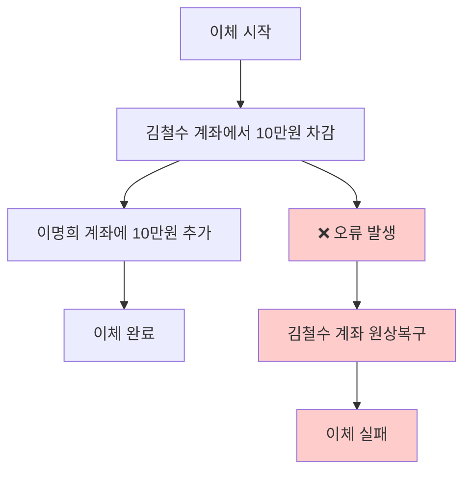
```mermaid
flowchart TD
    A[이체 시작] --> B[김철수 계좌에서 10만원 차감]
    B --> C[이명희 계좌에 10만원 추가]
    C --> D[이체 완료]
    
    B --> E[❌ 오류 발생]
    E --> F[김철수 계좌 원상복구]
    F --> G[이체 실패]
    
    style E fill:#ffcccc
    style F fill:#ffcccc
    style G fill:#ffcccc
```

이 과정에서 중요한 것은:
1. **김철수 계좌 -10만원** (출금)
2. **이명희 계좌 +10만원** (입금)

이 두 작업은 **반드시 함께 성공하거나 함께 실패**해야 합니다. 만약 출금만 되고 입금이 안 된다면? 김철수만 손해를 보게 되죠.

### 1.2 데이터베이스에서 트랜잭션이 필요한 이유

데이터베이스에서도 마찬가지입니다. 하나의 비즈니스 로직을 처리하기 위해 여러 개의 SQL 문이 실행될 때, 이들을 하나의 **작업 단위**로 묶어야 합니다.

```sql
-- 주문 처리 예시
INSERT INTO orders (user_id, product_id, quantity) VALUES (1, 100, 2);
UPDATE products SET stock = stock - 2 WHERE id = 100;
INSERT INTO order_history (order_id, status) VALUES (LAST_INSERT_ID(), 'PENDING');
```

위 3개의 SQL문 중 하나라도 실패하면, 데이터 불일치가 발생합니다:
- 주문은 생성됐는데 재고는 차감되지 않거나
- 재고는 차감됐는데 주문 기록이 없거나

### 1.3 "All or Nothing" 원칙 이해하기

트랜잭션의 핵심 원칙은 **"All or Nothing"** 입니다.

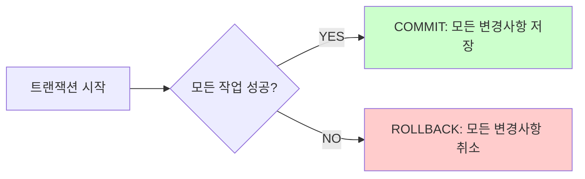
```mermaid
graph LR
    A[트랜잭션 시작] --> B{모든 작업 성공?}
    B -->|YES| C[COMMIT: 모든 변경사항 저장]
    B -->|NO| D[ROLLBACK: 모든 변경사항 취소]
    
    style C fill:#ccffcc
    style D fill:#ffcccc
```

- **COMMIT**: 모든 작업이 성공했을 때, 변경사항을 데이터베이스에 영구적으로 저장
- **ROLLBACK**: 하나라도 실패했을 때, 트랜잭션 시작 전 상태로 되돌림

## 2. 트랜잭션의 4가지 특성 - ACID 원리

트랜잭션이 제대로 동작하기 위해서는 4가지 특성을 만족해야 합니다. 이를 **ACID**라고 부릅니다.

### 2.1 원자성(Atomicity): 한 번에 모두 성공 or 모두 실패

**원자성**은 트랜잭션의 모든 작업이 완전히 수행되거나 전혀 수행되지 않아야 한다는 특성입니다.

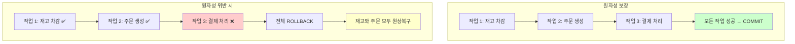
```mermaid
graph TB
    subgraph "원자성 보장"
        A1[작업 1: 재고 차감] --> A2[작업 2: 주문 생성]
        A2 --> A3[작업 3: 결제 처리]
        A3 --> A4[모든 작업 성공 → COMMIT]
    end
    
    subgraph "원자성 위반 시"
        B1[작업 1: 재고 차감 ✅] --> B2[작업 2: 주문 생성 ✅]
        B2 --> B3[작업 3: 결제 처리 ❌]
        B3 --> B4[전체 ROLLBACK]
        B4 --> B5[재고와 주문 모두 원상복구]
    end
    
    style A4 fill:#ccffcc
    style B3 fill:#ffcccc
    style B5 fill:#ffffcc
```

### 2.2 일관성(Consistency): 데이터 규칙 지키기

**일관성**은 트랜잭션 전후로 데이터베이스가 일관된 상태를 유지해야 한다는 특성입니다.

예시: 은행 시스템에서 "모든 계좌의 잔고는 0원 이상이어야 함"이라는 규칙이 있다면:

```java
@Transactional
public void transfer(Long fromId, Long toId, BigDecimal amount) {
    Account from = accountRepository.findById(fromId);
    Account to = accountRepository.findById(toId);
    
    // 잔고 부족 체크 (일관성 규칙 검증)
    if (from.getBalance().compareTo(amount) < 0) {
        throw new InsufficientBalanceException("잔고가 부족합니다");
    }
    
    from.withdraw(amount);  // 출금 후에도 잔고 >= 0 유지
    to.deposit(amount);     // 정상적인 입금
    
    // 트랜잭션 끝: 두 계좌 모두 잔고 >= 0 규칙 만족
}
```

### 2.3 격리성(Isolation): 동시 작업 시 간섭하지 않기

**격리성**은 동시에 실행되는 트랜잭션들이 서로 영향을 미치지 않도록 보장하는 특성입니다.

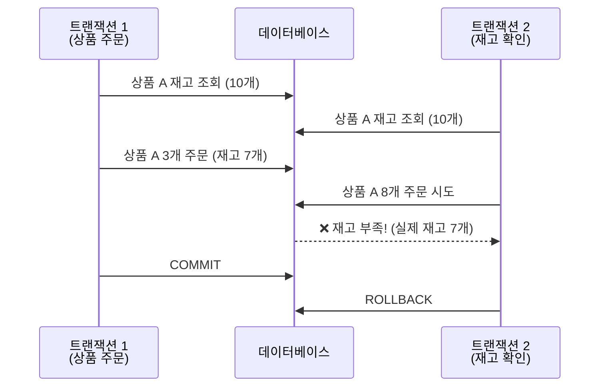
```mermaid
sequenceDiagram
    participant T1 as 트랜잭션 1<br/>(상품 주문)
    participant DB as 데이터베이스
    participant T2 as 트랜잭션 2<br/>(재고 확인)
    
    T1->>DB: 상품 A 재고 조회 (10개)
    T2->>DB: 상품 A 재고 조회 (10개)
    T1->>DB: 상품 A 3개 주문 (재고 7개)
    T2->>DB: 상품 A 8개 주문 시도
    DB-->>T2: ❌ 재고 부족! (실제 재고 7개)
    T1->>DB: COMMIT
    T2->>DB: ROLLBACK
```

### 2.4 지속성(Durability): 성공한 것은 영원히 저장

**지속성**은 성공적으로 완료된 트랜잭션의 결과가 시스템 장애가 발생해도 영구적으로 보존되어야 한다는 특성입니다.

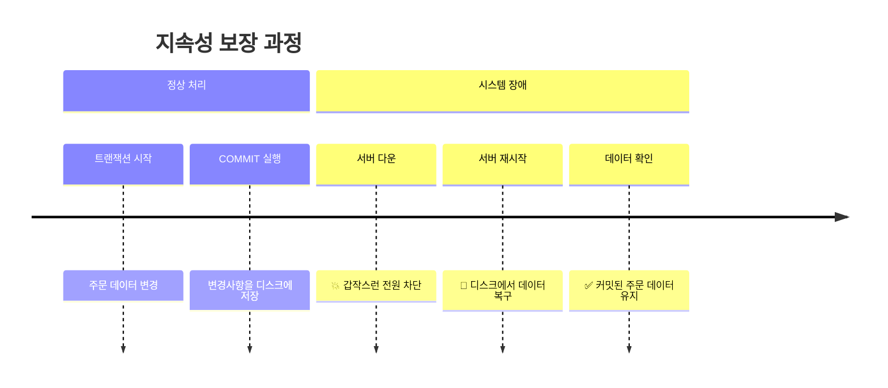
```mermaid
timeline
    title 지속성 보장 과정
    
    section 정상 처리
        트랜잭션 시작 : 주문 데이터 변경
        COMMIT 실행   : 변경사항을 디스크에 저장
        
    section 시스템 장애
        서버 다운     : 💥 갑작스런 전원 차단
        서버 재시작   : 💾 디스크에서 데이터 복구
        데이터 확인   : ✅ 커밋된 주문 데이터 유지
```

## 3. 동시성 문제와 트랜잭션 격리 수준

### 3.1 여러 명이 동시에 작업할 때 생기는 문제들

실제 서비스에서는 수많은 사용자가 동시에 데이터베이스에 접근합니다. 이때 발생할 수 있는 3가지 주요 문제를 살펴보겠습니다.

#### Dirty Read (더러운 읽기)

아직 커밋되지 않은 데이터를 다른 트랜잭션이 읽는 문제입니다.

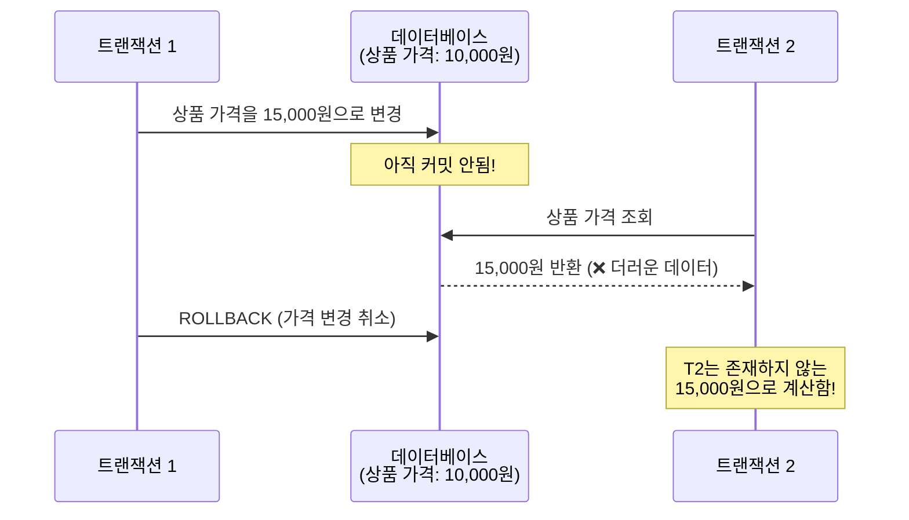
```mermaid
sequenceDiagram
    participant T1 as 트랜잭션 1
    participant DB as 데이터베이스<br/>(상품 가격: 10,000원)
    participant T2 as 트랜잭션 2
    
    T1->>DB: 상품 가격을 15,000원으로 변경
    Note over DB: 아직 커밋 안됨!
    T2->>DB: 상품 가격 조회
    DB-->>T2: 15,000원 반환 (❌ 더러운 데이터)
    T1->>DB: ROLLBACK (가격 변경 취소)
    Note over T2: T2는 존재하지 않는<br/>15,000원으로 계산함!
```

#### Non-Repeatable Read (반복 불가능한 읽기)

같은 트랜잭션 내에서 같은 데이터를 두 번 읽었는데 결과가 다른 문제입니다.

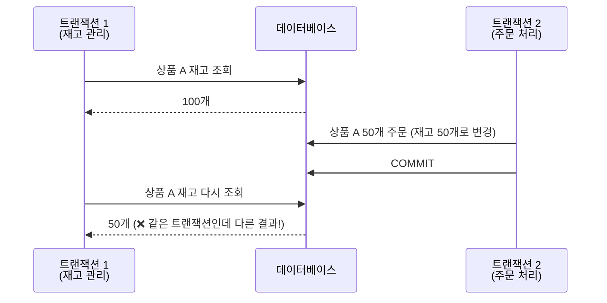
```mermaid
sequenceDiagram
    participant T1 as 트랜잭션 1<br/>(재고 관리)
    participant DB as 데이터베이스
    participant T2 as 트랜잭션 2<br/>(주문 처리)
    
    T1->>DB: 상품 A 재고 조회
    DB-->>T1: 100개
    T2->>DB: 상품 A 50개 주문 (재고 50개로 변경)
    T2->>DB: COMMIT
    T1->>DB: 상품 A 재고 다시 조회
    DB-->>T1: 50개 (❌ 같은 트랜잭션인데 다른 결과!)
```

#### Phantom Read (유령 읽기)

같은 조건으로 조회했는데, 이전에 없던 새로운 행이 나타나는 문제입니다.

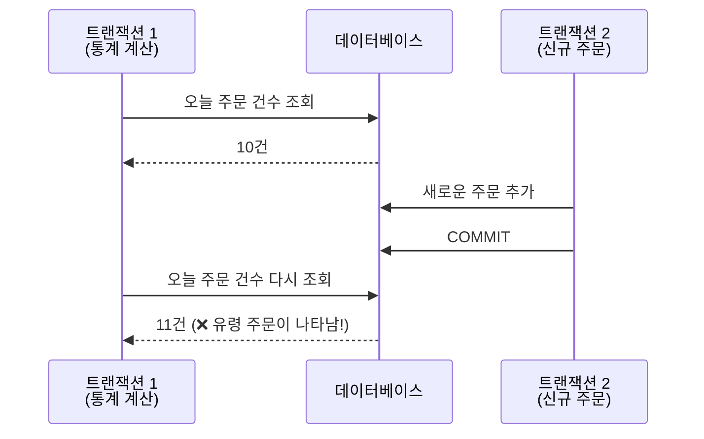
```mermaid
sequenceDiagram
    participant T1 as 트랜잭션 1<br/>(통계 계산)
    participant DB as 데이터베이스
    participant T2 as 트랜잭션 2<br/>(신규 주문)
    
    T1->>DB: 오늘 주문 건수 조회
    DB-->>T1: 10건
    T2->>DB: 새로운 주문 추가
    T2->>DB: COMMIT
    T1->>DB: 오늘 주문 건수 다시 조회
    DB-->>T1: 11건 (❌ 유령 주문이 나타남!)
```

### 3.2 격리 수준별 해결책

SQL 표준에서는 4가지 격리 수준을 정의합니다. 격리 수준이 높을수록 데이터 일관성은 좋아지지만 성능은 떨어집니다.

| 격리 수준 | Dirty Read | Non-Repeatable Read | Phantom Read | 설명 |
|----------|-----------|-------------------|-------------|------|
| **READ UNCOMMITTED** | 발생 | 발생 | 발생 | 가장 낮은 수준, 거의 사용 안함 |
| **READ COMMITTED** ⭐ | 방지 | 발생 | 발생 | 가장 많이 사용, Oracle/PostgreSQL 기본 |
| **REPEATABLE READ** | 방지 | 방지 | MySQL에서 방지 | MySQL 기본값 |
| **SERIALIZABLE** | 방지 | 방지 | 방지 | 최고 수준, 성능 저하 심함 |

#### READ COMMITTED (가장 많이 사용) ⭐

```java
// Oracle, PostgreSQL의 기본 격리 수준
@Transactional(isolation = Isolation.READ_COMMITTED)
public void processOrder() {
    // 커밋된 데이터만 읽을 수 있음
    // Dirty Read는 방지되지만, Non-Repeatable Read는 발생 가능
}
```

#### REPEATABLE READ (MySQL 기본)

```java
// MySQL InnoDB의 기본 격리 수준
@Transactional(isolation = Isolation.REPEATABLE_READ)
public void generateReport() {
    // 트랜잭션 내에서는 항상 같은 데이터를 읽음
    // MySQL에서는 Phantom Read도 방지함 (특별한 잠금 메커니즘)
}
```

### 3.3 MySQL vs Oracle 기본 설정

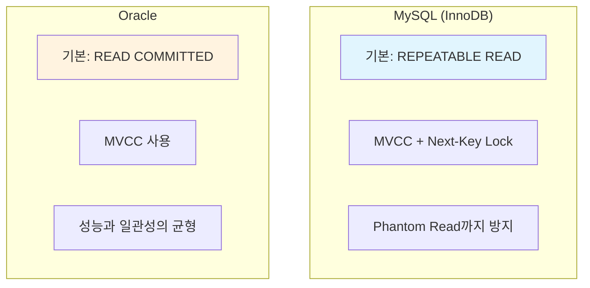
```mermaid
graph TB
    subgraph "MySQL (InnoDB)"
        M1[기본: REPEATABLE READ]
        M2[MVCC + Next-Key Lock]
        M3[Phantom Read까지 방지]
    end
    
    subgraph "Oracle"
        O1[기본: READ COMMITTED]
        O2[MVCC 사용]
        O3[성능과 일관성의 균형]
    end
    
    style M1 fill:#e1f5fe
    style O1 fill:#fff3e0
```

## 4. Spring에서 트랜잭션 사용하기

이제 실제 Spring 프로젝트에서 트랜잭션을 어떻게 사용하는지 알아보겠습니다.

### 4.1 트랜잭션 없이 vs 있을 때 코드 비교

#### ❌ 트랜잭션 없는 코드 (위험!)

```java
@Service
public class OrderService {
    
    @Autowired
    private OrderRepository orderRepository;
    
    @Autowired
    private ProductRepository productRepository;
    
    public void createOrder(OrderRequest request) {
        // 1. 주문 생성
        Order order = new Order(request.getUserId(), request.getProductId());
        orderRepository.save(order);
        
        // 2. 재고 차감
        Product product = productRepository.findById(request.getProductId());
        product.decreaseStock(request.getQuantity());
        productRepository.save(product);
        
        // ❌ 여기서 예외 발생하면?
        // → 주문은 생성되었지만 재고는 차감되지 않음!
        if (someBusinessLogic()) {
            throw new RuntimeException("비즈니스 로직 오류!");
        }
    }
}
```

#### ✅ 트랜잭션 적용한 안전한 코드

```java
@Service
@Transactional  // 클래스 레벨에 적용
public class OrderService {
    
    @Autowired
    private OrderRepository orderRepository;
    
    @Autowired
    private ProductRepository productRepository;
    
    public void createOrder(OrderRequest request) {
        // 1. 주문 생성
        Order order = new Order(request.getUserId(), request.getProductId());
        orderRepository.save(order);
        
        // 2. 재고 차감
        Product product = productRepository.findById(request.getProductId());
        product.decreaseStock(request.getQuantity());
        productRepository.save(product);
        
        // ✅ 여기서 예외 발생해도 안전!
        // → 주문 생성과 재고 차감 모두 자동 롤백됨
        if (someBusinessLogic()) {
            throw new RuntimeException("비즈니스 로직 오류!");
        }
    }
}
```

### 4.2 @Transactional 애노테이션 기본 사용법

#### 어디에 붙일까? (클래스 vs 메서드)

```java
@Service
@Transactional  // 클래스 레벨: 모든 public 메서드에 적용
public class UserService {
    
    public void createUser(User user) {
        // 트랜잭션 적용됨
    }
    
    @Transactional(readOnly = true)  // 메서드 레벨: 클래스 설정보다 우선
    public User getUserById(Long id) {
        // 읽기 전용 트랜잭션 적용됨
        return userRepository.findById(id);
    }
    
    // private 메서드는 트랜잭션 적용 안됨!
    private void privateMethod() {
        // 트랜잭션 적용되지 않음
    }
}
```

### 4.3 트랜잭션 프록시 동작 원리

Spring은 **프록시 패턴**을 사용해서 트랜잭션을 처리합니다.

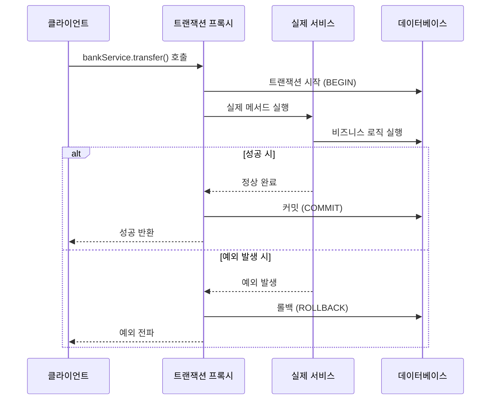
```mermaid
sequenceDiagram
    participant Client as 클라이언트
    participant Proxy as 트랜잭션 프록시
    participant Service as 실제 서비스
    participant DB as 데이터베이스
    
    Client->>Proxy: bankService.transfer() 호출
    Proxy->>DB: 트랜잭션 시작 (BEGIN)
    Proxy->>Service: 실제 메서드 실행
    Service->>DB: 비즈니스 로직 실행
    
    alt 성공 시
        Service-->>Proxy: 정상 완료
        Proxy->>DB: 커밋 (COMMIT)
        Proxy-->>Client: 성공 반환
    else 예외 발생 시
        Service-->>Proxy: 예외 발생
        Proxy->>DB: 롤백 (ROLLBACK)
        Proxy-->>Client: 예외 전파
    end
```

간단히 말하면:
1. `@Transactional`이 붙은 메서드를 호출하면
2. Spring이 자동으로 **트랜잭션 프록시**를 만들어서
3. 메서드 실행 전에 트랜잭션을 시작하고
4. 메서드 실행 후에 커밋 또는 롤백을 처리합니다

### 4.4 트랜잭션 적용 확인하는 방법

#### 로그로 확인하기

```yaml
# application.yml
logging:
  level:
    org.springframework.transaction.interceptor: TRACE
    org.springframework.orm.jpa.JpaTransactionManager: DEBUG
```

실행하면 다음과 같은 로그를 볼 수 있습니다:

```
Getting transaction for [BankService.transfer]
Creating new transaction with name [BankService.transfer]
Initiating transaction commit
Committing JPA transaction
Completing transaction for [BankService.transfer]
```

#### 코드로 확인하기

```java
@Service
public class TransactionCheckService {
    
    @Transactional
    public void checkTransaction() {
        // 현재 트랜잭션이 활성화되어 있는지 확인
        boolean isActive = TransactionSynchronizationManager.isActualTransactionActive();
        System.out.println("트랜잭션 활성화: " + isActive);  // true
        
        // 읽기 전용 트랜잭션인지 확인
        boolean isReadOnly = TransactionSynchronizationManager.isCurrentTransactionReadOnly();
        System.out.println("읽기 전용: " + isReadOnly);  // false
    }
    
    @Transactional(readOnly = true)
    public void checkReadOnlyTransaction() {
        boolean isReadOnly = TransactionSynchronizationManager.isCurrentTransactionReadOnly();
        System.out.println("읽기 전용: " + isReadOnly);  // true
    }
}
```

## 5. @Transactional 옵션

`@Transactional`에는 다양한 옵션이 있습니다. 실무에서 자주 사용하는 옵션들을 중심으로 알아보겠습니다.

### 5.1 readOnly: 읽기 전용 트랜잭션

**언제 사용하나요?**
데이터를 조회만 하고 수정하지 않는 메서드에 사용합니다.

```java
@Service
public class ProductService {
    
    // ✅ 조회 메서드에는 readOnly = true
    @Transactional(readOnly = true)
    public List<Product> getAllProducts() {
        return productRepository.findAll();
    }
    
    @Transactional(readOnly = true)
    public Product getProductById(Long id) {
        return productRepository.findById(id)
            .orElseThrow(() -> new ProductNotFoundException("상품을 찾을 수 없습니다"));
    }
    
    // ✅ 수정 메서드에는 readOnly 사용하지 않음 (기본값 false)
    @Transactional
    public Product createProduct(ProductRequest request) {
        Product product = new Product(request.getName(), request.getPrice());
        return productRepository.save(product);
    }
}
```

**readOnly = true의 장점:**
- 데이터베이스가 읽기 최적화를 수행할 수 있음
- 실수로 데이터를 수정하는 것을 방지
- 일부 데이터베이스에서 읽기 전용 복제본을 사용할 수 있음

### 5.2 timeout: 트랜잭션 제한 시간

```java
@Service
public class ReportService {
    
    // 30초 후에 타임아웃
    @Transactional(timeout = 30)
    public void generateLargeReport() {
        // 대용량 리포트 생성 작업
        // 30초 내에 완료되지 않으면 트랜잭션 롤백
    }
    
    // 기본값: 데이터베이스 설정을 따름
    @Transactional
    public void normalOperation() {
        // 일반적인 작업
    }
}
```

### 5.3 rollbackFor: 어떤 예외에 롤백할까?

Spring의 기본 롤백 규칙:
- **RuntimeException, Error**: 롤백 ✅
- **Checked Exception**: 커밋 ⚠️

```java
@Service
public class PaymentService {
    
    // 기본 동작: RuntimeException만 롤백
    @Transactional
    public void processPayment1(PaymentRequest request) throws PaymentException {
        // ... 결제 처리 ...
        
        if (paymentFailed) {
            throw new RuntimeException("결제 실패");  // 롤백됨 ✅
        }
        
        if (externalServiceError) {
            throw new PaymentException("외부 서비스 오류");  // 롤백 안됨! ❌
        }
    }
    
    // Checked Exception도 롤백하도록 설정
    @Transactional(rollbackFor = Exception.class)
    public void processPayment2(PaymentRequest request) throws PaymentException {
        // ... 결제 처리 ...
        
        if (externalServiceError) {
            throw new PaymentException("외부 서비스 오류");  // 이제 롤백됨 ✅
        }
    }
    
    // 특정 예외는 롤백하지 않도록 설정
    @Transactional(noRollbackFor = BusinessException.class)
    public void processOrder(OrderRequest request) throws BusinessException {
        // ... 주문 처리 ...
        
        if (businessRuleViolated) {
            throw new BusinessException("비즈니스 규칙 위반");  // 롤백 안됨
        }
    }
}
```

💡 **Tip**: 대부분의 경우 `rollbackFor = Exception.class`를 사용해서 모든 예외에 대해 롤백하는 것이 안전합니다.

### 5.4 isolation: 격리 수준 설정하기

```java
@Service
public class OrderService {
    
    // 기본값: 데이터베이스의 기본 격리 수준 사용
    @Transactional
    public void normalOrder() {
        // Oracle: READ_COMMITTED, MySQL: REPEATABLE_READ
    }
    
    // 명시적으로 격리 수준 설정
    @Transactional(isolation = Isolation.READ_COMMITTED)
    public void strictOrder() {
        // 항상 READ_COMMITTED 레벨 사용
    }
    
    // 높은 격리 수준 (성능 저하 주의)
    @Transactional(isolation = Isolation.SERIALIZABLE)
    public void criticalOrder() {
        // 가장 높은 격리 수준, 성능 저하 가능성
    }
}
```

## 6. 트랜잭션 전파 (Propagation)

트랜잭션 전파는 Spring 트랜잭션에서 가장 중요하면서도 어려운 개념입니다. 차근차근 알아보겠습니다.

### 6.1 트랜잭션 전파가 뭔가요?

**트랜잭션 전파**는 이미 트랜잭션이 실행중인 상황에서 추가로 트랜잭션이 필요한 메서드가 호출될 때, 어떻게 처리할지 결정하는 것입니다.

```java
@Service
public class OrderService {
    
    @Autowired
    private PaymentService paymentService;
    
    @Transactional  // 외부 트랜잭션
    public void processOrder(OrderRequest request) {
        // 1. 주문 생성
        createOrder(request);
        
        // 2. 결제 처리 (내부 트랜잭션)
        paymentService.processPayment(request);  // 이 메서드도 @Transactional
        
        // 결제 메서드의 트랜잭션은 어떻게 동작할까? 🤔
    }
}
```

### 6.2 물리 트랜잭션 vs 논리 트랜잭션 개념 정리

Spring은 이해를 돕기 위해 **물리 트랜잭션**과 **논리 트랜잭션**을 구분합니다.

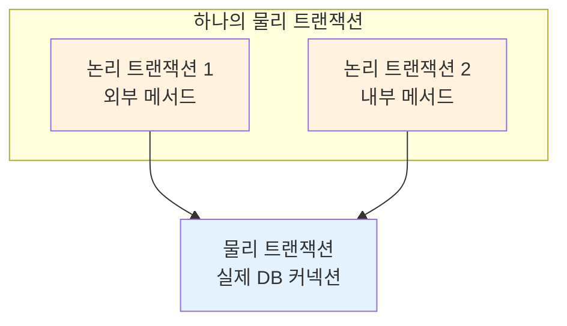
```mermaid
graph TB
    subgraph "하나의 물리 트랜잭션"
        LT1[논리 트랜잭션 1<br/>외부 메서드]
        LT2[논리 트랜잭션 2<br/>내부 메서드]
    end
    
    PT[물리 트랜잭션<br/>실제 DB 커넥션]
    
    LT1 --> PT
    LT2 --> PT
    
    style PT fill:#e3f2fd
    style LT1 fill:#fff3e0
    style LT2 fill:#fff3e0
```

- **물리 트랜잭션**: 실제 데이터베이스 커넥션을 통한 트랜잭션 (BEGIN, COMMIT, ROLLBACK)
- **논리 트랜잭션**: Spring이 관리하는 트랜잭션 단위 (`@Transactional` 메서드 각각)

**핵심 원칙:**
- **모든 논리 트랜잭션이 성공해야 물리 트랜잭션이 커밋됩니다**
- **하나의 논리 트랜잭션이라도 실패하면 물리 트랜잭션이 롤백됩니다**

### 6.3 REQUIRED (기본값)

`REQUIRED`는 가장 일반적으로 사용되는 전파 옵션입니다. "트랜잭션이 필요하다"는 의미로, 없으면 만들고 있으면 참여합니다.

#### 외부 트랜잭션이 없을 때

```java
@Service
public class UserService {
    
    @Transactional  // REQUIRED (기본값)
    public void createUser(User user) {
        userRepository.save(user);
        // 새로운 물리 트랜잭션 시작 → 신규 트랜잭션
    }
}

@RestController
public class UserController {
    
    @Autowired
    private UserService userService;
    
    @PostMapping("/users")
    public ResponseEntity<String> createUser(@RequestBody User user) {
        // 컨트롤러에는 @Transactional이 없음
        userService.createUser(user);  // 새로운 트랜잭션 시작
        return ResponseEntity.ok("사용자 생성 완료");
    }
}
```

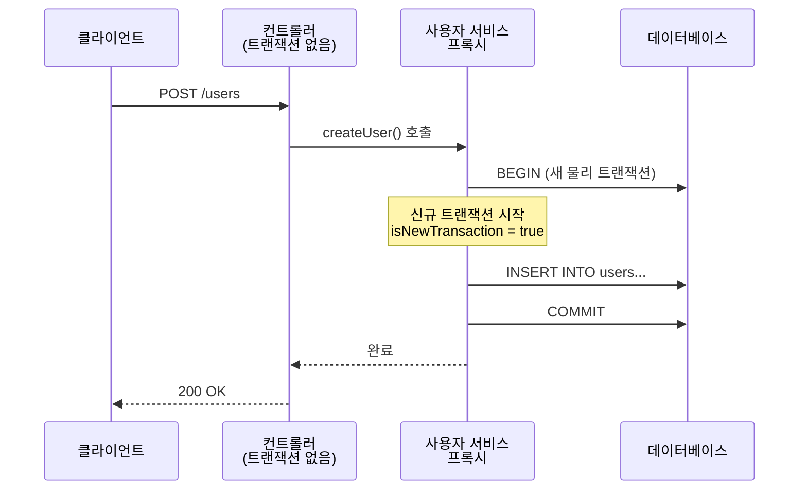
```mermaid
sequenceDiagram
    participant Client as 클라이언트
    participant Controller as 컨트롤러<br/>(트랜잭션 없음)
    participant UserProxy as 사용자 서비스<br/>프록시
    participant DB as 데이터베이스
    
    Client->>Controller: POST /users
    Controller->>UserProxy: createUser() 호출
    UserProxy->>DB: BEGIN (새 물리 트랜잭션)
    Note over UserProxy: 신규 트랜잭션 시작<br/>isNewTransaction = true
    UserProxy->>DB: INSERT INTO users...
    UserProxy->>DB: COMMIT
    UserProxy-->>Controller: 완료
    Controller-->>Client: 200 OK
```

#### 외부 트랜잭션이 있을 때

```java
@Service
public class OrderService {
    
    @Autowired
    private UserService userService;
    
    @Autowired
    private PaymentService paymentService;
    
    @Transactional  // 외부 트랜잭션 (물리 트랜잭션 시작)
    public void processOrder(OrderRequest request) {
        // 1. 주문 생성
        Order order = createOrder(request);
        
        // 2. 사용자 생성 (내부 트랜잭션 - 기존 트랜잭션 참여)
        userService.createUser(request.getUser());
        
        // 3. 결제 처리 (내부 트랜잭션 - 기존 트랜잭션 참여)  
        paymentService.processPayment(order.getId(), request.getAmount());
        
        // 모든 작업이 하나의 물리 트랜잭션으로 처리됨
    }
}
```

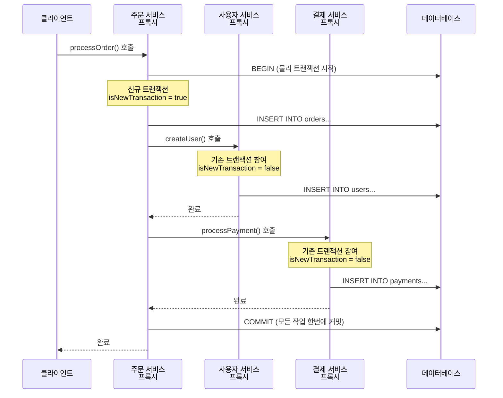
```mermaid
sequenceDiagram
    participant Client as 클라이언트
    participant OrderProxy as 주문 서비스<br/>프록시
    participant UserProxy as 사용자 서비스<br/>프록시
    participant PaymentProxy as 결제 서비스<br/>프록시
    participant DB as 데이터베이스
    
    Client->>OrderProxy: processOrder() 호출
    OrderProxy->>DB: BEGIN (물리 트랜잭션 시작)
    Note over OrderProxy: 신규 트랜잭션<br/>isNewTransaction = true
    OrderProxy->>DB: INSERT INTO orders...
    
    OrderProxy->>UserProxy: createUser() 호출
    Note over UserProxy: 기존 트랜잭션 참여<br/>isNewTransaction = false
    UserProxy->>DB: INSERT INTO users...
    UserProxy-->>OrderProxy: 완료
    
    OrderProxy->>PaymentProxy: processPayment() 호출
    Note over PaymentProxy: 기존 트랜잭션 참여<br/>isNewTransaction = false
    PaymentProxy->>DB: INSERT INTO payments...
    PaymentProxy-->>OrderProxy: 완료
    
    OrderProxy->>DB: COMMIT (모든 작업 한번에 커밋)
    OrderProxy-->>Client: 완료
```

### 6.4 REQUIRES_NEW - 새로운 트랜잭션 시작

`REQUIRES_NEW`는 항상 새로운 물리 트랜잭션을 시작합니다.

```java
@Service
public class AuditService {
    
    // 독립적인 트랜잭션으로 실행
    @Transactional(propagation = Propagation.REQUIRES_NEW)
    public void createAuditLog(String action) {
        auditRepository.save(new AuditLog(action, LocalDateTime.now()));
        // 별도의 물리 트랜잭션에서 실행됨
    }
}

@Service
public class OrderService {
    
    @Autowired
    private AuditService auditService;
    
    @Transactional
    public void processOrder(OrderRequest request) {
        try {
            // 1. 주문 처리
            createOrder(request);
            
            // 2. 감사 로그 (독립적인 트랜잭션)
            auditService.createAuditLog("ORDER_CREATED");
            
            // 3. 결제 처리 (실패 가능)
            processPayment(request);  // 예외 발생!
            
        } catch (Exception e) {
            // 주문과 결제는 롤백되지만, 감사 로그는 커밋됨!
            throw e;
        }
    }
}
```

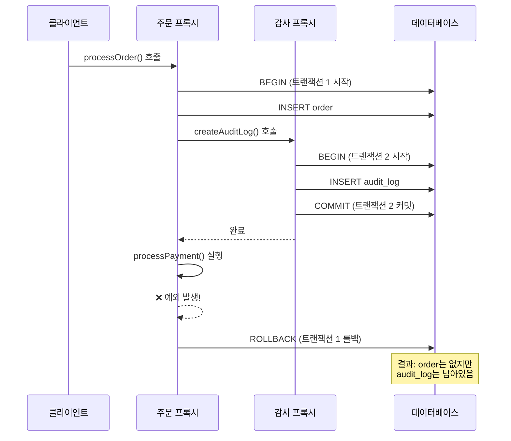
```mermaid
sequenceDiagram
    participant Client as 클라이언트
    participant OrderProxy as 주문 프록시
    participant AuditProxy as 감사 프록시
    participant DB as 데이터베이스
    
    Client->>OrderProxy: processOrder() 호출
    OrderProxy->>DB: BEGIN (트랜잭션 1 시작)
    OrderProxy->>DB: INSERT order
    
    OrderProxy->>AuditProxy: createAuditLog() 호출
    AuditProxy->>DB: BEGIN (트랜잭션 2 시작)
    AuditProxy->>DB: INSERT audit_log
    AuditProxy->>DB: COMMIT (트랜잭션 2 커밋)
    AuditProxy-->>OrderProxy: 완료
    
    OrderProxy->>OrderProxy: processPayment() 실행
    OrderProxy-->>OrderProxy: ❌ 예외 발생!
    OrderProxy->>DB: ROLLBACK (트랜잭션 1 롤백)
    
    Note over DB: 결과: order는 없지만<br/>audit_log는 남아있음
```

### 6.5 기타 전파 옵션들 (SUPPORTS, MANDATORY 등)

```java
@Service
public class UtilityService {
    
    // 트랜잭션이 있으면 참여, 없으면 트랜잭션 없이 실행
    @Transactional(propagation = Propagation.SUPPORTS)
    public void flexibleMethod() {
        // 선택적 트랜잭션 처리
    }
    
    // 반드시 기존 트랜잭션이 있어야 함 (없으면 예외)
    @Transactional(propagation = Propagation.MANDATORY)
    public void mandatoryTransactionMethod() {
        // 단독 호출 불가, 반드시 트랜잭션 내에서만 호출
    }
    
    // 트랜잭션이 없어야 함 (있으면 일시 중단)
    @Transactional(propagation = Propagation.NOT_SUPPORTED)
    public void nonTransactionalMethod() {
        // 트랜잭션 없이 실행되어야 하는 작업
    }
}
```

## 7. 트랜잭션 전파 시나리오별 동작 이해

실제 상황에서 트랜잭션이 어떻게 동작하는지 구체적인 시나리오로 알아보겠습니다.

### 7.1 외부 트랜잭션 성공, 내부 트랜잭션 성공

```java
@Service
public class OrderService {
    
    @Autowired
    private PaymentService paymentService;
    
    @Transactional
    public void processOrder(OrderRequest request) {
        // 1. 주문 생성 (성공)
        Order order = createOrder(request);
        
        // 2. 결제 처리 (성공)
        paymentService.processPayment(order.getId(), request.getAmount());
        
        // 모든 작업 성공 → 전체 커밋
    }
}

@Service
public class PaymentService {
    
    @Transactional  // REQUIRED (기본값)
    public void processPayment(Long orderId, BigDecimal amount) {
        Payment payment = new Payment(orderId, amount);
        paymentRepository.save(payment);
        // 성공적으로 완료
    }
}
```

**결과**: 주문과 결제 모두 데이터베이스에 저장됩니다.

### 7.2 외부 트랜잭션 롤백 시 전체 롤백

```java
@Service
public class OrderService {
    
    @Autowired
    private PaymentService paymentService;
    
    @Transactional
    public void processOrder(OrderRequest request) {
        // 1. 주문 생성 (성공)
        Order order = createOrder(request);
        
        // 2. 결제 처리 (성공)
        paymentService.processPayment(order.getId(), request.getAmount());
        
        // 3. 외부 트랜잭션에서 예외 발생!
        if (someValidationFails()) {
            throw new OrderValidationException("주문 검증 실패");
        }
    }
}
```

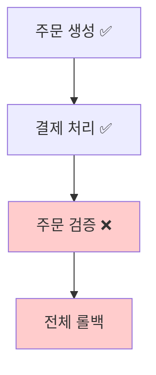
```mermaid
graph TB
    A[주문 생성 ✅] --> B[결제 처리 ✅]
    B --> C[주문 검증 ❌]
    C --> D[전체 롤백]
    
    style C fill:#ffcccc
    style D fill:#ffcccc
```

**결과**: 주문과 결제 모두 롤백되어 데이터베이스에 저장되지 않습니다.

### 7.3 내부 트랜잭션 롤백의 함정 ⚠️

이것이 가장 헷갈리는 부분입니다!

```java
@Service
public class OrderService {
    
    @Autowired
    private PaymentService paymentService;
    
    @Transactional
    public void processOrder(OrderRequest request) {
        try {
            // 1. 주문 생성 (성공)
            Order order = createOrder(request);
            
            // 2. 결제 처리 (실패!)
            paymentService.processPayment(order.getId(), request.getAmount());
            
        } catch (PaymentException e) {
            // 예외를 잡아서 처리했으니 괜찮을까? ❌
            log.error("결제 실패했지만 주문은 유지하자", e);
        }
        
        // 여기서 커밋을 시도하지만...
    }
}

@Service
public class PaymentService {
    
    @Transactional
    public void processPayment(Long orderId, BigDecimal amount) {
        // 결제 검증 실패
        if (amount.compareTo(BigDecimal.ZERO) <= 0) {
            throw new PaymentException("결제 금액이 잘못되었습니다");
        }
        
        // 결제 처리...
    }
}
```

**예상**: 주문은 저장되고 결제만 실패  
**실제 결과**: 주문도 롤백됨! ❌

**왜 그럴까요?**

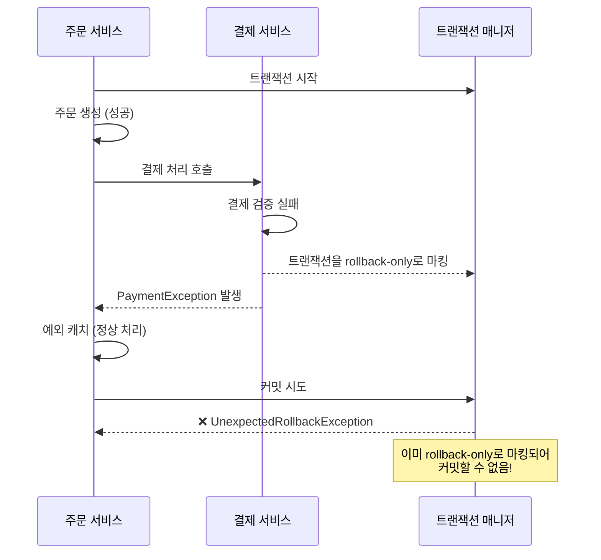
```mermaid
sequenceDiagram
    participant OrderService as 주문 서비스
    participant PaymentService as 결제 서비스
    participant TxManager as 트랜잭션 매니저
    
    OrderService->>TxManager: 트랜잭션 시작
    OrderService->>OrderService: 주문 생성 (성공)
    OrderService->>PaymentService: 결제 처리 호출
    PaymentService->>PaymentService: 결제 검증 실패
    PaymentService-->>TxManager: 트랜잭션을 rollback-only로 마킹
    PaymentService-->>OrderService: PaymentException 발생
    OrderService->>OrderService: 예외 캐치 (정상 처리)
    OrderService->>TxManager: 커밋 시도
    TxManager-->>OrderService: ❌ UnexpectedRollbackException
    
    Note over TxManager: 이미 rollback-only로 마킹되어<br/>커밋할 수 없음!
```

**핵심 포인트**: 내부 트랜잭션에서 예외가 발생하면, 물리 트랜잭션이 "rollback-only"로 마킹됩니다. 이후 외부에서 커밋을 시도해도 `UnexpectedRollbackException`이 발생합니다.

### 7.4 REQUIRES_NEW로 트랜잭션 분리하기

위 문제를 해결하려면 `REQUIRES_NEW`를 사용해서 트랜잭션을 분리해야 합니다.

```java
@Service
public class OrderService {
    
    @Autowired
    private PaymentService paymentService;
    
    @Transactional
    public void processOrder(OrderRequest request) {
        try {
            // 1. 주문 생성 (성공)
            Order order = createOrder(request);
            
            // 2. 결제 처리 (독립적인 트랜잭션)
            paymentService.processPaymentSeparately(order.getId(), request.getAmount());
            
        } catch (PaymentException e) {
            // 이제 결제 실패해도 주문은 유지됨 ✅
            log.error("결제 실패, 주문 상태를 대기로 변경", e);
            updateOrderStatus(orderId, OrderStatus.PAYMENT_PENDING);
        }
    }
}

@Service
public class PaymentService {
    
    @Transactional(propagation = Propagation.REQUIRES_NEW)
    public void processPaymentSeparately(Long orderId, BigDecimal amount) {
        if (amount.compareTo(BigDecimal.ZERO) <= 0) {
            throw new PaymentException("결제 금액이 잘못되었습니다");
        }
        
        // 결제 처리...
    }
}
```

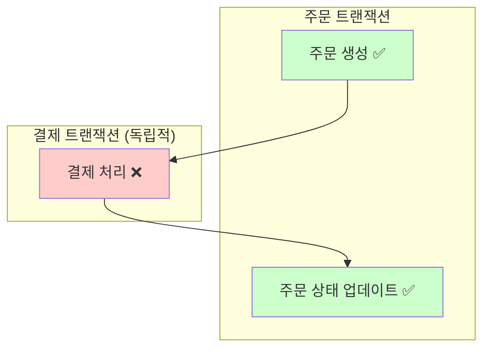
```mermaid
graph TB
    subgraph "주문 트랜잭션"
        A[주문 생성 ✅]
        C[주문 상태 업데이트 ✅]
    end
    
    subgraph "결제 트랜잭션 (독립적)"
        B[결제 처리 ❌]
    end
    
    A --> B
    B --> C
    
    style B fill:#ffcccc
    style A fill:#ccffcc
    style C fill:#ccffcc
```

**결과**: 주문은 저장되고 결제만 실패합니다.

## 8. 예외와 트랜잭션 롤백

Spring에서 어떤 예외가 발생했을 때 트랜잭션이 롤백되는지 정확히 알아야 합니다.

### 8.1 어떤 예외에 롤백될까?

Spring의 기본 롤백 규칙:

```text
// ✅ 이런 예외들은 자동 롤백
RuntimeException
Error
그리고 이들의 하위 예외들

// ❌ 이런 예외들은 커밋됨 (롤백 안됨)
Exception (Checked Exception)
그리고 RuntimeException을 상속받지 않은 예외들
```

#### RuntimeException → 롤백 ✅

```java
@Service
public class UserService {
    
    @Transactional
    public void createUser(User user) {
        userRepository.save(user);
        
        // 이런 예외들은 자동으로 롤백됨
        if (user.getEmail() == null) {
            throw new IllegalArgumentException("이메일은 필수입니다");  // RuntimeException
        }
        
        if (userRepository.existsByEmail(user.getEmail())) {
            throw new DuplicateUserException("이미 존재하는 이메일입니다");  // RuntimeException 상속
        }
    }
}
```

#### Checked Exception → 커밋 ⚠️

```java
@Service
public class EmailService {
    
    @Transactional
    public void sendWelcomeEmail(User user) throws EmailSendException {
        userRepository.save(user);  // 사용자 저장
        
        // Checked Exception 발생
        if (emailServerDown()) {
            throw new EmailSendException("이메일 서버에 연결할 수 없습니다");
        }
        
        // 예외가 발생해도 사용자는 저장됨! (커밋됨)
    }
}

// Checked Exception 정의
public class EmailSendException extends Exception {
    public EmailSendException(String message) {
        super(message);
    }
}
```

**왜 이렇게 설계되었을까요?**

- **RuntimeException**: 프로그래밍 오류 (데이터 불일치를 초래할 수 있음) → 롤백
- **Checked Exception**: 비즈니스 예외 (정상적인 비즈니스 플로우) → 커밋

### 8.2 비즈니스 예외 처리 전략

실무에서는 비즈니스 예외를 어떻게 처리할지 전략을 세워야 합니다.

#### 전략 1: 모든 예외에 대해 롤백

```java
@Service
public class OrderService {
    
    // 모든 예외에 대해 롤백
    @Transactional(rollbackFor = Exception.class)
    public void processOrder(OrderRequest request) throws OrderException {
        Order order = createOrder(request);
        
        if (!validateOrder(order)) {
            throw new OrderException("주문 검증 실패");  // Checked Exception이지만 롤백됨
        }
        
        processPayment(order);  // IOException 발생 가능하지만 롤백됨
    }
}
```

#### 전략 2: 비즈니스 예외는 커밋, 시스템 예외만 롤백

```java
@Service
public class NotificationService {
    
    @Transactional(noRollbackFor = BusinessException.class)
    public void sendNotification(User user) throws BusinessException {
        // 사용자 정보 업데이트
        user.setLastNotificationTime(LocalDateTime.now());
        userRepository.save(user);
        
        // 외부 서비스 호출
        if (!externalNotificationService.send(user.getEmail())) {
            // 비즈니스 예외: 사용자 정보는 저장하고 알림만 실패 처리
            throw new BusinessException("알림 발송 실패");  // 롤백 안됨
        }
    }
}
```

#### 전략 3: 예외별로 세분화된 처리

```java
@Service
public class PaymentService {
    
    @Transactional(
        rollbackFor = {PaymentSystemException.class, DataIntegrityException.class},
        noRollbackFor = {PaymentDeclinedException.class, InsufficientFundsException.class}
    )
    public void processPayment(PaymentRequest request) 
            throws PaymentSystemException, PaymentDeclinedException {
        
        Payment payment = createPayment(request);
        
        try {
            // 외부 결제 시스템 호출
            PaymentResult result = externalPaymentGateway.charge(request);
            
            if (result.isDeclined()) {
                // 카드 거절: 비즈니스 예외, 결제 기록은 남김 (커밋)
                throw new PaymentDeclinedException("카드가 거절되었습니다");
            }
            
        } catch (IOException e) {
            // 시스템 예외: 전체 롤백
            throw new PaymentSystemException("결제 시스템 연결 오류", e);
        }
    }
}
```

### 8.3 rollbackFor와 noRollbackFor 활용

실제 사용 예시를 보겠습니다:

```java
@Service
public class UserRegistrationService {
    
    @Autowired
    private EmailService emailService;
    
    @Autowired
    private SmsService smsService;
    
    // 사용자 등록은 성공하되, 알림 실패는 별도 처리
    @Transactional(noRollbackFor = {EmailException.class, SmsException.class})
    public UserRegistrationResult registerUser(UserRequest request) {
        UserRegistrationResult result = new UserRegistrationResult();
        
        try {
            // 1. 사용자 생성 (핵심 비즈니스 로직)
            User user = createUser(request);
            result.setUser(user);
            result.setSuccess(true);
            
            // 2. 환영 이메일 발송 (실패해도 사용자 등록은 유지)
            try {
                emailService.sendWelcomeEmail(user.getEmail());
                result.setEmailSent(true);
            } catch (EmailException e) {
                result.setEmailSent(false);
                result.addWarning("환영 이메일 발송 실패: " + e.getMessage());
            }
            
            // 3. SMS 발송 (실패해도 사용자 등록은 유지)
            try {
                smsService.sendWelcomeSms(user.getPhoneNumber());
                result.setSmsSent(true);
            } catch (SmsException e) {
                result.setSmsSent(false);
                result.addWarning("환영 SMS 발송 실패: " + e.getMessage());
            }
            
        } catch (DuplicateUserException e) {
            // 사용자 중복: 전체 롤백 (RuntimeException)
            result.setSuccess(false);
            result.setError("이미 존재하는 사용자입니다");
            throw e;
        }
        
        return result;
    }
}

// 결과 DTO
public class UserRegistrationResult {
    private User user;
    private boolean success;
    private boolean emailSent;
    private boolean smsSent;
    private String error;
    private List<String> warnings = new ArrayList<>();
    
    // getters, setters...
}
```

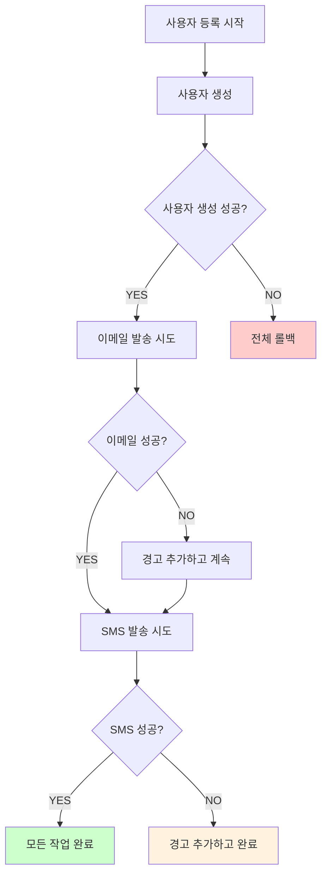
```mermaid
flowchart TD
    A[사용자 등록 시작] --> B[사용자 생성]
    B --> C{사용자 생성 성공?}
    C -->|YES| D[이메일 발송 시도]
    C -->|NO| E[전체 롤백]
    
    D --> F{이메일 성공?}
    F -->|YES| G[SMS 발송 시도]
    F -->|NO| H[경고 추가하고 계속]
    
    H --> G
    G --> I{SMS 성공?}
    I -->|YES| J[모든 작업 완료]
    I -->|NO| K[경고 추가하고 완료]
    
    style E fill:#ffcccc
    style J fill:#ccffcc
    style K fill:#fff3e0
```

💡 **Tip**:
- **핵심 비즈니스 로직**: 실패하면 롤백
- **부가 기능 (알림, 로그 등)**: 실패해도 커밋
- **시스템 오류**: 항상 롤백
- **비즈니스 규칙 위반**: 상황에 따라 결정

## 9. 정리

#### 반드시 기억해야 할 5가지

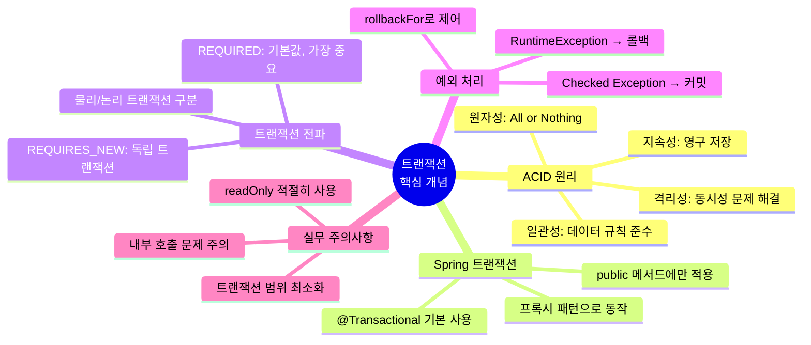
```mermaid
mindmap
  root((트랜잭션<br/>핵심 개념))
    ACID 원리
      원자성: All or Nothing
      일관성: 데이터 규칙 준수
      격리성: 동시성 문제 해결
      지속성: 영구 저장
    
    Spring 트랜잭션
      @Transactional 기본 사용
      public 메서드에만 적용
      프록시 패턴으로 동작
      
    트랜잭션 전파
      REQUIRED: 기본값, 가장 중요
      REQUIRES_NEW: 독립 트랜잭션
      물리/논리 트랜잭션 구분
      
    예외 처리
      RuntimeException → 롤백
      Checked Exception → 커밋
      rollbackFor로 제어
      
    실무 주의사항
      readOnly 적절히 사용
      트랜잭션 범위 최소화
      내부 호출 문제 주의
```

#### 자주 사용하는 패턴

```java
// 1. 기본적인 서비스 메서드
@Service
@Transactional
public class OrderService {
    
    // 조회 메서드는 readOnly
    @Transactional(readOnly = true)
    public Order getOrder(Long id) {
        return orderRepository.findById(id);
    }
    
    // 모든 예외에 롤백 적용
    @Transactional(rollbackFor = Exception.class)
    public void processOrder(OrderRequest request) {
        // 비즈니스 로직
    }
    
    // 독립적인 트랜잭션 (로그, 알림 등)
    @Transactional(propagation = Propagation.REQUIRES_NEW)
    public void createAuditLog(String action) {
        // 감사 로그
    }
}
```

#### 자주 하는 실수들

1. **private 메서드에 @Transactional 적용**
```java
// ❌ 동작하지 않음
@Transactional
private void privateMethod() {
    // 트랜잭션 적용 안됨!
}
```

2. **같은 클래스 내부 호출**
```java
public class UserService {
    
    public void publicMethod() {
        internalMethod();  // 트랜잭션 적용 안됨!
    }
    
    @Transactional
    public void internalMethod() {
        // 프록시를 거치지 않아서 트랜잭션 적용 안됨
    }
}
```

3. **Checked Exception 롤백 규칙 착각**
```java
@Transactional  // rollbackFor 설정 없음
public void processData() throws DataException {
    saveData();
    throw new DataException("오류");  // 롤백 안됨!
}
```

#### 성능 최적화

```java
@Service
public class ProductService {
    
    // 읽기 전용 트랜잭션으로 성능 향상
    @Transactional(readOnly = true)
    public List<Product> getProductList() {
        return productRepository.findAll();
    }
    
    // 트랜잭션 범위를 최소화
    @Transactional
    public void updateProduct(Long id, ProductUpdate update) {
        // 1. 조회는 트랜잭션 밖에서 (가능하다면)
        
        // 2. 최소한의 변경만 트랜잭션 안에서
        Product product = productRepository.findById(id);
        product.update(update);
        productRepository.save(product);
        
        // 3. 외부 API 호출은 트랜잭션 밖에서 (가능하다면)
    }
    
    // 긴 작업은 타임아웃 설정
    @Transactional(timeout = 30)
    public void bulkUpdate(List<ProductUpdate> updates) {
        // 대량 업데이트
    }
}
```
