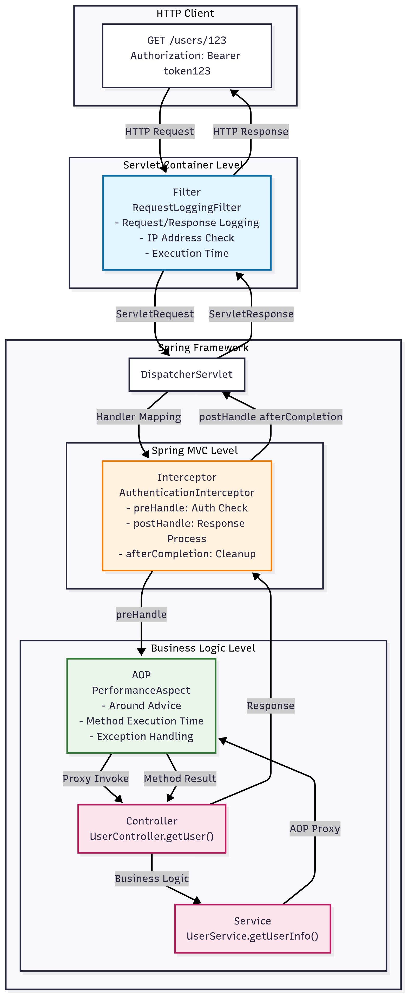

## 1: 프로젝트 설정 

### 1.1 Spring Boot 프로젝트 생성
```bash
# Spring Initializr로 프로젝트 생성하거나 아래 의존성을 추가
```

### 1.2 build.gradle 설정
```gradle
dependencies {
    implementation 'org.springframework.boot:spring-boot-starter-web'
    implementation 'org.springframework.boot:spring-boot-starter-aop'
    implementation 'org.springframework.boot:spring-boot-starter'
    testImplementation 'org.springframework.boot:spring-boot-starter-test'
}
```

### 1.3 application.yml 설정
```yaml
logging:
  level:
    com.example: DEBUG
  pattern:
    console: "%d{HH:mm:ss.SSS} [%thread] %-5level %logger{36} - %msg%n"
```

## 2: Filter 구현

### 2.1 Request Logging Filter 작성
```java
@Slf4j
@Component
public class RequestLoggingFilter implements Filter {

    @Override
    public void doFilter(ServletRequest request, ServletResponse response, 
                        FilterChain chain) throws IOException, ServletException {
        
        HttpServletRequest httpRequest = (HttpServletRequest) request;
        HttpServletResponse httpResponse = (HttpServletResponse) response;
        
        long startTime = System.currentTimeMillis();
        String requestInfo = String.format("[FILTER] 요청 시작 - URI: %s, Method: %s, IP: %s, Time: %s",
            httpRequest.getRequestURI(), 
            httpRequest.getMethod(),
            httpRequest.getRemoteAddr(),
            LocalDateTime.now());
        
        log.info(requestInfo);
        
        try {
            // 다음 Filter나 Servlet으로 요청 전달
            chain.doFilter(request, response);
        } finally {
            long endTime = System.currentTimeMillis();
            log.info("[FILTER] 응답 완료 - Status: {}, 처리시간: {}ms", 
                httpResponse.getStatus(), (endTime - startTime));
        }
    }
}
```

### 2.2 Controller 작성
```java
@Slf4j
@RestController
public class UserController {

    @GetMapping("/users/{id}")
    public String getUser(@PathVariable String id) {
        log.info("[CONTROLLER] getUser 메서드 실행 - ID: {}", id);
        try {
            Thread.sleep(100);
        } catch (InterruptedException e) {
            Thread.currentThread().interrupt();
        }
        return String.format("User ID: %s, Name: John Doe", id);
    }
}
```

### 2.3 첫 번째 테스트
```bash
# 애플리케이션 실행 후
curl http://localhost:8080/users/123
```

**예상 로그 출력**:
```bash
[FILTER] 요청 시작 - URI: /users/123, Method: GET, IP: 0:0:0:0:0:0:0:1, Time: 2025-09-04T23:29:46.978278
[CONTROLLER] getUser 메서드 실행 - ID: 123
[FILTER] 응답 완료 - Status: 200, 처리시간: 6590ms
```

## 3: Interceptor

### 3.1 Authentication Interceptor 작성
```java
@Slf4j
@Component
public class AuthenticationInterceptor implements HandlerInterceptor {

    @Override
    public boolean preHandle(HttpServletRequest request, HttpServletResponse response, Object handler) throws Exception {
        
        log.info("[INTERCEPTOR] preHandle - URI: {}, Handler: {}", 
            request.getRequestURI(), handler.getClass().getSimpleName());
        
        String authHeader = request.getHeader("Authorization");
        if (authHeader == null || authHeader.isEmpty()) {
            log.warn("[INTERCEPTOR] 인증 헤더가 없습니다. 기본 사용자로 처리");
            request.setAttribute("user", "anonymous");
        } else {
            log.info("[INTERCEPTOR] 인증 성공 - Token: {}", authHeader);
            request.setAttribute("user", "authenticated_user");
        }
        
        return true;
    }

    @Override
    public void postHandle(HttpServletRequest request, HttpServletResponse response, Object handler, ModelAndView modelAndView) throws Exception {
        log.info("[INTERCEPTOR] postHandle - Response Status: {}", response.getStatus());
    }

    @Override
    public void afterCompletion(HttpServletRequest request, HttpServletResponse response, Object handler, Exception ex) throws Exception {
        String status = ex != null ? "ERROR" : "SUCCESS";
        log.info("[INTERCEPTOR] afterCompletion - Status: {}", status);
    }
}
```

### 3.2 Interceptor 등록
```java
@Configuration
@RequiredArgsConstructor
public class WebConfig implements WebMvcConfigurer {
    
    private final AuthenticationInterceptor authenticationInterceptor;

    @Override
    public void addInterceptors(InterceptorRegistry registry) {
        registry.addInterceptor(authenticationInterceptor)
                .addPathPatterns("/users/**")
                .excludePathPatterns("/public/**");
    }
}
```

### 3.3 두 번째 테스트
```bash
# 인증 헤더 없이 요청
curl http://localhost:8080/users/123
# 인증 헤더와 함께 요청
curl -H "Authorization: Bearer token123" http://localhost:8080/users/123
```

**예상 로그 출력**:
```bash
[FILTER] 요청 시작 - URI: /users/123, Method: GET, IP: 0:0:0:0:0:0:0:1, Time: 2025-09-04T23:29:46.978278
[INTERCEPTOR] preHandle - URI: /users/123, Handler: HandlerMethod
[INTERCEPTOR] 인증 성공 - Token: Bearer token123
[CONTROLLER] getUser 메서드 실행 - ID: 123
[INTERCEPTOR] postHandle - Response Status: 200
[INTERCEPTOR] afterCompletion - Status: SUCCESS
[FILTER] 응답 완료 - Status: 200, 처리시간: 6590ms
```

## 4: AOP 구현 

### 4.1 Performance Monitoring Aspect 작성
```java
@Slf4j
@Aspect
@Component
public class PerformanceAspect {

    @Around("execution(* com.example.demo.controller.*.*(..)) || execution(* com.example.demo.service.*.*(..))")
    public Object measureExecutionTime(ProceedingJoinPoint joinPoint) throws Throwable {
        
        String methodName = joinPoint.getSignature().getName();
        String className = joinPoint.getTarget().getClass().getSimpleName();
        Object[] args = joinPoint.getArgs();
        
        log.info("[AOP] Before - {}#{} 실행 시작, Args: {}", 
            className, methodName, java.util.Arrays.toString(args));
        
        long startTime = System.currentTimeMillis();
        
        try {
            // 실제 메서드 실행
            Object result = joinPoint.proceed();
            long endTime = System.currentTimeMillis();
            log.info("[AOP] After - {}#{} 실행 완료, 실행시간: {}ms, Result: {}", 
                className, methodName, (endTime - startTime), result);
            return result;
        } catch (Exception e) {
            log.error("[AOP] Exception - {}#{} 실행 중 오류 발생: {}", 
                className, methodName, e.getMessage());
            throw e;
        }
    }
}
```

### 4.2 Service Layer 추가
```java
@Slf4j
@Service
public class UserService {

    public String getUserInfo(String id) {
        log.info("[SERVICE] getUserInfo 호출 - ID: {}", id);
        try {
            Thread.sleep(50);
        } catch (InterruptedException e) {
            Thread.currentThread().interrupt();
        }
        return String.format("User Details for ID: %s", id);
    }
}
```

### 4.3 Controller 수정
```java
@Slf4j
@RestController
@RequiredArgsConstructor
public class UserController {
    
    private final UserService userService;

    @GetMapping("/users/{id}")
    public String getUser(@PathVariable String id) {
        log.info("[CONTROLLER] getUser 메서드 실행 - ID: {}", id);
        String userInfo = userService.getUserInfo(id);
        return String.format("User ID: %s, Name: John Doe, Details: %s", id, userInfo);
    }
}
```

### 4.4 최종 테스트
```bash
curl -H "Authorization: Bearer token123" http://localhost:8080/users/456
```

### 4.5 예상 최종 로그 출력
```bash
[FILTER] 요청 시작 - URI: /users/123, Method: GET, IP: 0:0:0:0:0:0:0:1, Time: 2025-09-04T23:29:46.978278
[INTERCEPTOR] preHandle - URI: /users/123, Handler: HandlerMethod
[INTERCEPTOR] 인증 성공 - Token: Bearer token123
[AOP] Before - UserController#getUser 실행 시작, Args: [123]
[CONTROLLER] getUser 메서드 실행 - ID: 123
[AOP] Before - UserService#getUserInfo 실행 시작, Args: [123]
[SERVICE] getUserInfo 호출 - ID: 123
[AOP] After - UserService#getUserInfo 실행 완료, 실행시간: 55ms, Result: User Details for ID: 123
[AOP] After - UserController#getUser 실행 완료, 실행시간: 2461ms, Result: User ID: 123, Name: John Doe
[INTERCEPTOR] postHandle - Response Status: 200
[INTERCEPTOR] afterCompletion - Status: SUCCESS
[FILTER] 응답 완료 - Status: 200, 처리시간: 6590ms
```

### 4.6 실행 순서

**요청 시 순서**:
1. **Filter** → 가장 먼저 실행 (서블릿 컨테이너 레벨)
2. **Interceptor.preHandle** → DispatcherServlet 이후
3. **AOP @Around Before** → 메서드 호출 직전
4. **Controller Method** → 실제 비즈니스 로직
5. **Service Method** (AOP로 감싸짐)

**응답 시 순서** (역순):
5. **AOP @Around After** → 메서드 완료 직후
4. **Interceptor.postHandle** → 뷰 렌더링 전
3. **Interceptor.afterCompletion** → 요청 처리 완료 후
2. **Filter** → 최종 응답 전




## 정리

### 기술의 특징과 용도

| 구분 | Filter | Interceptor | AOP |
|------|--------|-------------|-----|
| **작동 레벨** | 서블릿 컨테이너 | Spring MVC | 메서드 호출 |
| **적용 범위** | 모든 요청 | MVC 요청만 | 특정 메서드 |
| **주요 용도** | 보안, 인코딩, 압축 | 인증, 권한, 로깅 | 트랜잭션, 성능 측정 |
| **Spring 컨텍스트** | 접근 불가 | 접근 가능 | 접근 가능 |

### 활용 팁

1. **Filter 사용**: 모든 요청에 공통적으로 적용되는 저수준 작업
2. **Interceptor 사용**: Spring MVC 내에서 핸들러별 세밀한 제어
3. **AOP 사용**: 비즈니스 로직에 투명하게 부가 기능 적용
